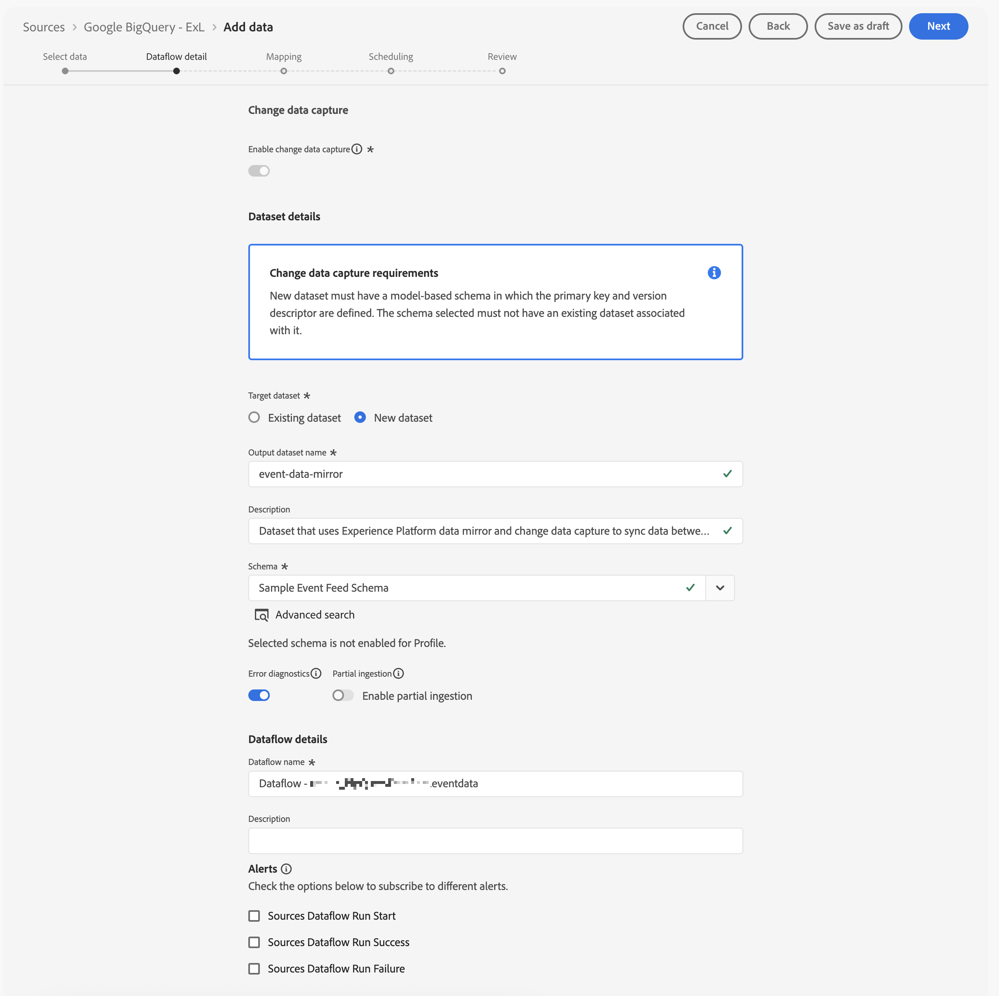
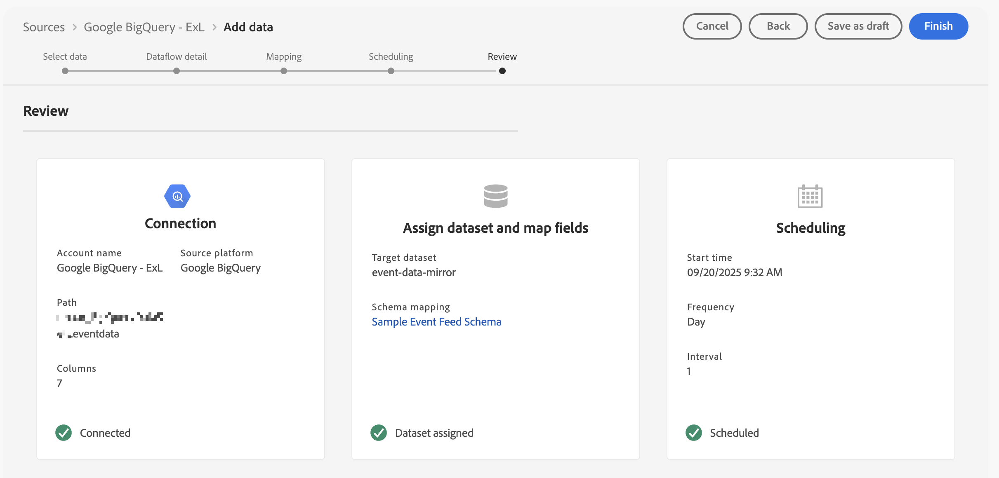
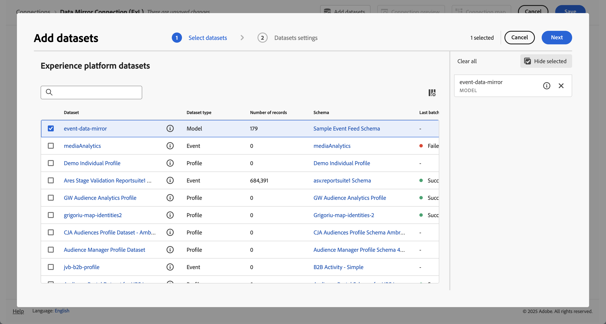

# 映象並使用關聯式資料

{{release-limited-testing}}

本快速入門手冊說明如何使用[適用於Customer Journey Analytics的Experience Platform Data Mirror](data-mirror.md)，從Adobe Experience Platform的Data Warehouse原生解決方案映象關聯資料。 然後將這些資料用於Customer Journey Analytics。

若要完成此使用案例，您必須：

* **使用Data Warehouse原生解決方案**&#x200B;來儲存您要在Experience Platform中映象的資料。 然後將這些資料用於Customer Journey Analytics中的報告和分析。

* **在Experience Platform中設定結構描述**&#x200B;以定義您要映象之資料的模型（結構描述）。

* **在Experience Platform中使用來源聯結器**，將您的映象資料匯入資料集。

* 在 Customer Journey Analytics 中&#x200B;**設定連線**。此連線應該（至少）包含您的Experience Platform關聯式資料集。

* 在 Customer Journey Analytics 中&#x200B;**設定資料檢視**，定義您要在 Analysis Workspace 中使用的量度和維度。

* 在 Customer Journey Analytics 中&#x200B;**設定專案**，建立您的報告和視覺效果。

適用於Customer Journey Analytics的Experience Platform Data Mirror需要關聯式結構描述。


>[!NOTE]
>
>本快速入門手冊是一份簡化的指南，說明如何在Adobe Experience Platform中映象關聯式資料，以及在Customer Journey Analytics中使用該資料。 強烈建議在提及時研究其他資訊。

{{relational-model-based}}

## 使用Data Warehouse原生解決方案

本快速入門手冊使用[[!DNL Google BigQuery]](datawarehouse.md#google-bigquery)作為資料倉儲原生解決方案。 其他[支援的解決方案](datawarehouse.md)是[[!DNL Snowflake]](datawarehouse.md#snowflake)和[[!DNL Azure Databricks]](datawarehouse.md#azure-databricks)。

在[!DNL Google BigQuery]內，下列範例資料會定期儲存和更新於名為&#x200B;**[!UICONTROL eventdata]**&#x200B;的資料表中。

+++ 範例事件資料的詳細資訊

| timestamp | id | pagename | personid | trackingcode | 訂單 | 收入金額 |
| :---                      |  ---: | :---              | :---            | :---          |   ---: | :---           |
| 2025-03-06T19:15:39+00:00 | 10001 | 首頁 | person-1abc123 | abc123 |        |                |
| 2025-03-06T19:15:39+00:00 | 10002 | 確認頁面 | person-1abc123 |               | 1 | 174.25 |
| 2025-03-06T19:15:39+00:00 | 10003 | 首頁 | person-2def123 | def123 |        |                |
| 2025-03-06T19:15:39+00:00 | 10004 | 首頁 | person-3ghi123 | ghi123 |        |                |
| 2025-03-06T19:15:39+00:00 | 10005 | 確認頁面 | person-3ghi123 |               | 1 | 149.25 |
| 2025-03-06T19:15:39+00:00 | 10006 | 首頁 | person-4abc456 | abc456 |        |                |
| 2025-03-06T19:15:39+00:00 | 10007 | 首頁 | person-5def456 | def456 |        |                |
| 2025-03-06T19:15:39+00:00 | 10008 | 首頁 | person-6ghi456 | ghi456 |        |                |
| 2025-03-06T19:15:39+00:00 | 10009 | 確認頁面 | person-6ghi456 |               | 1 | 159.25 |
| 2025-03-06T19:15:39+00:00 | 10010 | 首頁 | person-7abc789 | abc789 |        |                |
| 2025-03-06T19:15:39+00:00 | 10011 | 首頁 | person-8def789 | def789 |        |                |
| 2025-03-06T19:15:39+00:00 | 10012 | 首頁 | person-9ghi789 | ghi789 |        |                |
| 2025-03-06T19:15:39+00:00 | 10013 | 確認頁面 | person-9ghi789 |               | 1 | 124.25 |
| 2025-03-06T19:15:39+00:00 | 10014 | 首頁 | person-10abc987 | abc987 |        |                |
| 2025-03-06T19:15:39+00:00 | 10015 | 首頁 | person-11def987 | def987 |        |                |
| 2025-03-06T19:15:39+00:00 | 10016 | 首頁 | person-12ghi987 | ghi987 |        |                |
| 2025-03-06T19:15:39+00:00 | 10017 | 首頁 | person-13abc654 | abc654 |        |                |
| 2025-03-06T19:15:39+00:00 | 10018 | 首頁 | person-14def654 | def654 |        |                |
| 2025-03-06T19:15:39+00:00 | 10019 | 首頁 | person-15ghi654 | ghi654 |        |                |
| 2025-03-06T19:15:39+00:00 | 10020 | 確認頁面 | person-15ghi654 |               | 1 | 174.25 |

+++

資料會儲存在具有關聯綱要的資料庫表格中。 檢查資料庫表格：

1. 登入Google BigQuery。
1. 選取&#x200B;**[!UICONTROL BigQuery]** > **[!UICONTROL 工作室]**。
1. 選取您的專案、資料集和表格。 在&#x200B;**[!UICONTROL 結構描述]**&#x200B;標籤中，您會看到事件資料的結構描述概觀。

   

若要檢查資料：

1. 選取&#x200B;**[!UICONTROL 查詢]**。
1. 在查詢編輯器中執行範例查詢，其中`project`是專案名稱，`datasets`是資料集名稱：

   ```sql
   SELECT * FROM `project.datasets.eventdata` LIMIT 100
   ```

   

針對適用於Customer Journey Analytics的Experience Platform Data Mirror，您必須啟用Data Warehouse原生解決方案中的表格以取得變更記錄。 若要確認表格已啟用變更記錄，請執行下列動作：

1. 在查詢編輯器中執行下列SQL陳述式以檢查設定，其中`project`是專案名稱，`datasets`是資料集名稱：

   ```sql
   SELECT
      table_name,
      MAX(CASE WHEN option_name = 'enable_change_history' THEN option_value END) AS enable_change_history
   FROM `project.datasets.INFORMATION_SCHEMA.TABLE_OPTIONS`
   WHERE table_name = 'eventdata'
   GROUP BY table_name
   ORDER BY table_name;
   ```

1. 如果結果不是&#x200B;**[!UICONTROL TRUE]**，請使用下列SQL陳述式來啟用變更記錄，其中`project`是專案名稱，`datasets`是資料集名稱：

   ```sql
   ALTER TABLE `project.datasets.eventdata` 
   SET OPTIONS (enable_change_history = TRUE);
   ```

Data Warehouse原生解決方案表格中的資料，已可供用於Customer Journey Analytics的Experience Platform Data Mirror使用。


## 設定結構

若要在Experience Platform中映象資料，您必須先定義資料的結構描述。 您要在Experience Platform中映象並使用適用於Customer Journey Analytics的Experience Platform Data Mirror的所有資料都必須符合關聯式結構描述。

定義用來模型化此資料的結構描述。 若要設定您的結構：

1. 在Adobe Experience Platform UI的左側邊欄中，選取&#x200B;**[!UICONTROL 資料管理]**&#x200B;內的&#x200B;**[!UICONTROL 結構描述]**。

1. 選取&#x200B;**[!UICONTROL 「建立結構」]**。
1. 從下拉式功能表中選取&#x200B;**[!UICONTROL 關聯式]**。
1. 如果您看到快顯視窗，其中包含&#x200B;**[!UICONTROL 手動建立]**&#x200B;或&#x200B;**[!UICONTROL 上傳DDL檔案]**&#x200B;之間的選取選項：
   1. 選取&#x200B;**[!UICONTROL 選取手動建立]**。

      

   1. 選取&#x200B;**[!UICONTROL 「下一步」]**。
1. 在&#x200B;**[!UICONTROL 結構描述]** > **[!UICONTROL 建立關聯式結構描述]**&#x200B;介面中：
   1. 輸入&#x200B;**[!UICONTROL 結構描述顯示名稱]**。 例如：`Sample Event Feed Schema`。
   1. 輸入&#x200B;**[!UICONTROL 描述]**。 例如：`Sample event feed schema for a relational schema`。
   1. 選取&#x200B;**[!UICONTROL 時間序列]**&#x200B;做為&#x200B;**[!UICONTROL 結構描述行為]**。 您為時間序列型資料選取&#x200B;**[!UICONTROL 時間序列]**，為記錄型資料選取&#x200B;**[!UICONTROL 記錄]**。 此行為會定義結構描述的結構以及包含的屬性。

      適用於Customer Journey Analytics的Experience Platform Data Mirror主要用於時間序列資料（例如事件資料）。

      

   1. 選取&#x200B;**[!UICONTROL 「完成」]**。

1. 在&#x200B;**[!UICONTROL 結構描述]** > **[!UICONTROL 範例事件摘要結構描述]**&#x200B;介面中，您會看到關聯式結構描述支援擷取做為變更列的警告。

   

   以變更列形式擷取也稱為變更資料擷取(CDC)。 若要支援變更資料擷取，結構描述需要：

   * 主索引鍵。
   * 版本描述項。
   * 時間序列資料的時間戳記描述項。

1. 選取旁的&#x200B;**[!UICONTROL AddCircle]**，以開始將欄位新增至結構描述。 將具有資料型別和其他屬性的以下欄位新增到結構描述。

   | 欄位名稱 | 顯示名稱 | 類型 | 其他屬性 |
   |---|---|---|---|
   | `id` | `Id` | **[!UICONTROL 整數]** | 版本描述項 |
   | `orders` | `Orders` | **[!UICONTROL 整數]** | |
   | `pagename` | `Page Name` | **[!UICONTROL 字串]** | |
   | `personid` | `Person Id` | **[!UICONTROL 字串]** | 主索引鍵<br/>身分<br/>為身分名稱空間選取CRMID。 |
   | `revenueamount` | `Revenue Amount` | **[!UICONTROL 雙倍]** | |
   | `timestamp` | `Timestamp` | **[!UICONTROL 日期時間]** | 時間戳記描述項 |
   | `trackingcode` | `Tracking Code` | **[!UICONTROL 字串]** | |


   * **[!UICONTROL id]**&#x200B;欄位已設定為&#x200B;**[!UICONTROL 版本描述項]**。

     

     在實際情況中，您可能會想要使用更適當的欄位做為[版本描述項](aep.md#schema)。 例如，追蹤上次修改時間的欄位。

   * 已設定&#x200B;**[!UICONTROL personid]**&#x200B;欄位及&#x200B;**[!UICONTROL 時間戳記]**&#x200B;為&#x200B;**[!UICONTROL 主索引鍵]**。 選取 **[!UICONTROL 建立複合主索引鍵]**&#x200B;以建立複合索引鍵。

     

     **[!UICONTROL personid]**&#x200B;欄位也設定為&#x200B;**[!UICONTROL 身分識別]**，並將&#x200B;**[!UICONTROL CRMID]**&#x200B;設定為&#x200B;**[!UICONTROL 身分識別名稱空間]**。

     

     **[!UICONTROL personid]**&#x200B;欄位不一定要是&#x200B;**[!UICONTROL 主索引鍵]**。 在實際情況中，您很有可能有不同的欄位來追蹤主要金鑰（與&#x200B;**[!UICONTROL personid]**&#x200B;分開）。

   * 已設定&#x200B;**[!UICONTROL timestamp]**&#x200B;欄位以及&#x200B;**[!UICONTROL personid]**&#x200B;欄位作為&#x200B;**[!UICONTROL 主索引鍵]**。 **[!UICONTROL 時間戳記]**&#x200B;欄位也設定為&#x200B;**[!UICONTROL 時間戳記描述項]**。 您只需要將時間序列關聯資料的欄位定義為&#x200B;**[!UICONTROL 時間戳記描述項]**。

     


   如果您已正確定義&#x200B;**[!UICONTROL 主索引鍵]**、**[!UICONTROL 版本描述項]**&#x200B;和&#x200B;**[!UICONTROL 時間戳記描述項]**，則結構描述定義上方的警告會消失。

1. 選取&#x200B;**[!UICONTROL 「儲存」]**，即可儲存您的結構。

同樣地，您可以設定以記錄為基礎的關聯式[結構描述](aep.md#schema)。 例如，包含設定檔和查詢資料。


## 使用來源連接器

您使用來源聯結器將Data Warehouse原生解決方案連線至Experience Platform。

在Experience Platform介面中：

1. 選取&#x200B;**[!UICONTROL 來源]**。
1. 選取或搜尋&#x200B;**[!UICONTROL Google BigQuery]**。
1. 選取&#x200B;**[!UICONTROL 新增資料]**。

新增資料精靈會引導您完成下列步驟，將資料從[!DNL Google BigQuery]中的表格連線到Experience Platform。

### Authentication

在&#x200B;**[!UICONTROL 驗證]**&#x200B;步驟中，選取：

* 已設定Google BigQuery的帳戶時&#x200B;**[!UICONTROL 現有帳戶]**。 繼續進行[選取資料](#select-data)步驟。
* 需要連線到Google BigQuery時&#x200B;**[!UICONTROL 新帳戶]**。
   1. 指定&#x200B;**[!UICONTROL 帳戶名稱]**&#x200B;和（選擇性） **[!UICONTROL 描述]**。
   1. 選取您的&#x200B;**[!UICONTROL 驗證型別]**： **[!UICONTROL 基本驗證]**&#x200B;或&#x200B;**[!UICONTROL 服務驗證]**。 根據您的選擇，提供所需的輸入。
   1. 選取&#x200B;**[!UICONTROL 連線至來源]**

      

      已驗證您的連線。  **[!UICONTROL Connected]**&#x200B;表示連線成功。

   1. 選取&#x200B;**[!UICONTROL 「下一步」]**。

  請參閱Experience Platform檔案，以取得當您使用[Azure Databricks](https://experienceleague.adobe.com/en/docs/experience-platform/sources/connectors/databases/databricks)或[Snowflake](https://experienceleague.adobe.com/en/docs/experience-platform/sources/connectors/databases/snowflake)聯結器時，如何連線及驗證的詳細資料。


### 選取資料

在&#x200B;**[!UICONTROL 選擇資料]**&#x200B;步驟：

1. 從表格清單中選取表格。 例如： **[!UICONTROL eventdata]**。

   

   您會看到為驗證而顯示的資料範例。

1. 選取&#x200B;**[!UICONTROL 「下一步」]**&#x200B;以繼續。


### 資料流詳細資料

在&#x200B;**[!UICONTROL 資料流詳細資料]**&#x200B;步驟中：

1. 選取&#x200B;**[!UICONTROL 啟用變更資料擷取]**。 顯示&#x200B;**[!UICONTROL 變更資料擷取需求]**&#x200B;資訊方塊，其中包含更多資訊。
1. 選取&#x200B;**[!UICONTROL 目標資料集]**&#x200B;的&#x200B;**[!UICONTROL 新資料集]**，以建立包含映象資料的新資料集。
1. 輸入&#x200B;**[!UICONTROL 輸出資料集名稱]**。 例如：`event-data-mirror`。
1. 從&#x200B;**[!UICONTROL 結構描述]**&#x200B;下拉式功能表中選取您先前建立的關聯式結構描述。 例如： **[!UICONTROL 範例事件摘要結構描述]**。

   

1. 指定其他詳細資料。
1. 選取&#x200B;**[!UICONTROL 「下一步」]**。


### 映射

在&#x200B;**[!UICONTROL 對應]**&#x200B;步驟：

1. 將Google BigQuery結構描述中的欄位(**[!UICONTROL Source資料]**)對應到您在Experience Platform中定義的結構描述中的欄位（**[!UICONTROL 目標欄位]**）。

   

1. 如果所有欄位都正確對應，請選取&#x200B;**[!UICONTROL 下一步]**&#x200B;以繼續。


### 排程

在&#x200B;**[!UICONTROL 排程]**&#x200B;步驟中：

1. 指定&#x200B;**[!UICONTROL 頻率]**&#x200B;和&#x200B;**[!UICONTROL 間隔]**&#x200B;以排程映象資料的同步處理。
1. 指定排程的&#x200B;**[!UICONTROL 開始時間]**。

   

1. 選取&#x200B;**[!UICONTROL 「下一步」]**&#x200B;以繼續。


### 檢閱

在&#x200B;**[!UICONTROL 檢閱]**&#x200B;步驟中。

1. 檢閱來源聯結器的設定。

   

1. 選取&#x200B;**[!UICONTROL 完成]**。 您被導向到設定的資料流。

   


## 設定連線

在本快速入門手冊中，您將建立新連線以使用來自Experience Platform的映象資料。 或者，您可以將映象資料新增到現有連線。

在Customer Journey Analytics介面中：

1. 從&#x200B;**[!UICONTROL 資料管理]**&#x200B;功能表選取&#x200B;**[!UICONTROL 連線]**。
1. 選取「**[!UICONTROL 建立新連線]**」。
1. 指定必要的&#x200B;**[!UICONTROL 連線名稱]**、**[!UICONTROL 沙箱]**、**[!UICONTROL 平均每日事件數]**&#x200B;以及其他選用引數。
1. 選取&#x200B;**[!UICONTROL 「新增資料集」]**。

   1. 在&#x200B;**[!UICONTROL 新增資料集]**&#x200B;的&#x200B;**[!UICONTROL 選取資料集]**&#x200B;步驟中：

      1. 選取包含映象資料的資料集。 例如： **[!UICONTROL event-data-mirror]**。 資料集有&#x200B;**[!UICONTROL 關聯式]**&#x200B;做為&#x200B;**[!UICONTROL 資料集型別]**。

         

      1. 新增與連線相關的任何其他資料集。
      1. 選取&#x200B;**[!UICONTROL 「下一步」]**。

   1. 在&#x200B;**[!UICONTROL 新增資料集]**&#x200B;的&#x200B;**[!UICONTROL 資料集設定]**&#x200B;步驟中：

      針對&#x200B;**[!UICONTROL event-data-mirror]**&#x200B;關聯式資料集

      1. 選取&#x200B;**[!UICONTROL 事件]**&#x200B;做為&#x200B;**[!UICONTROL 資料集型別]**。
      1. 選取&#x200B;**[!UICONTROL 人員ID]**&#x200B;欄位做為&#x200B;**[!UICONTROL 人員ID]**。
      1. **[!UICONTROL Timestamp]**&#x200B;會自動填入為&#x200B;**[!UICONTROL Timestamp]**。
      1. 選取&#x200B;**[!UICONTROL 其他]**&#x200B;作為&#x200B;**[!UICONTROL 資料來源型別]**。
      1. 輸入`Google BigQuery Event Data`作為&#x200B;**[!UICONTROL 資料來源描述]**。
      1. 指定其他詳細資料，例如&#x200B;**[!UICONTROL 匯入所有新資料]**&#x200B;和&#x200B;**[!UICONTROL 回填所有現有資料]**。

         

      選擇性地指定其他資料集的詳細資訊。

   1. 選取&#x200B;**[!UICONTROL 「新增資料集」]**。
1. 選取&#x200B;**[!UICONTROL 「儲存」]**。

建立[連線](/help/connections/overview.md)之後，您可以執行各種管理工作。 例如[選取並合併資料集](/help/connections/combined-dataset.md)、[檢查連線資料集的狀態和資料擷取的狀態](/help/connections/manage-connections.md)等等。


## 設定資料檢視

若要建立資料檢視，請執行以下操作：

1. 在Customer Journey Analytics介面中，從頂端功能表的&#x200B;**[!UICONTROL 資料管理]**&#x200B;中選取&#x200B;**[!UICONTROL 資料檢視]**。

2. 選取&#x200B;**[!UICONTROL 「建立新的資料檢視」]**。

3. 在&#x200B;**[!UICONTROL 設定]**&#x200B;步驟：

   1. 從&#x200B;**[!UICONTROL 「連線」]**&#x200B;清單中選取您的連線。

   1. 為連線命名，並 (可選) 提供說明。

   1. 選取&#x200B;**[!UICONTROL 「儲存並繼續」]**。

4. 在&#x200B;**[!UICONTROL 元件]**&#x200B;步驟：

   1. 新增您要包含在&#x200B;**[!UICONTROL METRICS]**&#x200B;或&#x200B;**[!UICONTROL DIMENSIONS]**&#x200B;元件方塊中的任何結構描述欄位和/或標準元件。 請確定您從包含映象資料的資料集中新增相關欄位。 若要存取這些欄位：

      1. 選取&#x200B;**[!UICONTROL 事件資料集]**。
      1. 選取&#x200B;**[!UICONTROL 臨機及關聯欄位]**。
      1. 從關聯式結構描述拖放欄位至&#x200B;**[!UICONTROL METRICS]**&#x200B;或&#x200B;**[!UICONTROL DIMENSIONS]**。

         

   1. 為不具有適當型別、格式不正確或由於其他原因而想要修改的欄位定義衍生欄位。 例如，**[!UICONTROL 收入金額]**。

      1. 選取&#x200B;**[!UICONTROL 建立衍生欄位。]**
      1. 在衍生欄位編輯器中：
         1. 定義新的`Revenue Amount (Numeric)`欄位，如下所示。

            

         1. 選取「**[!UICONTROL 儲存]**」。
      1. 將新的&#x200B;**[!UICONTROL 收入金額（數值）]**&#x200B;衍生欄位拖放到&#x200B;**[!UICONTROL METRICS]**&#x200B;中。

         

   1. 選取&#x200B;**[!UICONTROL 「儲存並繼續」]**。

5. 在&#x200B;**[!UICONTROL 設定]**&#x200B;步驟：

   保留設定原樣並選取&#x200B;**[!UICONTROL 「儲存並完成」]**。

如需如何建立和編輯資料檢視的詳細資訊，請參閱[資料檢視總覽](../data-views/data-views.md)。 以及哪些元件可用於資料檢視，以及如何使用區段和工作階段設定。


## 設定專案

Analysis Workspace是一款彈性的瀏覽器工具，可讓您快速建立分析，並根據您的資料分享見解。 您可以使用工作區專案合併資料元件、表格和視覺效果，進行分析並與貴組織的任何人分享。

若要建立專案，請執行以下操作：

1. 在Customer Journey Analytics介面中，選取頂端功能表中的&#x200B;**[!UICONTROL Workspace]**。

2. 在左側導覽中選取&#x200B;**[!UICONTROL 「專案」]**。

3. 選取&#x200B;**[!UICONTROL 建立專案]**。 在快顯視窗中：


   1. 選取&#x200B;**[!UICONTROL 空白Workspace專案]**。

   1. 選取「**[!UICONTROL 建立]**」。


4. 在&#x200B;**[!UICONTROL 新專案]**&#x200B;工作區中，確定已選取您的[資料檢視](#set-up-a-data-view)。 該資料檢視連結到包含映象資料的[連線](#set-up-a-connection)。

5. 若要建立您的第一個報表，請在&#x200B;**[!UICONTROL 自由格式]**&#x200B;面板的&#x200B;**[!UICONTROL 自由格式表格]**&#x200B;上拖放維度和量度。 例如，將&#x200B;**[!UICONTROL 收入金額（數值）]**&#x200B;拖曳至&#x200B;**[!UICONTROL _將量度拖曳到此處_]**。 拖曳&#x200B;**[!UICONTROL PersonId]**&#x200B;並將欄位放置在第一欄標題上。 進行您認為適當的其他調整。

   最終結果會根據源自Google BigQuery表格的映象資料，概略介紹設定檔及其收入。

   

如需如何使用元件、視覺效果和面板建立專案和建立分析的詳細資訊，請參閱 [Analysis Workspace 概觀](../analysis-workspace/home.md)。

>[!SUCCESS]
>
>您已完成所有步驟。一開始先定義您要從資料倉儲原生解決方案收集哪些映象資料（結構描述）。 以及將該資料（資料集）儲存在Experience Platform中的何處。 您已設定適當的來源聯結器，以提供Experience Platform中的映象資料。 您在Customer Journey Analytics中定義連線，以使用映象事件資料和（選擇性）其他資料。 您的資料檢視定義可讓您指定使用映象資料中的維度和量度。 最後，您建立了第一個專案，將映象資料視覺化並加以分析。
