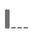

# 歸因元件設定

歸因可讓您自訂維度專案獲得成功事件評分的方式。

例如：

1. 您網站的使用者按一下您其中一個產品頁面的付費搜尋連結。 他們將產品新增至購物車，但並未購買。
2. 第二天，他們看到了朋友的社群媒體貼文。 他們按一下連結，然後完成購買。

在某些報表中，您可能想要將訂單歸因於「付費」搜尋。在其他報表中，則可能會將訂單歸因至「社交」。歸因可讓您控制報表的這個方面。

此資料檢視元件設定可讓您為量度設定預設歸因模型。 在 Analysis Workspace 中工作時，您可以覆寫給定量度的歸因模型。

如果您的組織要求量度有多個歸因設定，您可以執行下列任一項作業：

* 使用每個所需的歸因設定複製資料檢視中的量度。 您可以在資料檢視中多次包含相同的量度，為每個量度提供不同的設定。 請務必適當地標示每個量度，好讓分析師在產生報表時瞭解這些量度之間的差異。
* 覆寫Analysis Workspace中的量度。 在量度的 [欄設定](/help/analysis-workspace/visualizations/freeform-table/column-row-settings/column-settings.md)，選取 **[!UICONTROL 使用非預設歸因模型]** 變更該特定報表的量度歸因模型和回顧期間。

## 歸因模型

在量度的回顧期間中看到多個值時，歸因模型會決定哪些維度專案會獲得量度的評分。 歸因模型僅適用於回顧期間中設定了多個維度專案時。 如果只設定單一維度專案，則該維度專案會獲得100%的評分，無論使用的歸因模型為何。

| 圖示 | 歸因模型 | 定義 |
| :---: | :--- | --- |
|  | 上次接觸 | 會將 100% 的評分給予轉換前發生的最近一次接觸點。若未另外指定歸因模型，此歸因模型通常是任何量度的預設值。 組織通常會在轉換時間相對較短的情況下使用此模型，例如分析內部搜尋關鍵字。 |
|  | 首次接觸 | 會將100%的評分給予歸因回顧期間中首個出現的接觸點。 組織通常會使用此模型來瞭解品牌認知度或客戶贏取。 |
|  | 線性 | 會將相等的評分歸給每個帶來轉換的接觸點。當轉換週期較長或需要更頻繁的客戶參與時，此功能會很有用。 組織通常會使用此歸因模型來衡量行動應用程式通知有效性或訂閱型產品。 |
|  | 參與率 | 會將 100% 的評分給予所有不重複接觸點。由於每個接觸點都會獲得100%的評分，量度資料的總和通常會超過100%。 如果維度專案出現多次，導致轉換，則會刪除重複值至100%。 如果您想要瞭解客戶最常接觸到哪些接觸點，此歸因模型是理想的選擇。 媒體組織通常會使用此模型來計算內容速度。 零售組織通常會使用此模型來瞭解網站的哪些部分是帶來轉換的關鍵。 |
|  | 同一次接觸 | 會將100%的評分給予發生轉換的相同事件。 如果接觸點未在與轉換相同的事件中發生，則會歸類在「無」底下。 此歸因模型有時等於完全沒有歸因模型。 若您不希望其他會影響量度將評分給予維度專案之事件的值，此維度就十分實用。 產品或設計團隊可以使用此模型來評估轉換發生的頁面是否有效。 |
|  | U 型 | 會將 40% 的評分給予第一次互動，再將 40% 的評分給予上次互動，剩下的 20% 則分給兩者之間的任何接觸點。只有單一接觸點的轉換則會獲得 100% 的評分。如果是具有兩個接觸點的轉換，兩者會平均獲得 50% 的評分。此歸因模型最適合用於您最重視第一個和最後一個互動，但不想完全排除兩者之間的其他互動的情境。 |
|  | J 曲線 | 會將 60% 的評分給予上次互動，再將 20% 的評分給予第一次互動，剩下的 20% 則分給兩者之間的任何接觸點。只有單一接觸點的轉換則會獲得 100% 的評分。如果是具有兩個接觸點的轉換，上次互動會獲得 75% 的評分，第一次則獲得 25%。此歸因模型類似於U形，偏好第一次和最後一次互動，但偏好上次互動較多。 |
|  | 反向 J | 會將 60% 的評分給予第一個接觸點，再將 20% 的評分給予上個接觸點，剩下的 20% 則分給兩者之間的任何接觸點。只有單一接觸點的轉換則會獲得 100% 的評分。如果是具有兩個接觸點的轉換，第一次互動會獲得 75% 的評分，上次則獲得 25%。此歸因模型類似於J形，偏好第一次和最後一次互動，但偏好第一次互動的比例較高。 |
|  | 時間耗損 | 會以自訂的半衰期參數 (預設為 7 天) 進行指數耗損。每個管道的權重須視接觸點啟動和最終轉換之間所經過的時間量而定。用於判斷評分的公式為 `2^(-t/halflife)`，`t` 代表接觸點和轉換之間的時間量。 所有接觸點隨後都會標準化至 100%。最適合您要針對特定重要事件測量歸因的情況。 在此事件後發生轉換的時間越長，獲得的評分就越少。 |
|  | 自訂 | 可讓您指定要賦予給第一個接觸點、最後一個接觸點以及兩者之間任何接觸點的權重。 如果您輸入的自訂數字加總並非 100，系統也會將指定值標準化為 100%。只有單一接觸點的轉換則會獲得 100% 的評分。如果是具有兩個接觸點的互動，系統會忽略中間參數，然後將第一和最後一個接觸點標準化為 100%，再按照設定分配評分。如果您想要完全控制歸因模型，且具有其他歸因模型無法滿足的特定需求，則這個模型是分析師的理想選擇。 |
|  | 演算法 | 使用統計技巧動態決定所選量度的最佳評分配置。用於歸因的演算法以合作賽局理論中的 Harsanyi 利益為基礎。Harsanyi 利益是 Shapley 值解法 (命名自諾貝爾經濟學獎得主 Lloyd Shapley) 的泛論，即在一場對結果貢獻不均等的賽局中，在玩家之間分配評分。 歸因的高層次計算方式為必須公平分配盈餘的玩家聯盟。 每個聯盟的盈餘分配會根據每個子聯盟先前產生的盈餘（或先前參與的維度專案）遞回決定。 如需更多詳細資訊，請參閱John Harsanyi和Lloyd Shapley的原稿： Shapley， Lloyd S.(1953)。 A value for n-person games。*Contributions to the Theory of Games, 2(28)*, 307-317。 Harsanyi, John C. (1963)。A simplified bargaining model for the n-person cooperative game。*International Economic Review 4(2)*, 194-220。 |

{style="table-layout:auto"}

## 回顧期間

回顧期間是指轉換要納入接觸點時需要回顧的時間量。如果在回顧期間之外設定維度專案，該值不會納入任何歸因計算中。

* **14天**：從轉換發生之日起最多14天內回溯。
* **30天**：從轉換發生之日起最多30天內回溯。
* **60天**：從轉換發生之日起最多60天內回溯。
* **90天**：從轉換發生之日起最多90天內回溯。
* **工作階段**：回顧至轉換發生當下該工作階段的起始處。 工作階段回顧期間會遵循修改過的 [工作階段逾時](../create-dataview.md#session-settings).
* **人員（報告視窗）**：回顧至目前日期範圍當月1日以來的所有造訪。 舉例來說，如果報表日期範圍為 9 月 15 日 到 9 月 30 日，則人員回顧日期範圍將包含 9 月 1 日 到 9 月 30 日。如果您使用此回顧期間，您偶爾會看到維度專案歸因至報表期間之外的日期。
* **自訂時間：** 可讓您從轉換發生時設定自訂回顧期間。 您可以指定分鐘數、小時數、日數、周數、月數或季數。 例如，如果轉換發生在2月20日，5天的回顧期間將會評估歸因模型中從2月15日到2月20日的所有維度接觸點。

## 範例

考量下列範例：

1. 9月15日當天，有人透過付費搜尋廣告造訪您的網站，然後離開。
2. 9月18日當天，該人透過朋友的社群媒體連結再次造訪您的網站。 對方在購物車中加入數個商品，但並未購買任何商品。
3. 9 月 24 日當天，您的行銷團隊會寄送電子郵件給對方，郵件內含對方購物車中某些商品的優惠券。對方使用了抵用券，但也造訪了數個其他網站，看看是否有其他優惠券可用。對方透過顯示廣告找到了其他優惠券，最終以 $50 美元的價格購買商品。

根據您的回顧期間和歸因模型，管道會獲得不同的評分。以下為幾個值得了解的範例：

* 使用 **首次接觸** 和 **工作階段回顧期間**，歸因僅會考慮第三次造訪。 在電子郵件和顯示廣告兩者之間，訪客優先接觸到電子郵件，因此電子郵件在這次 $50 美元的購買動作中有 100% 的評分。
* 使用 **首次接觸** 和 **人員回顧期間**，歸因會計入全部三次造訪。 付費搜尋是第一次接觸，因此在這次 $50 美元的購買動作中有 100% 的評分。
* 使用 **線性** 和 **工作階段回顧期間**，評分會由電子郵件和顯示廣告平分， 兩個管道各有 $25 美元的評分。
* 使用 **線性** 和 **人員回顧期間**，評分會由搜尋付費、社群媒體、電子郵件和顯示廣告平分， 每個管道在這次購買中各有 $12.50 的評分。
* 使用 **J形** 和 **人員回顧期間**，評分會由搜尋付費、社群媒體、電子郵件和顯示廣告平分，
   * 60% 歸給顯示廣告，價值 $30 美元，
   * 20% 歸給付費搜尋，價值 $10 美元，
   * 剩下的 20% 平分給社交媒體和電子郵件，各為 $5 美元。
* 使用 **時間耗損** 和 **人員回顧期間**，評分會由搜尋付費、社群媒體、電子郵件和顯示廣告平分， 以預設的 7 天半衰期計算，結果如下：
   * 顯示廣告接觸點與轉換之間的間隔為零天。 `2^(-0/7) = 1`
   * 電子郵件接觸點與轉換之間的間隔為零天。 `2^(-0/7) = 1`
   * 社交接觸點與轉換之間的間隔為六天。 `2^(-6/7) = 0.552`
   * 付費搜尋接觸點與轉換之間的間隔為九天。 `2^(-9/7) = 0.41`
   * 將這些值標準化會產生下列結果：
      * 顯示廣告：33.8%，價值 $16.88 美元
      * 電子郵件：33.8%，價值 $16.88 美元
      * 社交媒體：18.6%，價值 $9.32 美元
      * 付費搜尋：13.8%，價值 $6.92 美元

如果評分屬於多個管道，則通常具有整數的轉換事件會被劃分。 例如，如果兩個色版對使用線性歸因模型的訂單均有貢獻，則兩個色版會獲得該訂單的0.5倍。 這些部分量度會在所有人員之間加總，然後四捨五入至最接近的整數，以用於報表。
