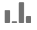

# 歸因元件設定

屬性使您能夠自定義維項目如何獲得成功事件的積分。 例如：

1. 您的網站訪客按了一下您其中一個產品頁面的付費搜尋連結。他們將產品添加到購物車中，但不購買。
2. 第二天，他們的一個朋友在社交媒體上發帖。 他們按一下連結，然後完成購買。

在某些報表中，您可能想要將訂單歸因於「付費」搜尋。在其他報表中，則可能會將訂單歸因至「社交」。歸因可讓您控制報表的這個方面。

此資料視圖元件設定允許您為度量設定預設屬性模型。 在 Analysis Workspace 中工作時，您可以覆寫給定量度的歸因模型。

如果您的組織要求度量具有多個屬性設定，則可以執行以下操作之一：

* 在資料視圖中複製度量並設定每個所需的屬性。 可以在資料視圖中多次包含相同的度量，為每個度量提供不同的設定。 確保對每個度量進行適當的標籤，以便分析員在生成報告時瞭解這些度量之間的差異。
* 覆蓋Analysis Workspace的度量。 在度量中 [列設定](/help/analysis-workspace/visualizations/freeform-table/column-row-settings/column-settings.md)選中 **[!UICONTROL 使用非預設屬性模型]** 更改度量的屬性模型，並查看特定報告的回望窗口。

## 歸因模型

當在度量的回望窗口中看到多個值時，屬性模型確定哪些維度項獲得度量的信用。 僅當在回望窗口中設定了多個維項時，屬性模型才適用。 如果僅設定單個維項，則該維項將獲得100%貸項，而不考慮使用的屬性模型。

| 圖示 | 歸因模型 | 定義 |
| :---: | :--- | --- |
|  | 上次接觸 | 會將 100% 的評分給予轉換前發生的最近一次接觸點。此屬性模型通常是未指定屬性模型的任何度量的預設值。 組織通常使用轉換時間相對較短的此模型，例如分析內部搜索關鍵字。 |
|  | 首次接觸 | 在屬性回望窗口中首次看到的觸點，給予100%的信用。 組織通常使用此模型來瞭解品牌知名度或客戶購買情況。 |
|  | 線性 | 會將相等的評分歸給每個帶來轉換的接觸點。在轉換週期較長或需要更頻繁的客戶參與時，此功能非常有用。 組織通常使用此屬性模型來衡量移動應用通知的有效性或基於訂閱的產品。 |
|  | 參與率 | 會將 100% 的評分給予所有不重複接觸點。由於每個接觸點都獲得100%的信用，因此衡量資料通常總和超過100%。 如果維項目出現多次不同的次數，導致轉換，則值將重複消除為100%。 在您希望瞭解客戶接觸最多的觸摸點的情況下，此屬性模型非常理想。 媒體組織通常使用此模型計算內容速度。 零售組織通常使用此模型來瞭解其站點的哪些部分對轉換至關重要。 |
|  | 同一次接觸 | 將100%的貸項貸項授予發生轉換的同一事件。 如果與轉換在同一事件上未發生接觸點，則在「無」下分時段顯示。 這種歸因模型有時被等同於沒有歸因模型。 在您不希望其他事件中的值影響度量為維度項提供信用的情況下，此方法非常有價值。 產品或設計團隊可以使用此模型來評估發生轉換的頁面的有效性。 |
|  | U 型 | 會將 40% 的評分給予第一次互動，再將 40% 的評分給予上次互動，剩下的 20% 則分給兩者之間的任何接觸點。只有單一接觸點的轉換則會獲得 100% 的評分。如果是具有兩個接觸點的轉換，兩者會平均獲得 50% 的評分。此屬性模型最適合在您最看重第一個和最後一個交互的情況下使用，但不想完全忽略其間的附加交互。 |
|  | J 曲線 | 會將 60% 的評分給予上次互動，再將 20% 的評分給予第一次互動，剩下的 20% 則分給兩者之間的任何接觸點。只有單一接觸點的轉換則會獲得 100% 的評分。如果是具有兩個接觸點的轉換，上次互動會獲得 75% 的評分，第一次則獲得 25%。與U形相似，該屬性模型更有利於第一次和最後一次交互，但更有利於最後一次交互。 |
|  | 反向 J | 會將 60% 的評分給予第一個接觸點，再將 20% 的評分給予上個接觸點，剩下的 20% 則分給兩者之間的任何接觸點。只有單一接觸點的轉換則會獲得 100% 的評分。如果是具有兩個接觸點的轉換，第一次互動會獲得 75% 的評分，上次則獲得 25%。與J-Shipe相似，該屬性模型對第一次和最後一次交互有利，但更有利於第一次交互。 |
|  | 時間耗損 | 會以自訂的半衰期參數 (預設為 7 天) 進行指數耗損。每個管道的權重須視接觸點啟動和最終轉換之間所經過的時間量而定。用於判斷評分的公式為 `2^(-t/halflife)`，`t` 代表接觸點和轉換之間的時間量。 所有接觸點隨後都會標準化至 100%。非常適合於希望根據特定重要事件來衡量屬性的情形。 在此事件後，轉換發生的時間越長，所給予的信用就越少。 |
|  | 自訂 | 允許您指定要賦予第一個觸摸點、最後一個觸摸點以及中間的任何觸摸點的權重。 如果您輸入的自訂數字加總並非 100，系統也會將指定值標準化為 100%。只有單一接觸點的轉換則會獲得 100% 的評分。如果是具有兩個接觸點的互動，系統會忽略中間參數，然後將第一和最後一個接觸點標準化為 100%，再按照設定分配評分。該模型對於想要完全控制其屬性模型並且具有其他屬性模型無法滿足的特定需求的分析員來說是理想的。 |
|  | 演算法 | 使用統計技巧動態決定所選量度的最佳評分配置。用於歸因的演算法以合作賽局理論中的 Harsanyi 利益為基礎。Harsanyi 利益是 Shapley 值解法 (命名自諾貝爾經濟學獎得主 Lloyd Shapley) 的泛論，即在一場對結果貢獻不均等的賽局中，在玩家之間分配評分。 在高層面上，分配被計算為一個必須公平分配盈餘的參與者聯盟。 每個聯盟的盈餘分配根據每個子聯盟（或先前參與的維項）以遞歸方式先前建立的盈餘來確定。 更多細節，請參閱約翰·哈薩尼和勞埃德·沙普利的原稿： 沙普利，勞埃德·S（1953年）。 A value for n-person games。*Contributions to the Theory of Games, 2(28)*, 307-317。 Harsanyi, John C. (1963)。A simplified bargaining model for the n-person cooperative game。*International Economic Review 4(2)*, 194-220。 |

{style="table-layout:auto"}

## 回顧期間

回顧期間是指轉換要納入接觸點時需要回顧的時間量。如果維項設定在回望窗口之外，則該值不包括在任何屬性計算中。

* **14天**:從轉換開始至14天。
* **30天**:從轉換開始至30天。
* **60天**:從轉換開始至60天。
* **90天**:從轉換開始至90天。
* **會話**:回溯到發生轉換的會話的開始。 會話回望窗口與修改的 [會話超時](../create-dataview.md#session-settings)。
* **人員（報告窗口）**:查看所有訪問，直到當前日期範圍的月初。 舉例來說，如果報表日期範圍為 9 月 15 日到 9 月 30 日，則訪客回顧日期範圍將是 9 月 1 日到 9 月 30 日。如果使用此回望窗口，您偶爾會看到維項被歸因於報告窗口之外的日期。
* **自定義時間：** 允許您在轉換發生時設定自定義回望窗口。 您可以指定分鐘、小時、天、周、月或季度數。 例如，如果轉換發生在2月20日，則5天的回望窗口將在屬性模型中評估從2月15日到2月20日的所有維接觸點。

## 範例

考量下列範例：

1. 9 月 15 日當天，某個訪客透過付費搜尋廣告前往您的網站後離開。
2. 9 月 18 日當天，該訪客透過來自朋友的社交媒體連結再次造訪您的網站。對方在購物車中加入數個商品，但並未購買任何商品。
3. 9 月 24 日當天，您的行銷團隊會寄送電子郵件給對方，郵件內含對方購物車中某些商品的優惠券。對方使用了抵用券，但也造訪了數個其他網站，看看是否有其他優惠券可用。對方透過顯示廣告找到了其他優惠券，最終以 $50 美元的價格購買商品。

根據您的回顧期間和歸因模型，管道會獲得不同的評分。以下為幾個值得了解的範例：

* 使用 **第一次觸碰** 和 **會話回望窗口**，屬性只看第三次訪問。 在電子郵件和顯示廣告兩者之間，訪客優先接觸到電子郵件，因此電子郵件在這次 $50 美元的購買動作中有 100% 的評分。
* 使用 **第一次觸碰** 和 **人員回望窗口**，歸因查看所有三次訪問。 付費搜尋是第一次接觸，因此在這次 $50 美元的購買動作中有 100% 的評分。
* 使用 **線性** 和 **會話回望窗口**，信用分為電子郵件和顯示。 兩個管道各有 $25 美元的評分。
* 使用 **線性** 和 **人員回望窗口**，信用分為付費搜索、社交、電子郵件和顯示。 每個管道在這次購買中各有 $12.50 的評分。
* 使用 **J形** 和 **人員回望窗口**，信用分為付費搜索、社交、電子郵件和顯示。
   * 60% 歸給顯示廣告，價值 $30 美元，
   * 20% 歸給付費搜尋，價值 $10 美元，
   * 剩下的 20% 平分給社交媒體和電子郵件，各為 $5 美元。
* 使用 **時間衰減** 和 **人員回望窗口**，信用分為付費搜索、社交、電子郵件和顯示。 以預設的 7 天半衰期計算，結果如下：
   * 顯示觸點和轉換之間的間隔為零天。 `2^(-0/7) = 1`
   * 電子郵件接觸點與轉換之間的間隔為零天。 `2^(-0/7) = 1`
   * 社交接觸點和轉換之間的6天間隔。 `2^(-6/7) = 0.552`
   * 付費搜索觸點與轉換之間的間隔為9天。 `2^(-9/7) = 0.41`
   * 將這些值標準化會產生下列結果：
      * 顯示廣告：33.8%，價值 $16.88 美元
      * 電子郵件：33.8%，價值 $16.88 美元
      * 社交媒體：18.6%，價值 $9.32 美元
      * 付費搜尋：13.8%，價值 $6.92 美元

如果信用屬於多個渠道，則通常具有整數的轉換事件被分割。 例如，如果兩個通道使用線性屬性模型貢獻一個順序，則兩個通道都得到該順序的0.5。 這些部分度量在所有人之間求和，然後捨入到最接近的整數以用於報告。
