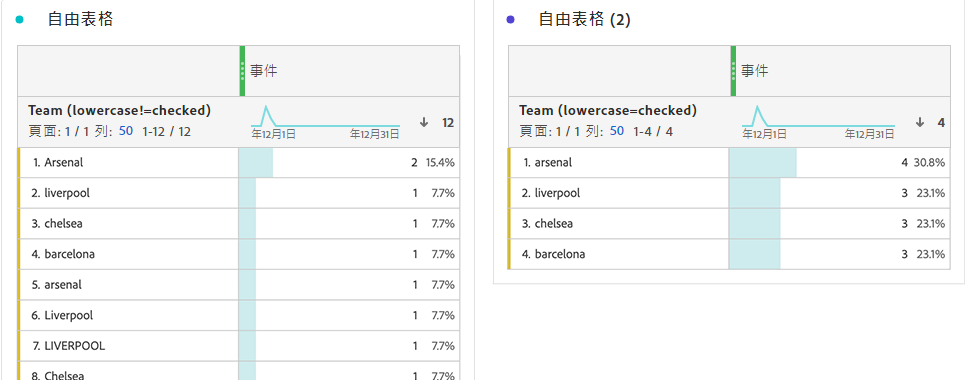

# 行為元件設定

維度和量度上均可使用行為設定。 可用的設定視元件類型和架構資料類型而定。

## Dimension行為設定

| 設定 | 說明 |
| --- | --- |
| [!UICONTROL 小寫] | 去除具有相同值但大小寫不同的列。 如果已啟用，則具有相同值的維度的所有例項都會報告為小寫。 例如，您的資料包含字串維度中的`"liverpool"`、`"Liverpool"`和`"LIVERPOOL"`值。 如果啟用了[!UICONTROL 小寫]，則所有三個值將合併到`"liverpool"`中。 如果已停用，則會將這三個值視為不同值。 |

>[!NOTE]
>
>如果您對查詢資料集維度啟用[!UICONTROL 小寫]，同一識別碼可以有多個查詢值。 如果發生此衝突，CJA會使用第一個ASCII對齊值（大寫值優先於小寫值）。 啟用[!UICONTROL 小寫]時，Adobe建議不要使用包含相同值的查詢資料集。

## 量度行為設定

| 設定 | 說明/使用案例 |
| --- | --- |
| [!UICONTROL 計數值] | 在整數和雙方架構資料類型上可見。 依指定的量度增加量度。 例如，如果欄的值為`50`，則將量度增加50。 |
| [!UICONTROL 計數實例] | 在整數和雙方架構資料類型上可見。 無論值為何，都將量度增加1。 任何值的存在都會增加量度。 例如，如果欄的值為`50`，則將量度增加1。 |
| [!UICONTROL 要計數的值] | 在布林架構資料類型上可見。 可讓您透過計數`true`、`false`或兩者來判斷量度是否增加。 |

您可以使用具有不同行為的相同事件資料集欄，在Analysis Workspace中同時產生「訂購」和「收入」量度。 將「收入」資料集欄拖曳至資料檢視兩次，並將其中一次設為「計數值」，將另一次設為「計算例項」。 「訂購」量度會計算例項，而「收入」量度則會計算值。
