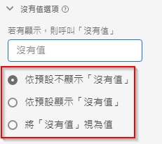

# 沒有值選項元件設定

沒有值選項可讓您確定 Analysis Workspace 如何處理資料集中的事件包含量度但維度不包含值的情況。您可以選擇該維度項的名稱，將其完全隱藏，甚至將其視為實際值。

| 設定 | 說明 |
| --- | --- |
| [!UICONTROL 如果顯示，請呼叫「無值」] | 一個文本欄位，可讓您將&#x200B;**[!UICONTROL 無值]**&#x200B;維度項目重新命名為其他名稱。 |
| [!UICONTROL 預設不顯示「無」值] | 不會在報告中顯示此值。與此維度無關的量度在報告中不可見。 |
| [!UICONTROL 預設顯示「無」值] | 在報告中顯示此值。 |
| [!UICONTROL 將「無值」視為值] | 以您在[!UICONTROL 「如果顯示，請呼叫無值...」] 下指定的文字取代資料中的空白值。例如，如果您以行動裝置類型為維度，您可將&#x200B;**[!UICONTROL 「沒有值」]**&#x200B;項目重新命名為「桌面」。當您將此欄位變更為自訂值時，自訂值將視為合法的字串值處理。因此，如果您在此欄位中輸入「Red」值，出現在資料中的字串「Red」執行個體將落在您已指定的相同條列項目下。 |
