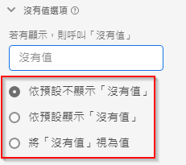

# 沒有值選項元件設定 {#no-value-options-component-settings}

<!-- markdownlint-disable MD034 -->

>[!CONTEXTUALHELP]
>id="dataview_component_dimension_novalueoptions"
>title="沒有值選項"
>abstract="設定當維度中不存在任何值時的預設行為。"

<!-- markdownlint-enable MD034 -->

[!UICONTROL 沒有值選項]讓您可以確認 Analysis Workspace 如何處理資料集中的事件包含量度但維度不包含值的情況。 您可以選擇該維度項的名稱，將其完全隱藏，甚至將其視為實際值。

## 設定 {#settings}

| 設定 | 說明 |
| --- | --- |
| **[!UICONTROL 如果顯示，請呼叫「無值」]** | 一個文本欄位，可讓您將&#x200B;**[!UICONTROL 無值]**&#x200B;維度項目重新命名為其他名稱。 |
| **[!UICONTROL 預設不顯示「無值」]** | 不會在報告中顯示此值。 與此維度無關的量度在報告中不可見。 |
| **[!UICONTROL 預設顯示「無值」]** | 在報告中顯示此值。 |
| **[!UICONTROL 將「無值」視為值]** | (不支援數值維度) 以您在[!UICONTROL 「如果顯示，請呼叫無值...」] 下指定的文字取代資料中的空白值。 例如，如果您以行動裝置類型為維度，您可將&#x200B;**[!UICONTROL 「沒有值」]**&#x200B;項目重新命名為「桌面」。 當您將此欄位變更為自訂值時，自訂值將視為合法的字串值處理。 因此，如果您在此欄位中輸入「Red」值，出現在資料中的字串「Red」執行個體將落在您已指定的相同條列項目下。 |

## 數值維度的「無值」支援 {#numeric}

當使用數值做為維度時，您可以

* 在資料視圖中設定「無值」選項。 請注意，除了&#x200B;**[!UICONTROL 將「無值」視為值]**&#x200B;之外，以上所示的設定皆予以支援。
* 將&#x200B;**[!UICONTROL 包括「無值」]**&#x200B;用於工作區中自由格式表格內的數值維度。
* 在區段產生器中，使用具有數值維度的&#x200B;**[!UICONTROL 存在]**&#x200B;或&#x200B;**[!UICONTROL 不存在]**&#x200B;運運算元。

>[!MORELIKETHIS]
>
>[在Adobe Customer Journey Analytics中處理「沒有值」的完整行動手冊](https://experienceleaguecommunities.adobe.com/t5/adobe-analytics-blogs/the-complete-playbook-for-handling-no-value-in-adobe-cja/ba-p/756696#M598)。

