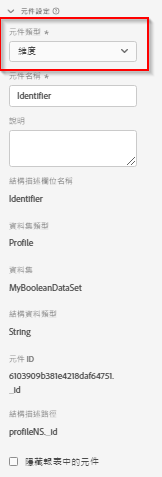

# 元件設定

資料檢視元件使用的核心設定。

| 設定 | 說明/使用案例 |
| --- | --- |
| [!UICONTROL 元件類型] | 必填。可讓您將元件從「量度」變更為「維度」，反之亦然。變更此下拉式清單會將元件移動到其各自包含的元件區域。 |
| [!UICONTROL 元件名稱] | 必填。可讓您指定在 Analysis Workspace 中顯示的友好名稱。您可以重新命名元件，給它一個特定於資料檢視的名稱。 |
| [!UICONTROL 說明] | 選填，但建議。為其他使用者提供有關元件的資訊。 |
| [!UICONTROL 標籤] | 選填。可讓您使用自訂或現成可用的標籤來標記元件，以便在 Analysis Workspace UI 中更輕鬆地進行搜尋/篩選。 |
| [!UICONTROL 欄位名稱] | 結構欄位的名稱。 |
| [!UICONTROL 資料集類型] | 必填。不可編輯的欄位，顯示元件來自的資料集類型 (事件、查詢或設定檔)。 |
| [!UICONTROL 資料集] | 不可編輯的欄位，顯示元件來自的資料集。此欄位可包含多個資料集。 |
| [!UICONTROL 結構描述資料類型] | 不可編輯的欄位，顯示元件的資料類型。雖然您可以在 Platform 中使用任何支援的結構描述欄位類型，但不是所有欄位類型都在 CJA 中受到支援。 以下是支援的資料類型：`Integer`、`Int`、`Long`、`Double`、`Float`、`Number`、`Short`、`Byte`、`String` 和 `Boolean`。 目前在查詢資料集中只允許使用 `String` 結構描述資料類型。 |
| [!UICONTROL 元件 ID] | 必填。[CJA API](https://adobe.io/cja-apis/docs) 使用此欄位來參考元件。資料檢視中的每個元件都必須是唯一的。Adobe 會自動為每個元件產生一個 ID；但是，您可以按一下編輯圖示並修改元件 ID。變更元件 ID 會中斷包含此元件的所有現有 Workspace 專案。雖然每個元件在單個資料檢視中都需要一個唯一 ID，但您可以在其他資料檢視中使用相同的元件 ID。如果您在其他資料檢視中使用相同的元件 ID，您可以使 Workspace 專案跨資料檢視相容。 |
| [!UICONTROL 結構描述路徑] | 必填。不可編輯的欄位，顯示元件來自的結構路徑。 |
| [!UICONTROL 隱藏報告中的元件] | 可讓您從非管理員的資料檢視中組織出元件。管理員仍可以按一下 Analysis Workspace 專案中的「[!UICONTROL 顯示所有元件]」來存取它。 |
