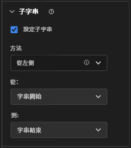

# [!UICONTROL 子字串]元件設定

[!UICONTROL 子字串]元件設定可讓您執行多種字串操控方法，以在報告中取得想要的維度項目。

[!UICONTROL 子字串]僅在維度上可用，並且可追溯至套用到的資料。它是發生在套用篩選或其他分析作業之前的立即資料轉換。

## 從左側/右側

根據其在字串開頭或結尾的位置獲取字串的一部分。**[!UICONTROL 從左邊]** 和 **[!UICONTROL 從右邊]** 方法提供兩個下拉式清單： **[!UICONTROL 從]** （輸出開始的位置）和 **[!UICONTROL 結束日期]** （輸出結束的位置）。

* **[!UICONTROL 字串開頭]**：字串起始。
* **[!UICONTROL 字串結尾]**：字串結束。
* **[!UICONTROL 位置]**：從左側或右側開始的靜態字元數，依方法而定。
* **[!UICONTROL 字串]**：和某個字元或字元序列相符以表示字串的開頭或結尾。此下拉式清單也會顯示其他選項：
   * **[!UICONTROL 相符]**：相符的字串。若輸入與此欄位不相符，[無值選項](no-value-options.md)適用。
   * **[!UICONTROL 索引]**：該&#x200B;**[!UICONTROL 相符]**&#x200B;標準可能會在字串中出現多次。此整數會決定何者和開始或結束輸出相符，依方法而定。例如，`1` 的索引代表第一個相符。如果索引高於可用的相符數，則套用[無值選項](no-value-options.md)。
   * **[!UICONTROL 包含字串]**：包含輸出中的&#x200B;**[!UICONTROL 相符]**&#x200B;字串的核取方塊 (如啟用)。
* **[!UICONTROL 長度]**：指定包含輸出的起始位置後的字元計數的整數。僅限 **[!UICONTROL 結束日期]** 下拉式清單。

## 分隔字元

將此方法用於使用分隔字元分隔多個字串值的欄位。您可以擷取個別元素以用作輸出，也可以將字串轉換為物件陣列結構描述元素。

* **[!UICONTROL 準則]**：您希望如何處理分隔的值清單。
   * **[!UICONTROL 從左側]**：從分隔清單的開頭開始並往前計數。
   * **[!UICONTROL 從右側]**：從分隔清單的結尾開始並往後計數。
   * **[!UICONTROL 轉換成陣列]**：將此維度視為物件陣列結構描述元素來處理。
* **[!UICONTROL 分隔字元]**：欄位使用的分隔字元。
* **[!UICONTROL 索引]**：只有在準則為「從左側/右側」時才會出現。猶如在陣列中的元素編號。例如，如果字串輸入為 `"Fox,Turtle,Rabbit,Wolf"`，而索引為 3，則輸入為 `"Rabbit"`。 如果索引高於分隔元素數，則套用[無值選項](no-value-options.md)。

## URL 剖析

和包含 URLs 的欄位搭配使用。 使用範例 URL `https://example.com/store/index.html?cid=campaign#cart`，下列選項可供選擇：

* **[!UICONTROL 取得通訊協定]**：取得 URL 的通訊協定。例如，`"https://"`。
* **[!UICONTROL 取得主機]**：取得 URL 的主機。例如，`"example.com"`。
* **[!UICONTROL 取得路徑]**：取得 URL 的路徑。例如，`"store/index.html"`。
* **[!UICONTROL 取得查詢字串值]**：從單一查詢字串取得值。將所需的查詢字串參數放入&#x200B;**[!UICONTROL 查詢鍵]**&#x200B;欄位中。若上述 URL 和 `"cid"` 查詢鍵搭配使用，則輸出為 `"campaign"`。
* **[!UICONTROL 取得雜湊值]**：取得 URL 的雜湊值。例如，`"cart"`。

如果輸出非有效的 URL 或如果所需的 URL 元件並未出現，則套用[無值選項](no-value-options.md)。

## 修剪

修剪來自字串的空格或特殊字元。

* **[!UICONTROL 修剪空格]**：移除所有字串開頭和結尾的所有空格的核取方塊 (如啟用)。
* **[!UICONTROL 修剪特殊字元]**：顯示&#x200B;**[!UICONTROL 特殊字元]**&#x200B;輸入欄位的核取方塊 (如啟用)。此欄位中的所有字元都將從輸出中刪除。不支援多位元組字元。

## 規則運算式

將規則運算式套用至維度，以擷取所需的值。

* **[!UICONTROL 規則運算式]**：規則運算式公式。
* **[!UICONTROL 輸出格式]**：可讓您新增文字或重新排序規則運算式子群組輸出的選用欄位。如果此欄位為空白，則字串輸出是評估過的規則運算式。
* **[!UICONTROL 區分大小寫]**：強制規則運算式區分大小寫的核取方塊 (如啟用)。

CJA 使用 Perl 規則運算式語法的子集。若輸入和規則運算式不相符，且&#x200B;**[!UICONTROL 輸出格式]**&#x200B;為空白，則套用[無值選項](no-value-options.md)。支援下列運算式：

| 運算式 | 說明 |
| --- | --- |
| `a` | 單一字元 `a`。 |
| `a|b` | 單一字元 `a` 或 `b`。 |
| `[abc]` | 單一字元 `a`、`b` 或 `c`。 |
| `[^abc]` | 除了 `a`、`b` 或 `c` 之外的任一單一字元。 |
| `[a-z]` | `a`-`z` 範圍內的任一單一字元。 |
| `[a-zA-Z0-9]` | `a`-`z`、`A`-`Z` 或數字 `0`-`9` 範圍內的任一單一字元。 |
| `^` | 和行的開頭相符。 |
| `$` | 和行的結尾相符。 |
| `\A` | 字串的開頭。 |
| `\z` | 字串的結尾。 |
| `.` | 符合任一字元。  |
| `\s` | 任一空格字元。 |
| `\S` | 任何非空格字元。 |
| `\d` | 任何數字。 |
| `\D` | 任何非數字。 |
| `\w` | 任一字母、數字或底線。 |
| `\W` | 任一非單詞字元。 |
| `\b` | 任何單詞邊界。 |
| `\B` | 任一非單詞邊界的字元。 |
| `\<` | 單詞的開頭。 |
| `\>` | 單詞的結尾。 |
| `(...)` | 擷取括號內的所有內容。 |
| `(?:...)` | 未標示擷取。防止在輸出字串中參考相符項。 |
| `a?` | 零個或一個 `a`。 |
| `a*` | 零個或更多 `a`。 |
| `a+` | 一個或更多 `a`。 |
| `a{3}` | 剛好 3 個 `a`。 |
| `a{3,}` | 3 個或更多 `a`。 |
| `a{3,6}` | 介於 3 個和 6 個 `a` 之間。 |

還支援輸出預留位置。您可以在&#x200B;**[!UICONTROL 輸出格式]**&#x200B;中以不限次數和任何順序的方式使用這些序列，以實現所需的字串輸出。

| 輸出預留位置序列 | 說明 |
| --- | --- |
| `$&` | 和全部運算式相符的輸出。 |
| `$n` | 和第 n 個子運算式相符的輸出。例如，`$1` 輸出第一個子運算式。 |
| ``$` `` | 輸出找到的最後一個相符項的結尾 (如果沒有找到之前的相符項，則為文字的開頭) 和目前相符項的開頭之間的文字。 |
| `$+` | 輸出和規則運算式中最後一個標記的子運算式相符的內容。 |
| `$$` | 輸出字串字元 `"$"`。 |

{style="table-layout:auto"}

## 有關繫結維度的影片

以下是有關繫結維度的影片：

>[!VIDEO](https://video.tv.adobe.com/v/342694/?quality=12)
