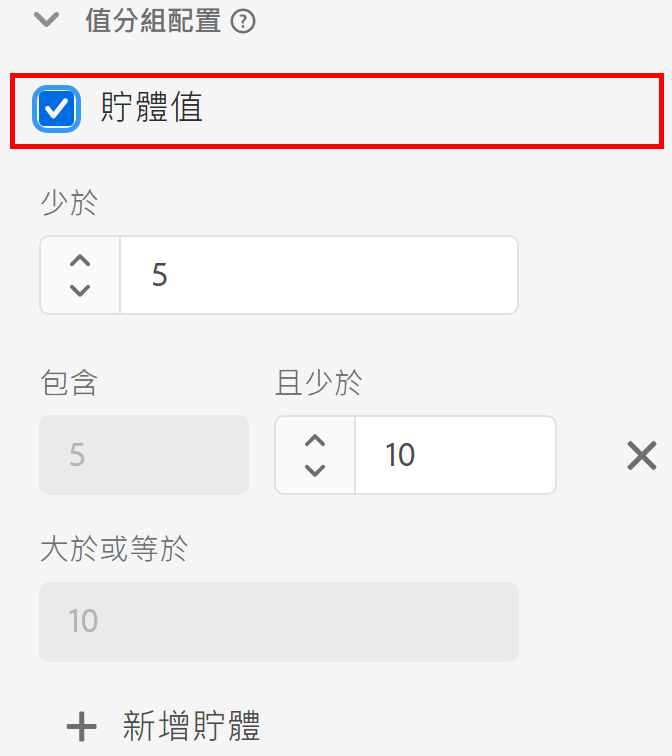

# [!UICONTROL 值分組]元件設定

建立或編輯資料檢視時，值分組允許您根據範圍組合數值。它僅適用於使用 Integer 或 Double 結構描述資料類型的維度。

當您想要將範圍組合在一起而不是將每個唯一數字視為單獨的維度項目時，值分組很有價值。例如，「5 到 10 之間」的值區會在 Analysis Workspace 中顯示為「5 到 10」的條列項目。

如果您希望靈活地報告分組維度和非分組維度，請將元件的兩個副本拖到可用維度清單中。在一個維度上啟用分組，在另一個維度上停用它。

| 設定 | 說明 |
| --- | --- |
| [!UICONTROL 值區值] | 一個允許您啟用分組的核取方塊。 |
| [!UICONTROL 少於] | 第一個維度值區的範圍上限。 |
| [!UICONTROL 包含] [!UICONTROL 和小於] | 後續值區的邊界。 |
| [!UICONTROL 大於或等於] | 最後一個維度值區的範圍下限。 |
| [!UICONTROL 新增值區] | 可讓您新增另一個值區至數值維度分組。您最多可以在一個維度中新增 20 個值區。 |

{style="table-layout:auto"}
