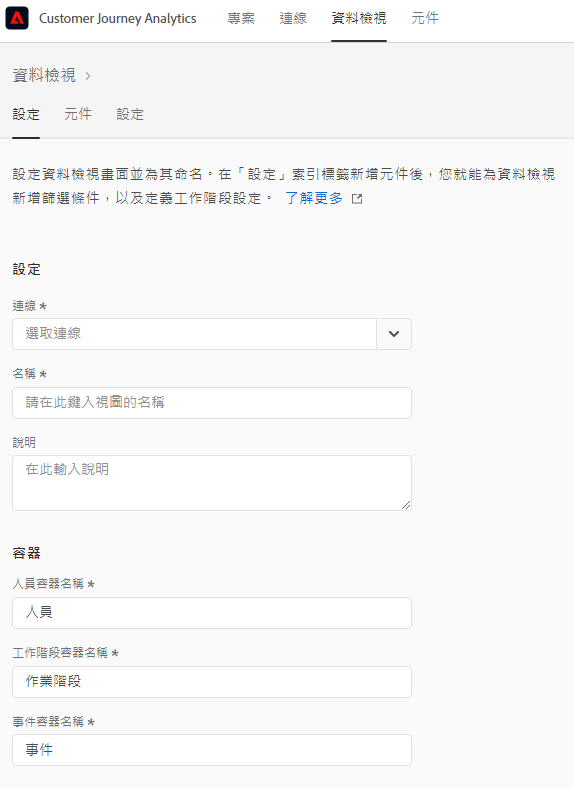
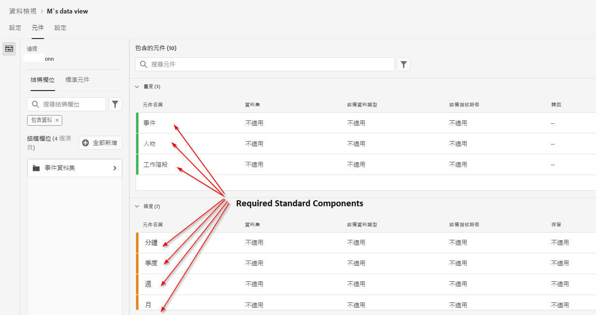
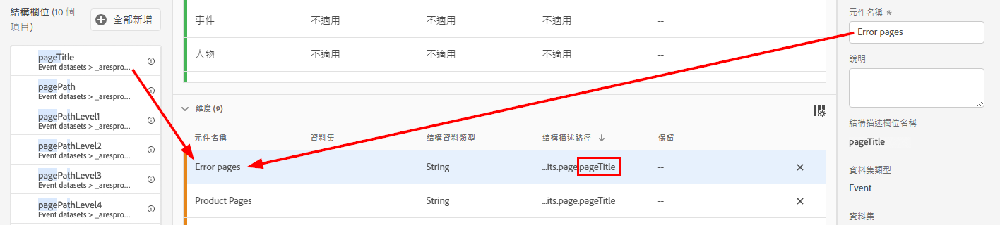
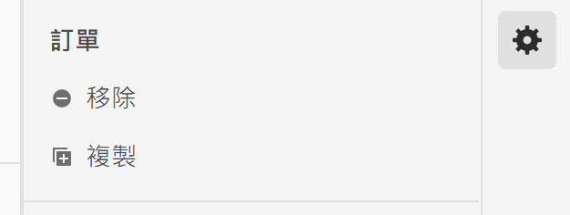
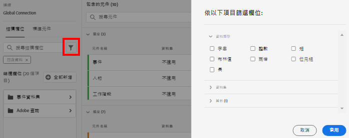
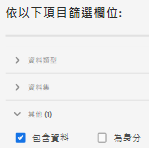

# 建立或編輯資料檢視

建立資料檢視需要從結構元素建立量度和維度或使用標準元件。大多數結構描述元素可以是維度或量度，具體取決於您的業務需求。將結構描述元素拖到資料檢視中後，右側會出現選項，您可以在其中調整維度或量度在 CJA 中的運行方式。

## 設定資料檢視

1. 登入 [Customer Journey Analytics](https://analytics.adobe.com) 並移至「**[!UICONTROL 資料檢視]**」標籤。
2. 按一下「**[!UICONTROL 新增]**」建立資料檢視，或按一下現有資料檢視進行編輯。

### 資料檢視設定

為資料檢視提供總體設定。

| 設定 | 說明 |
| --- | --- |
| [!UICONTROL 連線] | 此欄位會將資料檢視連結至您先前建立的連線，其中包含一或多個 Adobe Experience Platform 資料集。 |
| [!UICONTROL 名稱] | 必填。資料檢視的名稱。此值顯示在 Analysis Workspace 的右上角下拉式清單中。 |
| [!UICONTROL 說明] | 選填。Adobe 建議使用詳細說明，讓用戶了解資料檢視存在的原因及其設計對象。 |

### 容器

指定資料檢視的容器名稱。容器名稱在[篩選](/help/components/filters/filters-overview.md#Filter-containers)中經常使用。

| 設定 | 說明 |
| --- | --- |
| [!UICONTROL 人員容器名稱] | 「[!UICONTROL 人員]」(預設)。「[!UICONTROL 人員]」容器包含指定時間段內訪客的每個工作階段和事件。如果您的組織使用不同的術語（例如，「訪客」或「用戶」），您可以在此處重新命名容器。 |
| [!UICONTROL 工作階段容器名稱] | 「[!UICONTROL 工作階段]」(預設)。「[!UICONTROL 工作階段]」容器可讓您識別特定工作階段的頁面互動、促銷活動或轉換。您可以將此容器重新命名為「Visit」或您組織偏好的其他任何詞語。 |
| [!UICONTROL 事件容器名稱] | [!UICONTROL 事件] (預設)。[!UICONTROL 事件]容器定義資料集中的單個事件。如果您的組織使用不同的術語（例如，「點擊次數」或「頁面檢視量」），您可以在此處重新命名容器。 |

### 行事曆

指示您希望資料檢視遵循的行事曆格式。您可以根據同一個[連線](/help/connections/create-connection.md)擁有多個資料檢視，並為它們提供不同的行事曆類型或時區。這些資料檢視可以讓使用不同行事曆類型的團隊，透過相同的基礎資料滿足各自的需求。

| 設定 | 說明 |
| --- | --- |
| [!UICONTROL 時區] | 選擇要顯示資料的時區。如果您選擇實行夏令時間的時區，則會自動調整資料以反映這一點。在春天，當時鐘向前調快一小時，會出現一小時的缺口。在秋天，當時鐘向後調慢一小時，會在夏令偏移期間重複一小時。 |
| [!UICONTROL 行事曆類型] | 決定一個月中的週如何分組。 **西曆：**&#x200B;標準行事曆格式。季依照月分組。 **4-5-4 零售業：**&#x200B;標準化的 4-5-4 零售業行事曆。本季的第一個月和最後一個月為 4 週，而本季的第二個月為 5 週。 **自訂 (4-5-4)：**&#x200B;類似於 4-5-4 行事曆，但您可以選擇一年的第一天以及「額外」週發生的年份。 **自訂 (4-4-5)：**&#x200B;每個季的第一個月和第二個月為 4 週，而每個季的最後一週為 5 週。 **自訂 (5-4-4)：**&#x200B;每個季的第一個月為 5 週，而每個季的第二和第三個月為 4 週。 |
| [!UICONTROL 一年的第一個月]和[!UICONTROL 一週的第一天] | 對西曆行事曆類型可見。指定您希望行事曆年從哪一個月開始，以及您希望每週從哪一天開始。 |
| [!UICONTROL 當年的第一天] | 對自訂行事曆類型可見。指定您希望目前年份在一年中的哪一天開始。行事曆會根據此值自動設定每週第一天的格式。 |
| [!UICONTROL 「額外」週發生的年份] | 對於大多數 364 天行事曆（52 週，每週 7 天），每年都會累積剩餘的天數，直到它們形成額外的一週。然後將這個額外的一週新增到該年的最後一個月。指定您希望將額外一週新增到哪一年。 |

## 設定資料檢視的元件

接著，您可以從結構元素建立量度和維度。您也可以使用標準元件。

1. 登入 [Customer Journey Analytics](https://analytics.adobe.com) 並移至「**[!UICONTROL 資料檢視]**」標籤。
1. 按一下「**[!UICONTROL 新增]**」以建立資料檢視，或按一下現有資料檢視來進行編輯。
1. 按一下「**[!UICONTROL 元件]**」標籤。

   

   您可以在左上角看到「[!UICONTROL 連線]」，其中包含資料集，以及下面的[!UICONTROL 「結構」欄位]。請注意，已包含的元件是所有資料檢視的標準必要元件 (系統產生)。Adobe 預設也會套用&#x200B;**[!UICONTROL 包含資料]**&#x200B;篩選條件，以便只顯示包含資料的結構描述欄位。 如果您想要不含資料的欄位，請移除此篩選條件。

1. 從左側邊欄拖曳結構欄位 (例如 `pageTitle`) 至 Metrics 或 Dimensions 區段。

   您可以多次將相同的結構欄位拖曳至維度或量度區段，並以不同的方式設定相同的維度或量度。 例如，從 `pageTitle` 欄位，您可以使用右側不同的 [Component settings](component-settings/overview.md)，以建立名為「Product Pages」的維度，以及另一個「Error pages」等。

   

   如果從左側欄拖曳結構描述欄位檔案夾，它們會自動排序為傳統區段。字串欄位會在「[!UICONTROL 維度]」區段中結束，而數字結構描述類型最終出現在「[!UICONTROL 量度]」區段中。您也可以按一下「**[!UICONTROL 新增全部]**」，並新增所有結構描述欄位至其各自的位置。

1. 選取元件後，右側會出現許多設定。使用[元件設定](component-settings/overview.md)來設定元件。可用的元件設定取決於元件是維度/量度以及結構描述資料類型。設定包括：

   * [[!UICONTROL 歸因]](component-settings/attribution.md)
   * [[!UICONTROL 行為]](component-settings/behavior.md)
   * [[!UICONTROL 格式]](component-settings/format.md)
   * [[!UICONTROL 包含排除值]](component-settings/include-exclude-values.md)
   * [[!UICONTROL 量度重複資料刪除]](component-settings/metric-deduplication.md)
   * [[!UICONTROL 沒有值選項]](component-settings/no-value-options.md)
   * [[!UICONTROL 持續性]](component-settings/persistence.md)
   * [[!UICONTROL 值分組]](component-settings/value-bucketing.md)

## 複製量度或維度

複製量度或維度，然後修改特定的設定，是從單一結構描述欄位建立多個量度或維度的簡易方式。選取右上方的量度或維度名稱底下的「[!UICONTROL 複製]」設定。 修改新的量度或維度，並使用更具說明性的名稱來儲存它。

## 篩選結構描述欄位或資料集

您可以依下列資料類型篩選左側邊欄中的結構描述欄位：

您也可以依資料集以及結構欄位是否包含資料或是否為身分來篩選。依預設，Adobe 一開始會將&#x200B;**[!UICONTROL 包含資料]**&#x200B;篩選套用至所有資料檢視。

## 設定索引標籤

1. 登入 [Customer Journey Analytics](https://analytics.adobe.com) 並移至「**[!UICONTROL 資料檢視]**」標籤。
1. 按一下「**[!UICONTROL 新增]**」以建立資料檢視，或按一下現有資料檢視來進行編輯。
1. 按一下「**[!UICONTROL 設定]**」標籤。

### 全域篩選

您可以新增套用至整個資料檢視的篩選器。此篩選器將套用至您在 Workspace 中執行的任何報告。從左側邊欄的清單拖曳篩選器至「[!UICONTROL 新增篩選器]」欄位。

### 工作階段設定

決定在工作階段到期和新工作階段開始之前，事件之間的閒置時段。

需要時段。您也可以選擇在事件包含特定量度時，強制啟動新工作階段。

指定所有所需設定後，按一下&#x200B;**[!UICONTROL 「儲存並完成」]**。
