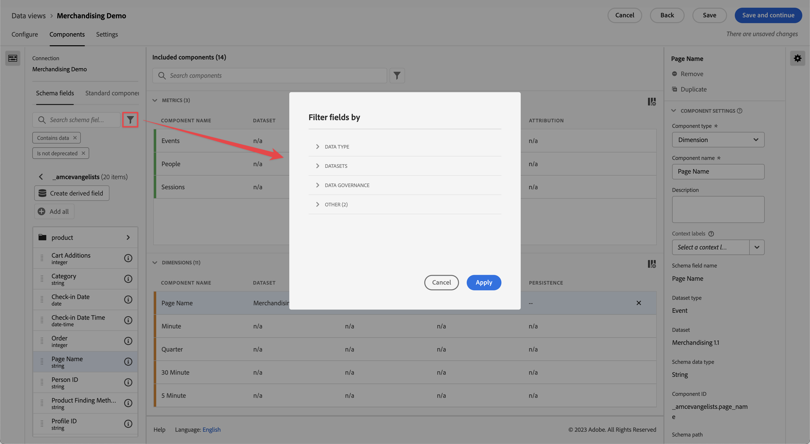

# 建立或編輯資料視圖

建立資料視圖需要從結構描述元素建立量度和維度或使用標準元件。 大多數結構描述元素可以是維度或量度，具體取決於您的業務需求。 將結構描述元素拖到資料視圖中後，右側會出現選項，您可以在其中調整維度或量度在 Customer Journey Analytics 中的執行方式。

>[!BEGINSHADEBOX]

請參閱  [建立或編輯資料檢視](https://experienceleague.adobe.com/en/docs/customer-journey-analytics-learn/tutorials/data-views/overview-of-configuring-data-views-for-cja){target="_blank"}的示範影片。

>[!ENDSHADEBOX]

若要建立或編輯資料視圖：

1. 登入 [Customer Journey Analytics](https://analytics.adobe.com) 然後選取「**[!UICONTROL 資料視圖]**」，也可以自頂部選單中選取「**[!UICONTROL 資料管理]**」。
1. 若要建立資料視圖，請選取「**[!UICONTROL 建立新的資料視圖]**」。 或者，您可以從資料視圖清單中選取現有資料視圖進行編輯。

## 設定 {#configure}

設定新的或現有的資料視圖的方法：

1. 選取「**[!UICONTROL 設定]**」索引標籤 (如果尚未啟動使用)。
1. 指定&#x200B;**[!UICONTROL 設定]**、**[!UICONTROL 相容性]**、**[!UICONTROL AI設定]**&#x200B;和&#x200B;**[!UICONTROL 行事曆]**&#x200B;詳細資料（請參閱下文）。
1. 選取「**[!UICONTROL 儲存並繼續]**」，繼續設定新的或現有的資料視圖。 選取「**[!UICONTROL 儲存]**」，儲存現有資料視圖的設定。

### 設定 {#configure-settings}

>[!CONTEXTUALHELP]
>id="dataview_externalid"
>title="外部 ID"
>abstract="變更外部ID會影響資料檢視名稱在外部來源（例如商務智慧工具）中的顯示方式。"

為資料視圖提供總體設定。

| 設定 | 說明 |
| --- | --- |
| **[!UICONTROL 連線]** | 此欄位會將資料視圖連結至您先前建立的連線，其中包含一或多個 Adobe Experience Platform 資料集。 |
| **[!UICONTROL 名稱]** | 必填。 資料視圖的名稱。 此值顯示在 Analysis Workspace 右上角的下拉式選單中。 |
| **[!UICONTROL 外部 ID]** | 必填。 您可以在外部來源 (例如商業智慧工具) 中使用的資料視圖名稱。 預設值為 `unspecified`。 如果不指定外部 ID，則將從資料視圖的名稱產生該名稱，並以底線取代空格。 |
| **[!UICONTROL 說明]** | 選填。 Adobe 建議使用詳細說明，讓用戶了解資料視圖存在的原因及其設計客群。 |

{style="table-layout:auto"}

### 相容性 {#compatibility}

>[!CONTEXTUALHELP]
>id="dataview_dataviewsinadobejourneyoptimizer"
>title="Journey Optimizer 的資料釋圖"
>abstract="Customer Journey Analytics需要與Adobe Journey Optimizer相容的連線和資料檢視。 依預設，系統會建立連線和資料檢視。 或者，啟用此選項以將此項設為Adobe Journey Optimizer報告的預設資料檢視，這會將必要元件新增至資料檢視，並將資料集新增至連線。"
>additional-url="https://experienceleague.adobe.com/zh-hant/docs/analytics-platform/using/integrations/ajo#connection" text="新增了哪些元件和資料集。"

提供 Customer Journey Analytics 搭配使用 Adobe Journey Optimizer 時適用的設定。

只有已佈建 Journey Optimizer 的管理員才能看到此部分。

| 設定 | 說明 |
| --- | --- |
| [!UICONTROL **設為 Adobe Journey Optimizer 中的預設資料視圖**] | 您可使用此設定選項，讓 Journey Optimizer 和 Customer Journey Analytics 共用標準化報告， 並在 Customer Journey Analytics 中對 Adobe Journey Optimizer 資料執行進階分析 (在 Journey Optimizer 中選取 「[!UICONTROL **在 CJA 中分析**]」按鈕)。
Journey Optimizer 需擁有 Customer Journey Analytics 資料視圖的存取權，才能執行此類分析。
啟用此選項可使其成為您沙箱的 Journey Optimizer 報告中的預設資料視圖。

此設定選項會自動完成以下操作：
<ul><li>在 Customer Journey Analytics 的相關連線中，設定所有必要的 Journey Optimizer 資料集，以供 Journey Optimizer 使用。</li><li>在資料視圖中建立一組 Journey Optimizer 量度和維度 (包括衍生欄位和計算量度)。 系統會為所有這些指標和維度自動設定內容標籤。</li><li>在與此資料視圖關聯的連線中，自動啟用&#x200B;**[!UICONTROL 在 CJA 中使用]**&#x200B;選項。 (若要了解更多關於此選項的資訊，請參閱[在 Customer Journey Analytics 中使用 Journey Optimizer 連線](/help/connections/manage-connections.md)。)
如果您在啟用此設定後手動將其停用，連線和任何相關的資料視圖都會重設為預設狀態。 這可能會導致報告中的資料變更。
</li></ul>

啟用此選項時請考慮以下事項： <ul><li>您可於日後變更預設資料視圖，但這麼做可能會對 Journey Optimizer 報告資料造成影響。 如果您在啟用此選項後又選擇停用，系統將提示您選取新的預設資料視圖。</li><li>如果您已對 Customer Journey Analytics 資料視圖中的資料集、維度或量度進行了手動自訂，則在啟用此設定選項時，您的手動自訂將保持不變。 此選項可進行額外的自訂，進一步標準化跨 Journey Optimizer 和 Customer Journey Analytics 的報告。 您也可以在啟用此選項後進行手動自訂。</li><li>在選取此選項後，就無法刪除與資料檢視關聯的連線。</li></ul>如需詳細資訊，請參閱[整合 Adobe Journey Optimizer 與 Adobe Customer Journey Analytics](/help/integrations/ajo.md)。 |

{style="table-layout:auto"}

### AI 設定

選取&#x200B;**[!UICONTROL 啟用Data Insights Agent]**&#x200B;以啟用[Data Insights Agent](/help/data-analysis-ai.md)的資料檢視。 Data Insights Agent是產生式AI交談代理程式，可從Customer Journey Analytics的AI助理存取。 它能協助您透過文字提示快速分析資料。 代理程式會使用您資料檢視中的元件，並使用您的實際資料，在Analysis Workspace中建置相關的視覺效果。

### 行事曆

指示您希望資料視圖遵循的行事曆格式。 您可以根據同一個[連線](/help/connections/create-connection.md)擁有多個資料視圖，並為它們提供不同的行事曆類型或時區。 這些資料視圖可以讓使用不同行事曆類型的團隊，透過相同的基礎資料滿足各自的需求。

| 設定 | 說明 |
| --- | --- |
| [!UICONTROL **時區**] | 選擇要顯示資料的時區。 如果您選擇實行夏令時間的時區，則會自動調整資料以反映這一點。 在春天，當時鐘向前調快一小時，會出現一小時的缺口。 在秋天，當時鐘向後調慢一小時，會在夏令偏移期間重複一小時。 |
| [!UICONTROL **行事曆類型**] | 決定一個月中的周如何分組。 **西曆：**&#x200B;標準行事曆格式。 季度依月份分組。 **4-5-4零售業：**&#x200B;標準化的4-5-4零售業行事曆。 本季的第一個月和最後一個月為 4 週，而本季的第二個月為 5 週。 **自訂 (4-5-4)：**&#x200B;類似於 4-5-4 行事曆，但您可以選取一年的第一天以及「額外」週發生的年份。 **自訂 (4-4-5)：**&#x200B;每個季的第一個月和第二個月為 4 週，而每個季的最後一週為 5 週。 **自訂 (5-4-4)：**&#x200B;每個季的第一個月為 5 週，而每個季的第二和第三個月為 4 週。 |
| [!UICONTROL **一年的第一個月**]&#x200B;和&#x200B;[!UICONTROL **一週的第一天**] | 對西曆行事曆類型可見。 指定您希望行事曆年從哪一個月開始，以及您希望每週從哪一天開始。 |
| [!UICONTROL **當年的第一天**] | 對自訂行事曆類型可見。 指定您希望目前年份在一年中的哪一天開始。 行事曆會根據此值自動設定每週第一天的格式。 |
| [!UICONTROL **「額外」週發生的年份**] | 對於大多數 364 天行事曆 (52 週，每週 7 天)，每年都會累積剩餘的天數，直到加起來多出一週。 然後將這個額外的一週新增到該年的最後一個月。 指定您希望將額外一週新增到哪一年。  **額外週數和閏年** &#x200B;當您選取自訂「**[!UICONTROL 日曆類型]**」(「**[!UICONTROL 自訂 (4-5-4)]**」、「**[!UICONTROL 自訂 (4-4-5)]**」或「**[!UICONTROL 自訂 (5-4-4)]**」) 時，每年剩餘的天數會累積，直到這些天數加起來為完整的額外一週 (7 天) 為止。 該額外的一週會新增至您在「**[!UICONTROL 「額外」週發生的年度]**」所選取的那一年。  在「**[!UICONTROL 「額外」週發生的年度]**」中不會刻意顯示閏年。 不過，閏年仍可包含 53 週。 若要強制閏年包含 53 週，請從「**[!UICONTROL 發生「額外」週的年度]**」選取非閏年，確保在您的目標閏年中，累計的日期偏差總計達 7 天。 例如：若要在 2024 年有 53 週，請選取「**[!UICONTROL 2019]**」。 從2019年到2024年，總日期漂移為7天(2020 (+2)、2021 (+1)、2022 (+1)、2023 (+1)和2024 (+2))，這會導致2024年的第53週。  選擇&#x200B;**[!UICONTROL 當年的第一天]**&#x200B;會影響額外周所在的位置。 使用日曆預覽確認您的設定。 |

{style="table-layout:auto"}

## 容器

{{release-limited-testing-section}}

>[!BEGINTABS]

>[!TAB 標準]

>[!TAB B2B Edition]

>[!ENDTABS]

在&#x200B;**[!UICONTROL 容器]**&#x200B;標籤中，您可以重新命名系統容器並新增自訂容器。

### 系統容器

指定資料視圖的容器名稱。 容器名稱在[區段](/help/components/segments/seg-overview.md#containers)中經常使用。

| 容器名稱 | 顯示名稱（預設） | 說明 |
| --- | --- | --- |
| globalAccount | [!BADGE B2B edition]{type=Informative url="https://experienceleague.adobe.com/zh-hant/docs/analytics-platform/using/cja-overview/cja-b2b/cja-b2b-edition" newtab=true tooltip="Customer Journey Analytics B2B Edition"} **[!UICONTROL 全域帳戶&#x200B;]** | 「[!UICONTROL 全域帳戶]」容器包含指定時間段內全域帳戶的每個工作階段和事件。 若您的組織使用不同的術語，您可以在此處重新命名容器。 |
| 人員 | **[!UICONTROL 人員]** | 「[!UICONTROL 人員]」容器包含指定時間段內人員的每個工作階段和事件。 如果您的組織使用不同的術語 (例如，「訪客」或「用戶」)，您可以在此處重新命名容器。 |
| session | **[!UICONTROL 工作階段]** | 「[!UICONTROL 工作階段]」容器讓您可以識別特定工作階段的頁面互動、促銷活動或轉換。 您可以將此容器重新命名為「Visit」或您組織偏好的其他任何詞語。 |
| 商機 | [!BADGE B2B edition]{type=Informative url="https://experienceleague.adobe.com/zh-hant/docs/analytics-platform/using/cja-overview/cja-b2b/cja-b2b-edition" newtab=true tooltip="Customer Journey Analytics B2B Edition"} **[!UICONTROL 商機&#x200B;]** | 「[!UICONTROL 機會]」容器包含指定時間段內機會的每個工作階段和事件。 若您的組織使用不同的術語，您可以在此處重新命名容器。 |
| purchingGroup | [!BADGE B2B edition]{type=Informative url="https://experienceleague.adobe.com/zh-hant/docs/analytics-platform/using/cja-overview/cja-b2b/cja-b2b-edition" newtab=true tooltip="Customer Journey Analytics B2B Edition"} **[!UICONTROL 購買群組&#x200B;]** | 「[!UICONTROL 購買群組]」容器包含指定時間段內購買群組的每個工作階段和事件。 若您的組織使用不同的術語，您可以在此處重新命名容器。 |
| 事件 | **[!UICONTROL 事件]** | [!UICONTROL 事件]容器定義資料集中的單個事件。 如果您的組織使用不同的術語 (例如，「點擊次數」或「頁面檢視量」)，您可以在此處重新命名容器。 |
| account | [!BADGE B2B edition]{type=Informative url="https://experienceleague.adobe.com/zh-hant/docs/analytics-platform/using/cja-overview/cja-b2b/cja-b2b-edition" newtab=true tooltip="Customer Journey Analytics B2B Edition"} **[!UICONTROL 帳戶&#x200B;]** | 「[!UICONTROL 帳戶]」容器包含指定時間段內帳戶的每個工作階段和事件。 若您的組織使用不同的術語，您可以在此處重新命名容器。 |

若要重新命名系統容器：

1. 選取以編輯容器的&#x200B;**[!UICONTROL 顯示名稱]**。
1. 定義容器的新名稱。
1. 選取&#x200B;**[!UICONTROL 「儲存」]**。

### 自訂容器

您新增自訂容器至資料檢視，以便使用這些容器進行[子事件分析](/help/components/segments/sub-event.md)。 自訂容器可從以下位置定義：

* 屬於連線之一部分的資料集內可用的物件或陣列。 例如，**[!UICONTROL productListItems]**、**[!UICONTROL content_assets]**&#x200B;或&#x200B;**[!UICONTROL placeContext.activePOIs]**。
* 使用[分割](/help/data-views/derived-fields/derived-fields.md#split)函式傳回陣列的衍生欄位。
* 資料檢視元件，這些元件已設定為使用[Substring](/help/data-views/component-settings/substring.md)元件設定及[分隔符號](/help/data-views/component-settings/substring.md#delimiter)選項傳回陣列。

若要新增自訂容器：

1. 選取&#x200B;**[!UICONTROL 新增自訂容器]**。
1. 在&#x200B;**[!UICONTROL 新增容器]**&#x200B;對話方塊中：
   1. 從&#x200B;**[!UICONTROL 容器]**&#x200B;下拉式功能表中選取容器。 例如： **[!UICONTROL productListItems.productCategories]**。 選取後，您會看到&#x200B;**[!UICONTROL 結構描述路徑]**&#x200B;和&#x200B;**[!UICONTROL 結構描述型別]**&#x200B;的更新值。

   1. 輸入容器的&#x200B;**[!UICONTROL 顯示名稱]**。 例如：`Product Categories`。
   1. 選取&#x200B;**[!UICONTROL 「儲存」]**。

若要編輯自訂容器：

1. 在&#x200B;**[!UICONTROL 顯示名稱]**&#x200B;資料行中，為自訂容器選取。
1. 從內容選單中選取  **[!UICONTROL 「編輯」]**。
1. 在&#x200B;**[!UICONTROL 編輯容器]**&#x200B;對話方塊中：
   1. 修改&#x200B;**[!UICONTROL 容器]**&#x200B;或&#x200B;**[!UICONTROL 顯示名稱]**&#x200B;或兩者。
   1. 選取&#x200B;**[!UICONTROL 「儲存」]**。

若要刪除自訂容器：

1. 在[顯示名稱]欄中選取自訂容器的。
1. 從內容功能表中選取 **[!UICONTROL 刪除]**。

   >[!NOTE]
   >
   >自訂容器會被刪除，恕不確認。
   >

若要變更自訂容器清單：

1. 選取。
1. 在&#x200B;**[!UICONTROL 自訂資料表]**&#x200B;中：
   1. 選取要顯示的欄。
   1. 選取&#x200B;**[!UICONTROL 「儲存」]**。

## 元件

接下來，您可以設定資料視圖的元件，這代表您可以從結構描述元素建立量度和維度。 您也可以使用標準元件。

>[!IMPORTANT]
>
>單一資料視圖中最多可新增 5,000 個量度和 5,000 個維度。

1. 選取「**[!UICONTROL 元件]**」索引標籤。

   

   您可以在左上角看到「[!UICONTROL 連線]」，其中包含資料集，以及下面的[!UICONTROL 「結構描述」欄位]。  所有資料檢視都包含標準元件，例如「事件」、「人員」、「工作階段」量度和時間維度。<ul><li>當您定義[自訂容器](#containers-1)時，量度會自動新增為 **[!UICONTROL _自訂容器名稱&#x200B;_發生次數]**。</li><li>預設情況下，系統套用&#x200B;**[!UICONTROL 不是已棄用的]**&#x200B;篩選器，因此只顯示未棄用的結構描述欄位。</li></ul>

1. 使用「**[!UICONTROL 搜尋結構描述欄位]**」來搜尋結構描述欄位，或者移動到任何資料集集合中尋找欄位，例如「**[!UICONTROL 事件資料集]**」或「**[!UICONTROL 查詢資料集]**」。 對於事件資料集， **[!UICONTROL XDM欄位]**&#x200B;和 **[!UICONTROL 臨機欄位和關聯欄位]**&#x200B;有可用的個別集合。 或者，您可以使用 **建立衍生欄位**&#x200B;來建立衍生欄位。 請參閱「[衍生欄位](./derived-fields/derived-fields.md)」以了解更多資訊。

1. 找到特定結構描述欄位或定義衍生欄位後，請將該欄位（例如 **[!UICONTROL 頁面名稱]**）從左側邊欄拖曳至&#x200B;**[!UICONTROL 包含的元件下**[!UICONTROL &#x200B;量度&#x200B;]**或**[!UICONTROL &#x200B;維度&#x200B;]**區段]**。
您可以多次將相同的結構描述欄位拖曳至維度或量度區段，並以不同的方式設定相同的維度或量度。 例如，從pageName欄位，使用右側不同的[元件設定](component-settings/overview.md)來建立`Product Pages`和`Error pages`維度。
如果從左側邊欄拖曳一個結構描述欄位資料夾，資料夾中的欄位會自動排序成為適當的區段。 字串欄位會在「[!UICONTROL 維度]」區段中結束，而數值結構描述類型最終出現在「[!UICONTROL 量度]」區段中。 您也可以按一下「**[!UICONTROL 新增全部]**」，並新增所有結構描述欄位至其各自的區段。

1. 選取元件後，右側會出現設定。

   

   使用[元件設定](component-settings/overview.md)來設定元件。 可用的元件設定取決於元件是維度/量度以及結構描述資料類型。 設定包括：

   * [[!UICONTROL 歸因]](component-settings/attribution.md)
   * [[!UICONTROL 行為]](component-settings/behavior.md)
   * [[!UICONTROL 格式]](component-settings/format.md)
   * [[!UICONTROL 包含排除值]](component-settings/include-exclude-values.md)
   * [[!UICONTROL 量度重複資料刪除]](component-settings/metric-deduplication.md)
   * [[!UICONTROL 沒有值選項]](component-settings/no-value-options.md)
   * [[!UICONTROL 持續性]](component-settings/persistence.md)
   * [[!UICONTROL 值分組]](component-settings/value-bucketing.md)

1. 選取「**[!UICONTROL 儲存並繼續]**」，繼續設定新的或現有的資料視圖。 選取「**[!UICONTROL 儲存]**」，儲存現有資料視圖的設定。

### 複製量度或維度

複製量度或維度然後修改特定的設定是從單一結構描述欄位建立多個量度或維度的有效方式。 選取右上方的量度或維度名稱底下的[!UICONTROL 複製]設定。 修改新的量度或維度，並使用更具說明性的名稱來儲存它。

### 篩選結構描述欄位或資料集

您可以依照[!UICONTROL 資料類型], [!UICONTROL 資料集]、[!UICONTROL 資料治理] 和 [!UICONTROL 其他] 條件 ([!UICONTROL 包含資料]、[!UICONTROL 身分識別] 和 [!UICONTROL 未淘汰]) 篩選左邊欄中的結構描述欄位：

>[!TIP]
>
>若元件未在您的資料檢視中正確載入，且您看到錯誤訊息，請參考[缺乏許可權](../troubleshooting/lack-of-permissions.md)以取得解決方案。

### 包含的元件 {#included-components}

>[!CONTEXTUALHELP]
>id="dataview_includedcomponents_filter_datagovernance_custom"
>title="自訂標籤"
>abstract="除了 Adobe 提供的標籤之外，您也可以定義所屬組織的自訂標籤。"
>additional-url="https://experienceleague.adobe.com/zh-hant/docs/experience-platform/data-governance/labels/overview" text="資料使用標籤概觀"

>[!CONTEXTUALHELP]
>id="dataview_includedcomponents_filter_datagovernance_contract"
>title="合約標籤"
>abstract="我們使用合約 (C) 標籤針對具有合約義務或與貴組織的資料治理原則相關的資料進行分類。"
>additional-url="https://experienceleague.adobe.com/zh-hant/docs/experience-platform/data-governance/labels/overview" text="資料使用標籤概觀"

>[!CONTEXTUALHELP]
>id="dataview_includedcomponents_filter_datagovernance_identity"
>title="身分識別標籤"
>abstract="我們使用身分識別 (I) 標籤將可以識別身分或聯絡特定人員的資料進行分類。"
>additional-url="https://experienceleague.adobe.com/zh-hant/docs/experience-platform/data-governance/labels/overview" text="資料使用標籤概觀"

>[!CONTEXTUALHELP]
>id="dataview_includedcomponents_filter_datagovernance_sensitive"
>title="敏感標籤"
>abstract="我們使用敏感 (S) 標籤針對您及所屬組織認定為敏感的資料進行分類。"
>additional-url="https://experienceleague.adobe.com/zh-hant/docs/experience-platform/data-governance/labels/overview" text="資料使用標籤概觀"

>[!CONTEXTUALHELP]
>id="dataview_includedcomponents_filter_datagovernance_partnerecosystem"
>title="合作夥伴生態系統"
>abstract="我們使用合作夥伴生態系統 (P) 標籤針對與第三方合作夥伴共用的資料進行分類。"
>additional-url="https://experienceleague.adobe.com/zh-hant/docs/experience-platform/data-governance/labels/overview" text="資料使用標籤概觀"

>[!CONTEXTUALHELP]
>id="dataview_includedcomponents_filter_datagovernance_policies"
>title="原則"
>abstract="若要支援資料合規性，請實作資料使用原則。 這些原則說明Experience Platform中允許或限制對資料執行的行銷動作。 原則篩選器將啟用的原則套用至資料視圖。"
>additional-url="https://experienceleague.adobe.com/zh-hant/docs/experience-platform/data-governance/labels/overview" text="資料使用標籤概觀"

>[!CONTEXTUALHELP]
>id="dataview_includedcomponents_filter_datagovernance_responsibleengagement"
>title="負責任的參與標籤"
>abstract="我們使用負責任的參與標籤來支持負責任參與。"
>additional-url="https://experienceleague.adobe.com/zh-hant/docs/experience-platform/data-governance/labels/overview" text="資料使用標籤概觀"

**[!UICONTROL 包含的元件]**&#x200B;區段包含您為資料檢視設定的&#x200B;**[!UICONTROL 量度]**&#x200B;和&#x200B;**[!UICONTROL 維度]**&#x200B;清單。

* 若要搜尋元件，請使用「**[!UICONTROL _搜尋元件_]**」。
* 若要篩選列出的包含的元件，請選取「」。

  

  在「**[!UICONTROL 篩選欄位依據]**」對話框中，您可以篩選下列類別：

   * **[!UICONTROL 資料類型]** - 您可以選取下列一個或多個資料類型：[!UICONTROL 字串]、[!UICONTROL 整數]、[!UICONTROL 短整數]、[!UICONTROL 布林值]、[!UICONTROL 雙精度]、[!UICONTROL 位元組]、[!UICONTROL 長整數]、[!UICONTROL 日期]或[!UICONTROL 日期時間]。
   * **[!UICONTROL 資料集]** - 選取一個或多個資料集。
   * **[!UICONTROL 資料控管]**：從[!UICONTROL 自訂標籤]、[!UICONTROL 合約標籤]、[!UICONTROL 身分標籤]、[!UICONTROL 敏感度標籤]、[!UICONTROL 合作夥伴生態系統]或[!UICONTROL 原則]子類別中選取一或多個標籤。
   * **[!UICONTROL 其他]** - 選取一個或多個選項「[!UICONTROL 包含資料]」、「[!UICONTROL 是身分識別]」或「[!UICONTROL 未棄用]」。

  選取「**[!UICONTROL 套用]**」以套用篩選器。

## 設定 {#dataview-settings}

1. 選取「**[!UICONTROL 設定]**」索引標籤。

   

1. 設定區段以套用於整個資料視圖。 請參閱下方的[設定 (區段)](#settings-filters)。
1. 設定工作階段逾時和量度。 請參閱下方的「[工作階段設定](#session-settings)」。

1. 選取「**[!UICONTROL 儲存並繼續]**」，繼續設定新的或現有的資料視圖。 選取「**[!UICONTROL 儲存]**」，儲存現有資料視圖的設定。

### 設定 (區段) {#segment-settings}

您可以新增套用至整個資料視圖的區段。 此區段將套用至您在 Workspace 中執行的任何報告。 自左側邊欄的元件將區段拖曳至「**[!UICONTROL 新增區段]**」欄位。

### 工作階段設定

決定在工作階段到期和新工作階段開始之前，事件之間的閒置時段。 需要時段。 您可以選擇在事件包含特定量度時強制啟動新工作階段。 如需詳細資料，請參閱[工作階段設定](session-settings.md)。

### 資料預覽

資料預覽會將此資料視圖的資料與連線的資料進行比較 (針對各種容器)。 預覽百分比是根據連線中過去 90 天的總數。

如果預覽未載入，表示您的連線仍在回填。

指定好所有想要的設定後，按一下「**[!UICONTROL 儲存並完成]**」。
