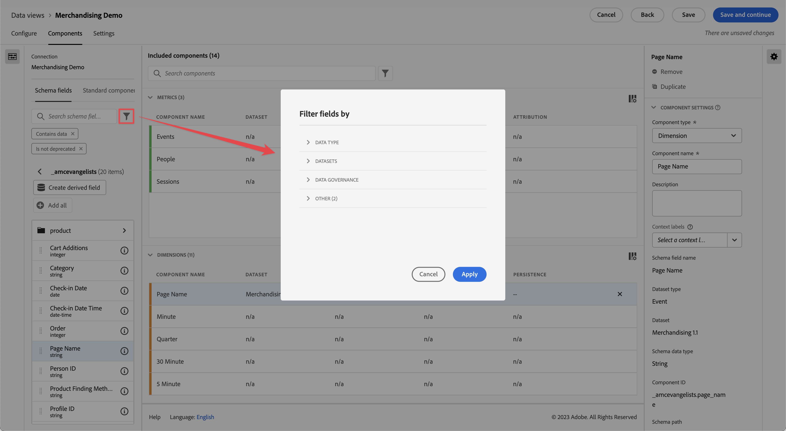

# 建立或編輯資料檢視

建立資料檢視涉及從結構元素建立量度和維度或使用標準元件。 大多數結構描述元素可以是維度或量度，具體取決於您的業務需求。將結構描述元素拖曳至資料檢視後，右側會出現選項，您可以在其中調整維度或量度在Customer Journey Analytics中的運作方式。

以下是有關該主題的影片：

>[!VIDEO](https://video.tv.adobe.com/v/35110/?quality=12&learn=on)

若要建立或編輯資料檢視：

1. 登入 [Customer Journey Analytics](https://analytics.adobe.com) 並前往 **[!UICONTROL 資料檢視]** 標籤。
1. 若要建立資料檢視，請選取 **[!UICONTROL 建立新的資料檢視]**. 或者，您可以從資料檢視清單中選取現有的資料檢視，以便進行編輯。

## 設定

若要設定新的或現有的資料檢視：

1. 選取 **[!UICONTROL 設定]** 標籤（如果尚未啟用）。

   
1. 指定 [!UICONTROL 設定]， [!UICONTROL 容器]、和 [!UICONTROL 行事曆] 詳細資料（請參閱下文）。
1. 選取 **[!UICONTROL 儲存並繼續]** 以繼續設定新的或現有的資料檢視。 選取 **[!UICONTROL 儲存]** 以儲存現有資料檢視的設定。

### 設定

為資料檢視提供總體設定。

| 設定 | 說明 |
| --- | --- |
| [!UICONTROL 連線] | 此欄位會將資料檢視連結至您先前建立的連線，其中包含一或多個 Adobe Experience Platform 資料集。 |
| [!UICONTROL 名稱] | 必填。資料檢視的名稱。此值會顯示在Analysis Workspace的右上角下拉式清單中。 |
| [!UICONTROL 說明] | 選填。Adobe 建議使用詳細說明，讓用戶了解資料檢視存在的原因及其設計對象。 |

{style="table-layout:auto"}

### 容器

指定資料檢視的容器名稱。容器名稱在[篩選](/help/components/filters/filters-overview.md#Filter-containers)中經常使用。

| 設定 | 說明 |
| --- | --- |
| [!UICONTROL 人員容器名稱] | 「[!UICONTROL 人員]」(預設)。此 [!UICONTROL 個人] 容器包含指定時間段內個人的每個工作階段和事件。 如果您的組織使用不同的術語（例如，「訪客」或「用戶」），您可以在此處重新命名容器。 |
| [!UICONTROL 工作階段容器名稱] | 「[!UICONTROL 工作階段]」(預設)。「[!UICONTROL 工作階段]」容器可讓您識別特定工作階段的頁面互動、促銷活動或轉換。您可以將此容器重新命名為「Visit」或您組織偏好的其他任何詞語。 |
| [!UICONTROL 事件容器名稱] | [!UICONTROL 事件] (預設)。[!UICONTROL 事件]容器定義資料集中的單個事件。如果您的組織使用不同的術語（例如，「點擊次數」或「頁面檢視量」），您可以在此處重新命名容器。 |

{style="table-layout:auto"}

### 行事曆

指示您希望資料檢視遵循的行事曆格式。您可以根據同一個[連線](/help/connections/create-connection.md)擁有多個資料檢視，並為它們提供不同的行事曆類型或時區。這些資料檢視可以讓使用不同行事曆類型的團隊，透過相同的基礎資料滿足各自的需求。

| 設定 | 說明 |
| --- | --- |
| [!UICONTROL 時區] | 選擇您要在哪個時區中顯示資料。 如果您選擇實行夏令時間的時區，則會自動調整資料以反映這一點。在春天，當時鐘向前調快一小時，會出現一小時的缺口。在秋天，當時鐘向後調慢一小時，會在夏令偏移期間重複一小時。 |
| [!UICONTROL 行事曆類型] | 決定一個月中的週如何分組。 **西曆：**&#x200B;標準行事曆格式。季依照月分組。 **4-5-4 零售業：**&#x200B;標準化的 4-5-4 零售業行事曆。本季的第一個月和最後一個月為4週，而本季的第二個月為5週。 **自訂 (4-5-4)：**&#x200B;類似於 4-5-4 行事曆，但您可以選擇一年的第一天以及「額外」週發生的年份。 **自訂(4-4-5)：** 每個季的第一個月和第二個月為4週，而每個季的最後一個月為5週。 **自訂 (5-4-4)：**&#x200B;每個季的第一個月為 5 週，而每個季的第二和第三個月為 4 週。 |
| [!UICONTROL 一年的第一個月]和[!UICONTROL 一週的第一天] | 對西曆行事曆類型可見。指定您希望行事曆年從哪一個月開始，以及您希望每週從哪一天開始。 |
| [!UICONTROL 當年的第一天] | 對自訂行事曆類型可見。指定您希望目前年份在一年中的哪一天開始。行事曆會根據此值自動設定每週第一天的格式。 |
| [!UICONTROL 「額外」週發生的年份] | 對於大多數364天行事曆（52週，每週7天），每年都會累積剩餘的天數，直到累加到額外的一週。 然後將這個額外的一週新增到該年的最後一個月。指定您希望將額外一週新增到哪一年。 |

{style="table-layout:auto"}

## 元件

接下來，您可以設定資料檢視的元件，這表示您可以從結構元素建立量度和維度。 您也可以使用標準元件。

1. 選取 **[!UICONTROL 元件]** 標籤。

   

   您可以在左上角看到「[!UICONTROL 連線]」，其中包含資料集，以及下面的[!UICONTROL 「結構」欄位]。已包含的元件為所有資料檢視（例如「事件」、「人員」、「工作階段」量度，以及「分鐘」、「季度」、「週」維度）所需的標準元件（系統產生）。 Adobe也會套用篩選器 **[!UICONTROL 包含資料]** 和 **[!UICONTROL 未棄用]** 根據預設，只有包含資料且未棄用的結構描述欄位才會出現。

1. 搜尋結構欄位，使用  **[!UICONTROL 搜尋結構描述欄位]** 或移至任何資料集集合以尋找欄位，例如  **[!UICONTROL 事件資料集]**. 或者，您也可以使用建立衍生欄位  **建立衍生欄位** . 另請參閱 [衍生欄位](./derived-fields/derived-fields.md) 以取得詳細資訊。

1. 當您找到特定的結構描述欄位或定義衍生欄位時，請拖曳該欄位，例如  **[!UICONTROL 頁面名稱]**，從左側欄移至「量度」或「Dimension」區段。
您可以多次將相同的結構欄位拖曳至維度或量度區段，並以不同的方式設定相同的維度或量度。 例如，從pageName欄位，您可以使用不同的來建立名為「產品頁面」的維度，以及另一個「錯誤頁面」 [元件設定](component-settings/overview.md) 在右邊。
如果從左側欄拖曳結構描述欄位檔案夾，它們會自動排序為傳統區段。字串欄位會在「[!UICONTROL 維度]」區段中結束，而數字結構描述類型最終出現在「[!UICONTROL 量度]」區段中。您也可以按一下「**[!UICONTROL 新增全部]**」，並新增所有結構描述欄位至其各自的位置。

1. 選取元件後，設定會顯示在右側。

   

   使用[元件設定](component-settings/overview.md)來設定元件。可用的元件設定取決於元件是維度/量度以及結構描述資料類型。設定包括：

   * [[!UICONTROL 歸因]](component-settings/attribution.md)
   * [[!UICONTROL 行為]](component-settings/behavior.md)
   * [[!UICONTROL 格式]](component-settings/format.md)
   * [[!UICONTROL 包含排除值]](component-settings/include-exclude-values.md)
   * [[!UICONTROL 量度重複資料刪除]](component-settings/metric-deduplication.md)
   * [[!UICONTROL 沒有值選項]](component-settings/no-value-options.md)
   * [[!UICONTROL 持續性]](component-settings/persistence.md)
   * [[!UICONTROL 值分組]](component-settings/value-bucketing.md)

1. 選取 **[!UICONTROL 儲存並繼續]** 以繼續設定新的或現有的資料檢視。 選取 **[!UICONTROL 儲存]** 以儲存現有資料檢視的設定。

**複製量度或維度**

複製量度或維度，然後修改特定的設定，是從單一結構描述欄位建立多個量度或維度的簡易方式。選取右上方的量度或維度名稱底下的「[!UICONTROL 複製]」設定。 修改新的量度或維度，並使用更具說明性的名稱來儲存它。

**篩選結構描述欄位或資料集**

您可以篩選  左側邊欄中的結構描述欄位依據 [!UICONTROL 資料型別]， [!UICONTROL 資料集]， [!UICONTROL 資料控管]、和 [!UICONTROL 其他] 條件([!UICONTROL 包含資料]， [!UICONTROL 為身分]、和 [!UICONTROL 未棄用])：

## 設定

1. 選取 **[!UICONTROL 設定]** 標籤。
1. 設定要套用至整個資料檢視的篩選器。 另請參閱 [設定（篩選器）](#settings-filters) 下方的。
1. 設定工作階段逾時和量度。 另請參閱 [工作階段設定](#session-settings) 下方的。
1. 選取 **[!UICONTROL 儲存並繼續]** 以繼續設定新的或現有的資料檢視。 選取 **[!UICONTROL 儲存]** 以儲存現有資料檢視的設定。

### 設定（篩選器）

您可以新增套用至整個資料檢視的篩選器。此篩選器將套用至您在 Workspace 中執行的任何報告。從左側邊欄的清單拖曳篩選器至「[!UICONTROL 新增篩選器]」欄位。

### 工作階段設定

決定在工作階段到期和新工作階段開始之前，事件之間的閒置時段。需要時段。您也可以選擇在事件包含特定量度時，強制啟動新工作階段。

指定所有所需設定後，按一下&#x200B;**[!UICONTROL 「儲存並完成」]**。
