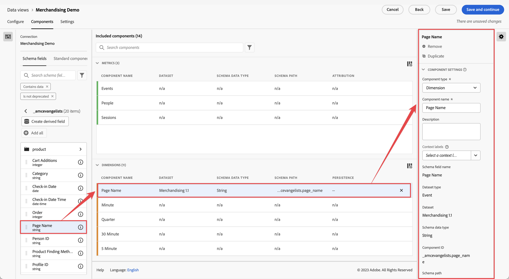

# 建立或編輯資料視圖

建立資料視圖需要從結構描述元素建立量度和維度或使用標準元件。大多數結構描述元素可以是維度或量度，具體取決於您的業務需求。將結構描述元素拖到資料視圖中後，右側會出現選項，您可以在其中調整維度或量度在 Customer Journey Analytics 中的執行方式。

>[!BEGINSHADEBOX]

請參閱  [建立或編輯資料檢視](https://video.tv.adobe.com/v/35110/?quality=12&learn=on){target="_blank"}的示範影片。

>[!ENDSHADEBOX]

建立或編輯資料視圖的方法：

1. 登入[Customer Journey Analytics](https://analytics.adobe.com)，並選取頂端功能表中的&#x200B;**[!UICONTROL 資料檢視]** （可選擇從&#x200B;**[!UICONTROL 資料管理]**&#x200B;進行）。
1. 若要建立資料視圖，請選取「**[!UICONTROL 建立新的資料視圖]**」。或者，您可以從資料視圖清單中選取現有資料視圖進行編輯。

## 設定 {#configure}

設定新的或現有的資料視圖的方法：

>[!BEGINTABS]

>[!TAB 標準]

>[!TAB B2B edition]

>[!ENDTABS]

1. 選取「**[!UICONTROL 設定]**」標籤 (如果尚未啟動)。

1. 指定「[!UICONTROL 設定]」、「[!UICONTROL 容器]」，然後指定「[!UICONTROL 行事曆]」詳細資料 (見下文)。
1. 選取「**[!UICONTROL 儲存並繼續]**」，繼續設定新的或現有的資料視圖。選取「**[!UICONTROL 儲存]**」，儲存現有資料視圖的設定。

### 設定 {#settings}

<!-- markdownlint-disable MD034 -->

>[!CONTEXTUALHELP]
>id="dataview_externalid"
>title="外部 ID"
>abstract="變更外部 ID 可能會影響資料釋圖名稱在外部來源 (例如商業智慧工具) 中的顯示方式。"

<!-- markdownlint-enable MD034 -->

為資料視圖提供總體設定。

| 設定 | 說明 |
| --- | --- |
| **[!UICONTROL 連線]** | 此欄位會將資料視圖連結至您先前建立的連線，其中包含一或多個 Adobe Experience Platform 資料集。 |
| **[!UICONTROL 名稱]** | 必填。資料視圖的名稱。此值顯示在 Analysis Workspace 的右上角下拉式清單中。 |
| **[!UICONTROL 外部 ID]** | 必填。您可以在外部來源 (例如商業智慧工具) 中使用的資料視圖名稱。預設值為 `unspecified`。如果不指定外部 ID，則將從資料視圖的名稱產生該名稱，並以底線取代空格。 |
| **[!UICONTROL 說明]** | 選填。Adobe 建議使用詳細說明，讓用戶了解資料視圖存在的原因及其設計對象。 |

{style="table-layout:auto"}

### 相容性 {#compatibility}

<!-- markdownlint-disable MD034 -->

>[!CONTEXTUALHELP]
>id="dataview_dataviewsinadobejourneyoptimizer"
>title="Journey Optimizer 的資料釋圖"
>abstract="Customer Journey Analytics 需要使用與 Adobe Journey Optimizer 相容的連線和資料檢視。依據預設，會為此目的自動建立連線和資料檢視。 或者，您可以啟用此選項，使其成為 Adobe Journey Optimizer 報告中使用的預設資料檢視。啟用後，Journey Optimizer 所需的所有必要元件都會新增至此資料檢視，並且所有必要的 Journey Optimizer 資料集都會新增至與此資料檢視關聯的連線。"
>additional-url="https://experienceleague.adobe.com/zh-hant/docs/analytics-platform/using/integrations/ajo#connection" text="新增了哪些元件和資料集。"

<!-- markdownlint-enable MD034 -->

提供 Customer Journey Analytics 搭配使用 Adobe Journey Optimizer 時適用的設定。

只有已佈建 Journey Optimizer 的管理員才能看到此部分。

| 設定 | 說明 |
| --- | --- |
| [!UICONTROL **設為 Adobe Journey Optimizer 中的預設資料視圖**] | 您可使用此設定選項，讓 Journey Optimizer 和 Customer Journey Analytics 共用標準化報告，並在 Customer Journey Analytics 中對 Adobe Journey Optimizer 資料執行進階分析 (在 Journey Optimizer 中選取 「[!UICONTROL **在 CJA 中分析**]」按鈕)。
Journey Optimizer 需擁有 Customer Journey Analytics 資料視圖的存取權，才能執行此類分析。
啟用此選項可使其成為您沙箱的 Journey Optimizer 報告中的預設資料視圖。

此設定選項會自動完成以下操作：
<ul><li>在 Customer Journey Analytics 的相關連線中，設定所有必要的 Journey Optimizer 資料集，以供 Journey Optimizer 使用。</li><li>在資料視圖中建立一組 Journey Optimizer 量度和維度 (包括衍生欄位和計算量度)。系統會為所有這些指標和維度自動設定內容標籤。</li></ul>

啟用此選項時請考慮以下事項： <ul><li>您可於日後變更預設資料視圖，但這麼做可能會對 Journey Optimizer 報告資料造成影響。如果您在啟用此選項後又選擇停用，系統將提示您選取新的預設資料視圖。</li><li>如果您已對 Customer Journey Analytics 資料視圖中的資料集、維度或量度進行了手動自訂，則在啟用此設定選項時，您的手動自訂將保持不變。此選項可進行額外的自訂，進一步標準化跨 Journey Optimizer 和 Customer Journey Analytics 的報告。您也可以在啟用此選項後進行手動自訂。</li><li>在選取此選項後，就無法刪除與資料檢視關聯的連線。</li></ul>如需詳細資訊，請參閱[整合 Adobe Journey Optimizer 與 Adobe Customer Journey Analytics](/help/integrations/ajo.md)。 |

{style="table-layout:auto"}

### 容器

指定資料視圖的容器名稱。容器名稱在[區段](/help/components/filters/filters-overview.md#Filter-containers)中經常使用。

| 設定 | 說明 |
| --- | --- |
| [!BADGE B2B edition]{type=Informative url="https://experienceleague.adobe.com/en/docs/analytics-platform/using/cja-overview/cja-b2b/cja-b2b-edition" newtab=true tooltip="Customer Journey Analytics B2B edition"} **[!UICONTROL 全域帳戶容器名稱&#x200B;]** | `Global Account` （預設）。 [!UICONTROL 全域帳戶]容器包含指定時間範圍內全域帳戶的每個工作階段和事件。 如果您的組織使用不同的術語，您可以在此處重新命名容器。 |
| [!BADGE B2B edition]{type=Informative url="https://experienceleague.adobe.com/en/docs/analytics-platform/using/cja-overview/cja-b2b/cja-b2b-edition" newtab=true tooltip="Customer Journey Analytics B2B edition"} **[!UICONTROL 帳戶容器名稱&#x200B;]** | `Account` （預設）。 [!UICONTROL 帳戶]容器包含指定時間範圍內帳戶的每個工作階段和事件。 如果您的組織使用不同的術語，您可以在此處重新命名容器。 |
| [!BADGE B2B edition]{type=Informative url="https://experienceleague.adobe.com/en/docs/analytics-platform/using/cja-overview/cja-b2b/cja-b2b-edition" newtab=true tooltip="Customer Journey Analytics B2B edition"} **[!UICONTROL 機會容器名稱&#x200B;]** | `Opportunity` （預設）。 [!UICONTROL 機會]容器包含指定時間範圍內機會的每個工作階段和事件。 如果您的組織使用不同的術語，您可以在此處重新命名容器。 |
| [!BADGE B2B edition]{type=Informative url="https://experienceleague.adobe.com/en/docs/analytics-platform/using/cja-overview/cja-b2b/cja-b2b-edition" newtab=true tooltip="Customer Journey Analytics B2B edition"} **[!UICONTROL 購買群組容器名稱&#x200B;]** | `Buying Group` （預設）。 [!UICONTROL 購買群組]容器包含指定時間範圍內購買群組的每個工作階段和事件。 如果您的組織使用不同的術語，您可以在此處重新命名容器。 |
| **[!UICONTROL 人員容器名稱]** | `Person` （預設）。 「[!UICONTROL 人員]」容器包含指定時間段內人員的每個工作階段和事件。如果您的組織使用不同的術語 (例如，「訪客」或「用戶」)，您可以在此處重新命名容器。 |
| **[!UICONTROL 工作階段容器名稱]** | `Session` （預設）。 「[!UICONTROL 工作階段]」容器可讓您識別特定工作階段的頁面互動、促銷活動或轉換。您可以將此容器重新命名為「Visit」或您組織偏好的其他任何詞語。 |
| **[!UICONTROL 事件容器名稱]** | `Event` （預設）。 [!UICONTROL 事件]容器定義資料集中的單個事件。如果您的組織使用不同的術語 (例如，「點擊次數」或「頁面檢視量」)，您可以在此處重新命名容器。 |

{style="table-layout:auto"}

### 行事曆

指示您希望資料視圖遵循的行事曆格式。您可以根據同一個[連線](/help/connections/create-connection.md)擁有多個資料視圖，並為它們提供不同的行事曆類型或時區。這些資料視圖可以讓使用不同行事曆類型的團隊，透過相同的基礎資料滿足各自的需求。

| 設定 | 說明 |
| --- | --- |
| [!UICONTROL **時區**] | 選擇要顯示資料的時區。如果您選擇實行夏令時間的時區，則會自動調整資料以反映這一點。在春天，當時鐘向前調快一小時，會出現一小時的缺口。在秋天，當時鐘向後調慢一小時，會在夏令偏移期間重複一小時。 |
| [!UICONTROL **行事曆類型**] | 決定一個月中的週如何分組。 **西曆：**&#x200B;標準行事曆格式。季依照月分組。 **4-5-4 零售業：**&#x200B;標準化的 4-5-4 零售業行事曆。本季的第一個月和最後一個月為 4 週，而本季的第二個月為 5 週。 **自訂 (4-5-4)：**&#x200B;類似於 4-5-4 行事曆，但您可以選取一年的第一天以及「額外」週發生的年份。 **自訂 (4-4-5)：**&#x200B;每個季的第一個月和第二個月為 4 週，而每個季的最後一週為 5 週。 **自訂 (5-4-4)：**&#x200B;每個季的第一個月為 5 週，而每個季的第二和第三個月為 4 週。 |
| [!UICONTROL **一年的第一個月**]&#x200B;和&#x200B;[!UICONTROL **一週的第一天**] | 對西曆行事曆類型可見。指定您希望行事曆年從哪一個月開始，以及您希望每週從哪一天開始。 |
| [!UICONTROL **當年的第一天**] | 對自訂行事曆類型可見。指定您希望目前年份在一年中的哪一天開始。行事曆會根據此值自動設定每週第一天的格式。 |
| [!UICONTROL **「額外」週發生的年份**] | 對於大多數 364 天行事曆 (52 週，每週 7 天)，每年都會累積剩餘的天數，直到加起來多出一週。然後將這個額外的一週新增到該年的最後一個月。指定您希望將額外一週新增到哪一年。 |

{style="table-layout:auto"}

## 元件

接下來，您可以設定資料視圖的元件，這代表您可以從結構描述元素建立量度和維度。您也可以使用標準元件。

>[!IMPORTANT]
>
>單一資料視圖中最多可新增 5,000 個量度和 5,000 個維度。

1. 選取「**[!UICONTROL 元件]**」索引標籤。

   

   您可以在左上角看到「[!UICONTROL 連線]」，其中包含資料集，以及下面的[!UICONTROL 「結構描述」欄位]。已包含的元件是所有資料視圖 (如事件、人員、工作階段量度以及分鐘、季度、週維度) 所需的標準元件 (系統產生)。Adobe 預設會套用篩選器「**[!UICONTROL 包含資料]**」和「**[!UICONTROL 未淘汰]**」，以僅顯示包含資料且未淘汰的結構描述欄位。

1. 使用「」**[!UICONTROL 搜尋結構描述欄位]**&#x200B;來搜尋結構描述欄位，或者移動到任意資料集集合來尋找欄位，例如「**[!UICONTROL 事件資料集]**」。 或者，您可以使用「**建立衍生欄位**」來建立衍生欄位。請參閱「[衍生欄位](./derived-fields/derived-fields.md)」以了解更多資訊。

1. 當您找到特定結構描述欄位或定義衍生欄位時，拖動該欄位，例如「**[!UICONTROL 頁面名稱]**」，從左邊欄進入量度或維度區段。您可以多次將相同的結構描述欄位拖曳至維度或量度區段，並以不同的方式設定相同的維度或量度。例如，在 pageName 欄位，您可以使用右側不同的[元件設定](component-settings/overview.md)，以建立名為「產品頁面」的維度，以及「錯誤頁面」維度。如果從左側欄拖曳結構描述欄位檔案夾，它們會自動排序為傳統區段。字串欄位會在「[!UICONTROL 維度]」區段中結束，而數字結構描述類型最終出現在「[!UICONTROL 量度]」區段中。您也可以按一下「**[!UICONTROL 新增全部]**」，並新增所有結構描述欄位至其各自的位置。

1. 選取元件後，右側會出現設定。

   

   使用[元件設定](component-settings/overview.md)來設定元件。可用的元件設定取決於元件是維度/量度以及結構描述資料類型。設定包括：

   * [[!UICONTROL 歸因]](component-settings/attribution.md)
   * [[!UICONTROL 行為]](component-settings/behavior.md)
   * [[!UICONTROL 格式]](component-settings/format.md)
   * [[!UICONTROL 包含排除值]](component-settings/include-exclude-values.md)
   * [[!UICONTROL 量度重複資料刪除]](component-settings/metric-deduplication.md)
   * [[!UICONTROL 沒有值選項]](component-settings/no-value-options.md)
   * [[!UICONTROL 持續性]](component-settings/persistence.md)
   * [[!UICONTROL 值分組]](component-settings/value-bucketing.md)

1. 選取「**[!UICONTROL 儲存並繼續]**」，繼續設定新的或現有的資料視圖。選取「**[!UICONTROL 儲存]**」，儲存現有資料視圖的設定。

**複製量度或維度**

複製量度或維度，然後修改特定的設定，是從單一結構描述欄位建立多個量度或維度的簡易方式。選取右上方的量度或維度名稱底下的「[!UICONTROL 複製]」設定。 修改新的量度或維度，並使用更具說明性的名稱來儲存它。

**篩選結構描述欄位或資料集**

您可以依照[!UICONTROL 資料類型], [!UICONTROL 資料集]、[!UICONTROL 資料治理] 和 [!UICONTROL 其他] 條件 ([!UICONTROL 包含資料]、[!UICONTROL 身分識別] 和 [!UICONTROL 未淘汰]) 篩選左邊欄中的結構描述欄位：

>[!TIP]
>
>如果資料視圖中未能正確載入元件，而且您看到錯誤訊息，請參閱「[缺乏權限](../troubleshooting/lack-of-permissions.md)」尋找解決方案。

## 設定

1. 選取「**[!UICONTROL 設定]**」索引標籤。
1. 設定區段以套用至整個資料檢視。 請參閱下方的[設定（區段）](#settings-filters)。
1. 設定工作階段逾時和量度。請參閱下方的「[工作階段設定](#session-settings)」。
1. 選取「**[!UICONTROL 儲存並繼續]**」，繼續設定新的或現有的資料視圖。選取「**[!UICONTROL 儲存]**」，儲存現有資料視圖的設定。

### 設定（區段）

您可以新增套用至整個資料檢視的區段。 此區段會套用至您在Workspace中執行的任何報表。 從左側邊欄的清單拖曳區段至&#x200B;**[!UICONTROL 新增區段]**&#x200B;欄位。

### 工作階段設定

決定在工作階段到期和新工作階段開始之前，事件之間的閒置時段。需要時段。您也可以選擇在事件包含特定量度時，強制啟動新工作階段。如需詳細資料，請參閱[工作階段設定](session-settings.md)。

### 資料預覽

資料預覽會比較（針對各種容器）此資料檢視的資料與連線的資料。 預覽百分比是根據過去90天的連線總數。

如果未載入預覽，您的連線可能仍在回填。

指定所有所需設定後，按一下「**[!UICONTROL 儲存並完成]**」。
