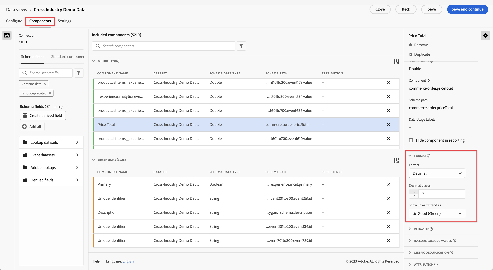

# 建立新的資料檢視

建立資料檢視需要從結構元素建立量度和維度或使用標準元件。建立量度或維度可為您提供極大的彈性。先前，假設您在 Adobe Experience Platform 有資料集，則會使用字串欄位作為維度，而數值欄位則作為量度。為了變更這些欄位，您必須在「平台」中編輯結構。資料檢視 UI 現在允許您[更自由地定義量度和維度](/help/data-views/data-views.md)。如需更多使用案例，請參閱[資料檢視使用案例](/help/data-views/data-views-usecases.md)。

## 1. 設置資料檢視設定和容器

1. 在 Customer Journey Analytics 中，前往「**[!UICONTROL 資料檢視]**」索引標籤。
2. 按一下「**[!UICONTROL 新增]**」以建立和設定新資料檢視。

| 設定 | 說明/使用案例 |
| --- | --- |
| [!UICONTROL 連線] | 此欄位會將資料檢視連結至您先前建立的連線，其中包含一或多個 Adobe Experience Platform 資料集。 |
| [!UICONTROL 名稱] | 必須為資料檢視命名。 |
| [!UICONTROL 說明] | 詳細說明非必填，但建議使用。 |
| [!UICONTROL 時區] | 選擇要顯示資料的時區。 |
| [!UICONTROL 標籤] | 標籤可用來將資料檢視整理到不同類別中。 |
| [!UICONTROL 容器] | 您可以在此處重新命名容器，這是容器在任何以此資料檢視為基礎的 Workspace 專案中的顯示方式。容器用於篩選器和流失/流量等，以定義範圍或內容的寬度或窄度。[了解更多](https://experienceleague.adobe.com/docs/analytics-platform/using/cja-components/cja-filters/filters-overview.html?lang=zh-Hant#filter-containers) |
| [!UICONTROL 「人員」容器名稱是……] | 「[!UICONTROL 人員]」(預設)。「[!UICONTROL 人員]」容器包含指定時段內訪客的每次瀏覽和頁面檢視。您可以將它重新命名為「使用者」或您偏好的任何其他詞語。 |
| [!UICONTROL 「工作階段」容器名稱是……] | 「[!UICONTROL 工作階段]」(預設)。「[!UICONTROL 工作階段]」容器可讓您識別特定工作階段的頁面互動、促銷活動或轉換。您可以將它重新命名為「造訪」或您偏好的任何其他詞語。 |
| [!UICONTROL 「事件」容器名稱是……] | 「[!UICONTROL 事件]」(預設)。「[!UICONTROL 事件]」容器定義您要在篩選器中包含或排除哪些頁面事件。 |

接著，您可以從結構元素建立量度和維度。您也可以使用標準元件。

## 2. 從結構元素建立量度和維度

1. 在 [!UICONTROL Customer Journey Analytics] > 「[!UICONTROL 資料檢視]」中，按一下「[!UICONTROL 元件]」索引標籤。

您可以在左上角看到「[!UICONTROL 連線]」，其中包含資料集，以及下面的[!UICONTROL 「結構」欄位]。請記住：

* 已包含的元件是標準必需元件 (系統生成)。
* 我們也會依預設套用篩選器&#x200B;**[!UICONTROL &#x200B;包含資料]**，以便只顯示包含資料的結構欄位。如果您要尋找不含資料的欄位，請移除篩選器。

1. 現在，從左側邊欄拖曳結構欄位 (例如 [!UICONTROL pageTitle]) 至 Metrics 或 Dimensions 區段。

   您可以多次將相同的結構欄位拖曳至維度或量度區段，並以不同的方式設定相同的維度或量度。例如，從 **[!UICONTROL &#x200B;pageTitle]** &#x200B;欄位，您可以重新命名右側的 **[!UICONTROL Component Name]**，以建立名為「Product Pages」的維度，以及另一個「Error pages」等。從 **[!UICONTROL pageTitle]** 結構欄位中，您也可以從字串值建立量度。例如，您可以建立一或多個具有不同歸因設定和不同包含/排除值的「**[!UICONTROL 訂單]**」量度。

   

   >[!NOTE]
   >
   >您可以從左側邊欄拖曳整個結構欄位資料夾，它們會自動排序為傳統區段。字串欄位會在「[!UICONTROL 維度]」區段中結束，而數字則會出現在「[!UICONTROL 量度]」區段中。或者，您可以按一下「**[!UICONTROL 新增全部]**」，並新增所有結構欄位。

1. 選取元件後，右側會出現許多設定。使用下述設定來設定元件。

### 設置元件設定

| 設定 | 說明/使用案例 |
| --- | --- |
| [!UICONTROL 元件類型] | 必填。可讓您將元件從「量度」變更為「維度」，反之亦然。 |
| [!UICONTROL 元件名稱] | 必填。可讓您指定在 Analysis Workspace 中顯示的友好名稱。您可以重新命名元件，以為其指定資料檢視特定名稱。 |
| [!UICONTROL 說明] | 選填，但建議為其他使用者提供有關元件的資訊。 |
| [!UICONTROL 標籤] | 選填。可讓您使用自訂或現成可用的標籤來標記元件，以便在 Analysis Workspace UI 中更輕鬆地進行搜尋/篩選。 |
| [!UICONTROL 欄位名稱] | 結構欄位的名稱。 |
| [!UICONTROL 資料集類型] | 必填。不可編輯的欄位，顯示元件來自的資料集類型 (事件、查詢或設定檔)。 |
| [!UICONTROL 資料集] | 必填。不可編輯的欄位，顯示元件來自的欄位類型 (例如字串、整數等)。此欄位可包含多個資料集。 |
| [!UICONTROL 結構資料類型] | 指元件是否為字串、整數等。 |
| [!UICONTROL 元件 ID] | 必填。[CJA API](https://adobe.io/cja-apis/docs) 使用此欄位來參考元件。您可以按一下編輯圖示並修改此元件 ID。然而，變更此元件 ID 會中斷包含此元件的所有現有 Workspace 專案。 如果您曾為 pageTitle 維度建立其他使用不同欄位的資料檢視，則可以重新命名該檢視，並讓維度與跨資料檢視相容。 |
| [!UICONTROL 架構路徑] | 必填。不可編輯的欄位，顯示元件來自的結構路徑。 |
| [!UICONTROL 隱藏報告中的元件] | 預設= off。可讓您在報告中使用元件時，從「資料檢視」中組織出元件。這不會影響權限，只會影響元件組織。換言之，您可以在報告中隱藏元件，使非管理員無法存取。管理員仍可以按一下 Analysis Workspace 專案中的「[!UICONTROL 顯示所有元件]」來存取它。 |

### 設置格式設定

格式設定僅適用於量度。

| 設定 | 說明/使用案例 |
| --- | --- |
| [!UICONTROL 格式] | 可讓您指定量度的格式，如小數、時間、百分比或貨幣。 |
| [!UICONTROL 小數位數] | 可讓您指定量度應顯示的小數位數。 |
| [!UICONTROL 顯示上升趨勢的方式] | 可讓您指定此量度的上升趨勢是否應被視為好 (綠色) 或壞 (紅色)。 |
| [!UICONTROL 貨幣] | 此設定僅在選取的量度格式為[!UICONTROL 貨幣] 時顯示。提供貨幣選項清單。預設為無貨幣。這可讓您以報告中所選擇的貨幣來表示收入。這不是貨幣轉換，只是 UI 格式選項。 |

### 設置歸因設定

| 設定 | 說明/使用案例 |
| --- | --- |
| [!UICONTROL 設定歸因] | 可讓您指定使用此量度時，預設要套用至此量度的歸因設定。此預設可在自由表格或計算量度中覆寫。 |
| [!UICONTROL 歸因模型] | 可讓您指定預設歸因模型——僅在您開啟使用[!UICONTROL 非預設歸因模型]設定時啟用。預設為 「[!UICONTROL 上次接觸]」。選項包括：「上次接觸」、「首次接觸」、「線性」、「參與率」、「相同接觸」、「U 形」、「J 曲線」、「反 J」、「時間衰減」、「自訂」、「演算法」。有些選項會建立其他需要填寫的欄位，例如「自訂」或「時間衰減」。您可以使用相同欄位建立多個量度，這表示您可以有一個「[!UICONTROL 上次接觸]」收入量度和一個「[!UICONTROL 首次接觸]」收入量度，但是以結構中相同的收入欄位為基礎。 |
| [!UICONTROL 回顧視窗] | 可讓您指定量度的回顧視窗，僅在您開啟使用[!UICONTROL 非預設歸因模型]設定時啟用。選項包括：「人員」 (報告視窗)、「工作階段」、「自訂」。在選取「Custom」 (自訂) 時，我們也會提供您選項以選取任何天數/週數/月數等。(最多 90 天)，如同 Attribution IQ。您可以使用相同的結構欄位來擁有多個量度，但每個量度都有個別的回顧視窗。 |

### 「設置包含/排除值」設定

此設定允許您在查詢時修改要報告的基礎資料。它與篩選器不同。但篩選器會遵循這個新維度，路徑和歸因也會如此。

例如，您可以在 pageTitle 欄位中建立維度，但將其稱為「error pages」，並包括任何[!UICONTROL 包含片語]「error」的頁面。

| 設定 | 說明/使用案例 |
| --- | --- |
| [!UICONTROL 區分大小寫] | 預設 = On。此設定僅適用於「[!UICONTROL 包含/排除]」區段。它可讓您判斷您套用的包含/排除規則是否應區分大小寫。 |
| [!UICONTROL 符合] | 可讓您指定在歸因和篩選之前，考慮要以哪些值做報告 (例如，僅使用包含片語「error」的值)。您可以指定：**[!UICONTROL 如果滿足所有標準&#x200B;]**&#x200B;或&#x200B;**[!UICONTROL &#x200B;如果滿足任何標準]**。 |
| [!UICONTROL 標準] | 可讓您指定應套用至特定篩選規則的符合邏輯。<ul><li>**字串**：包含片語、包含任何詞語、包含所有詞語、不包含任何詞語、不包含片語、等於、不等於、開頭為、結尾為</li><li>**雙/整數**：等於、不等於、大於、小於、大於或等於、小於或等於</li><li>**日期**：等於、不等於、晚於、等於、發生於</li></ul> |
| [!UICONTROL 匹配操作數] | 可讓您指定應套用匹配運算子的匹配操作數。<ul><li>**字串**：文字欄位</li><li>**雙/整數**：文字欄位，其上／下箭頭代表數值</li><li>**日期**：日詳細程度選擇器 (日曆)</li><li>**日期時間**：日期和時間詳細程度選擇器</li></ul> |
| [!UICONTROL 新增規則] | 可讓您指定額外的匹配運算子和操作數。 |

### 設置行為設定

| 設定 | 說明/使用案例 |
| --- | --- |
| [!UICONTROL 計數值] | 僅適用於布爾量度，此設定可讓您指定要將[!UICONTROL 計數True]、[!UICONTROL 計數False]或[!UICONTROL 計數True或False]設為量度值。 預設值為[!UICONTROL Count True]。 |
| [!UICONTROL 計數實例] | 可讓您指定用作度量的數值或日期類型欄位是否應計算其設定時間，而非值本身。 如果您想要加總數值欄位的例項，並且只想加總欄位已&#x200B;*設定*&#x200B;的次數而非欄位內的實際值。 例如，這對於從「[!UICONTROL 收入]」欄位建立「[!UICONTROL 訂單]」量度非常有用。如果已設定「收入」 (revenue)，則我們想要計算 1 份單一訂單 (order)，而非數值形式的收入金額。 |

### 設置「[!UICONTROL 無值選項]」設定

[!UICONTROL 「無值選項」]設定類似於報告中的[!UICONTROL 「未指定」]或[!UICONTROL 「無」]值。在資料檢視 UI 中，您可以依元件來決定要在報告中如何處理這些值。您也可以將[!UICONTROL 「No value」]重新命名為更適合您環境的值，例如「[!UICONTROL 無]」、「[!UICONTROL 未設定]」或其他值。

另請注意，您在此欄位中指定的任何項目，都可用於報告中「[!UICONTROL 無值]」條列項目的特殊 UI 處理，如「[!UICONTROL 無值選項]」設定所述。

| 設定 | 說明/使用案例 |
| --- | --- |
| [!UICONTROL 如果顯示，請呼叫「無值……」] | 您可以在此處將&#x200B;**[!UICONTROL 「&#x200B;No value」]**&#x200B;更名為其他值。 |
| [!UICONTROL 預設不顯示「無」值] | 不會在報告中顯示此值。 |
| [!UICONTROL 預設顯示「無」值] | 會在報告中顯示此值。 |
| [!UICONTROL 將「無值」視為值] | 此設定會以您在[!UICONTROL 「如果顯示，請呼叫無值……」]下指定的文字取代資料中的空白值。例如，如果您以行動裝置類型為維度，您可將&#x200B;**[!UICONTROL &#x200B;「No value&#x200B;」]**&#x200B;項目重新命名為「Desktop」。請注意，當您將此欄位變更為自訂值時，自訂值會被視為合法字串值。 因此，如果在此欄位中輸入「Red」值，資料中出現的字串「Red」例項也會在您所指定的相同條列項目下滾動。 |

### 設置持續性設定

如需詳細資訊，請參閱[持續性](/help/data-views/persistence.md)主題。

| 設定 | 說明/使用案例 |
| --- | --- |
| [!UICONTROL 設定持續性] | 切換鍵 |
| [!UICONTROL 配置] | 可讓您指定用於維度持續性的配置模式。選項包括：「[!UICONTROL 最近]」、「[!UICONTROL 原始]」、「[!UICONTROL 例項]」、「[!UICONTROL 全部]」。如果您想要保留值 (類似於傳統 Analytics 中的 eVar)，則您會在這裡設定值。唯一的關鍵區別是，您可以設定的最大持續性為 90 天。此外，「[!UICONTROL 永不過期]」不是一個選項。 |
| [!UICONTROL 有效期] | 可讓您指定維度的持續性視窗。選項包括：「[!UICONTROL 工作階段]」(預設)、「[!UICONTROL 人員]」、「[!UICONTROL 時間]」、「[!UICONTROL 量度]」。您可能需要能夠使購買的維度到期 (例如內部搜尋詞或其他銷售使用案例)。[!UICONTROL 量度]可讓您指定任何已定義量度作為此維度的有效期 (例如[!UICONTROL 購買]量度)。 **注意**:選取「全部」配置時，無法設定維度的自訂 [!UICONTROL 過期]。 |

### 設置值分組設定

例如，「5 到 10 之間」的時段會在 Workspace 報告中顯示為「5 到 10」的條列項目。

| 設定 | 說明/使用案例 |
| --- | --- |
| [!UICONTROL 貯體值] | 可讓您建立數值維度的分區版本。這可讓您報告收入區間或其他數值作為報告中的維度。 |
| [!UICONTROL 最多] | 可讓您指定第一個數值維度儲存段的邊界。這僅適用於數值維度。 |
| [!UICONTROL 介於和最多] | 可讓您指定後續數值維度區間的邊界。 |
| [!UICONTROL 新增貯體] | 可讓您新增另一個儲存貯體至數值維度分區。 |

### 使用[!UICONTROL 標準元件]

除了從結構元素建立量度和維度外，您也可以在資料檢視中使用標準元件。

[!UICONTROL 標準元件]是不是從資料集結構欄位產生，而是從系統產生的元件。在任何資料檢視中都需要一些系統元件，以利 Analysis Workspace 的報告功能，而其他系統元件則是選用的。

依預設，這些必要的標準元件會新增至每個資料檢視。

| 元件名稱 | 維度或量度 | 附註 |
| --- | --- | --- |
| [!UICONTROL 人員] | 量度 | 此量度以[!UICONTROL Connection]中指定的人員ID為基礎。 |
| [!UICONTROL 工作階段] | 量度 | 此量度以下指定的工作階段化設定為基礎。 |
| [!UICONTROL 事件] | 量度 | 此量度代表[!UICONTROL Connection]中所有事件資料集的列數。 |
| [!UICONTROL 日] | 維度 | 「日」維度會報告指定量度發生的日子。第一個維度項目是日期範圍中的第一天，最後一個維度項目是日期範圍中的最後一天。 |
| [!UICONTROL 週] | 維度 | 「週」維度會報告指定量度發生的週別。第一個維度項目是日期範圍中的第一週，最後一個維度項目是日期範圍中的最後一週。 |
| [!UICONTROL 月] | 維度 | 「月」維度會報告指定量度發生的月份。第一個維度項目是日期範圍中的第一個月，最後一個維度項目是日期範圍中的最後一個月。 |
| [!UICONTROL 季度] | 維度 | 「季」維度會報告指定量度發生的季度。第一個維度項目是日期範圍中的第一季，最後一個維度項目是日期範圍中的最後一季。 |
| [!UICONTROL 年] | 維度 | 「年」維度會報告指定量度發生的年份。第一個維度項目是日期範圍中的第一年，最後一個維度項目是日期範圍中最近的一年。 |
| [!UICONTROL 小時] | 維度 | 「小時」維度會報告指定量度發生的小時 (四拾五入)。第一個維度項目是日期範圍中的第一小時，最後一個維度項目是日期範圍中的最後一小時。 |
| [!UICONTROL 分鐘] | 維度 | 「分鐘」維度會報告指定量度發生的分鐘 (無條件捨去)。第一個維度項目是日期範圍中的第一分鐘，最後一個維度項目是日期範圍中的最後一分鐘。 |

### 可選標準元件

可選的標準元件位於「&#x200B;**[!UICONTROL 標準元件]**」索引&#x200B;標籤下。

| 元件名稱 | 維度或量度 | 附註 |
| --- | --- | --- |
| [!UICONTROL 工作階段開始] | 量度 | 此度量會計算工作階段中第一個事件的事件數。當用於篩選定義時 (例如「[!UICONTROL 工作階段開始]存在」)，它只篩選到每個工作階段的第一個事件。 |
| [!UICONTROL 工作階段結束] | 量度 | 此度量會計算工作階段中最後一個事件的事件數。與[!UICONTROL 「工作階段開始」]類似，它也可用於篩選定義中，以篩選至每個工作階段的最後一個事件。 |
| [!UICONTROL 逗留時間 (秒)] | 量度 | [!UICONTROL 逗留時間]量度會為維度加總兩個不同值之間的時間。 |
| [!UICONTROL 每個事件逗留時間] | 維度 | [!UICONTROL 「每個事件逗留時間」]會將[!UICONTROL 「逗留時間」]量度儲存至[!UICONTROL 「事件」]桶。 |
| [!UICONTROL 每個工作階段逗留時間] | 維度 | [!UICONTROL 「每個事件逗留時間」]會將[!UICONTROL 「逗留時間」]量度儲存至[!UICONTROL 「事件」]桶。 |
| [!UICONTROL 每人逗留時間] | 維度 | [!UICONTROL 「每人逗留時間」]會將[!UICONTROL 「逗留時間」]量度儲存至[!UICONTROL 「事件」]桶。 |
| [!UICONTROL 批次 ID]  | 維度 | 表示「[!UICONTROL 事件]」所屬的 Experience Platform 批次。 |
| [!UICONTROL 資料集 ID] | 維度 | 表示「[!UICONTROL 事件]」所屬的 Experience Platform 資料集。 |

### 篩選結構欄位和維度/量度

您可以依下列資料類型篩選左側邊欄中的結構欄位：

您也可以依資料集以及結構欄位是否包含資料或是否為身分來篩選。依預設，我們會將&#x200B;**[!UICONTROL &#x200B;包含資料]**&#x200B;篩選套用至所有資料檢視。

## 3. .新增全域篩選器至您的資料檢視

您可以新增套用至整個資料檢視的篩選器。此篩選器將套用至您在 Workspace 中執行的任何報告。

1. 按一下「[!UICONTROL 資料檢視]」中的「[!UICONTROL 設定]」索引標籤。
1. 從左側邊欄的清單拖曳篩選器至「[!UICONTROL 新增篩選器]」欄位。
