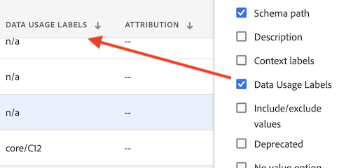

# 標籤、原則和行銷動作

在 Experience Platform 中建立資料集時，您可以為資料集中的部分或全部元素建立[資料使用情況標籤](https://experienceleague.adobe.com/zh-hant/docs/experience-platform/data-governance/labels/reference)。 您可以在 Customer Journey Analytics 中檢視這些標籤和原則。

Customer Journey Analytics對以下標籤和行銷動作特別感興趣：

| 標籤 | 行銷動作 | 定義 |
|---------|----------|---------|
| `C2` | [!UICONTROL 匯出至第三方] | 標籤和相關聯的行銷動作表示如果已啟用對應的DULE原則，資料就無法匯出給第三方。 |
| `C3` | [!UICONTROL 結合可直接識別的資料] | 標籤和相關聯的行銷動作表示如果已啟用對應的DULE原則，資料無法結合或搭配可直接識別的資訊使用。 |
| `C8` | [!UICONTROL Analytics] | 標籤和相關聯的行銷動作表示如果已啟用對應的DULE原則，資料就無法用於組織網站或應用程式上的分析。 |
| `C9` | [!UICONTROL 資料科學] | 標籤和相關聯的行銷動作表示如果已啟用對應的DULE原則，資料就無法用於資料科學工作流程。 |
| `C12` | [!UICONTROL 資料匯出] | 標籤和相關聯的行銷動作表示如果已啟用對應的DULE原則，則以這種方式標示的結構描述欄位無法從Customer Journey Analytics （透過報告、匯出、API等）匯出或下載。 |

>[!NOTE]
>
>資料使用標籤不會自動傳播到合成資料集。 不過可以手動新增。

加上標籤並不表示已強制執行這些資料使用標籤。 使用標籤的方式由各項原則決定。 您可以使用 [Experience Platform UI](https://experienceleague.adobe.com/zh-hant/docs/experience-platform/data-governance/policies/user-guide) 或透過 Experience Platform 上的[原則服務 API](https://experienceleague.adobe.com/zh-hant/docs/experience-platform/data-governance/api/overview) 建立原則。

Experience Platform中有五個由Adobe定義的原則，這些原則可能會出現在Customer Journey Analytics中，並影響報表和資料匯出：

| 原則 | 標籤 |
|---------|----------|
| [!UICONTROL 限制第三方資料匯出] | `C2` |
| [!UICONTROL 限制可直接識別的資料組合] | `C3` |
| [!UICONTROL 限制使用分析和以使用者為基礎的測量] | `C8` |
| [!UICONTROL 限制資料科學] | `C9` |
| [!UICONTROL 限制資料匯出] | `C12` |

## 在 Customer Journey Analytics 資料視圖中檢視資料標籤

由您或其他人在 Experience Platform 中建立的資料標籤，會在資料視圖使用者介面中的三個位置顯示：

| 位置 | 說明 |
| --- | --- |
| 結構描述欄位上的資訊按鈕 | 按一下此按鈕表示哪些[!UICONTROL 資料使用標籤]目前套用至欄位：
 |
| 右邊邊欄在[元件設定](/help/data-views/component-settings/overview.md)下方 | 此處列出任何[!UICONTROL 資料使用標籤]：
 |
| 將資料標籤做為一欄新增 | 您可以將[!UICONTROL 資料使用標籤]做為一欄新增到資料檢視中的「[!UICONTROL 包含的元件]」欄。 只需選取欄選擇器圖示，然後選取&#x200B;**[!UICONTROL 資料使用情況標籤]**：
 |

{style="table-layout:auto"}

## 在資料視圖中按資料治理標籤進行篩選

在資料視圖編輯器中，選取左側邊欄中的「[!UICONTROL 篩選器]」圖示，然後依「**[!UICONTROL 資料治理]**」和「**[!UICONTROL 標籤]**」類型篩選資料視圖元件：

按一下「**[!UICONTROL 套用]**」，以查看哪些元件附加標籤。

## 篩選資料檢視中的資料控管原則

您可以檢查特定原則 (例如您建立的「**[!UICONTROL 強制執行 Analytics]**」原則) 是否已啟用， 以該原則是否禁止特定的 Customer Journey Analytics 資料視圖元素用於分析或資料匯出。

再次選取左側邊欄中的「[!UICONTROL 篩選器]」圖示，然後在「**[!UICONTROL 資料治理]**」下方選取「**[!UICONTROL 原則]**」。

按一下「**[!UICONTROL 套用]**」，查看已啟用哪些原則。

## 啟用的原則如何影響資料視圖

如果一或多個原則已使用C1、C2、C3、C8、C9或C12標籤開啟，則套用特定資料標籤的結構描述元件無法新增到資料檢視。

這些元件會在左側邊欄「[!UICONTROL 結構描述]」欄位清單中顯示為灰色：

您無法儲存當中有已封鎖欄位的資料檢視。

如果您已在資料視圖中為 Experience Platform 中的欄位或欄位群組定義了元件，則當您嘗試為這些欄位或欄位群組套用存取和資料治理標籤 (透過原則) 時，請務必小心謹慎。 您可能會看到這個對話框。

您需要先解決違規問題 (例如從資料視圖中移除元件)。

>[!MORELIKETHIS]
>
>[下載敏感性資料](/help/analysis-workspace/export/download-send.md)

>[!MORELIKETHIS]
>
>[什麼是 Report Builder 中受限制的標籤？](https://experienceleague.adobe.com/zh-hant/docs/analytics-platform/using/cja-reportbuilder/restricted-labels)

