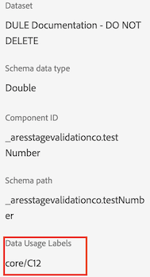

# 標籤和原則

在 Experience Platform 中建立資料集時，您可以針對資料集中的部分或全部元素建立[資料使用標籤](https://experienceleague.adobe.com/docs/experience-platform/data-governance/labels/reference.html?lang=en)。您可以在 Customer Journey Analytics 中檢視這些標籤和原則。

以下是對 Customer Journey Analytics 特別重要的標籤：

* `C8` 標籤 - **[!UICONTROL 無測量]**。此標籤表示資料無法供貴組織的網站或應用程式進行分析之用。

* `C12` 標籤 - **[!UICONTROL 無一般資料匯出]**。依此方式標示的綱要欄位無法從 Customer Journey Analytics (透過報告、匯出、API 等) 匯出或下載。

>[!NOTE]
>
>資料使用標籤不會自動傳播到合成資料集。不過可以手動新增。

加上標籤並不表示已強制執行這些資料使用標籤。使用標籤的方式由各項原則決定。您可以使用 [Experience Platform UI](https://experienceleague.adobe.com/docs/experience-platform/data-governance/policies/user-guide.html?lang=en) 或透過 Experience Platform 上的[原則服務 API](https://experienceleague.adobe.com/docs/experience-platform/data-governance/api/overview.html?lang=zh-Hant) 建立您的原則。

兩個 Adobe 定義的原則會在 Customer Journey Analytics 中出現，並影響報告和下載/共用：

* **[!UICONTROL 強制執行 Analytics]** 原則
* **[!UICONTROL 強制執行下載]**&#x200B;原則

## 檢視 Customer Journey Analytics 資料檢視中的資料標籤

在 Experience Platform 中建立的資料標籤會在資料檢視使用者介面中的三個位置中出現：

| 位置 | 說明 |
| --- | --- |
| 結構描述欄位上的資訊按鈕 | 按一下此按鈕表示哪些[!UICONTROL 資料使用標籤]目前套用至欄位：
 |
| 右邊邊欄在[元件設定](/help/data-views/component-settings/overview.md)下方 | 此處列出任何[!UICONTROL 資料使用標籤]：
 |
| 將資料標籤做為一欄新增 | 您可以將[!UICONTROL 資料使用標籤]做為一欄新增到資料檢視中的「[!UICONTROL 包含的元件]」欄。按一下欄選擇棄，然後選取&#x200B;**[!UICONTROL 資料使用標籤]**：
 |

{style="table-layout:auto"}

## 篩選資料檢視中的資料控管標籤

在資料檢視編輯器中，按一下左側邊欄中的「[!UICONTROL 篩選條件]」圖示，然後依「**[!UICONTROL 資料控管]**」和「**[!UICONTROL 標籤]**」類型篩選資料檢視元件：

按一下「**[!UICONTROL 套用]**」，以查看哪些元件附加標籤。

## 篩選資料檢視中的資料控管原則

您可以查看是否啟用某項原則，禁止使用某些 Customer Journey Analytics 資料檢視元素進行分析或匯出。

再按一下左側邊欄中的「[!UICONTROL 篩選條件]」圖示，然後在「**[!UICONTROL 資料控管]**」下方按一下「**[!UICONTROL 原則]**」。

按一下「**[!UICONTROL 套用]**」，以查看已啟用哪些原則。

## 啟用的原則如何影響資料檢視

如果已開啟&#x200B;**[!UICONTROL 強制執行分析]**&#x200B;或&#x200B;**[!UICONTROL 強制執行下載]**&#x200B;原則，這些關聯某些資料標籤 (C8 或 C12) 的結構描述元件無法新增到資料檢視。

這些元件會在左側邊欄「[!UICONTROL 結構描述」欄位]清單中反灰：

您無法儲存當中有已封鎖欄位的資料檢視。

>[!MORELIKETHIS]
>[下載敏感性資料](/help/analysis-workspace/export/download-send.md)

>[!MORELIKETHIS]
>[什麼是 Report Builder 中受限制的標籤？](https://experienceleague.adobe.com/docs/analytics-platform/using/cja-reportbuilder/restricted-labels.html?lang=zh-Hant)

