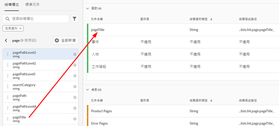
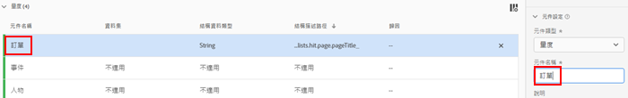
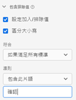
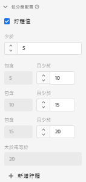
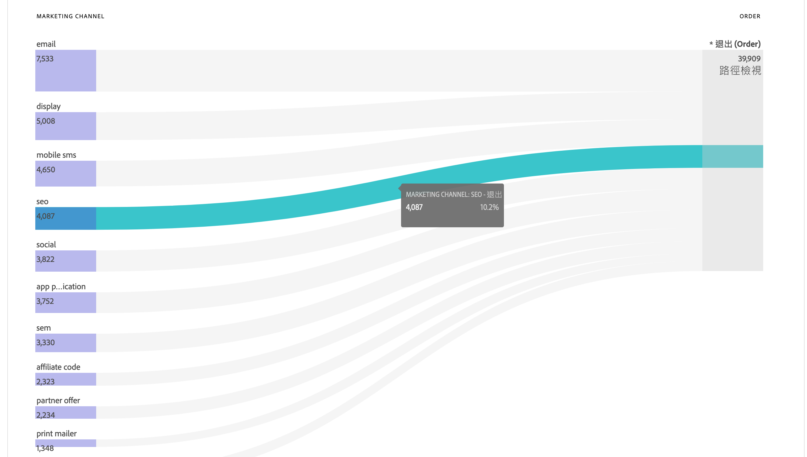
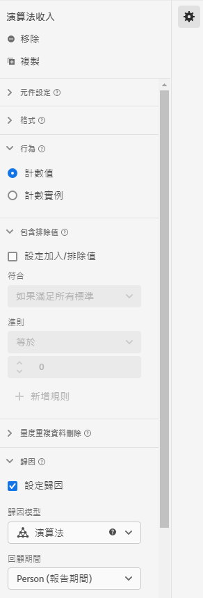

# 資料檢視使用案例

這些使用案例顯示 Customer Journey Analytics 中資料檢視的彈性和功能。

## 1.從pageTitle（字串）結構欄位建立「訂購」量度

例如，在建立資料檢視時，您可以從字串「[!UICONTROL pageTitle]」結構欄位建立「[!UICONTROL 訂單]」量度。步驟如下：

1. 在「元件」索引標籤上，將「[!UICONTROL pageTitle]」拖曳至「[!UICONTROL 已包含元件]」下的「[!UICONTROL 量度]」區段。
   
1. 現在，在右側的「[!UICONTROL 元件設定] 」下反白標示您剛才拖曳的量度，並將其重新命名：
   
1. 開啟右側的「[!UICONTROL 包含/排除值]」對話框，並指定下列項目：
   

   「確認」短語表示這是訂單。在檢閱符合這些標準的所有頁面標題後，每個例項都會計為「1」。此結果是新量度 (而非計算量度)。具有包含/排除值的量度可用於任何其他量度也可使用的地方。它適用於 Attribution IQ、篩選器，以及您可使用標準量度的其他任何地方。
1. 您可以進一步指定此量度的歸因模型，例如 「[!UICONTROL 上次接觸]」，並具有「[!UICONTROL 工作階段]」的 [!UICONTROL 「回顧」視窗]。您也可以從相同欄位建立另一個「[!UICONTROL 訂單]」量度，並為其指定不同的歸因模型，例如「[!UICONTROL 上次接觸]」，以及不同的[!UICONTROL 「回顧」視窗]，例如「[!UICONTROL 30天]」。

## 2.使用整數作為維

先前，整數會自動被視為 CJA 中的量度。現在，數字 (包括 Adobe Analytics 的自訂事件) 可被視為維度。其範例如下：

1. 將「[!UICONTROL call_length_min]」整數拖曳至「[!UICONTROL 已包含元件]」下的「[!UICONTROL 維度]」區段：

   

1. 您現在可以新增「[!UICONTROL 值分組]」，在報告中以分組方式呈現此維度。(若未進行分組，此維度的每個例項都會顯示為 Workspace 報告中的條列項目。)

   

## 3.在流量圖中使用數值維度作為「量度」

您可以使用數值維度將「量度」傳入[!UICONTROL 流量]視覺效果中。

1. 在「資料檢視[元件](https://experienceleague.adobe.com/docs/analytics-platform/using/cja-dataviews/create-dataview.html?lang=en#configure-component-settings)」標籤上，將「行銷管道」]結構欄位拖曳至「[!UICONTROL 包含的元件]」下的「[!UICONTROL 量度]」區域。[!UICONTROL 
2. 在工作區報表中，此流量顯示流入[!UICONTROL 訂單]的[!UICONTROL 行銷管道]:

## 4.進行子事件篩選

您可以篩選事件，只顯示您想要查看的內容。 例如，在資料檢視中使用包含/排除功能，只將精力放在產生銷售額超過50美元的產品上。 因此，如果您的訂單包含50美元的產品購買和25美元的產品購買，我們將僅刪除25美元的產品購買，而不會刪除整個訂單。

1. 在「資料檢視[元件](https://experienceleague.adobe.com/docs/analytics-platform/using/cja-dataviews/create-dataview.html?lang=en#configure-component-settings)」標籤上，將[!UICONTROL 收入]結構欄位拖曳至[!UICONTROL 包含的元件]下的[!UICONTROL 量度]區域。
1. 選取量度並在右側設定下列項目：
a.在[!UICONTROL Format]下，選擇[!UICONTROL Currency]。
b.在[!UICONTROL Currency]下，選擇USD。
c.在[!UICONTROL 包含/排除值]下，選取[!UICONTROL 設定包含/排除值]旁的核取方塊。
d.在[!UICONTROL Match]下，選擇[!UICONTROL 如果所有條件都滿足]。
e.在[!UICONTROL 條件]下，選擇[!UICONTROL 大於或等於]。
f.指定&quot;50&quot;作為值。

這些新設定可讓您僅檢視高價值收入，並篩選掉低於$50的任何項目。

## 5.使用[!UICONTROL 無值選項]設定

貴公司可能已花時間訓練使用者在報表中預期「未指定」。 資料檢視的預設值為「無值」。 您現在可以在資料檢視UI中將[「無值」重新命名為「未指定」](https://experienceleague.adobe.com/docs/analytics-platform/using/cja-dataviews/create-dataview.html?lang=en#configure-no-value-options-settings)。

## 6.使用[!UICONTROL 複製]功能

若要從單一結構欄位建立多個量度或維度，複製量度並修改特定設定是一種簡單的方式。

只需選取右上方量度或維度名稱下方的「複製」設定：

## 使用不同的歸因設定建立多個量度

使用上述的[!UICONTROL 複製]功能，建立許多具有不同歸因設定的收入量度，例如[!UICONTROL 首次接觸]、[!UICONTROL 上次接觸]和[!UICONTROL 演算法]。

請別忘了重新命名每個量度以反映差異，例如「演算法收入」：

有關其他資料檢視設定的詳細資訊，請參閱「[建立資料檢視](/help/data-views/create-dataview.md)」。有關資料檢視的概念性概觀，請參閱「[資料檢視概觀](/help/data-views/data-views.md)」。