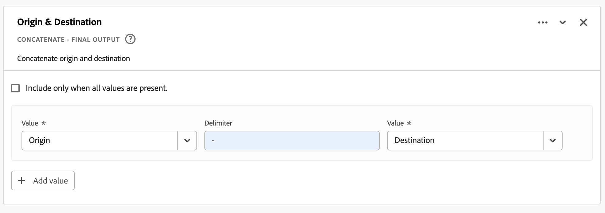
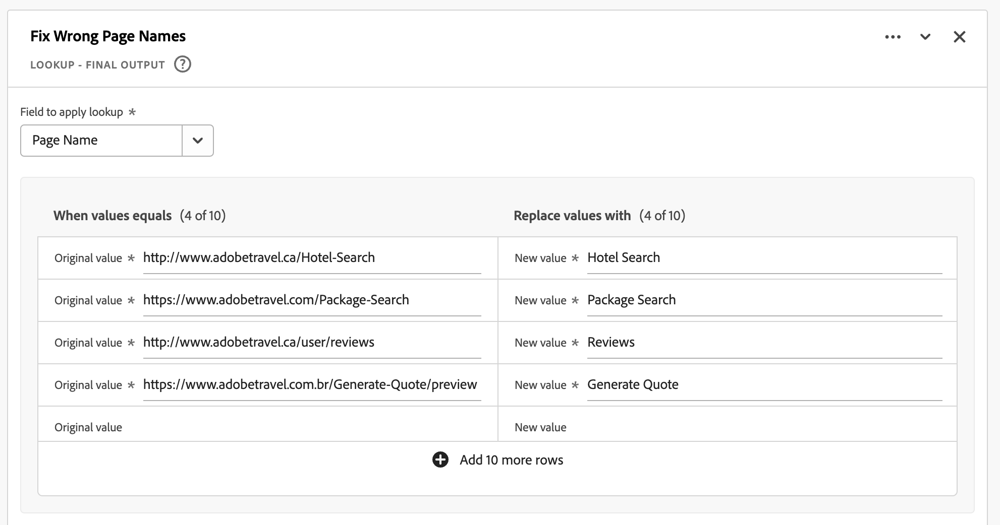
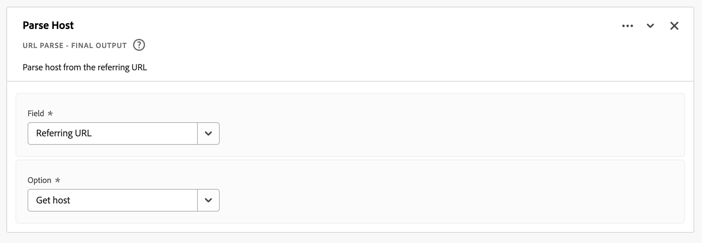

# 衍生欄位

{{release-limited-testing}}

衍生欄位是Customer Journey Analytics (CJA)中即時報告功能的重要方面。 衍生欄位可讓您透過可自訂的規則產生器，迅速定義 (通常是複雜的) 資料操作。然後，您可以將該衍生欄位當做中的元件（量度或維度） [Workspace](../../analysis-workspace/home.md) 甚至進一步將衍生欄位定義為中的元件 [資料檢視](../data-views.md).

相較於CJA以外其他位置中的資料轉換或操控，衍生欄位可節省大量的時間和精力。 例如 [資料準備](https://experienceleague.adobe.com/docs/experience-platform/data-prep/home.html?lang=zh-Hant)， [資料Distiller](https://experienceleague.adobe.com/docs/experience-platform/query/data-distiller/overview.html?lang=en)，或在您自己的提取轉換載入(ETL) /提取載入轉換(ELT)程式內。

衍生欄位定義於 [資料檢視](../data-views.md)是以定義為規則的一組函式為基礎，並套用至可用的標準和/或結構描述欄位。

範例使用案例包括：

- 定義衍生的「頁面名稱」欄位，此欄位會將收集到的頁面名稱值更正為正確的頁面名稱值。

- 定義衍生的行銷管道欄位，以根據一或多個條件（例如URL引數、頁面URL、頁面名稱）決定適當的行銷管道。

## 衍生欄位介面

當您建立或編輯衍生欄位時，請使用衍生欄位介面。

|  | 名稱 | 說明 |
|---------|----------|--------|
| 1 | **選擇器** | 您可使用選取器區域來選取您的函式、函式範本、結構描述欄位或標準欄位，並將其拖放至規則產生器。  使用下拉式清單來選取：   [!UICONTROL 函式]  — 可用清單 [函式](#function-reference)，   [!UICONTROL 函式範本]  — 可用清單 [函式範本](#function-templates)，    [!UICONTROL 結構描述欄位]  — 列出資料集類別（事件、設定檔、查詢）以及先前定義之衍生欄位中可用的欄位，以及   [!UICONTROL 標準欄位]  — 標準可用欄位（例如Platform資料集ID）。 選擇器中只會顯示字串和數值標準欄位。 如果函式支援其他資料型別，則可以為規則介面中的值或欄位選擇具有這些其他資料型別的標準欄位。 您可以使用以下專案搜尋功能、功能範本、結構描述和標準欄位：  搜尋方塊。  您可以選取「 」，篩選選取的物件清單  在中篩選和指定篩選器 [!UICONTROL 欄位篩選依據] 對話方塊。 您可以使用以下方式輕鬆移除篩選器  用於每個篩選器。 |
| 2 | **規則產生器** | 您可使用一或多個規則依序建置衍生欄位。 規則是函式的特定實作，因此一律只與一個函式相關聯。 將函式拖放至規則產生器，即可建立規則。 函式型別會決定規則的介面。 請參閱 [規則介面](#rule-interface) 以取得詳細資訊。  您可以在規則產生器中已提供的規則開始、結束或之間插入函式。 規則產生器中的最後一個規則會決定衍生欄位的最終輸出。 |
| 3 | **[!UICONTROL **&#x200B;欄位設定&#x200B;**]** | 您可以為衍生欄位命名和說明，並檢查其欄位型別。 |
| 4 | **[!UICONTROL **&#x200B;最終輸出&#x200B;**]** | 此區域會根據過去30天的資料以及您在規則產生器中對衍生欄位所做的變更，顯示輸出值的即時更新預覽。 |

{style="table-layout:auto"}

## 欄位範本精靈

第一次存取衍生欄位介面時， [!UICONTROL 從欄位範本開始] 精靈隨即顯示。

1. 選取最能描述您嘗試建立的欄位型別的範本。
2. 選取 **[!UICONTROL **&#x200B;選取&#x200B;**]** 按鈕以繼續。

衍生欄位對話方塊會填入您所選欄位型別的必要或實用規則（和函式）。 另請參閱 [函式範本](#function-templates) 以取得可用範本的詳細資訊。

## 規則介面

在規則產生器中定義規則時，會使用規則介面。

|  | 名稱 | 說明 |
|---------|----------|--------|
| A | **規則名稱** | 依預設，規則名稱為 **規則X** （X代表序號）。 若要編輯規則的名稱，請選取其名稱，然後輸入新名稱，例如 `Query Parameter`. |
| B | **函數名稱** | 規則的選取函式名稱，例如 [!UICONTROL url剖析]. 當函式是函式序列中的最後一個並決定最終輸出值時，函式名稱后面會跟著 [!UICONTROL  — 最終輸出]，例如 [!UICONTROL URL剖析 — 最終輸出].  若要顯示包含函式詳細資訊的快顯視窗，請選取 . |
| C | **規則說明** | 您可以選擇新增說明至規則。 選取 ，然後選取 **[!UICONTROL **&#x200B;新增說明&#x200B;**]** 新增說明或 **[!UICONTROL **&#x200B;編輯說明&#x200B;**]** 以編輯現有的說明。 使用編輯器輸入說明。 您可以使用工具列來格式化文字（使用樣式選擇器、粗體、斜體、底線、右側、左側、置中、顏色、數字清單、專案符號清單）並新增連結至外部資訊。  若要完成說明的編輯，請在編輯器外按一下「 」。 |
| D | **功能區域** | 定義函式的邏輯。 介面取決於函式的型別。 的下拉式清單 [!UICONTROL 欄位] 或 [!UICONTROL 值] 根據函式預期的輸入型別，顯示所有類別的可用欄位（規則、標準欄位、欄位）。 另請參閱 [函式參考](#function-reference) 每個支援函式的詳細資訊。 |

{style="table-layout:auto"}

## 建立衍生欄位

1. 選取現有的資料檢視或建立資料檢視。 另請參閱 [資料檢視](../data-views.md) 以取得詳細資訊。

2. 選取 **[!UICONTROL **&#x200B;元件&#x200B;**]** 資料檢視的索引標籤。

3. 選取 **[!UICONTROL **&#x200B;建立衍生欄位&#x200B;**]** 從左側邊欄。

4. 若要定義衍生欄位，請使用 [!UICONTROL 建立衍生欄位] 介面。 另請參閱 [衍生欄位介面](#derived-field-interface).

   若要儲存新的衍生欄位，請選取 **[!UICONTROL **&#x200B;儲存&#x200B;**]**.

5. 您的新衍生欄位會新增至 [!UICONTROL 衍生欄位>] 容器，作為的一部分 **[!UICONTROL **&#x200B;結構描述欄位&#x200B;**]** 位於資料檢視的左側邊欄中。

## 編輯衍生欄位

1. 選取現有的資料檢視。 另請參閱 [資料檢視](../data-views.md) 以取得詳細資訊。

2. 選取 **[!UICONTROL **&#x200B;元件&#x200B;**]** 資料檢視的索引標籤。

3. 選取 **[!UICONTROL **&#x200B;結構描述欄位&#x200B;**]** 索引標籤中的 [!UICONTROL 連線] 左側的窗格。

4. 選取 **[!UICONTROL **&#x200B;衍生欄位>**]** 容器。

5. 將游標停留在您要編輯的衍生欄位上，然後選取 .

6. 若要編輯衍生欄位，請使用 [!UICONTROL 編輯衍生欄位] 介面。 另請參閱 [衍生欄位介面](#derived-field-interface).

   - 選取 **[!UICONTROL **&#x200B;儲存&#x200B;**]** 以儲存更新的衍生欄位。

   - 選取 **[!UICONTROL **&#x200B;取消&#x200B;**]** 以取消您對衍生欄位所做的任何變更。

   - 選取 **[!UICONTROL **&#x200B;另存為&#x200B;**]** 將衍生欄位另存為新衍生欄位。 新衍生欄位的名稱與原始編輯的衍生欄位相同，其名稱為 `(copy)` 已新增至其中。

## 刪除衍生欄位

1. 選取現有的資料檢視。 另請參閱 [資料檢視](../data-views.md) 以取得詳細資訊。

2. 選取 **[!UICONTROL **&#x200B;元件&#x200B;**]** 資料檢視的索引標籤。

3. 選取 **[!UICONTROL **&#x200B;結構描述欄位&#x200B;**]** 定位於 [!UICONTROL 連線] 窗格。

4. 選取 **[!UICONTROL **&#x200B;衍生欄位>**]** 容器。

5. 將游標停留在您要刪除的衍生欄位上，然後選取 .

6. 使用中 **[!UICONTROL **&#x200B;編輯衍生欄位&#x200B;**]** 介面中，選取刪除。

   A [!UICONTROL 刪除元件] 對話方塊會要求您確認刪除。 考慮資料檢視外部衍生欄位可能存在的任何外部參考。

   - 選取 **[!UICONTROL **&#x200B;繼續&#x200B;**]** 以刪除衍生欄位。

## 函數範本

若要快速建立特定使用案例的衍生欄位，可使用函式範本。 這些函式範本可從衍生欄位介面的選取器區域存取，或首次使用時顯示於 [!UICONTROL 從欄位範本開始] 精靈。

### 行銷管道

此範本設定為使用 [Url剖析](#dnl-url-parse) 和 [案例時間](#dnl-case-when) 函式多次，以從URL取得適當的值。 接著對這些值套用邏輯，以便將URL與特定行銷管道建立關聯。

+++ 詳細資料

若要使用範本，您必須為範本規則中列出的每個函式指定正確的引數。 另請參閱 [函式參考](#function-reference) 以取得詳細資訊。

+++

<!--

+++ Data clean up template

>[!WARNING]
>
>Could not find any information on this template.
+++

-->

## 函式參考

如需各個支援功能的詳細資訊，請參閱以下內容：

- 規格：
   - 輸入資料型別：支援的資料型別，
   - 輸入：輸入的可能值，
   - 包含的運運算元：此函式支援的運運算元（如果有的話）、
   - 限制：適用於此特定函式的限制，
   - 輸出。

- 使用案例，包括：
   - 定義衍生欄位之前的資料，
   - 如何定義衍生欄位，
   - 定義衍生欄位後的資料。

- 限制（如果適用）。

<!-- Concatenate -->

### 串連

將兩個或多個欄位、衍生欄位或使用者輸入的值結合至具有已定義分隔字元的單一欄位。

+++ 詳細資料

## 規格 {#concatenate-io}

| 輸入資料型別 | 輸入 | 包含的運運算元 | 限制 | 輸出 |
|---|---|---|---|---|
| 
字串
 | <ul><li>針對每個 [!UICONTROL 值]：<ul><li>規則</li><li>標準欄位</li><li>欄位</li><li>使用者輸入的輸入</li></ul></li><li>針對每個 [!UICONTROL 分隔符號]：<ul><li>使用者輸入的輸入</li></ul></li> </ul> | 
不適用
 | 
每個衍生欄位2個函式
 | 
新增衍生欄位
 |

{style="table-layout:auto"}

## 使用案例 {#concatenate-uc}

您目前是以個別欄位的形式收集起源和目的地機場代碼。 您想要取用這兩個欄位，並將它們合併成以連字型大小(-)分隔的單一維度。 因此，您可以分析來源與目的地的組合，以識別預訂的最上層路由。

假設：

- 來源和目的地值會收集在相同表格中的個別欄位中。
- 使用者決定在值之間使用分隔字元&#39;-&#39;。

想像一下會發生下列預訂：

- 客戶ABC123預訂鹽湖城(SLC)和奧蘭多(MCO)之間的航班
- 客戶ABC456預訂鹽湖城(SLC)和洛杉磯(LAX)之間的航班
- 客戶ABC789預訂鹽湖城(SLC)和西雅圖(SEA)之間的航班
- 客戶ABC987預訂鹽湖城(SLC)和聖荷西(SJO)之間的航班
- 客戶ABC654預訂鹽湖城(SLC)和奧蘭多(MCO)之間的航班

所需的報表應如下所示：

| 來源/目的地 | 預訂 |
|----|---:|
| SLC-MCO | 2 |
| SLC-LAX | 1 |
| SLC-SEA | 1 |
| SLC-SJO | 1 |

{style="table-layout:auto"}

### 在此之前的資料 {#concatenate-uc-databefore}

| Origin | 目標 |
|----|---:|
| SLC | MCO |
| SLC | LAX |
| SLC | SEA |
| SLC | SJO |
| SLC | MCO |

{style="table-layout:auto"}

### 衍生欄位 {#concatenate-derivedfield}

您定義新的 [!UICONTROL 來源 — 目的地] 衍生欄位。 您使用 [!UICONTROL 串連] 定義規則以串連 [!UICONTROL 原始] 和 [!UICONTROL 目的地] 欄位使用 `-` [!UICONTROL 分隔符號].

### 之後的資料 {#concatenate-dataafter}

| 來源 — 目的地 （衍生欄位） |
|---|
| SLC-MCO |
| SLC-LAX |
| SLC-SEA |
| SLC-SJO |
| SLC-MCO |

{style="table-layout:auto"}

+++

<!-- CASE WHEN -->

### 情況

根據一或多個欄位的定義條件套用條件。 然後，系統會根據條件的順序，使用這些條件來定義新衍生欄位中的值。

+++ 詳細資料

## 規格 {#casewhen-io}

| 輸入資料型別 | 輸入 | 包含的運運算元 | 限制 | 輸出 |
|---|---|---|---|---|
| <ul><li>字串</li><li>數值</li><li>日期</li></ul> | <ul><li>針對每個 [!UICONTROL 若]， [!UICONTROL Else If] 容器：
<ul><li>[!UICONTROL 值]</li><ul><li>規則</li><li>標準欄位</li><li>欄位</li></ul><li>[!UICONTROL 條件] （根據選取的值型別，請參閱包含的運運算元）</li></ul></li><li>針對每個 [!UICONTROL 然後將值設定為]， [!UICONTROL 否則將值設為]：
<ul><li>[!UICONTROL 值]</li><ul><li>規則</li><li>標準欄位</li><li>欄位</li></ul></ul></li></ul> | 
字串
<ul><li>等於</li><li>等於任何字詞</li><li>包含片語</li><li>包含任何字詞</li><li>包含所有字詞</li><li>開始於</li><li>以任何字詞開頭</li><li>終止於</li><li>以任何字詞結尾</li><li>不等於</li><li>不等於任何字詞</li><li>不包含此片語</li><li>不包含任何字詞</li><li>不包含所有字詞</li><li>不開始於</li><li>開頭不是任何詞語</li><li>不終止於</li><li>結尾不是任何字詞</li><li>已設定</li><li>未設定</li></ul>
數值
<ul><li>等於</li><li>不等於</li><li>大於</li><li>大於或等於</li><li>小於</li><li>小於或等於</li><li>已設定</li><li>未設定</li></ul>
日期
<ul><li>等於</li><li>不等於</li><li>晚於</li><li>晚於或等於</li><li>早於</li><li>早於或等於</li><li>已設定</li><li>未設定</li></ul> | <ul><li>每個衍生欄位5個函式</li><li>每個衍生欄位200個運運算元。 「反向連結網域包含google」是單一運運算元的範例。 </li></ul> | 
新增衍生欄位
 |

{style="table-layout:auto"}

## 使用案例1 {#casewhen-uc1}

您要定義規則以識別各種行銷管道，方法是套用階層式邏輯來將行銷管道欄位設定為適當的值：

- 如果反向連結來自搜尋引擎，且頁面具有查詢字串值，其中 `cid` 包含 `ps_`，則行銷管道應識別為 [!DNL *付費搜尋*].
- 如果反向連結來自搜尋引擎，而頁面沒有查詢字串 `cid`，則行銷管道應識別為 [!DNL *免費搜尋*].
- 如果頁面有查詢字串值，其中 `cid` 包含 `em_`，則行銷管道應識別為 [!DNL *電子郵件*].
- 如果頁面有查詢字串值，其中 `cid` 包含 `ds_`，則行銷管道應識別為 [!DNL *顯示廣告*].
- 如果頁面有查詢字串值，其中 `cid` 包含 `so_`，則行銷管道應識別為 [!DNL *付費社交*].
- 如果反向連結來自的反向連結網域： [!DNL twitter.com]， [!DNL facebook.com]， [!DNL linkedin.com]，或 [!DNL tiktok.com]，則行銷管道應識別為 [!DNL *自然社交*].
- 如果不符合上述任何規則，則行銷管道應識別為 [!DNL *其他反向連結*].

如果您的網站收到以下範例事件，包含 [!UICONTROL 反向連結] 和 [!UICONTROL 頁面URL]，這些事件的識別方式如下：

| [!DNL Event] | [!DNL Referrer] | [!DNL Page URL] | [!DNL Marketing Channel] |
|:--:|----|----|----|
| 1 | `https://facebook.com` | `https://site.com/home` | [!DNL Natural Social] |
| 2 | `https://abc.com` | `https://site.com/?cid=ds_12345678` | [!DNL Display] |
| 3 |  | `https://site.com/?cid=em_12345678` | [!DNL Email] |
| 4 | `https://google.com` | `https://site.com/?cid=ps_abc098765` | [!DNL Paid Search] |
| 5 | `https://google.com` | `https://site.com/?cid=em_765544332` | [!DNL Email] |
| 6 | `https://google.com` |  | [!DNL Natural Search] |

{style="table-layout:auto"}

### 在此之前的資料 {#casewhen-uc1-databefore}

| [!DNL Referrer] | [!DNL Page URL] |
|----|----|
| `https://facebook.com` | `https://site.com/home` |
| `https://abc.com` | `https://site.com/?cid=ds_12345678` |
|  | `https://site.com/?cid=em_12345678` |
| `https://google.com` | `https://site.com/?cid=ps_abc098765` |
| `https://google.com` | `https://site.com/?cid=em_765544332` |
| `https://google.com` |

{style="table-layout:auto"}

### 衍生欄位 {#casewhen-uc1-derivedfield}

您定義新的 `Marketing Channel` 衍生欄位。 您使用 [!UICONTROL 案例時間] 函式來定義規則，這些規則會根據兩者的現有值為建立值 `Page URL` 和 `Referring URL` 欄位。

記下函式的使用情況 [!UICONTROL url剖析] 定義規則以擷取值 `Page Url` 和 `Referring Url` 早於 [!UICONTROL 案例時間] 規則已套用。

### 之後的資料 {#casewhen-uc1-dataafter}

| [!DNL Marketing Channel] |
|----|
| [!DNL Natural Social] |
| [!DNL Display] |
| [!DNL Email] |
| [!DNL Paid Search] |
| [!DNL Email] |
| [!DNL Natural Search] |

{style="table-layout:auto"}

## 使用案例2 {#casewhen-uc2}

您已收集內數個不同的搜尋變體 [!DNL Product Finding Methods] 維度。 若要瞭解搜尋與瀏覽的整體效能，您必須花大量時間手動結合結果。

您的網站為收集以下值 [!DNL Product Finding Methods] 維度。 最後，所有這些值都表示搜尋。

| 收集的值 | 實際值 |
|---|---|
| [!DNL search p13n_no] | [!DNL search] |
| [!DNL search p13n_yes] | [!DNL search] |
| [!DNL search refine p13n_no] | [!DNL search] |
| [!DNL search refine p13n_yes ] | [!DNL search] |
| [!DNL search redirect p13n_yes] | [!DNL search] |
| [!DNL search-redirect] | [!DNL search] |

{style="table-layout:auto"}

### 在此之前的資料 {#casewhen-uc2-databefore}

| [!DNL Product Finding Methods] |
|----|
| [!DNL search p13_no] |
| [!DNL search p13_yes] |
| [!DNL browse] |
| [!DNL search refine p13_no] |
| [!DNL search refine p13_yes] |
| [!DNL browse] |
| [!DNL search redirect p13_yes] |
| [!DNL search-redirect] |
| [!DNL browse] |

{style="table-layout:auto"}

### 衍生欄位 {#casewhen-uc2-derivedfield}

您定義 `Product Finding Methods (new)` 衍生欄位。 您建立下列專案 [!UICONTROL 案例時間] 規則產生器中的規則。 這些規則會將邏輯套用至舊版的所有可能變體 [!UICONTROL 產品尋找方法] 的欄位值 `search` 和 `browse` 使用 [!UICONTROL 包含片語] 條件。

### 之後的資料 {#casewhen-uc2-dataafter}

| [!DNL Product Finding Methods (new)] |
|----|
| [!DNL search] |
| [!DNL search] |
| [!DNL browse] |
| [!DNL search] |
| [!DNL search] |
| [!DNL browse] |
| [!DNL search] |
| [!DNL search] |
| [!DNL browse] |

{style="table-layout:auto"}

## 使用案例3 {#casewhen-uc3}

作為旅行公司，您想要針對預訂的旅行報告分段旅行期間。

假設：

- 組織正在將運送航程期間收集至數值欄位。
- 他們想要將1-3天的期間貯體放入名為&#39;的貯體中[!DNL short trip]&#39;
- 他們想要將4-7天的期間貯體放入名為&#39;的貯體中[!DNL medium trip]&#39;
- 他們想要將8天以上的期間貯體放入名為&#39;的貯體中[!DNL long trip]&#39;
- 1天期間預訂了132次行程
- 已預訂110次旅行，為期2天
- 為期3天預訂了105次行程
- 已預訂99次旅行，為期4天
- 已預訂92次行程，為期5天
- 已預訂85次行程，為期6天
- 已預訂82次行程，為期7天
- 已預訂78次行程，為期8天
- 已預訂50次旅行，為期9天
- 預訂了44次旅行，為期10天
- 38次行程已預訂，為期11天
- 31次行程已預訂，為期12天

您需要的報表應如下所示：

| [!DNL Trip Duration Type] | [!DNL Bookings] |
|----|---:|
| [!DNL medium trip] | 358 |
| [!DNL short trip] | 347 |
| [!DNL long trip] | 241 |

{style="table-layout:auto"}

### 在此之前的資料 {#casewhen-uc3-databefore}

| [!DNL Trip Duration] |
|---:|
| 1 |
| 12 |
| 3 |
| 6 |
| 4 |
| 8 |
| 6 |
| 2 |
| 1 |
| 2 |
| 21 |
| 8 |

### 衍生欄位 {#casewhen-uc3-derivedfield}

您定義 `Trip Duration (bucketed)` 衍生欄位。 您建立下列專案 [!UICONTROL 案例時間] 規則產生器中的規則。 此規則會將邏輯套用至舊的 [!UICONTROL 運送航程期間] 欄位值分為三個值： `short trip`， `medium  trip`、和 `long trip`.

### 之後的資料 {#casewhen-uc3-dataafter}

| [!DNL Trip Duration (bucketed)] |
|---|
| [!DNL short trip] |
| [!DNL long trip] |
| [!DNL short trip] |
| [!DNL medium trip] |
| [!DNL medium trip] |
| [!DNL long trip] |
| [!DNL medium trip] |
| [!DNL short trip] |
| [!DNL short trip] |
| [!DNL short trip] |
| [!DNL long trip] |
| [!DNL long trip] |

## 限制

CJA使用巢狀容器結構，並以Adobe Experience Platform的範本建模 [XDM](https://experienceleague.adobe.com/docs/experience-platform/xdm/home.html?lang=zh-Hant) （體驗資料模型）。 另請參閱 [容器](../create-dataview.md#containers) 和 [篩選容器](../../components/filters/filters-overview.md#filter-containers) 以取得更多背景資訊。 此容器模型雖然本質上有彈性，但在使用規則產生器時施加了一些限制。

CJA使用以下預設容器模型：

下列限制確實適用，並且會在下列情況下強制執行： *選取* 和 *設定* 值。

|  | 限制 |
|:---:|----|
| **A** | 您的值 *選取* 在相同 [!UICONTROL 若]， [!UICONTROL Else If] 建構(使用 [!UICONTROL 和] 或 [!UICONTROL 或])且必須源自相同容器，且可以是任何型別（字串） ，數值 ，依此類推)。   |
| **B** | 您所有的值 *set* 跨規則必須來自相同容器，且具有相同型別或相同型別的衍生值。    |
| **C** | 您的值 *選取* 橫向 [!UICONTROL 若]， [!UICONTROL Else If] 規則中的建構do *not* 必須源自相同的容器，並 *not* 必須是相同型別。    |

{style="table-layout:auto"}

+++

<!-- FIND AND REPLACE -->

### 尋找和取代

尋找所選欄位中的所有值，並在新的衍生欄位中以不同的值取代這些值。

+++ 詳細資料

## 規格 {#findreplace-io}

| 輸入資料型別 | 輸入 | 包含的運運算元 | 限制 | 輸出 |
|---|---|---|---|---|
| 
字串
 | <ul><li>對於條件：<ul><li>[!UICONTROL 值]<ul><li>規則</li><li>標準欄位</li><li>欄位</li></ul></li></ul></li><li>針對每個 [!UICONTROL 全部尋找]， [!UICONTROL 並全部取代為]：<ul><li>[!UICONTROL 值]</li><ul><li>使用者輸入的輸入</li></ul></li></ul></ul> | 
字串
<ul><li>[!UICONTROL 全部尋找]， [!UICONTROL 並全部取代為]</li></ul> | 
每個衍生欄位5個函式
 | 
新增衍生欄位
 |

{style="table-layout:auto"}

## 使用案例 {#findreplace-uc}

例如，您收到的外部行銷管道報表值格式錯誤 `email%20 marketing` 而非 `email marketing`. 這些格式錯誤的值會割裂您的報表，並使得檢視電子郵件效能的難度增加。 您想要取代 `email%20marketing` 替換為 `email marketing`.

**原始報告**

| [!DNL External Marketing Channels] | [!DNL Sessions] |
|---|--:|
| [!DNL email marketing] | 500 |
| [!DNL email %20marketing] | 24 |

{style="table-layout:auto"}

**偏好的報告**

| [!DNL External Marketing Channels] | [!DNL Sessions] |
|---|--:|
| [!DNL email marketing] | 524 |

### 在此之前的資料 {#findreplace-uc-databefore}

| [!DNL External Marketing] |
|----|
| [!DNL email marketing] |
| [!DNL email%20marketing] |
| [!DNL email marketing] |
| [!DNL email marketing] |
| [!DNL email%20marketing] |

{style="table-layout:auto"}

### 衍生欄位 {#findreplace-uc-derivedfield}

您定義 `Email Marketing (updated)` 衍生欄位。 您使用 [!UICONTROL 尋找和取代] 函式來定義尋找和取代所有出現位置的規則 `email%20marketing` 替換為 `email marketing`.

### 之後的資料 {#findreplace-uc-dataafter}

| [!DNL External Marketing (updated)] |
|----|
| [!DNL email marketing] |
| [!DNL email marketing] |
| [!DNL email marketing] |
| [!DNL email marketing] |
| [!DNL email marketing] |

{style="table-layout:auto"}

+++

<!-- LOOKUP -->

### 查詢

定義一組查閱值，這些值會由對應的值取代。

+++ 詳細資料

## 規格 {#lookup-io}

| 輸入資料型別 | 輸入 | 包含的運運算元 | 限制 | 輸出 |
|---|---|---|---|---|
| <ul><li>字串</li><li>數值</li><li>日期</li></ul> | <ul><li>對象 [!UICONTROL 要套用查閱的欄位]：<ul><li>規則</li><li>標準欄位</li><li>欄位</li></ul></li><li>對象 [!UICONTROL 當值等於] 和 [!UICONTROL 將值取代為]：
<ul><li>使用者輸入的輸入</li></ul></li></ul> | 
不適用
 | 
每個衍生欄位5個函式
 | 
新增衍生欄位
 |

{style="table-layout:auto"}

## 使用案例1 {#lookup-uc1}

您的確有一個CSV檔案，其中包含索引鍵資料行 `hotelID` 以及一或多個與關聯的其他欄 `hotelID`： `city`， `rooms`， `hotel name`.
您正在收集 [!DNL Hotel ID] 在維度中，但想要建立 [!DNL Hotel Name] 維度衍生自 `hotelID` CSV檔案中的。

**CSV檔案結構和內容**

| [!DNL hotelID] | [!DNL city] | [!DNL rooms] | [!DNL hotel name] |
|---|---|---:|---|
| [!DNL SLC123] | [!DNL Salt Lake City] | 40 | [!DNL SLC Downtown] |
| [!DNL LAX342] | [!DNL Los Angeles] | 60 | [!DNL LA Airport] |
| [!DNL SFO456] | [!DNL San Francisco] | 75 | [!DNL Market Street] |

{style="table-layout:auto"}

**目前的報告**

| [!DNL Hotel ID] | 產品檢視 |
|---|---:|
| [!DNL SLC123] | 200 |
| [!DNL LX342] | 198 |
| [!DNL SFO456] | 190 |

{style="table-layout:auto"}

**所需報告**

| [!DNL Hotel Name] | 產品檢視 |
|----|----:|
| [!DNL SLC Downtown] | 200 |
| [!DNL LA Airport] | 198 |
| [!DNL Market Street] | 190 |

{style="table-layout:auto"}

### 在此之前的資料 {#lookup-uc1-databefore}

| [!DNL Hotel ID] |
|----|
| [!DNL SLC123] |
| [!DNL LAX342] |
| [!DNL SFO456] |

{style="table-layout:auto"}

### 衍生欄位 {#lookup-uc1-derivedfield}

您定義 `Hotel Name` 衍生欄位。 您使用 [!UICONTROL 查詢] 函式來定義規則，您可以在其中查詢 [!UICONTROL 飯店ID] 欄位並取代為新值。

### 之後的資料 {#lookup-uc1-dataafter}

| [!DNL Hotel Name] |
|----|
| [!DNL SLC Downtown] |
| [!DNL LA Airport] |
| [!DNL Market Street] |

{style="table-layout:auto"}

## 使用案例2 {#lookup-uc2}

您已收集好幾個頁面的URL，而不是好記的頁面名稱。 此混合值集合會中斷報告。

### 在此之前的資料 {#lookup-uc2-databefore}

| [!DNL Page Name] |
|---|
| [!DNL Home Page] |
| [!DNL Flight Search] |
| `http://www.adobetravel.ca/Hotel-Search` |
| `https://www.adobetravel.com/Package-Search` |
| [!DNL Deals & Offers] |
| `http://www.adobetravel.ca/user/reviews` |
| `https://www.adobetravel.com.br/Generate-Quote/preview` |

{style="table-layout:auto"}

### 衍生欄位 {#lookup-uc2-derivedfield}

您定義 `Page Name (updated)` 衍生欄位。 您使用 [!UICONTROL 查詢] 函式，定義可查詢現有值的規則 [!UICONTROL 頁面名稱] 欄位並取代為更新的正確值。

### 之後的資料 {#lookup-uc2-dataafter}

| [!DNL Page Name (updated)] |
|---|
| [!DNL Home Page] |
| [!DNL Flight Search] |
| [!DNL Hotel Search] |
| [!DNL Package Search] |
| [!DNL Deals & Offers] |
| [!DNL Reviews] |
| [!DNL Generate Quote] |

+++

<!-- URL PARSE -->

### URL 剖析

剖析URL的不同部分，包括通訊協定、主機、路徑或查詢引數。

+++ 詳細資料

## 規格 {#urlparse-io}

| 輸入資料型別 | 輸入 | 包含的運運算元 | 限制 | 輸出 |
|---|---|---|---|---|
| <ul><li>字串</li></ul> | <ul><li>對象 [!UICONTROL 欄位]：</li><ul><li>規則</li><li>標準欄位</li><li>欄位</li></ul><li>對象 [!UICONTROL 選項]：<ul><li>[!UICONTROL 取得通訊協定]</li><li>[!UICONTROL 取得主機]</li><li>[!UICONTROL 取得路徑]</li><li>[!UICONTROL 取得查詢字串值]<ul><li>[!UICONTROL 查詢參數]:<ul><li>使用者輸入的輸入</li></ul></li></ul></li><li>[!UICONTROL 取得雜湊值]</li></ul></li></ul></li></ul> | 
不適用
 | 
每個衍生欄位5個函式
 | 
新增衍生欄位
 |

{style="table-layout:auto"}

## 使用案例1 {#urlparse-uc1}

您只想使用反向連結URL中的反向連結網域作為行銷管道規則集的一部分。

### 在此之前的資料 {#urlparse-uc1-databefore}

| [!DNL Referring URL] |
|----|
| `https://www.google.com/` |
| `https://duckduckgo.com/` |
| `https://t.co/` |
| `https://l.facebook.com/` |

{style="table-layout:auto"}

### 衍生欄位 {#urlparse-uc1-derivedfield}

您定義  `Referring Domain` 衍生欄位。 您使用 [!UICONTROL url剖析] 定義規則以從擷取主機的函式 [!UICONTROL 反向連結URL] 欄位並將其儲存在新的衍生欄位中。

### 之後的資料 {#urlparse-uc1-dataafter}

| [!DNL Referrer Domain] |
|----|
| [!DNL www.google.com] |
| [!DNL duckduckgo.com] |
| [!DNL t.co] |
| [!DNL l.facebook.com] |

{style="table-layout:auto"}

## 使用案例2 {#urlparse-uc2}

您想要使用 `cid` 中查詢字串的引數 [!DNL Page URL] 作為衍生追蹤程式碼報表輸出的一部分。

### 在此之前的資料 {#urlparse-uc2-databefore}

| [!DNL Page URL] |
|----|
| `https://www.adobe.com/?cid=abc123` |
| `https://www.adobe.com/?em=email1234&cid=def123` |
| `https://www.adobe.com/landingpage?querystring1=test&test2=1234&cid=xyz123` |

{style="table-layout:auto"}

### 衍生欄位 {#urlparse-uc2-derivedfield}

您定義 `Query String CID` 衍生欄位。 您使用 [!UICONTROL url剖析] 函式來定義規則，以擷取中查詢字串引數的值 [!UICONTROL 頁面URL] 欄位，指定 `cid` 作為查詢引數。 輸出值會儲存在新的衍生欄位中。

### 之後的資料 {#urlparse-uc2-dataafter}

| [!DNL Query String CID] |
|----|
| [!DNL abc123] |
| [!DNL def123] |
| [!DNL xyz123] |

{style="table-layout:auto"}

+++

## 限制

下列限制適用於衍生欄位的一般功能：

- 為衍生欄位定義規則時，您最多可以使用100個不同的結構描述欄位（不包括標準欄位）。
- 每個CJA連線最多可以有100個衍生欄位。
