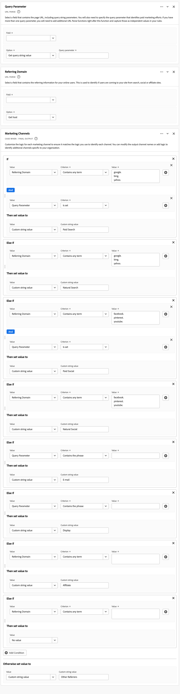
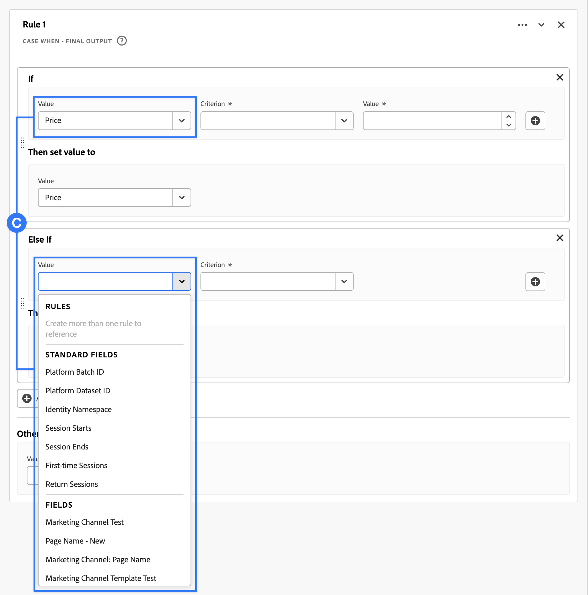

# 衍生欄位

{{release-limited-testing}}

>[!NOTE]
>
>待定的最終更新，您可能會看到 [!UICONTROL 自訂欄位] 而非 [!UICONTROL 衍生欄位] 跨使用者介面。

衍生欄位是Customer Journey Analytics(CJA)中即時報表功能的重要一環。 衍生欄位可讓您透過可自訂的規則產生器，即時定義（通常是複雜的）資料處理。 接著，您就可以將該衍生欄位用作 [工作區](../../analysis-workspace/home.md) 或甚至進一步將衍生欄位定義為 [資料檢視](../data-views.md).

與在CJA以外的其他位置轉換或操控資料相比，衍生欄位可節省大量的時間和精力。 例如 [資料準備](https://experienceleague.adobe.com/docs/experience-platform/data-prep/home.html?lang=zh-Hant), [資料Distiller](https://experienceleague.adobe.com/docs/experience-platform/query/data-distiller/overview.html?lang=en)，或在您自己的擷取轉換載入(ETL)/擷取載入轉換(ELT)程式中。

衍生欄位是在 [資料檢視](../data-views.md)，是以定義為規則的一組函式為基礎，並套用至可用的標準和/或結構欄位。

範例使用案例包括：

- 定義衍生的「頁面名稱」欄位，以更正不正確收集的頁面名稱值以更正頁面名稱值。

- 定義衍生的行銷管道欄位，以根據一或多個條件（例如URL參數、頁面URL、頁面名稱）來決定正確的行銷管道。

## 衍生欄位介面

建立或編輯衍生欄位時，請使用衍生欄位介面。

|  | 名稱 | 說明 |
|---------|----------|--------|
| 1 | **選取器** | 您可使用選取器區域來選取及拖放  函式， 函式模板， 方案欄位，或標準欄位。  使用下拉式清單在 [!UICONTROL 函式], [!UICONTROL 函式範本], [!UICONTROL 結構欄位]，和 [!UICONTROL 標準欄位]. 您可以使用  搜索框。  您可以選取  在 [!UICONTROL 依篩選欄位] 對話框。 您可以使用  對每個篩選器。 |
| 2 | **規則產生器** | 您使用一或多個規則循序建立衍生欄位。 規則是函式的特定實作，因此一律僅與一個函式相關聯。 將函式拖放至規則產生器，即可建立規則。 函式類型決定規則的介面。 請參閱 [規則介面](#rule-interface) 以取得更多資訊。  您可以在規則產生器中可用的規則之間插入函式，將其插入開頭、結尾或中。 規則產生器中的最後一個規則會決定衍生欄位的最終輸出。 |
| 3 | **[!UICONTROL **&#x200B;欄位設定&#x200B;**]** | 您可以為衍生欄位命名並加以說明，並檢查其欄位類型。 |
| 4 | **[!UICONTROL **&#x200B;最終輸出&#x200B;**]** | 此區域會根據過去30天的資料，以及您對規則產生器中衍生欄位所做的變更，顯示輸出值的即時更新預覽。 |

{style="table-layout:auto"}

## 欄位範本精靈

首次存取衍生欄位介面時， [!UICONTROL 從欄位範本開始] 嚮導。

1. 選取最能說明您嘗試建立之欄位類型的範本。
2. 選取 **[!UICONTROL **&#x200B;選擇&#x200B;**]** 按鈕繼續。

派生欄位對話框中填充了對所選欄位類型必需或有用的規則（和函式）。 請參閱 [函式範本](#function-templates) 以取得可用範本的詳細資訊。

## 規則介面

在規則產生器中定義規則時，會使用規則介面。

|  | 名稱 | 說明 |
|---------|----------|--------|
| A | **規則名稱** | 依預設，規則名稱為 **規則X** （X指序號）。 若要編輯規則的名稱，請選取規則的名稱，然後輸入新名稱，例如 `Query Parameter`. |
| B | **函數名稱** | 規則的所選函式名稱，例如 [!DNL URL PARSE]. 當函式是函式序列中的最後一個，並確定最終輸出值時，函式名稱后面跟 [!DNL - FINAL OUTPUT]，例如 [!DNL URL PARSE - FINAL OUTPUT].  若要顯示快顯視窗及函式的詳細資訊，請選取 . |
| C | **規則說明** | 您可以選擇將說明新增至規則。 選擇 ，然後選取 **[!UICONTROL **&#x200B;新增說明&#x200B;**]** 新增說明或 **[!UICONTROL **&#x200B;編輯說明&#x200B;**]** 編輯現有說明。 使用編輯器輸入說明。 您可以使用工具列來設定文字格式（使用樣式選取器、粗體、斜體、底線、右、左、中心、顏色、數字清單、項目符號清單），以及新增外部資訊的連結。  若要完成編輯說明，請按一下編輯器外部的。 |
| D | **功能區域** | 定義函式的邏輯。 介面取決於函式的類型。 請參閱 [函式參考](#function-reference) 詳細資訊。 |

{style="table-layout:auto"}

## 建立衍生欄位

1. 選擇現有資料視圖或建立資料視圖。 請參閱 [資料檢視](../data-views.md) 以取得更多資訊。

2. 選取 **[!UICONTROL **&#x200B;元件&#x200B;**]** 頁簽。

3. 選擇 **[!UICONTROL **&#x200B;建立衍生欄位&#x200B;**]** 從左側邊欄。

4. 若要定義衍生欄位，請使用 [!UICONTROL 建立衍生欄位] 介面。 請參閱 [衍生欄位介面](#derived-field-interface).

   若要儲存新的衍生欄位，請選取 **[!UICONTROL **&#x200B;儲存&#x200B;**]**.

5. 您的新衍生欄位會新增至 [!UICONTROL 衍生欄位>] 容器，作為 **[!UICONTROL **&#x200B;結構欄位&#x200B;**]** 在資料檢視的左側邊欄。

## 編輯衍生欄位

1. 選擇現有資料視圖。 請參閱 [資料檢視](../data-views.md) 以取得更多資訊。

2. 選取 **[!UICONTROL **&#x200B;元件&#x200B;**]** 頁簽。

3. 選擇 **[!UICONTROL **&#x200B;結構欄位&#x200B;**]** 標籤 [!UICONTROL 連線] 窗格。

4. 選擇 **[!UICONTROL **&#x200B;衍生欄位>**]** 容器。

5. 暫留在您要編輯的衍生欄位上，然後選取 .

6. 若要編輯衍生欄位，請使用 [!UICONTROL 編輯衍生欄位] 介面。 請參閱 [衍生欄位介面](#derived-field-interface).

   - 選擇 **[!UICONTROL **&#x200B;儲存&#x200B;**]** 以儲存更新的衍生欄位。

   - 選擇 **[!UICONTROL **&#x200B;取消&#x200B;**]** 取消您對派生欄位所做的任何更改。

   - 選擇 **[!UICONTROL **&#x200B;另存新檔&#x200B;**]** 將派生欄位另存為新的派生欄位。 新的派生欄位與原始編輯的派生欄位的名稱相同，具有 `(copy)` 新增。

## 刪除衍生欄位

1. 選擇現有資料視圖。 請參閱 [資料檢視](../data-views.md) 以取得更多資訊。

2. 選取 **[!UICONTROL **&#x200B;元件&#x200B;**]** 頁簽。

3. 選擇 **[!UICONTROL **&#x200B;結構欄位&#x200B;**]** 標籤 [!UICONTROL 連線] 框。

4. 選擇 **[!UICONTROL **&#x200B;衍生欄位>**]** 容器。

5. 暫留在您要刪除的衍生欄位上，然後選取 .

6. 使用中 **[!UICONTROL **&#x200B;編輯衍生欄位&#x200B;**]** 介面，選擇刪除。

   A [!UICONTROL 刪除元件] 對話框要求您確認刪除。 考慮資料檢視外部的衍生欄位可能存在任何外部參考。

   - 選擇 **[!UICONTROL **&#x200B;繼續&#x200B;**]** 刪除派生欄位。

## 函數範本

若要快速建立特定使用案例的衍生欄位，可使用函式範本。 這些函式範本可從衍生欄位介面的選取器區域存取，或在首次使用時顯示於 [!UICONTROL 從欄位範本開始] 嚮導。

### 行銷管道

此範本已設定為使用 [Url剖析](#dnl-url-parse) 和 [案例時機](#dnl-case-when) 函式多次，以從URL取得適當的值。 然後，對這些值套用邏輯，以將URL關聯至特定行銷管道。

+++ 詳細資料

若要使用範本，您必須為列為範本規則一部分的每個函式指定正確的參數。 請參閱 [函式參考](#function-reference) 以取得更多資訊。

+++

<!--

+++ Data clean up template

>[!WARNING]
>
>Could not find any information on this template.
+++

-->

## 函式參考

如需每個支援的函式，請參閱以下的詳細資訊：

- 規格：
   - 輸入資料類型：支援的資料類型，
   - 輸入：輸入的可能值，
   - 包含的運算子：支援此函式的運算子（如果有）,
   - 限制：可在衍生欄位中使用的規則數上限（連同此函式）,
   - 輸出。

- 使用案例，包括：
   - 定義衍生欄位之前的資料，
   - 如何定義衍生欄位，
   - 定義衍生欄位後的資料。

- 限制（若適用）。

<!-- Concatenate -->

### [!DNL Concatenate]

將兩個或多個欄位、衍生欄位或使用者輸入的值合併為具有定義分隔字元的單一欄位。

+++ 詳細資料

## 規格 {#concatenate-io}

| 輸入資料類型 | 輸入 | 包含的運算子 | 限制 | 輸出 |
|---|---|---|:--:|---|
| 
字串
 | <ul><li>要合併的兩個或多個值<ul><li>欄位</li><li>從先前規則衍生的值</li><li>使用者輸入的值</li></ul></li><li>分隔字元<ul><li>輸入或選取每個值的分隔字元</li></ul></li> </ul> | 
不適用
 | 
2
 | 
新衍生欄位
 |

{style="table-layout:auto"}

## 使用案例 {#concatenate-uc}

您目前以個別欄位收集來源和目的地機場代碼。 您想取用這兩個欄位，並將它們合併為以連字型大小(-)分隔的單一維度。 因此，您可以分析原點和目的地的組合，以識別已預訂的最上層路線。

假設：

- 原始值和目的地值會收集在相同表格中的個別欄位中。
- 使用者決定在值之間使用分隔字元「 — 」。

假設您預訂了下列項目：

- 客戶ABC123預訂在鹽湖城(SLC)和奧蘭多(MCO)之間的航班
- 客戶ABC456預訂在鹽湖城(SLC)和洛杉磯(LAX)之間的航班
- 客戶ABC789預訂在鹽湖城(SLC)和西雅圖(SEA)之間的航班
- 客戶ABC987預訂在鹽湖城(SLC)和聖何塞(SJO)之間的航班
- 客戶ABC654預訂在鹽湖城(SLC)和奧蘭多(MCO)之間的航班

所需報表看起來應該如下：

| 來源/目的地 | 預訂 |
|----|---:|
| SLC-MCO | 2 |
| SLC-LAX | 1 |
| 斯爾克海 | 1 |
| SLC-SJO | 1 |

{style="table-layout:auto"}

### 資料之前 {#concatenate-uc-databefore}

| Origin | 目標 |
|----|---:|
| SLC | MCO |
| SLC | 鬆散 |
| SLC | SEA |
| SLC | SJO |
| SLC | MCO |

{style="table-layout:auto"}

### 衍生欄位 {#concatenate-derivedfield}

您定義新 [!UICONTROL 來源 — 目的地] 衍生欄位。 您使用 [!UICONTROL 串連] 函式來定義要串連的規則 [!UICONTROL 原始] 和 [!UICONTROL 目的地] 欄位使用 `-` [!UICONTROL 分隔字元].

![[!DNL Concatenate] 規則](assets/concatenate.png)

### 之後的資料 {#concatenate-dataafter}

| 來源 — 目的地 （衍生欄位） |
|---|
| SLC-MCO |
| SLC-LAX |
| 斯爾克海 |
| SLC-SJO |
| SLC-MCO |

{style="table-layout:auto"}

+++

<!-- CASE WHEN -->

### [!DNL Case When]

根據一或多個欄位中定義的條件套用條件。 然後，系統會根據條件的順序，使用這些條件來定義新衍生欄位中的值。

+++ 詳細資料

## 規格 {#casewhen-io}

| 輸入資料類型 | 輸入 | 包含的運算子 | 限制 | 輸出 |
|---|---|---|:---:|---|
| <ul><li>字串</li><li>數值</li><li>日期/日期時間</li></ul> | <ul><li>輸入欄位</li><li>標準</li></ul> | 
<u>字串</u>
<ul><li>等於</li><li>等於任何字詞</li><li>包含片語</li><li>包含任何字詞</li><li>包含所有字詞</li><li>開始於</li><li>以任何詞語開頭</li><li>終止於</li><li>以任何詞語結尾</li><li>不等於</li><li>不等於任何字詞</li><li>不包含此片語</li><li>不包含任何字詞</li><li>不包含所有字詞</li><li>不開始於</li><li>不以任何詞語開頭</li><li>不終止於</li><li>不以任何詞語結尾</li><li>已設定</li><li>未設定</li></ul>
<u>數值</u>
<ul><li>等於</li><li>不等於</li><li>大於</li><li>大於或等於</li><li>小於</li><li>小於或等於</li><li>已設定</li><li>未設定</li></ul>
<u>日期</u>
<ul><li>等於</li><li>不等於</li><li>晚於</li><li>晚於或等於</li><li>是之前</li><li>早於或等於</li><li>已設定</li><li>未設定</li></ul> | 
5
 | 
新衍生欄位
 |

{style="table-layout:auto"}

## 使用案例1 {#casewhen-uc1}

您想要定義規則，透過套用階層式邏輯將行銷管道欄位設為適當值，以識別各種行銷管道：

- 如果反向連結來自搜尋引擎，且頁面具有查詢字串值，其中 `cid` 包含 `ps_`，行銷管道應識別為 [!DNL *付費搜尋*].
- 如果反向連結來自搜尋引擎，且頁面沒有查詢字串 `cid`，行銷管道應識別為 [!DNL *免費搜尋*].
- 若頁面具有查詢字串值，其中 `cid` 包含 `em_`，行銷管道應識別為 [!DNL *電子郵件*].
- 若頁面具有查詢字串值，其中 `cid` 包含 `ds_`，行銷管道應識別為 [!DNL *顯示廣告*].
- 若頁面具有查詢字串值，其中 `cid` 包含 `so_`，行銷管道應識別為 [!DNL *付費社交*].
- 如果反向連結來自 [!DNL twitter.com], [!DNL facebook.com], [!DNL linkedin.com]，或 [!DNL tiktok.com]，行銷管道應識別為 [!DNL *自然社會*].
- 如果上述規則皆不相符，則應將行銷管道識別為 [!DNL *其他反向連結*].

若您的網站收到下列範例事件，包含 [!UICONTROL 反向連結] 和 [!UICONTROL 頁面URL]，這些事件的識別方式如下：

| [!DNL Event] | [!DNL Referrer] | [!DNL Page URL] | [!DNL Marketing Channel] |
|:--:|----|----|----|
| 1 | `https://facebook.com` | `https://site.com/home` | [!DNL Natural Social] |
| 2 | `https://abc.com` | `https://site.com/?cid=ds_12345678` | [!DNL Display] |
| 3 |  | `https://site.com/?cid=em_12345678` | [!DNL Email] |
| 4 | `https://google.com` | `https://site.com/?cid=ps_abc098765` | [!DNL Paid Search] |
| 5 | `https://google.com` | `https://site.com/?cid=em_765544332` | [!DNL Email] |
| 6 | `https://google.com` |  | [!DNL Natural Search] |

{style="table-layout:auto"}

### 資料之前 {#casewhen-uc1-databefore}

| [!UICONTROL 反向連結] | [!DNL Page URL] |
|----|----|
| `https://facebook.com` | `https://site.com/home` |
| `https://abc.com` | `https://site.com/?cid=ds_12345678` |
|  | `https://site.com/?cid=em_12345678` |
| `https://google.com` | `https://site.com/?cid=ps_abc098765` |
| `https://google.com` | `https://site.com/?cid=em_765544332` |
| `https://google.com` |

{style="table-layout:auto"}

### 衍生欄位 {#casewhen-uc1-derivedfield}

您定義新 `Marketing Channel` 衍生欄位。 您使用 [!UICONTROL 案例] 函式來定義規則，以根據兩者的現有值來建立 `Page URL` 和 `Referring URL` 欄位。

請注意函式的用法 [!UICONTROL URL剖析] 定義規則以擷取 `Page Url` 和 `Referring Url` 在 [!UICONTROL 案例] 規則。

![[!DNL Case when] 規則1](assets/case-when-1.png)

### 之後的資料 {#casewhen-uc1-dataafter}

| [!DNL Marketing Channel] |
|----|
| [!DNL Natural Social] |
| [!DNL Display] |
| [!DNL Email] |
| [!DNL Paid Search] |
| [!DNL Email] |
| [!DNL Natural Search] |

{style="table-layout:auto"}

## 使用案例2 {#casewhen-uc2}

您已在 [!DNL Product Finding Methods] 維度。 若要了解搜尋與瀏覽的整體效能，您必須花大量時間手動結合結果。

您的網站會收集下列值 [!DNL Product Finding Methods] 維度。 最後，所有這些值都表示搜尋。

| 收集的值 | 實際值 |
|---|---|
| [!DNL search p13n_no] | [!DNL search] |
| [!DNL search p13n_yes] | [!DNL search] |
| [!DNL search refine p13n_no] | [!DNL search] |
| [!DNL search refine p13n_yes ] | [!DNL search] |
| [!DNL search redirect p13n_yes] | [!DNL search] |
| [!DNL search-redirect] | [!DNL search] |

{style="table-layout:auto"}

### 資料之前 {#casewhen-uc2-databefore}

| [!DNL Product Finding Methods] |
|----|
| [!DNL search p13_no] |
| [!DNL search p13_yes] |
| [!DNL browse] |
| [!DNL search refine p13_no] |
| [!DNL search refine p13_yes] |
| [!DNL browse] |
| [!DNL search redirect p13_yes] |
| [!DNL search-redirect] |
| [!DNL browse] |

{style="table-layout:auto"}

### 衍生欄位 {#casewhen-uc2-derivedfield}

您定義 `Product Finding Methods (new)` 衍生欄位。 您可建立下列項目 [!UICONTROL 案例] 規則產生器中的規則。 這些規則會套用邏輯至舊的所有可能變數 [!UICONTROL 產品尋找方法] 欄位值 `search` 和 `browse` 使用 [!UICONTROL 包含片語] 標準。

![[!DNL Case When] 規則2](assets/case-when-2.png)

### 之後的資料 {#casewhen-uc2-dataafter}

| [!DNL Product Finding Methods (new)] |
|----|
| [!DNL search] |
| [!DNL search] |
| [!DNL browse] |
| [!DNL search] |
| [!DNL search] |
| [!DNL browse] |
| [!DNL search] |
| [!DNL search] |
| [!DNL browse] |

{style="table-layout:auto"}

## 使用案例3 {#casewhen-uc3}

作為一家旅遊公司，您想要將預訂的行程持續時間分段，以便報告分段的行程長度。

假設：

- 組織正在將行程持續時間收集到數字欄位中。
- 他們想要將1至3天的持續時間分段至名為「[!DNL short trip]&#39;
- 他們想要將4至7天的持續時間分段至名為「[!DNL medium trip]&#39;
- 他們想要將8天以上的持續時間分段至名為「[!DNL long trip]&#39;
- 132次旅行被預訂，為期1天
- 110次旅行被預訂，為期2天
- 105次旅行被預訂，為期3天
- 99次旅行被預訂4天
- 92次旅行被預訂5天
- 85次旅行被預訂6天
- 82次旅行被預訂7天
- 78次旅行被預訂8天
- 50次旅行被預訂9天
- 44次旅行被預訂10天
- 38次旅行被預訂11天
- 31次旅行被預訂12天

您想要的報表應該看起來類似：

| [!DNL Trip Duration Type] | [!DNL Bookings] |
|----|---:|
| [!DNL medium trip] | 358 |
| [!DNL short trip] | 347 |
| [!DNL long trip] | 241 |

{style="table-layout:auto"}

### 資料之前 {#casewhen-uc3-databefore}

| [!DNL Trip Duration] |
|---:|
| 1 |
| 12 |
| 3 |
| 6 |
| 4 |
| 8 |
| 6 |
| 2 |
| 1 |
| 2 |
| 21 |
| 8 |

### 衍生欄位 {#casewhen-uc3-derivedfield}

您定義 `Trip Duration (bucketed)` 衍生欄位。 您可建立下列項目 [!UICONTROL 案例] 規則產生器中的規則。 此規則會套用邏輯以貯體舊 [!UICONTROL 行程期間] 欄位值分為三個值： `short trip`, `medium  trip`，和 `long trip`.

![[!DNL Case When] 規則3](assets/case-when-3.png)

### 之後的資料 {#casewhen-uc3-dataafter}

| [!DNL Trip Duration (bucketed)] |
|---|
| [!DNL short trip] |
| [!DNL long trip] |
| [!DNL short trip] |
| [!DNL medium trip] |
| [!DNL medium trip] |
| [!DNL long trip] |
| [!DNL medium trip] |
| [!DNL short trip] |
| [!DNL short trip] |
| [!DNL short trip] |
| [!DNL long trip] |
| [!DNL long trip] |

## 限制

CJA使用巢狀容器結構，以Adobe Experience Platform [XDM](https://experienceleague.adobe.com/docs/experience-platform/xdm/home.html?lang=zh-Hant) （體驗資料模型）。 請參閱 [容器](../create-dataview.md#containers) 和 [篩選容器](../../components/filters/filters-overview.md#filter-containers) 以了解更多背景資訊。 此容器模型雖然性質上是彈性的，但在使用規則產生器時會施加一些限制。

CJA使用下列預設容器模型：

下列限制確實適用，並會在 *選取* 和 *設定* 值。

|  | 限制 |
|:---:|----|
| **A** | 您的值 *選取* 相同 [!UICONTROL 若], [!UICONTROL 若] 建構(使用 [!UICONTROL 和] 或 [!UICONTROL 或])必須來自相同的容器，且可以是任何類型（字串） ，數值 ，依此類推)。   |
| **B** | 所有值 *set* 跨規則必須來自相同的容器，且具有相同類型或相同類型的衍生值。    |
| **C** | 您的值 *選取* 跨 [!UICONTROL 若], [!UICONTROL 若] 規則中的構造 *not* 必須源自相同的容器 *not* 必須是同一種類型。    |

{style="table-layout:auto"}

+++

<!-- FIND AND REPLACE -->

### [!DNL Find and Replace]

在選定欄位中查找所有值，並將這些值替換為新派生欄位中的不同值。

+++ 詳細資料

## 規格 {#findreplace-io}

| 輸入資料類型 | 輸入 | 包含的運算子 | 限制 | 輸出 |
|---|---|---|:---:|---|
| 
字串
 | <ul><li>「何時替換」欄位條件</li><li>「替換為」欄位值<ul><li>使用者輸入</li><li>獨立欄位</li></ul></li></ul> | 
<u>字串</u>
<ul><li>全部查找和全部替換</li></ul> | 
1
 | 
新衍生欄位
 |

{style="table-layout:auto"}

## 使用案例 {#findreplace-uc}

您已收到外部行銷管道報表的某些格式錯誤的值，例如 `email%20 marketing` 而非 `email marketing`. 這些格式錯誤的值會中斷您的報表，讓您更難查看電子郵件的執行情形。 要替換 `email%20marketing` with `email marketing`.

**原始報表**

| [!DNL External Marketing Channels] | [!DNL Sessions] |
|---|--:|
| [!DNL email marketing] | 500 |
| [!DNL email %20marketing] | 24 |

{style="table-layout:auto"}

**偏好報表**

| [!DNL External Marketing Channels] | [!DNL Sessions] |
|---|--:|
| [!DNL email marketing] | 524 |

### 資料之前 {#findreplace-uc-databefore}

| [!DNL External Marketing] |
|----|
| [!DNL email marketing] |
| [!DNL email%20marketing] |
| [!DNL email marketing] |
| [!DNL email marketing] |
| [!DNL email%20marketing] |

{style="table-layout:auto"}

### 衍生欄位 {#findreplace-uc-derivedfield}

您定義 `Email Marketing (updated)` 衍生欄位。 您使用 [!UICONTROL 查找和替換] 函式來定義規則，以尋找和取代所有 `email%20marketing` with `email marketing`.

![[!DNL Find and Replace] 規則](assets/find-and-replace.png)

### 之後的資料 {#findreplace-uc-dataafter}

| [!DNL External Marketing (updated)] |
|----|
| [!DNL email marketing] |
| [!DNL email marketing] |
| [!DNL email marketing] |
| [!DNL email marketing] |
| [!DNL email marketing] |

{style="table-layout:auto"}

+++

<!-- LOOKUP -->

### [!DNL Lookup]

定義一組由對應值取代的查閱值。

+++ 詳細資料

## 規格 {#lookup-io}

| 輸入資料類型 | 輸入 | 包含的運算子 | 限制 | 輸出 |
|---|---|---|:---:|---|
| <ul><li>字串</li><li>數值</li><li>日期</li></ul> | <ul><li>單一欄位</li><li>查閱檔案<ul><li>索引鍵欄</li><li>新欄位列</li></ul></li></ul> | 
不適用
 | 
5
 | 
新衍生欄位
 |

{style="table-layout:auto"}

## 使用案例1 {#lookup-uc1}

您的CSV檔案中包含的索引鍵欄 `hotelID` 和與 `hotelID`: `city`, `rooms`, `hotel name`.
您正在收集 [!DNL Hotel ID] ，但想要建立 [!DNL Hotel Name] 從 `hotelID` 填入。

**CSV檔案結構與內容**

| [!DNL hotelID] | [!DNL city] | [!DNL rooms] | [!DNL hotel name] |
|---|---|---:|---|
| [!DNL SLC123] | [!DNL Salt Lake City] | 40 | [!DNL SLC Downtown] |
| [!DNL LAX342] | [!DNL Los Angeles] | 60 | [!DNL LA Airport] |
| [!DNL SFO456] | [!DNL San Francisco] | 75 | [!DNL Market Street] |

{style="table-layout:auto"}

**目前的報表**

| [!DNL Hotel ID] | 產品檢視 |
|---|---:|
| [!DNL SLC123] | 200 |
| [!DNL LX342] | 198 |
| [!DNL SFO456] | 190 |

{style="table-layout:auto"}

**所需報表**

| [!DNL Hotel Name] | 產品檢視 |
|----|----:|
| [!DNL SLC Downtown] | 200 |
| [!DNL LA Airport] | 198 |
| [!DNL Market Street] | 190 |

{style="table-layout:auto"}

### 資料之前 {#lookup-uc1-databefore}

| [!DNL Hotel ID] |
|----|
| [!DNL SLC123] |
| [!DNL LAX342] |
| [!DNL SFO456] |

{style="table-layout:auto"}

### 衍生欄位 {#lookup-uc1-derivedfield}

您定義 `Hotel Name` 衍生欄位。 您使用 [!UICONTROL 查閱] 函式來定義規則，以便查詢 [!UICONTROL 酒店ID] 欄位中取代為新值。

![[!DNL Lookup] 規則1](assets/lookup-1.png)

### 之後的資料 {#lookup-uc1-dataafter}

| [!DNL Hotel Name] |
|----|
| [!DNL SLC Downtown] |
| [!DNL LA Airport] |
| [!DNL Market Street] |

{style="table-layout:auto"}

## 使用案例2 {#lookup-uc2}

您已收集數個頁面的URL，而非好記的頁面名稱。 這個混合值集合會中斷報表。

### 資料之前 {#lookup-uc2-databefore}

| [!DNL Page Name] |
|---|
| [!DNL Home Page] |
| [!DNL Flight Search] |
| `http://www.adobetravel.ca/Hotel-Search` |
| `https://www.adobetravel.com/Package-Search` |
| [!DNL Deals & Offers] |
| `http://www.adobetravel.ca/user/reviews` |
| `https://www.adobetravel.com.br/Generate-Quote/preview` |

{style="table-layout:auto"}

### 衍生欄位 {#lookup-uc2-derivedfield}

您定義 `Page Name (updated)` 衍生欄位。 您使用 [!UICONTROL 查閱] 函式來定義規則，以便在其中查詢現有 [!UICONTROL 頁面名稱] 欄位，並以更新的正確值取代。

![[!DNL Lookup] 規則2](assets/lookup-2.png)

### 之後的資料 {#lookup-uc2-dataafter}

| [!DNL Page Name (updated)] |
|---|
| [!DNL Home Page] |
| [!DNL Flight Search] |
| [!DNL Hotel Search] |
| [!DNL Package Search] |
| [!DNL Deals & Offers] |
| [!DNL Reviews] |
| [!DNL Generate Quote] |

+++

<!-- URL PARSE -->

### [!DNL URL Parse]

剖析URL的不同部分，包括通訊協定、主機、路徑或查詢參數。

+++ 詳細資料

## 規格 {#urlparse-io}

| 輸入資料類型 | 輸入 | 包含的運算子 | 限制 | 輸出 |
|---|---|---|:---:|---|
| <ul><li>字串</li></ul> | <ul><li>單一欄位</li><li>解析選項<ul><li>取得通訊協定</li><li>取得主機</li><li>取得路徑</li><li>取得查詢值<ul><li>查詢參數</li></ul></li><li>取得雜湊值</li></ul></li></ul></li></ul> | 
不適用
 | 
5
 | 
新衍生欄位
 |

{style="table-layout:auto"}

## 使用案例1 {#urlparse-uc1}

您只想使用來自反向連結URL的反向連結網域作為行銷管道規則集的一部分。

### 資料之前 {#urlparse-uc1-databefore}

| [!DNL Referring URL] |
|----|
| `https://www.google.com/` |
| `https://duckduckgo.com/` |
| `https://t.co/` |
| `https://l.facebook.com/` |

{style="table-layout:auto"}

### 衍生欄位 {#urlparse-uc1-derivedfield}

您定義  `Referring Domain` 衍生欄位。 您使用 [!UICONTROL URL剖析] 函式來定義要從 [!UICONTROL 轉介URL] 欄位，並將其儲存在新的衍生欄位中。

![[!DNL Url Parse] 規則1](assets/url-parse-1.png)

### 之後的資料 {#urlparse-uc1-dataafter}

| [!DNL Referrer Domain] |
|----|
| [!DNL www.google.com] |
| [!DNL duckduckgo.com] |
| [!DNL t.co] |
| [!DNL l.facebook.com] |

{style="table-layout:auto"}

## 使用案例2 {#urlparse-uc2}

您想使用 `cid` 中查詢字串的參數 [!DNL Page URL] 作為衍生追蹤程式碼報表輸出的一部分。

### 資料之前 {#urlparse-uc2-databefore}

| [!DNL Page URL] |
|----|
| `https://www.adobe.com/?cid=abc123` |
| `https://www.adobe.com/?em=email1234&cid=def123` |
| `https://www.adobe.com/landingpage?querystring1=test&test2=1234&cid=xyz123` |

{style="table-layout:auto"}

### 衍生欄位 {#urlparse-uc2-derivedfield}

您定義 `Query String CID` 衍生欄位。 您使用 [!UICONTROL URL剖析] 函式來定義規則，以擷取 [!UICONTROL 頁面URL] 欄位，指定 `cid` 作為查詢參數。 輸出值儲存在新的派生欄位中。

![[!DNL Url Parse] 規則2](assets/url-parse-2.png)

### 之後的資料 {#urlparse-uc2-dataafter}

| [!DNL Query String CID] |
|----|
| [!DNL abc123] |
| [!DNL def123] |
| [!DNL xyz123] |

{style="table-layout:auto"}

+++
