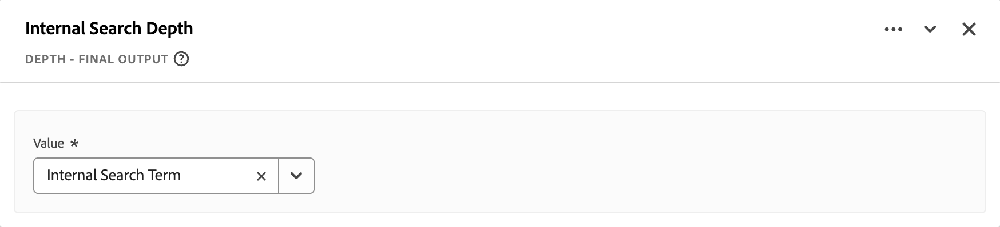

# 衍生欄位 {#derived-fields}

>[!CONTEXTUALHELP]
>id="dataview_derivedfields"
>title="衍生欄位"
>abstract="衍生欄位可讓您透過可自訂的規則產生器，迅速定義資料操作。您接著可以將衍生欄位用作為 Workspace 中的元件 (量度或維度)，甚至進一步在資料檢視中定義為元件。"

派生欄位是 Adob&#x200B;&#x200B;e Customer Journey Analytics 中即時報告功能的重要層面。衍生欄位可讓您透過可自訂的規則產生器，迅速定義 (通常是複雜的) 資料操作。然後，您可以使用作為 [Workspace](../../analysis-workspace/home.md) 元件 (量度或維度) 的衍生欄位，或甚至進一步將衍生欄位定義為[資料檢視](../data-views.md)中的元件。

與在 Customer Journey Analytics 之外其他位置內轉換或操作您的資料相比，派生欄位可以節省大量時間和精力。例如[資料準備](https://experienceleague.adobe.com/docs/experience-platform/data-prep/home.html?lang=zh-Hant)、[資料蒸餾器](https://experienceleague.adobe.com/docs/experience-platform/query/data-distiller/overview.html?lang=zh-Hant)，或在您自己的擷取轉換載入 (ETL) / 擷取載入轉換 (ELT) 流程中。

衍生欄位是在[資料檢視](../data-views.md)內定義，且是根據一組定義為規則的函數，並套用於適用的標準和/或結構描述欄位。

>[!NOTE]
>
>[標準元件](../component-reference.md)已繫結至事件資料集並與之建立關聯。 因此，作為衍生欄位一部分的標準元件僅適用於事件資料集中的資料。
>

範例使用案例為：

- 定義一個衍生的頁面名稱欄位，將不當收集的頁面名稱值修正為正確的頁面名稱值。

- 定義一個派生的行銷管道欄位，根據一個或多個條件 (例如 URL 參數、頁面 URL、頁面名稱) 確定適當的行銷管道。

只有衍生欄位中的事件資料集才支援標準元件。

## 衍生欄位介面 {#interface}

當您建立或編輯衍生欄位時，您可以使用衍生欄位介面。

|  | 名稱 | 說明 |
|---------|----------|--------|
| 1 | **選取器** | 您可以使用選取器區域來選取函數、函數範本、結構描述欄位或標準欄位，並將其拖放至規則產生器上。 使用下拉式選單在其間選取：   [!UICONTROL 函數] - 適用清單 [函數](#function-reference),   [!UICONTROL 函數範本] - 適用清單 [函數範本](#function-templates),    [!UICONTROL 結構描述欄位] - 適用清單，來自：資料集類別 (事件、設定檔、查閱) 和先前定義的衍生欄位,以及  [!UICONTROL 標準欄位] - 標準適用欄位 (如 Platform 資料集 ID)。選取器中僅顯示字串和數字標準欄位。如果函數支援其他資料類型，則可以為規則介面內的值或欄位選取有這些其他資料類型的標準欄位。 您可以使用 「搜尋」框來搜尋函數、函數範本、模式和標準欄位。 您可以透過選取  篩選器來篩選選取的物件清單，並在「[!UICONTROL 欄位篩選依據]」對話框中篩選和指定篩選器。您可以使用每個篩選器的來輕鬆刪除篩選器。 |
| 2 | **規則產生器** | 您可以使用一個或多個規則按順序建立衍生欄位。規則是一項功能的具體實施，因此一定只與一個功能相關聯。您可以將函數拖放至規則產生器中來建立規則。函數類型會確定規則介面。 如需詳細資訊，請參閱「[規則介面](#rule-interface)」。 您可以在規則產生器中已有的規則的開始、結束或之間插入函數。規則產生器中的最後一條規則可決定洐生欄位的最終輸出。 |
| 3 | **[!UICONTROL **&#x200B;欄位設定&#x200B;**]** | 您可以命名和描述您的派生欄位並檢查其欄位類型。 |
| 4 | **[!UICONTROL **&#x200B;最終輸出&#x200B;**]** | 此區域是根據過去 30 天的資料以及您對規則產生器中的衍生欄位所做的更改，顯示即時更新的輸出值預覽。 |

{style="table-layout:auto"}

## 欄位範本精靈 {#wizard}

當您首次存取衍生欄位介面時，將顯示「[!UICONTROL 從欄位範本開始]」精靈。

1. 選取最能描述您要建立的欄位類型範本。
2. 選取「**[!UICONTROL **&#x200B;選取&#x200B;**]**」按鈕並繼續。

您的衍生欄位對話框中填入了您選取的欄位類型所需或有用的規則 (和功能)。有關可用範本的更多資訊，請參閱「[函數範本](#function-templates)」。

## 規則介面 {#rules}

當您在規則產生器中定義規則時，您會使用規則介面。

|  | 名稱 | 說明 |
|---------|----------|--------|
| A | **規則名稱** | 依預設，規則名稱為「**規則 X**」(X 是指序列號碼)。若要編輯規則的名稱，請選取其名稱並輸入新名稱，例如 `Query Parameter`。 |
| B | **函數名稱** | 為規則選取的函數名稱，例如 [!UICONTROL URL PARSE]。當函數位於函數序列中的最後一個，並可確定最終的輸出值時，函數名稱後面會跟著 [!UICONTROL - FINAL OUTPUT]，例如 [!UICONTROL URL PARSE - FINAL OUTPUT]。 若要顯示包含有關該功能的更多資訊快顯視窗，請選取。 |
| C | **規則說明** | 您可以選擇為規則新增說明。 選取「」，然後選取「**[!UICONTROL **&#x200B;新增說明&#x200B;**]**&#x200B;以新增說明，或選取「**[!UICONTROL **&#x200B;編輯說明&#x200B;**]**」以編輯現有說明。 使用編輯器輸入說明。您可以使用工具列來格式化文字 (使用樣式選擇器、粗體、斜體、底線、右、左、居中、顏色、數字清單、項目符號清單) 並新增外部資訊連結。 若要完成編輯說明，請按一下編輯器外部。 |
| D | **功能區域** | 定義函數的邏輯。介面取決於函數類型。[!UICONTROL 欄位]或[!UICONTROL 值]的下拉式功能表，會根據函式預期的輸入型別，顯示所有可用的欄位類別（規則、標準欄位、欄位）。 或者，您可以將欄位從結構描述和標準欄位選擇器拖放至欄位或值上。當拖曳的欄位是來自查詢資料集時，查詢函數會自動插入您定義的函數之前。 請參閱「[函數引用](#function-reference)」，了解支援的每個功能詳細資訊。 |

{style="table-layout:auto"}

## 建立衍生欄位 {#create}

1. 選取現有的資料檢視或建立資料檢視。請參閱「[資料檢視](../data-views.md)」，了解更多資訊。

2. 選取資料檢視的「**[!UICONTROL **&#x200B;元件&#x200B;**]**」索引標籤。

3. 從左側邊欄，選取「**[!UICONTROL **&#x200B;建立派生欄位&#x200B;**]**」。

4. 若要定義洐生欄位，請使用「[!UICONTROL 建立洐生欄位]」介面.請參閱「[衍生欄位介面](#derived-field-interface)」。

   若要儲存新的衍生欄位，請選取「**[!UICONTROL **&#x200B;儲存&#x200B;**]**」。

5. 您新的洐生欄位將會加入「[!UICONTROL 派生欄位 >] 容器」中，並作為資料檢視左側邊欄中的&#x200B;**[!UICONTROL **&#x200B;結構描述&#x200B;**]**&#x200B;的一部分。

## 編輯衍生欄位 {#edit}

1. 選取現有的資料檢視。請參閱「[資料檢視](../data-views.md)」，了解更多資訊。

2. 選取資料檢視的「**[!UICONTROL **&#x200B;元件&#x200B;**]**」索引標籤。

3. 在左側「[!UICONTROL 連線]」窗格中，選取「**[!UICONTROL **&#x200B;結構描述欄位&#x200B;**]**」索引標籤。

4. 選取「**[!UICONTROL **&#x200B;衍生欄位 >**]**」容器。

5. 將滑鼠停留在所要編輯的衍生欄位上，然後選取「」。

6. 若要編輯衍生欄位，請使用「[!UICONTROL 編輯衍生欄位]」介面.請參閱「[衍生欄位介面](#derived-field-interface)」。

   - 選取「**[!UICONTROL **&#x200B;儲存&#x200B;**]**」，儲存您已更新的衍生欄位。

   - 選取「**[!UICONTROL **&#x200B;取消&#x200B;**]**」，取消對衍生欄位所做的任何變更。

   - 選取「**[!UICONTROL **&#x200B;另存新檔&#x200B;**]**」，將衍生欄位儲存為新的衍生欄位。新的衍生欄位名稱與原始編輯的衍生欄位名稱相同，並在名稱中加入 `(copy)`。

或者，如果您已使用衍生欄位作為資料檢視中維度或量度的元件：

1. 選取該元件。請注意，元件的名稱可能與衍生欄位的名稱不同。

1. 在元件面板中，選取 ，位於結構描述名稱下方、在您的衍生欄位旁邊。

1. 若要編輯衍生欄位，請使用「[!UICONTROL 編輯衍生欄位]」介面.請參閱「[衍生欄位介面](#derived-field-interface)」。

   - 選取「**[!UICONTROL **&#x200B;儲存&#x200B;**]**」，儲存您已更新的衍生欄位。

   - 選取「**[!UICONTROL **&#x200B;取消&#x200B;**]**」，取消對衍生欄位所做的任何變更。

   - 選取「**[!UICONTROL **&#x200B;另存新檔&#x200B;**]**」，將衍生欄位儲存為新的衍生欄位。新的衍生欄位名稱與原始編輯的衍生欄位名稱相同，並在名稱中加入 `(copy)`。

## 刪除衍生欄位 {#delete}

1. 選取現有的資料檢視。請參閱「[資料檢視](../data-views.md)」，了解更多資訊。

2. 選取資料檢視的「**[!UICONTROL **&#x200B;元件&#x200B;**]**」索引標籤。

3. 在「[!UICONTROL 連線]」窗格中，選取「**[!UICONTROL **&#x200B;結構描述&#x200B;**]**」索引標籤。

4. 選取「**[!UICONTROL **&#x200B;衍生欄位 >**]**」容器。

5. 將滑鼠停留在所要删除的衍生欄位上，然後選取「」。

6. 在「[!UICONTROL 編輯衍生欄位]」介面中，選取「**[!UICONTROL 刪除]**」。

   「[!UICONTROL 刪除元件]」對話框會要求您確認刪除。考慮資料檢視外面的衍生欄位可能有任何外部參考。

   - 選取「**[!UICONTROL **&#x200B;繼續&#x200B;**]**」，刪除衍生欄位。

或者，如果您已使用衍生欄位作為資料檢視中維度或量度的元件：

1. 選取該元件。請注意，元件的名稱可能與衍生欄位的名稱不同。

1. 在元件面板中，選取 ，位於結構描述名稱下方、在您的衍生欄位旁邊。

1. 在「[!UICONTROL 編輯衍生欄位]」介面中，選取「**[!UICONTROL 刪除]**」。

   「[!UICONTROL 刪除元件]」對話框會要求您確認刪除。考慮資料檢視外面的衍生欄位可能有任何外部參考。

   - 選取「**[!UICONTROL **&#x200B;繼續&#x200B;**]**」，刪除衍生欄位。

>[!NOTE]
>
>衍生欄位的管理是從 Customer Journey Analytics 中的連線層級進行。對於與該連線關聯且在任何資料檢視內的衍生欄位，任何所做的變更都會在所有這些關聯的資料檢視中套用。

## 函數範本 {#templates}

若要快速建立特定使用案例的衍生欄位，可以使用函數範本。這些函數範本可以從衍生欄位介面中的選擇器區域存取，或是會在「[!UICONTROL 從欄位範本開始]」精靈中首次使用時顯示。

### 行銷管道 {#mchannel}

此函數範本是使用一組規則集合來建立行銷管道。

+++ 詳細資料

若要使用範本，您必須為範本中規則所屬列出的每個函數指定正確的參數。如需詳細資訊，請參閱「[函數引用](#function-reference)」。

+++

### 退回數 {#bounces}

此函數範本是使用一組規則集合來識別網站退回。

+++ 詳細資料

{{select-package}}

若要使用範本，您必須為範本中規則所屬列出的每個函數指定正確的參數。如需詳細資訊，請參閱「[函數引用](#function-reference)」。

+++

### 多維度合併 {#multi-dim}

此函數範本會將兩個值合併為一個值。

+++ 詳細資料

{{select-package}}

若要使用範本，您必須為範本中規則所屬列出的每個函數指定正確的參數。如需詳細資訊，請參閱「[函數引用](#function-reference)」。

+++

### 易記的資料集名稱 {#friendlyname}

此函數範本會提供可讀取的資料集名稱。

+++ 詳細資料

{{select-package}}

若要使用範本，您必須為範本中規則所屬列出的每個函數指定正確的參數。如需詳細資訊，請參閱「[函數引用](#function-reference)」。

+++

### URL 中的頁面名稱 {#pagename}

此函數範本會建立一個簡單的頁面名稱。

+++ 詳細資料

{{select-package}}

若要使用範本，您必須為範本中規則所屬列出的每個函數指定正確的參數。如需詳細資訊，請參閱「[函數引用](#function-reference)」。

+++

### 假期季節 {#holiday}

此函數範本會對一年中的關鍵時間進行分類。

+++ 詳細資料

{{select-package}}

若要使用範本，您必須為範本中規則所屬列出的每個函數指定正確的參數。如需詳細資訊，請參閱「[函數引用](#function-reference)」。

+++

### 每月目標 {#goals}

此函數範本會設定自訂的每月目標。

+++ 詳細資料

{{select-package}}

若要使用範本，您必須為範本中規則所屬列出的每個函數指定正確的參數。如需詳細資訊，請參閱「[函數引用](#function-reference)」。

+++

### 取得分隔清單中的所有值 {#allvalues}

此函數範本會將有限清單轉換為陣列。

+++ 詳細資料

{{select-package}}

若要使用範本，您必須為範本中規則所屬列出的每個函數指定正確的參數。如需詳細資訊，請參閱「[函數引用](#function-reference)」。

+++

### 取得分隔清單中的第一個值 {#firstvalue}

此函數範本會取得分隔符號清單中的第一個值。

+++ 詳細資料

{{select-package}}

若要使用範本，您必須為範本中規則所屬列出的每個函數指定正確的參數。如需詳細資訊，請參閱「[函數引用](#function-reference)」。

+++

### 取得分隔清單中的最後一個值 {#lastvalue}

此函數範本會取得分隔符號清單中的最後一個值。

+++ 詳細資料

{{select-package}}

若要使用範本，您必須為範本中規則所屬列出的每個函數指定正確的參數。如需詳細資訊，請參閱「[函數引用](#function-reference)」。

+++

### 網域名稱 {#domain}

此函數範本會使用規則運算式來擷取網域名稱。

+++ 詳細資料

{{select-package}}

若要使用範本，您必須為範本中規則所屬列出的每個函數指定正確的參數。如需詳細資訊，請參閱「[函數引用](#function-reference)」。

+++

### 取得查詢字串參數 {#querystring}

此函數範本會擷取查詢字串值。

+++ 詳細資料

{{select-package}}

若要使用範本，您必須為範本中規則所屬列出的每個函數指定正確的參數。如需詳細資訊，請參閱「[函數引用](#function-reference)」。

+++

### 轉變欄位 {#transition}

此函數範本會將報告從一個欄位轉變到另一個欄位。

+++ 詳細資料

{{select-package}}

若要使用範本，您必須為範本中規則所屬列出的每個函數指定正確的參數。如需詳細資訊，請參閱「[函數引用](#function-reference)」。

+++

### 簡單的機器人偵測 {#botdetection}

此函數範本會實施輕度機器人識別。

+++ 詳細資料

{{select-package}}

若要使用範本，您必須為範本中規則所屬列出的每個函數指定正確的參數。如需詳細資訊，請參閱「[函數引用](#function-reference)」。

+++

### 退出連結 {#exit}

此函數範本會識別工作階段中最後進行的連結點擊。

+++ 詳細資料

{{select-package}}

若要使用範本，您必須為範本中規則所屬列出的每個函數指定正確的參數。如需詳細資訊，請參閱「[函數引用](#function-reference)」。

+++

### 下載連結 {#download}

此函數範本會標記常見的下載連結。

+++ 詳細資料

{{select-package}}

若要使用範本，您必須為範本中規則所屬列出的每個函數指定正確的參數。如需詳細資訊，請參閱「[函數引用](#function-reference)」。

+++

### 州緯度 {#state-latitude}

此函式範本取得美國狀態的緯度，精確度為5位數。

+++ 詳細資料

{{select-package}}

若要使用範本，您必須為範本中規則所屬列出的每個函數指定正確的參數。如需詳細資訊，請參閱「[函數引用](#function-reference)」。

+++

### 州經度 {#state-longitude}

此函式範本取得US狀態的經度，精確度為5位數。

+++ 詳細資料

{{select-package}}

若要使用範本，您必須為範本中規則所屬列出的每個函數指定正確的參數。如需詳細資訊，請參閱「[函數引用](#function-reference)」。

+++

<!--

+++ Data clean up template

>[!WARNING]
>
>Could not find any information on this template.
+++

-->

## 函數引用 {#functionref}

{{select-package}}

對於每個支援的函數，請參閱以下詳細資訊：

- 規格：
   - 輸入資料類型：支援的資料類型，
   - 輸入：可能輸入的值，
   - 包含的運算子：此功能支援的運算子 (如果有)，
   - 限制：套用於此特定函數的限制，
   - 輸出。

- 使用案例，包括：
   - 定義衍生欄位以前的資料，
   - 如何定義衍生欄位，
   - 定義衍生欄位以後的資料。

- 限制 (如果適用)。

<!-- CASE WHEN -->

### 情況 {#casewhen}

>[!CONTEXTUALHELP]
>id="dataview_derivedfields_casewhen"
>title="情況"
>abstract="此函數提供了根據一個或多個欄位中定義的標準來套用條件的功能。然後，使用這些標準根據條件的順序定義新衍生欄位中的值。"

根據一個或多個欄位明訂的標準來套用條件。然後，使用這些標準來定義新衍生欄位中的值 (根據條件序列)。

+++ 詳細資料

## 規格 {#casewhen-io}

| 輸入資料類型 | 輸入 | 包含的運算子 | 限制 | 輸出 |
|---|---|---|---|---|
| <ul><li>字串</li><li>數值</li><li>日期</li></ul> | <ul><li>[!UICONTROL If], [!UICONTROL Else If] 容器：
<ul><li>[!UICONTROL 值]</li><ul><li>規則</li><li>標準欄位</li><li>欄位</li></ul><li>[!UICONTROL 標準] (查看包含的運算子，根據選取值的類型)</li></ul></li><li>[!UICONTROL 然後將值設定為]， [!UICONTROL 否則將值設定為]：
<ul><li>[!UICONTROL 值]</li><ul><li>規則</li><li>標準欄位</li><li>欄位</li></ul></ul></li></ul> | 
字串
<ul><li>等於</li><li>等於任何字詞</li><li>包含片語</li><li>包含任何字詞</li><li>包含所有字詞</li><li>開始於</li><li>開頭為任何字詞</li><li>終止於</li><li>結尾為任何字詞</li><li>不等於</li><li>不等於任何字詞</li><li>不包含此片語</li><li>不包含任何字詞</li><li>不包含所有字詞</li><li>不開始於</li><li>不以任何字詞開頭</li><li>不終止於</li><li>未以任何字詞結尾</li><li>已設定</li><li>未設定</li></ul>
數值
<ul><li>等於</li><li>不等於</li><li>大於</li><li>大於或等於</li><li>小於</li><li>小於或等於</li><li>已設定</li><li>未設定</li></ul>
日期
<ul><li>等於</li><li>不等於</li><li>晚於</li><li>晚於或等於</li><li>早於</li><li>早於或等於</li><li>已設定</li><li>未設定</li></ul> | <ul><li>每個衍生欄位有 5 個函數</li><li>每個衍生欄位有 200 個 [運算子](#operators)。單一運算子的範例是「引用網域包含 google」。 </li></ul> | 
新的衍生欄位
 |

{style="table-layout:auto"}

## 使用案例 1 {#casewhen-uc1}

您想要定義規則以識別各種行銷管道，方法是套用階層式邏輯以便將行銷管道欄位設定為適當的值，：

- 如果引用來源是來自搜尋引擎，且頁面有查詢字串值`cid` 且其中含有 `ps_` 時，行銷管道應標示為「[!DNL *付費搜尋*]」。
- 如果引用來源來自搜尋引擎，且頁面沒有查詢字串 `cid`，則行銷管道應標示為「[!DNL *免費搜尋*]」。
- 如果頁面有查詢字串值 `cid` 且其中含有 `em_`，則行銷管道應標示為「[!DNL *電子郵件*]」。
- 如果頁面有查詢字串值 `cid` 且其中含有 `ds_`，則行銷管道應標示為「[!DNL *顯示廣告*]」。
- 如果頁面有查詢字串值 `cid` 且其中含有 `so_`，則行銷管道應標示為「[!DNL *付費社交媒體*]」。
- 如果引用來源來自 [!DNL twitter.com]、 [!DNL facebook.com]、 [!DNL linkedin.com]或 [!DNL tiktok.com]的反向連結網域，則行銷管道應標示為「[!DNL *免費社交媒體*]」。
- 若以上規則皆不符合，則行銷管道應標示為「[!DNL *其他反向連結*]」。

如果您的網站收到以下範例事件，其中包含[!UICONTROL 反向連結]和[!UICONTROL 頁面網址]，則這些事件應標示如下：

| [!DNL Event] | [!DNL Referrer] | [!DNL Page URL] | [!DNL Marketing Channel] |
|:--:|----|----|----|
| 1 | `https://facebook.com` | `https://site.com/home` | [!DNL Natural Social] |
| 2 | `https://abc.com` | `https://site.com/?cid=ds_12345678` | [!DNL Display] |
| 3 | | `https://site.com/?cid=em_12345678` | [!DNL Email] |
| 4 | `https://google.com` | `https://site.com/?cid=ps_abc098765` | [!DNL Paid Search] |
| 5 | `https://google.com` | `https://site.com/?cid=em_765544332` | [!DNL Email] |
| 6 | `https://google.com` |  | [!DNL Natural Search] |

{style="table-layout:auto"}

### 在之前的資料 {#casewhen-uc1-databefore}

| [!DNL Referrer] | [!DNL Page URL] |
|----|----|
| `https://facebook.com` | `https://site.com/home` |
| `https://abc.com` | `https://site.com/?cid=ds_12345678` |
|  | `https://site.com/?cid=em_12345678` |
| `https://google.com` | `https://site.com/?cid=ps_abc098765` |
| `https://google.com` | `https://site.com/?cid=em_765544332` |
| `https://google.com` | |

{style="table-layout:auto"}

### 衍生欄位 {#casewhen-uc1-derivedfield}

您定義一個 `Marketing Channel` 衍生欄位。您使用 [!UICONTROL CASE WHEN] 函數來定義基於 `Page URL` 和 `Referring URL` 欄位的現有值為建立值的規則。

請注意，使用函數 [!UICONTROL URL PARSE] 來定義規則，以便在套用 [!UICONTROL CASE WHEN]  規則之前取得 `Page Url` 和 `Referring Url` 的值。

### 其後的資料 {#casewhen-uc1-dataafter}

| [!DNL Marketing Channel] |
|----|
| [!DNL Natural Social] |
| [!DNL Display] |
| [!DNL Email] |
| [!DNL Paid Search] |
| [!DNL Email] |
| [!DNL Natural Search] |

{style="table-layout:auto"}

## 使用案例 2 {#casewhen-uc2}

您已經在您的 [!DNL Product Finding Methods] 維度內收集了幾種不同變化版的搜尋。若要了解搜尋與瀏覽的整體效能，您必須花大量時間以手動方式合併結果。

您的網站會為您的 [!DNL Product Finding Methods] 維度收集以下數值。最後，所有這些數值都表明一種搜尋。

| 收集值 | 實際值 |
|---|---|
| [!DNL search p13n_no] | [!DNL search] |
| [!DNL search p13n_yes] | [!DNL search] |
| [!DNL search refine p13n_no] | [!DNL search] |
| [!DNL search refine p13n_yes] | [!DNL search] |
| [!DNL search redirect p13n_yes] | [!DNL search] |
| [!DNL search-redirect] | [!DNL search] |

{style="table-layout:auto"}

### 之前的資料 {#casewhen-uc2-databefore}

| [!DNL Product Finding Methods] |
|----|
| [!DNL search p13_no] |
| [!DNL search p13_yes] |
| [!DNL browse] |
| [!DNL search refine p13_no] |
| [!DNL search refine p13_yes] |
| [!DNL browse] |
| [!DNL search redirect p13_yes] |
| [!DNL search-redirect] |
| [!DNL browse] |

{style="table-layout:auto"}

### 衍生欄位 {#casewhen-uc2-derivedfield}

您定義一個 `Product Finding Methods (new)` 衍生欄位。您在規則產生器中建立以下 [!UICONTROL CASE WHEN] 規則。這些規則會將邏輯套用至所有可能變化版本的舊「[!UICONTROL 產品尋找方法]」欄位值 (`search`和`browse`)，且使用[!UICONTROL 包含片語]準則。

### 其後的資料 {#casewhen-uc2-dataafter}

| [!DNL Product Finding Methods (new)] |
|----|
| [!DNL search] |
| [!DNL search] |
| [!DNL browse] |
| [!DNL search] |
| [!DNL search] |
| [!DNL browse] |
| [!DNL search] |
| [!DNL search] |
| [!DNL browse] |

{style="table-layout:auto"}

## 使用案例 3 {#casewhen-uc3}

您在旅遊公司工作，您希望為已預訂行程的旅行時長進行分組，以便您提出關於分組的旅行時長報告。

假設：

- 公司正在將旅行時長收集至數值欄位中。
- 他們希望將 1-3 天旅行時長放入名為 [!DNL short trip]‘ 的分組
- 他們希望將 4-7 天旅行時長放入名為 [!DNL medium trip]‘ 的分組
- 他們希望將 8+ 天旅行時長放入名為 [!DNL long trip]‘ 的分組
- 132 次旅行預訂為 1 天時長
- 110 次旅行預訂為 2 天時長
- 105 次旅行預訂為 3 天時長
- 99 次旅行預訂為 4 天時長
- 92 次旅行預訂為 5 天時長
- 85 次旅行預訂為 6 天時長
- 82 次旅行預訂為 7 天時長
- 78 次旅行預訂為 8 天時長
- 50 次旅行預訂為 9 天時長
- 44 次旅行預訂為 10 天時長
- 38 次旅行預訂為 11 天時長
- 31 次旅行預訂為 12 天時長

您想要的報告應該如下：

| [!DNL Trip Duration Type] | [!DNL Bookings] |
|----|---:|
| [!DNL medium trip] | 358 |
| [!DNL short trip] | 347 |
| [!DNL long trip] | 241 |

{style="table-layout:auto"}

### 之前的資料 {#casewhen-uc3-databefore}

| [!DNL Trip Duration] |
|---:|
| 1 |
| 12 |
| 3 |
| 6 |
| 4 |
| 8 |
| 6 |
| 2 |
| 1 |
| 2 |
| 21 |
| 8 |

### 衍生欄位 {#casewhen-uc3-derivedfield}

您定義一個 `Trip Duration (bucketed)` 衍生欄位。您在規則產生器中建立以下 [!UICONTROL CASE WHEN] 規則。此規則會套用邏輯將舊的[!UICONTROL 旅行時長]欄位值分為三個值： `short trip`、`medium  trip`和`long trip`。

### 其後的資料 {#casewhen-uc3-dataafter}

| [!DNL Trip Duration (bucketed)] |
|---|
| [!DNL short trip] |
| [!DNL long trip] |
| [!DNL short trip] |
| [!DNL medium trip] |
| [!DNL medium trip] |
| [!DNL long trip] |
| [!DNL medium trip] |
| [!DNL short trip] |
| [!DNL short trip] |
| [!DNL short trip] |
| [!DNL long trip] |
| [!DNL long trip] |

## 詳細資訊 {#casewhen-more-info}

Customer Journey Analytics 使用巢狀容器結構，該結構仿照 Adob&#x200B;&#x200B;e Experience Platform 的 [XDM](https://experienceleague.adobe.com/docs/experience-platform/xdm/home.html?lang=zh-hant) (體驗資料模型)。如需詳細背景資訊，請參閱[容器](../create-dataview.md#containers)和[區段容器](/help/components/segments/seg-overview.md#containers)。 這種容器模型雖然本質上很靈活，但在使用規則產生器時會施加一些限制。

Customer Journey Analytics 會使用以下預設容器模型：

以下限制適用，且當&#x200B;*選取* 和&#x200B;*設定* 值時會強制執行。

|  | 限制 |
|:---:|----|
| **A** | 您在規則中相同的 [!UICONTROL If]、[!UICONTROL Else If] 條件控制語句 (使用 [!UICONTROL And] 或 [!UICONTROL Or]) 內&#x200B;*選取*&#x200B;的數值必須源自相同的容器，且可以屬於任何類型 (、數值  等)。  |
| **B** | 您在整個規則中&#x200B;*設定*&#x200B;的所有值必須來自同一個容器，並且有相同的類型或相同類型的衍生值。    |
| **C** | 您在規則中整個 [!UICONTROL If]、[!UICONTROL Else If] 條件控制語句&#x200B;*選取*&#x200B;的數值&#x200B;*不*&#x200B;一定要源自相同的容器，且&#x200B;*不*&#x200B;一定要屬於相同的類型。   |

{style="table-layout:auto"}

+++

<!-- CLASSIFY -->

### 分類 {#classify}

>[!CONTEXTUALHELP]
>id="dataview_derivedfields_classify"
>title="分類"
>abstract="此函數提供了定義一組值的功能，這些值可透過文字輸入取代為對應的值。"

定義一組值，這些值會被新衍生欄位中的對應值取代。

+++ 詳細資料

## 規格 {#classify-io}

| 輸入資料類型 | 輸入 | 包含的運算子 | 限制 | 輸出 |
|---|---|---|---|---|
| <ul><li>字串</li><li>數值</li><li>日期</li></ul> | <ul><li>[!UICONTROL 要分類的欄位]：<ul><li>規則</li><li>標準欄位</li><li>欄位</li></ul></li><li>[!UICONTROL 當值等於]且[!UICONTROL 取代值為]：
<ul><li>字串</li></ul><li>顯示原始值<ul><li>布林值</li></ul></li></ul> | 
不適用
 | <ul><li>每個衍生欄位有 5 個函數</li><li>每個衍生欄位有 200 個 [運算子](#operators)。[!UICONTROL 「當值等於原始值」] [!UICONTROL 「以新值取代值」]的每個項目都被視為是運算子。</li></ul> | 
新的衍生欄位
 |

{style="table-layout:auto"}

## 使用案例 1 {#classify-uc1}

您有一個 CSV 檔案，其中包含 `hotelID` 的關鍵欄，以及與 `hotelID` 相關的一個或多個附加欄： `city`、`rooms`、`hotel name`。
您正在一個維度中收集 [!DNL Hotel ID]，但想要建立一個衍生自`hotelID` 的 [!DNL Hotel Name] 維度。

**CSV 檔案結構和內容**

| [!DNL hotelID] | [!DNL city] | [!DNL rooms] | [!DNL hotel name] |
|---|---|---:|---|
| [!DNL SLC123] | [!DNL Salt Lake City] | 40 | [!DNL SLC Downtown] |
| [!DNL LAX342] | [!DNL Los Angeles] | 60 | [!DNL LA Airport] |
| [!DNL SFO456] | [!DNL San Francisco] | 75 | [!DNL Market Street] |
| [!DNL AMS789] | [!DNL Amsterdam] | 50 | [!DNL Okura] |

{style="table-layout:auto"}

**目前的報告**

| [!DNL Hotel ID] | 產品檢視 |
|---|---:|
| [!DNL SLC123] | 200 |
| [!DNL LX342] | 198 |
| [!DNL SFO456] | 190 |
| [!DNL AMS789] | 150 |

{style="table-layout:auto"}

**所需報告**

| [!DNL Hotel Name] | 產品檢視 |
|----|----:|
| [!DNL SLC Downtown] | 200 |
| [!DNL LA Airport] | 198 |
| [!DNL Market Street] | 190 |

{style="table-layout:auto"}

### 之前的資料 {#classify-uc1-databefore}

| [!DNL Hotel ID] |
|----|
| [!DNL SLC123] |
| [!DNL LAX342] |
| [!DNL SFO456] |
| [!DNL AMS789] |

{style="table-layout:auto"}

### 衍生欄位 {#classify-uc1-derivedfield}

您定義一個 `Hotel Name` 衍生欄位。您使用 [!UICONTROL CLASSIFY] 函數定義一個規則，您可以在其中對 [!UICONTROL Hotel ID] 欄位的值進行分類並用新值取代。

如果要包含未&#x200B;&#x200B;定義為要分類的數值一部分的原始值 (例如，Hotel ID AMS789)，請確定您會選取「**[!UICONTROL 顯示原始值]**」。這可確保 AMS789 是衍生欄位輸出的一部分，雖然該值未分類。

### 其後的資料 {#classify-uc1-dataafter}

| [!DNL Hotel Name] |
|----|
| [!DNL SLC Downtown] |
| [!DNL LA Airport] |
| [!DNL Market Street] |

{style="table-layout:auto"}

## 使用案例 2 {#classify-uc2}

您收集了多個頁面的 URL，而不是友善的頁面名稱。這種混合的數值集合破壞了報告。

### 之前的資料 {#classify-uc2-databefore}

| [!DNL Page Name] |
|---|
| [!DNL Home Page] |
| [!DNL Flight Search] |
| `http://www.adobetravel.ca/Hotel-Search` |
| `https://www.adobetravel.com/Package-Search` |
| [!DNL Deals & Offers] |
| `http://www.adobetravel.ca/user/reviews` |
| `https://www.adobetravel.com.br/Generate-Quote/preview` |

{style="table-layout:auto"}

### 衍生欄位 {#classify-uc2-derivedfield}

您定義一個 `Page Name (updated)` 衍生欄位。您使用 [!UICONTROL CLASSIFY] 函數定義一條規則，您可以在其中對現有 [!UICONTROL 頁面名稱] 欄位的值進行分類，並以更新後的正確值取代。

### 其後的資料 {#classify-uc2-dataafter}

| [!DNL Page Name (updated)] |
|---|
| [!DNL Home Page] |
| [!DNL Flight Search] |
| [!DNL Hotel Search] |
| [!DNL Package Search] |
| [!DNL Deals & Offers] |
| [!DNL Reviews] |
| [!DNL Generate Quote] |

## 詳細資訊 {#classify-moreinfo}

分類規則介面還提供以下附加功能：

- 若要快速清除所有表格值，請選取  **[!UICONTROL 清除所有表格值]**。
- 若要上傳 CSV 文件且其中含有「當值相等於」的原始值和「取代值為」的新值，請選取  **[!UICONTROL 「上傳 CSV」]**。
- 若要下載用來建立包含原始值和新值的 CSV 檔案範本，請選取  **[!UICONTROL 「下載 CSV 範本」]**。
- 若要下載 CSV 檔案及規則介面中填入了所有原始值和新值，請選取  **[!UICONTROL 「下載 CSV 值」]**。

+++

<!-- CONCATENATE -->

### 串連 {#concatenate}

<!-- markdownlint-disable MD034 -->

>[!CONTEXTUALHELP]
>id="dataview_derivedfields_concatenate"
>title="串連"
>abstract="此函數提供將兩個或多個欄位、衍生欄位或使用者輸入字串值組合到具有已定義分隔符號的單一欄位的功能"

<!-- markdownlint-enable MD034 -->

將欄位值合併至具有定義分隔符號的單一新衍生欄位。

+++ 詳細資料

## 規格 {#concatenate-io}

| 輸入資料類型 | 輸入 | 包含的運算子 | 限制 | 輸出 |
|---|---|---|---|---|
| <ul><li>字串</li></ul> | <ul><li>[!UICONTROL 數值]:<ul><li>規則</li><li>標準欄位</li><li>欄位</li><li>字串</li></ul></li><li>[!UICONTROL 分隔符號]<ul><li>字串</li></ul></li> </ul> | 
不適用
 | 
每個衍生欄位有 2 個函數
 | 
新的衍生欄位
 |

{style="table-layout:auto"}

## 使用案例 {#concatenate-uc}

您目前收集出發地和目的地機場代碼作為單獨的欄位。您希望將這兩個欄位合併為一個維度，並以連字號 (-) 分隔。因此，您可以分析出發地和目的地的組合來確定預訂最多的航線。

假設：

- 原點值和目標值都收集在同一個表格中的不同欄位中。
- 使用者決定在值之間使用分隔符號 ‘-’。

假設發生以下預訂：

- 乘客 ABC123 預訂了鹽湖城 (SLC) 和奧蘭多 (MCO) 之間的航班
- 乘客 ABC456 預訂了鹽湖城 (SLC) 和洛杉磯 (LAX) 之間的航班
- 乘客 ABC789 預訂了鹽湖城 (SLC) 和西雅圖 (SEA) 之間的航班
- 乘客 ABC987 預訂了鹽湖城 (SLC) 和聖荷西 (SJO) 之間的航班
- 乘客 ABC654 預訂了鹽湖城 (SLC) 和奧蘭多 (MCO) 之間的航班

所需報告應該如下：

| 出發地 / 目的地 | 預訂 |
|----|---:|
| SLC-MCO | 2 |
| SLC-LAX | 1 |
| SLC-SEA | 1 |
| SLC-SJO | 1 |

{style="table-layout:auto"}

### 之前的資料 {#concatenate-uc-databefore}

| 出發地 | 目標 |
|----|---:|
| SLC | MCO |
| SLC | LAX |
| SLC | SEA |
| SLC | SJO |
| SLC | MCO |

{style="table-layout:auto"}

### 衍生欄位 {#concatenate-derivedfield}

您定義一個 `Origin - Destination` 衍生欄位。您使用 [!UICONTROL CONCATENATE] 函數定義一條規則，以使用`-`[!UICONTROL 分隔符號]來串連[!UICONTROL 出發地]和[!UICONTROL 目的地]欄位。

### 其後的資料 {#concatenate-dataafter}

| 出發地 - 目的地   (衍生欄位) |
|---|
| SLC-MCO |
| SLC-LAX |
| SLC-SEA |
| SLC-SJO |
| SLC-MCO |

{style="table-layout:auto"}

+++

<!-- DATE MATH -->

### 日期數學 {#datemath}

>[!CONTEXTUALHELP]
>id="dataview_derivedfields_datemath"
>title="日期數學"
>abstract="此函式提供傳回兩個日期或日期時間欄位之間差異的功能。 個人資料欄位（來自設定檔資料集）沒有&#x200B;**[!UICONTROL 傳回第一個]**&#x200B;和&#x200B;**[!UICONTROL 傳回最後一個的選項。]**。"

傳回兩個日期或兩個日期時間欄位之間的差異。

+++ 詳細資料

## 規格 {#datemath-io}

| 輸入資料類型 | 輸入 | 包含的運算子 | 限制 | 輸出 |
|---|---|---|---|---|
| <ul><li>日期</li><li>日期和時間</li></ul> | <ul><li>[!UICONTROL 範圍]<ul><li>事件</li><li>工作階段</li><li>人員</li></ul></li><li>[!UICONTROL 數值]:<ul><li>日期</li><li>日期時間</li><li>靜態日期（使用者輸入）</li><li>靜態日期時間（使用者輸入）</li><li>動態的日期<ul><li>今天</li></ul></li><li>動態日期時間<ul><li>現在</li></ul></li></ul></li><li>[!UICONTROL 粒度]：<ul><li>秒</li><li>分鐘</li><li>小時</li><li>日</li><li>週</li><li>月</li><li>季</li><li>年</li></ul></li><li>針對每個日期或日期時間傳回：<ul><li>第一個（在工作階段或人員內）</li><li>上次（在工作階段或人員內）</li></ul></li></ul> | 
不適用
 | 
每個衍生欄位有 2 個函數
 | 
新的衍生欄位
 |

{style="table-layout:auto"}

## 使用案例 1 {#datemath-uc1}

身為飯店公司的行銷分析師，您想要瞭解上週客戶簽到日期與預訂日期之間的天數差異。

### 衍生欄位 {#datemath-uc1-derivedfield}

您定義一個 `Days between booking and check-in` 衍生欄位。您使用[!UICONTROL DATE MATH]函式定義規則，以計算[!UICONTROL 預訂日期]與[!DNL Person]簽到日期[!UICONTROL 之間]範圍的天數。 您選取[!UICONTROL 天]作為[!UICONTROL 輸出粒度]。 而且您選取[!UICONTROL 傳回]預訂日期[!UICONTROL 和]簽到日期[!UICONTROL 的最後一個]，以確保計算中使用最後一個人員範圍的值。

## 使用案例 2 {#datemath-uc2}

身為實體店的行銷分析師，您想要瞭解客戶上次造訪商店是在多少天前。 您可以使用行動應用程式內的地理位置功能以及商店中的信標，擷取客戶的實體造訪。

### 衍生欄位 {#datemath-uc2-derivedfield}

您定義一個新的 `Days Since Visit To Shop` 衍生欄位。您使用[!UICONTROL DATE MATH]函式來定義規則，以計算自訂日期時間（您在[!UICONTROL Date]中指定）與[!UICONTROL 當地時間] （來自事件資料集的[!UICONTROL placeContext]欄位群組）之間的天數，其中具有[!UICONTROL 人員]的[!UICONTROL 重複資料刪除範圍]。 您選取「[!UICONTROL 傳回最後]」以確保計算中使用[!UICONTROL 當地時間]的最後一個人員範圍值。 選取「日」作為[!UICONTROL 輸出粒度]。

的熒幕擷圖

或者，您可以使用方便的「立即動態日期範圍」值，計算現在到[!UICONTROL 當地時間]之間的時間（從事件資料集的[!UICONTROL placeContext]欄位群組）

的熒幕擷圖

## 使用案例 3 {#datemath-uc3}

您想要瞭解工作階段中的客戶下訂單前的搜尋時間（分鐘）。

您定義新的`Time Between Search And Order In Minutes`衍生欄位，它是兩個[[!UICONTROL CASE WHEN]函式](#case-when)的結果，用來定義[!UICONTROL 搜尋時間]和[!UICONTROL 訂購時間]值。
然後使用這兩個值來計算差異，其中的[!UICONTROL DATE MATH]函式的[!UICONTROL 範圍]設定為[!UICONTROL 工作階段]，值設定為[!UICONTROL 搜尋時間]和[!UICONTROL 順序時間]，而[!UICONTROL 輸出粒度]設定為[!UICONTROL 分鐘]。 針對這兩個值，您選取[!UICONTROL 傳回第一個]，以確保傳回第一個[!UICONTROL 搜尋時間]和[!UICONTROL 訂購時間]。

的熒幕擷圖

## 詳細資訊 {#datemath-more-info}

當您選取以人員為基礎的（從設定檔資料集）欄位時，[!UICONTROL 傳回第一個]或[!UICONTROL 傳回最後一個]的選項無法使用。 以人員為基礎的欄位，個人的「日期」或「日期 — 時間」欄位只能有一個值。
+++

<!-- DEDUPLICATE -->

### 重複資料刪除 {#dedup}

>[!CONTEXTUALHELP]
>id="dataview_derivedfields_deduplicate"
>title="重複資料刪除"
>abstract="此函數提供了將欄位設定為僅在工作階段或個人層級不重複地計算值的功能。此外，重複資料刪除 ID 可用於確保根據特定 ID (例如購買 ID) 僅使用一個值 (第一個執行個體或最後一個執行個體)。"

避免多次計算同一個值。

+++ 詳細資料

## 規格 {#deduplicate-io}

| 輸入資料類型 | 輸入 | 包含的運算子 | 限制 | 輸出 |
|---|---|---|---|---|
| <ul><li>字串</li><li>數值</li></ul> | <ul><li>[!UICONTROL 數值]:<ul><li>規則</li><li>標準欄位</li><li>欄位</li><li>字串</li></ul></li><li>[!UICONTROL 範圍]<ul><li>個人</li><li>工作階段</li></ul></li><li>[!UICONTROL 重複資料刪除 ID]<ul><li>規則</li><li>標準欄位</li><li>欄位</li><li>字串</li></ul><li>[!UICONTROL 要保留的值]<ul><li>保留第一個執行個體</li><li>保留最後一個執行個體</li></ul></li></ul> | 
不適用
 | 
每個衍生欄位有 5 個函數
 | 
新的衍生欄位
 |

{style="table-layout:auto"}

## 使用案例 1 {#deduplicate-uc1}

您希望避免在使用者重新載入預訂確認頁面時計算重複收入。您可以在識別碼中使用預訂確認 ID，這樣在同一事件中收到時就不會再次計算這筆收入。

### 之前的資料 {#deduplicate-uc1-databefore}

| 預訂確認 ID &#39;&#39; | 收入 |
|----|---:|
| ABC123456789 | 359 |
| ABC123456789 | 359 |
| ABC123456789 | 359 |

{style="table-layout:auto"}

### 衍生欄位 {#deduplicate-uc1-derivedfield}

您定義一個 `Booking Confirmation` 衍生欄位。您使用 [!UICONTROL DEDUPLICATE] 函數定義一條規則，以使用[!UICONTROL 重複資料刪除 ID] [!UICONTROL 預訂確認 ID]對[!UICONTROL 範圍][!DNL Person]的[!UICONTROL 值][!DNL Booking]進行重複資料刪除。您選取「[!UICONTROL 保留第一個執行個體]」作為「[!UICONTROL 要保留的值]」。

### 其後的資料 {#deduplicate-uc1-dataafter}

| 預訂確認 ID | 收入 |
|----|---:|
| ABC123456789 | 359 |
| ABC123456789 | 0 |
| ABC123456789 | 0 |

{style="table-layout:auto"}

## 使用案例 2 {#deduplicate-uc2}

您可以使用事件作為外部行銷活動中活動點擊率的代理。重新載入和重新導向會導致事件量度膨脹。您希望對追蹤代碼維度進行重複資料刪除，以便僅收集第一個維度，並最大限度地減少事件重複計數。

### 之前的資料 {#deduplicate-uc2-databefore}

| 訪客 ID | 行銷管道 | 活動 |
|----|---|---:|
| ABC123 | 付費搜尋 | 1 |
| ABC123 | 付費搜尋 | 1 |
| ABC123 | 付費搜尋 | 1 |
| DEF123 | 電子郵件 | 1 |
| DEF123 | 電子郵件 | 1 |
| JKL123 | 免費搜尋 | 1 |
| JKL123 | 免費搜尋 | 1 |

{style="table-layout:auto"}

### 衍生欄位 {#deduplicate-uc2-derivedfield}

您定義一個新的 `Tracking Code (deduplicated)` 衍生欄位。您使用 [!UICONTROL DEDUPLICATE] 函數定義一條規則，以便對[!UICONTROL 追蹤代碼]進行重複資料刪除，其中有[!UICONTROL 工作階段]的[!UICONTROL 重複資料刪除範圍]，以及[!UICONTROL 保留第一個執行個體]作為「[!UICONTROL 要保留的值]」。

### 其後的資料 {#deduplicate-uc2-dataafter}

| 訪客 ID | 行銷管道 | 活動 |
|----|---|---:|
| ABC123 | 付費搜尋 | 1 |
| DEF123 | 電子郵件 | 1 |
| JKL123 | 免費搜尋 | 1 |

{style="table-layout:auto"}

+++

<!-- DEPTH -->

### 深度 {#depth}

>[!CONTEXTUALHELP]
>id="dataview_derivedfields_depth"
>title="深度"
>abstract="此函數可傳回任何欄位的深度，與事件深度標準元件的功能相似。"

傳回欄位深度，類似於現成可用的標準事件深度維度[&#128279;](/help/components/dimensions/overview.md#standard-dimensions)。

+++ 詳細資料

## 規格 {#depth-io}

| 輸入資料類型 | 輸入 | 包含的運算子 | 限制 | 輸出 |
|---|---|---|---|---|
| 任何 | 任何欄位 | 不適用 | 每個衍生欄位有 3 個函數 | 新的衍生欄位 |

{style="table-layout:auto"}

## 使用案例 {#depth-uc1}

您想要瞭解內部搜尋深度（您也可以將其解譯為搜尋次數）。 因此，您稍後可以使用內部搜尋深度，以劃分與特定搜尋深度相關的搜尋字詞。

### 衍生欄位 {#depth-uc1-derivedfield}

您定義一個新的 `Internal Search Depth` 衍生欄位。您使用[!UICONTROL DEPTH]函式定義規則來擷取[!UICONTROL 內部搜尋詞]的深度，並將其儲存在新的衍生欄位中。

深度規則熒幕擷圖

然後使用視覺效果中新衍生的欄位，在第一次搜尋時用來搜尋哪些辭彙。

深度規則熒幕擷圖

+++

<!-- FIND AND REPLACE -->

### 尋找並取代 {#find-and-replace}

<!-- markdownlint-disable MD034 -->

>[!CONTEXTUALHELP]
>id="dataview_derivedfields_findandreplace"
>title="尋找並取代"
>abstract="此函數提供了在選定欄位中尋找所有值，並將這些值取代為新衍生欄位中不同值的功能。"

尋找選定欄位中的所有值，並使用新衍生欄位中的其他值取代這些值。

+++ 詳細資料

## 規格 {#findreplace-io}

| 輸入資料類型 | 輸入 | 包含的運算子 | 限制 | 輸出 |
|---|---|---|---|---|
| <ul><li>字串</li></ul> | <ul><li>[!UICONTROL 值]<ul><li>規則</li><li>標準欄位</li><li>欄位</li></ul></li><li>[!UICONTROL 尋找所有]、 [!UICONTROL 並全部取代為]：<ul><li>字串</li></ul></li></ul></ul> | 
字串
<ul><li>[!UICONTROL 尋找所有]、 [!UICONTROL 並全部取代為]</li></ul> | 
每個衍生欄位有 5 個函數
 | 
新的衍生欄位
 |

{style="table-layout:auto"}

## 使用案例 {#findreplace-uc}

您已收到一些外部行銷管道報告的錯誤值，例如 `email%20 marketing` 而不是 `email marketing`。這些格式錯誤的值會破壞您的報告，讓您更難了解電子郵件功能的表現如何。您要將 `email%20marketing` 取代為 `email marketing`。

**原始報告**

| [!DNL External Marketing Channels] | [!DNL Sessions] |
|---|--:|
| [!DNL email marketing] | 500 |
| [!DNL email %20marketing] | 24 |

{style="table-layout:auto"}

**首選報告**

| [!DNL External Marketing Channels] | [!DNL Sessions] |
|---|--:|
| [!DNL email marketing] | 524 |

### 之前的資料 {#findreplace-uc-databefore}

| [!DNL External Marketing] |
|----|
| [!DNL email marketing] |
| [!DNL email%20marketing] |
| [!DNL email marketing] |
| [!DNL email marketing] |
| [!DNL email%20marketing] |

{style="table-layout:auto"}

### 衍生欄位 {#findreplace-uc-derivedfield}

您定義一個 `Email Marketing (updated)` 衍生欄位。您使用 [!UICONTROL FIND AND REPLACE] 函數定義一條規則，以尋找所有出現 `email%20marketing` 的地方並以 `email marketing` 取代。

### 其後的資料 {#findreplace-uc-dataafter}

| [!DNL External Marketing (updated)] |
|----|
| [!DNL email marketing] |
| [!DNL email marketing] |
| [!DNL email marketing] |
| [!DNL email marketing] |
| [!DNL email marketing] |

{style="table-layout:auto"}

+++

<!-- LOOKUP -->

### 查詢 {#lookup}

>[!CONTEXTUALHELP]
>id="dataview_derivedfields_lookup"
>title="查詢"
>abstract="此函數提供了使用資料集之間的比對索引鍵來使用查詢資料集中的欄位的功能。"

使用查詢資料集中的欄位來查詢值，並傳回新衍生欄位中的值或用於進一步的規則處理。

+++ 詳細資料

## 規格 {#lookup-io}

| 輸入資料類型 | 輸入 | 包含的運算子 | 限制 | 輸出 |
|---|---|---|---|---|
| <ul><li>字串</li><li>數值</li><li>日期</li></ul> | <ul><li>[!UICONTROL 要套用查詢的欄位]</li><ul><li>規則</li><li>標準欄位</li><li>欄位</li></ul><li>[!UICONTROL 查詢資料集]</li><ul><li>資料集</li></ul><li>[!UICONTROL 比對索引鍵]<ul><li>規則</li><li>欄位</li></ul></li><li>要傳回的值<ul><li>規則</li><li>欄位</li></ul></li></ul> | 
不適用
 | 
每個衍生欄位有 3 個函數
 | 
新的衍生欄位或值，以便在下一個規則中進一步處理
 |

{style="table-layout:auto"}

## 使用案例 {#lookup-uc}

您想要使用客戶點擊透過 Adob&#x200B;&#x200B;e Target 顯示的個人化橫幅時收集的活動 ID 來查詢活動名稱。您想要使用包含活動 ID 和活動名稱的 Analytics for Target (A4T) 活動來查詢資料集。

### A4T 查詢資料集 {#lookup-uc-lookup}

| 活動 ID | 活動名稱 |
|---|---|
| 415851 | MVT 測試類別頁面 |
| 415852 | Luma - 2022 年行銷活動最大限度 |
| 402922 | 首頁橫幅 |

{style="table-layout:auto"}

### 衍生欄位 {#lookup-uc-derivedfield}

您定義一個 `Activity Name` 衍生欄位。您使用 [!UICONTROL LOOKUP] 函數定義一條規則，以查詢您收集的資料數值，註明在[!UICONTROL 欄位中以套用查詢]欄位 (例如 **[!DNL ActivityIdentifier]**)。您可從[!UICONTROL 查詢資料集]清單 (例如 **[!DNL New CJA4T Activities]**) 選取查詢資料集。然後，您要從[!UICONTROL 比對索引鍵]清單選取識別碼欄位 (例如 **[!DNL ActivityIdentifier]**)，並要從[!UICONTROL 要傳回的值]清單 (例如 **[!DNL ActivityName]**) 選取要傳回的欄位。

## 詳細資訊 {#lookup-more-info}

查詢函數在報告時會套用在 Customer Journey Analytics 從您在連線中設定的查詢資料集中擷取的資料。

您可以快速插入規則產生器中的 [!UICONTROL Lookup] 函數；該規則器已經包含一個或多個其他函數。

1. 從選擇器選取「**[!UICONTROL 結構描述欄位]**」。
1. 選取  **[!UICONTROL 「查詢資料集」]**。
1. 選取您的查詢資料集並找到您想要用於查詢的欄位。
1. 將查詢欄位拖放到函數的任何可用輸入欄位上 (例如 Case When)。當有效時，有一個標示「**[!UICONTROL + 新增]**」的藍色框會出現，允許您放置欄位並在所放置查詢欄位使用的函數之前自動插入一個查詢函數。插入的查詢函數會自動填入所有欄位的相關值。
   

+++

<!-- LOWERCASE -->

### 小寫 {#lowercase}

>[!CONTEXTUALHELP]
>id="dataview_derivedfields_lowercase"
>title="小寫"
>abstract="此函數會將整個字串文字轉換為小寫值。"

將欄位中的值轉換為小寫並將其儲存到新的衍生欄位中。

+++ 詳細資料

## 規格 {#lowercase-io}

| 輸入資料類型 | 輸入 | 包含的運算子 | 限制 | 輸出 |
|---|---|---|---|---|
| <ul><li>字串</li><li>數值</li><li>日期</li></ul> | <ul><li>[!UICONTROL 欄位]</li><ul><li>規則</li><li>標準欄位</li><li>欄位</li></ul> | 
不適用
 | 
每個衍生欄位有 2 個函數
 | 
新的衍生欄位
 |

{style="table-layout:auto"}

## 使用案例 {#lowercase-uc}

您希望將所有收集的產品名稱轉換為小寫，以便您可正確提出報告。

### 之前的資料 {#lowercase-uc-databefore}

| 收集的產品名稱 | 產品檢視 |
|---|---:|
| 網球拍 | 35 |
| 網球拍 | 33 |
| 網球拍 | 21 |
| 棒球棒 | 15 |
| 棒球棒 | 12 |
| 棒球棒 | 10 |

{style="table-layout:auto"}

### 衍生欄位 {#lowercase-uc-derivedfield}

您定義一個 `Product Names` 衍生欄位。您使用 [!UICONTROL LOWERCASE] 函數定義一條規則將值，將來自「[!UICONTROL 收集的產品名稱]」欄位的值轉換為小寫並將其儲存在新的衍生欄位中。

### 其後的資料 {#lowercase-uc-dataafter}

| 產品名稱 | 產品檢視 |
|---|---|
| 網球拍 | 89 |
| 棒球棒 | 37 |

{style="table-layout:auto"}

+++

<!-- MATH -->

### Math {#math}

>[!CONTEXTUALHELP]
>id="dataview_derivedfields_math"
>title="Math"
>abstract="此函數提供在欄位上執行數學運算的功能。此函數可用於執行基本算術運算，例如加減乘除。"

在數值欄位上使用基本的數學運算子 (加、減、乘、除和冪次方)。

+++ 詳細資料

## 規格 {#math-io}

| 輸入資料類型 | 輸入 | 包含的運算子 | 限制 | 輸出 |
|---|---|---|---|---|
| <ul><li>數值</li></ul> | <ul><li>一個或多個數值欄位</li><li>一個或多個運算子 (加、減、乘、除、冪次方)</li><li>使用者輸入值</li></ul> | <ul><li>`+` (加)</li><li>`-` (減)</li><li>`*` (乘)</li><li>`/` (除)</li><li>`^` (羃次方)</li></ul> | <ul><li>每個衍生欄位 25 個運算子</li><li>每個衍生欄位有 5 個數學函數</li></ul> | 
新的衍生欄位
 |

{style="table-layout:auto"}

## 使用案例 {#math-uc}

由於通貨膨脹，您希望以 5% 的通貨膨脹率來修正所攝取 CRM 資料的收入數字。

### 之前的資料 {#math-uc-databefore}

| CRM ID | 年收入 |
|---|---:|
| 1234 | 35,070,000 |
| 4133 | 7,500,000 |
| 8110 | 10,980 |
| 2201 | 42,620 |

{style="table-layout:auto"}

### 衍生欄位 {#math-uc-derivedfield}

您定義一個 `Corrected Annual Revenue` 衍生欄位。您使用 [!UICONTROL MATH] 函數定義一條將原始年收入數字乘以 1.05 的規則。

### 其後的資料 {#math-uc-dataafter}

| CRM ID | 修正的年收入 |
|---|---:|
| 1234 | 36,823,500 |
| 4133 | 7,875,000 |
| 8110 | 11,529,00 |
| 2201 | 44,751 |

{style="table-layout:auto"}

## 詳細資訊 {#math-more-info}

若要建立公式：

1. 只需在公式欄位中開始輸入內容，與您輸入的內容相符的數字欄位就會出現在快顯式選單中。或者，您可以從左側窗格中的適用欄位來拖放一個數字欄位。
   

1. 新增操作數 (例如 `*` 表示乘以) 後面跟著另一個欄位或靜態值。您可以使用括號來定義更複雜的公式。

1. 若要插入靜態值 (例如 `1.05`)，請輸入該值並從快顯選單中選取 **[!UICONTROL 新增 *x* 作為靜態值]**&#x200B;或&#x200B;**[!UICONTROL 新增 -*x* 作為負靜態值]**。
   

1. 綠色核取記號  表示您的數學公式是否有效，否則您將看到警告  和[!UICONTROL 無效的公式運算式]訊息。
   

在 [!UICONTROL MATH] 函數中使用靜態數字時，需要考慮一些重要事項：

- 靜態值需要與欄位有關聯。例如，不支援使用只有靜態欄位的 [!UICONTROL MATH] 函數。
- 您不能對靜態值使用冪次方運算子 (`ˆ`)。
- 如果在公式中使用多個靜態值，則應使用括號對這些靜態值進行分組，這樣這個公式才會有效。例如：

   - 此公式傳回錯誤。
     

   - 這個公式有效。
     

使用數學函數進行以點擊層級為主的計算。使用 [Summarize](#summarize) 函數進行以事件、工作階段或人員範圍為主的計算。

+++

<!-- MERGE FIELDS -->

### 合併欄位 {#merge}

>[!CONTEXTUALHELP]
>id="dataview_derivedfields_mergefields"
>title="合併欄位"
>abstract="此函數提供從兩個不同欄位取得值並將其各自的值包含在單一維度中的功能。這個規則會先檢查是否已設定第一個值。如果未設定，則將使用第二個值，依此類推。"

將兩個不同欄位的值合併到一個新的衍生欄位。

+++ 詳細資料

## 規格 {#merge-fields-io}

| 輸入資料類型 | 輸入 | 包含的運算子 | 限制 | 輸出 |
|---|---|---|---|---|
| <ul><li>字串</li><li>數值</li><li>日期</li></ul> | <ul><li>[!UICONTROL 欄位]</li><ul><li>規則</li><li>標準欄位</li><li>欄位</li></ul> | 
不適用
 | 
每個衍生欄位有 5 個函數
 | 
新的衍生欄位
 |

{style="table-layout:auto"}

## 使用案例 {#merge-fields-uc}

您想要建立一個由頁面名稱欄位和呼叫原因欄位組成的維度，目的是分析跨管道的歷程。

### 之前的資料 {#merge-fields-uc-databefore}

| 頁面名稱 | 工作階段 | 訪客 |
|---|--:|--:|
| 說明頁面 | 250 | 200 |
| 首頁 | 500 | 250 |
| 產品詳細資訊頁面 | 300 | 200 |

{style="table-layout:auto"}

| 呼叫原因 | 工作階段 | 訪客 |
|---|--:|--:|
| 關於我訂單的問題 | 275 | 250 |
| 變更我的訂單 | 150 | 145 |
| 訂購問題 | 100 | 95 |

{style="table-layout:auto"}

### 衍生欄位 {#merge-fields-uc-derivedfield}

您定義一個 `Cross Channel Interactions` 衍生欄位。您使用 [!UICONTROL MERGE FIELDS] 函數定義一條規則，以合併來自[!UICONTROL 頁面名稱]欄位和[!UICONTROL 呼叫原因]欄位中的值，並將其儲存在新的衍生欄位中。

### 其後的資料 {#merge-fields-uc-dataafter}

| 跨管道互動 | 工作階段 | 訪客 |
|---|--:|--:|
| 首頁 | 500 | 250 |
| 產品詳細資訊頁面 | 300 | 200 |
| 關於我訂單的問題 | 275 | 250 |
| 說明頁面 | 250 | 200 |
| 變更我的訂單 | 150 | 145 |
| 訂購問題 | 100 | 95 |

{style="table-layout:auto"}

## 詳細資訊 {#merge-fields-moreinfo}

您必須在合併欄位規則中選取相同類型的欄位。例如，如果您選取「日期」欄位，則要合併的所有其他欄位都必須是日期欄位。

+++

<!-- NEXT OR PREVIOUS -->

### 下一個或上一個 {#next-previous}

>[!CONTEXTUALHELP]
>id="dataview_derivedfields_nextprevious"
>title="下一個或上一個"
>abstract="此函數提供查看為特定欄位收集的下一個或上一個值的功能。"

將欄位作為輸入資料，並在工作階段或使用範圍內解析該欄位的下一個或上一個值。這將只適用於造訪和事件表格欄位。

+++ 詳細資料

## 規格 {#prevornext-io}

| 輸入資料類型 | 輸入 | 包含的運算子 | 限制 | 輸出 |
|---|---|---|---|---|
| <ul><li>字串</li><li>數值</li><li>日期</li></ul> | <ul><li>[!UICONTROL 欄位]</li><ul><li>規則</li><li>標準欄位</li><li>欄位</li></ul><li>[!UICONTROL 方法]<ul><li>上一個值</li><li>下一個值</li></ul></li><li>[!UICONTROL 範圍]<ul><li>個人</li><li>工作階段</li></ul></li><li>[!UICONTROL 索引]<ul><li>數值</li></ul><li>[!UICONTROL 包括重複項目]<ul><li>布林值</li></ul></li></ul> | 
不適用
 | 
每個衍生欄位有 3 個函數
 | 
新的衍生欄位
 |

{style="table-layout:auto"}

## 使用案例 {#prevornext-uc1}

您想了解接收到的&#x200B;**下一個**&#x200B;或&#x200B;**上一個**&#x200B;值是什麼 (考慮到重複值)。

### 資料 {#prevornext-uc1-databefore}

**範例 1 - 處理包括重複項**

| 收到的資料 | 下一個值 工作階段 索引 = 1 包括重複項 | 下一個值 工作階段 索引 = 1 不包括重複項 | 上一個值 工作階段 索引 = 1 包括重複項 | 上一個值 工作階段 索引 = 1 不包括重複項 |
|---|---|---|---|---|
| 首頁 | 首頁 | 搜尋 | *無值* | *無值* |
| 首頁 | 搜尋 | 搜尋 | 首頁 | *無值* |
| 搜尋 | 搜尋 | 產品詳情 | 首頁 | 首頁 |
| 搜尋 | 產品詳情 | 產品詳情 | 搜尋 | 首頁 |
| 產品詳情 | 搜尋 | 搜尋 | 搜尋 | 搜尋 |
| 搜尋 | 產品詳情 | 產品詳情 | 產品詳情 | 產品詳情 |
| 產品詳情 | 搜尋 | 搜尋 | 搜尋 | 搜尋 |
| 搜尋 | 搜尋 | *無值* | 產品詳情 | 產品詳情 |
| 搜尋 | *無值* | *無值* | 搜尋 | 產品詳情 |

{style="table-layout:auto"}

**範例 2 - 處理收到資料中有空白值的包括重複項**

| 收到的資料 | 下一個值 工作階段 索引 = 1 包括重複項 | 下一個值 工作階段 索引 = 1 不包括重複項 | 上一個值 工作階段 索引 = 1 包括重複項 | 上一個值 工作階段 索引 = 1 不包括重複項 |
|---|---|---|---|---|
| 首頁 | 首頁 | 搜尋 | *無值* | *無值* |
| 首頁 | 首頁 | 搜尋 | 首頁 | *無值* |
| 首頁 | 搜尋 | 搜尋 | 首頁 | *無值* |
| 搜尋 | 搜尋 | 產品詳情 | 首頁 | 首頁 |
|   |   |   |   |   |
| 搜尋 | 搜尋 | 產品詳情 | 搜尋 | 首頁 |
| 搜尋 | 產品詳情 | 產品詳情 | 搜尋 | 首頁 |
| 產品詳情 | *無值* | *無值* | 搜尋 | 搜尋 |
|   |   |   |   |   |

{style="table-layout:auto"}

### 衍生欄位 {#prevnext-uc1-derivedfield}

您定義一個 `Next Value` 或 `Previous value` 派生欄位。您使用 [!UICONTROL NEXT OR PREVIOUS] 函數定義一條規則，該規則會選取「[!UICONTROL 收到的資料]」欄位；選取「[!UICONTROL 下一個值]」或「[!UICONTROL 上一個值]」作為[!UICONTROL 方式], [!UICONTROL 工作階段]作為範圍並將[!UICONTROL 索引]值設為 `1`。

## 詳細資訊 {#prevnext-moreinfo}

您只能選取屬於「造訪」或「事件」表格的欄位。

[!UICONTROL 包括重複項]會確定如何處理 [!UICONTROL NEXT OR PREVIOUS] 函數的重複值。

- 包括重複外觀和下一個或上一個值。如果已選取「[!UICONTROL 包括重複項]」，這將忽略目前點擊的下一個或上一個值的任何連續重複項。

- 若選取的欄位含無 (空白) 值的資料列，將不會在[!UICONTROL NEXT OR PREVIOUS] 函數輸出的部份中傳回下一個值或上一個值。

+++

<!-- REGEX REPLACE -->

### 規則運算式取代 {#regex-replace}

>[!CONTEXTUALHELP]
>id="dataview_derivedfields_regexreplace"
>title="規則運算式取代"
>abstract="此函數提供了使用規則運算式擷取部分字串的功能。"

使用規則運算式將欄位中的值取代為新的衍生欄位。

+++ 詳細資料

## 規格 {#regex-replace-io}

| 輸入資料類型 | 輸入 | 包含的運算子 | 限制 | 輸出 |
|---|---|---|---|---|
| <ul><li>字串</li><li>數值</li></ul> | <ul><li>[!UICONTROL 欄位]</li><ul><li>規則</li><li>標準欄位</li><li>欄位</li></ul></ul><ul><li>[!UICONTROL 規則運算式]:</li><ul><li>字串</li></ul></li><li>[!UICONTROL 輸出格式]<ul><li>字串</li></ul></ul><ul><li>區分大小寫</li><ul><li>布林值</li></ul></li></ul></li> | 
不適用
 | 
每個衍生欄位有 1 個函數
 | 
新的衍生欄位
 |

{style="table-layout:auto"}

## 使用案例 {#regex-replace-uc}

您可能想要捕捉 URL 的一部分並將其用作唯一的頁面識別碼來分析流量。您使用 `[^/]+(?=/$|$)` 作為規則運算式來捕捉 URL 的結尾，並使用 `$1` 作為輸出模式。

### 之前的資料 {#regex-replace-uc-databefore}

| 頁面 URL |
|---|
| `https://business.adobe.com/products/analytics/adobe-analytics-benefits.html` |
| `https://business.adobe.com/products/analytics/adobe-analytics.html` |
| `https://business.adobe.com/products/experience-platform/customer-journey-analytics.html` |
| `https://business.adobe.com/products/experience-platform/adobe-experience-platform.html` |

{style="table-layout:auto"}

### 衍生欄位 {#regex-replace-uc-derivedfield}

您建立一個 `Page Identifier` 衍生欄位。您使用 [!UICONTROL REGEX REPLACE] 函數定義一條規則， 以使用 `[^/]+(?=/$|$)` 的[!UICONTROL 規則運算式]和 `$1` 的[!UICONTROL 輸出格式]來取代[!UICONTROL 反向連結 URL]欄位的值。

### 其後的資料 {#regex-replace-uc-dataafter}

| 頁面識別碼 |
|---|
| adobe-analytics-benefits.html |
| adobe-analytics.html |
| customer-journey-analytics.html |
| adobe-experience-platform.html |

## 詳細資訊 {#regex-replace-more-info}

Customer Journey Analytics 使用 Perl 規則運算式語法的子集。支援下列運算式：

| 運算式 | 說明 |
| --- | --- |
| `a` | 單一字元 `a`。 |
| `a\|b` | 單一字元 `a` 或 `b`。 |
| `[abc]` | 單一字元 `a`、`b` 或 `c`。 |
| `[^abc]` | 除了 `a`、`b` 或 `c` 之外的任一單一字元。 |
| `[a-z]` | `a`-`z` 範圍內的任一單一字元。 |
| `[a-zA-Z0-9]` | `a`-`z`、`A`-`Z` 或數字 `0`-`9` 範圍內的任一單一字元。 |
| `^` | 和行的開頭相符。 |
| `$` | 和行的結尾相符。 |
| `\A` | 字串的開頭。 |
| `\z` | 字串的結尾。 |
| `.` | 符合任一字元。  |
| `\s` | 任一空格字元。 |
| `\S` | 任何非空格字元。 |
| `\d` | 任何數字。 |
| `\D` | 任何非數字。 |
| `\w` | 任一字母、數字或底線。 |
| `\W` | 任一非單詞字元。 |
| `\b` | 任何單詞邊界。 |
| `\B` | 任一非單詞邊界的字元。 |
| `\<` | 單詞的開頭。 |
| `\>` | 單詞的結尾。 |
| `(...)` | 擷取括號內的所有內容。 |
| `(?:...)` | 未標示擷取。防止在輸出字串中參考相符項。 |
| `a?` | 零個或一個 `a`。 |
| `a*` | 零個或更多 `a`。 |
| `a+` | 一個或更多 `a`。 |
| `a{3}` | 剛好 3 個 `a`。 |
| `a{3,}` | 3 個或更多 `a`。 |
| `a{3,6}` | 介於 3 個和 6 個 `a` 之間。 |

您可以在[!UICONTROL 輸出格式]中以不限次數和任何順序的方式使用這些序列，以實現所需的字串輸出。

| 輸出預留位置序列 | 說明 |
| --- | --- |
| `$&` | 和全部運算式相符的輸出。 |
| `$n` | 和第 n 個子運算式相符的輸出。例如，`$1` 輸出第一個子運算式。 |
| ``$` `` | 輸出找到的最後一個相符項的結尾 (如果沒有找到之前的相符項，則為文字的開頭) 和目前相符項的開頭之間的文字。 |
| `$+` | 輸出和規則運算式中最後一個標記的子運算式相符的內容。 |
| `$$` | 輸出字串字元 `"$"`。 |

{style="table-layout:auto"}

+++

<!-- SPLIT -->

### Split {#split}

>[!CONTEXTUALHELP]
>id="dataview_derivedfields_split"
>title="Split"
>abstract="此函數提供了根據分隔符號將一個欄位分割為多個欄位的功能。"

將欄位的值拆分至新的衍生欄位。

+++ 詳細資料

## 規格 {#split-io}

| 輸入資料類型 | 輸入 | 包含的運算子 | 限制 | 輸出 |
|---|---|---|---|---|
| <ul><li>字串</li><li>數值</li></ul> | <ul><li>[!UICONTROL 欄位]</li><ul><li>規則</li><li>標準欄位</li><li>欄位</li></ul></ul><ul><li>[!UICONTROL 方法]：</li><ul><li>從左側</li><li>從右側</li><li>轉換為陣列</li></ul></li><li>對於分隔符號：<ul><li>字串</li></ul><li>對於索引：<ul><li>數值</li></ul></li> | 
不適用
 | 
每個衍生欄位有 2 個函數
 | 
新的衍生欄位
 |

{style="table-layout:auto"}

## 使用案例 1 {#split-uc1}

您將語音應用程式的回應收集到單一維度的分隔符號清單中。您希望清單中的每個值在回應報告中都是唯一的值。

### 之前的資料 {#split-uc1-databefore}

| 語音應用程式回應 | 事件 |
|---|--:|
| 非常棒、非常合理、會推薦給其他人 | 1 |
| 很棒、有點令人困惑、會推薦給其他人 | 1 |
| 不太好、很令人困惑、不會推薦給其他人 | 1 |

{style="table-layout:auto"}

### 衍生欄位 {#split-u1-derivedfield}

您建立一個 `Responses` 衍生欄位。您使用 [!UICONTROL SPLIT] 函數定義一條規則，以使用[!UICONTROL 轉換為陣列] 方法來轉換[!UICONTROL 語音應用程式回應]欄位的值 (使用 `,` 作為 [!UICONTROL 分隔符號]) 。

### 其後的資料 {#split-uc1-dataafter}

| 回應 | 事件 |
|---|--:|
| 非常棒 | 2 |
| 會推薦給其他人 | 2 |
| 不太好 | 1 |
| 非常合理 | 1 |
| 有點令人困惑 | 1 |
| 非常令人困惑 | 1 |
| 不會推薦給其他人 | 1 |

{style="table-layout:auto"}

## 使用案例 2 {#split-uc2}

您將語音應用程式的回應收集到單一維度的分隔符號清單中。您希望將清單中第一個值的回應放入其個別的維度中。您想要將清單中的最後一個值放至其個別的維度中。

### 之前的資料 {#split-uc2-databefore}

| 回應 | 事件 |
|---|--:|
| 非常棒、非常合理、會推薦給其他人 | 1 |
| 很棒、有點令人困惑、會推薦給其他人 | 1 |
| 不太好、很令人困惑、不會推薦給其他人 | 1 |

{style="table-layout:auto"}

### 衍生欄位 {#split-u2-derivedfield}

您建立一個 `First Response` 衍生欄位。您使用 [!UICONTROL SPLIT] 函數定義一條規則，以取得來自「[!UICONTROL 回應]」欄位的第一個值 (從回應 `,` 作為分隔符號的左側)。

您建立一個 `Second Response` 衍生欄位，透過選取「從右側，1 作為分隔符、1 作為索引」，從「[!UICONTROL 回應]」欄位取得最後一個值。

### 其後的資料 {#split-uc2-dataafter}

| 第一個回應 | 事件 |
|---|--:|
| 非常棒 | 2 |
| 不太好 | 1 |

{style="table-layout:auto"}

| 第二個回應 | 事件 |
|---|--:|
| 會推薦給其他人 | 2 |
| 不會推薦給其他人 | 1 |

{style="table-layout:auto"}

+++

<!-- SUMMARIZE -->

### 總結 {#summarize}

>[!CONTEXTUALHELP]
>id="dataview_derivedfields_summarize"
>title="總結"
>abstract="此函數提供了在事件、工作階段或人員層級彙總值的功能。根據所選欄位的欄位類型，將提供不同的選項。"

套用彙總類型函數至事件、工作階段和使用者層級的量度或維度。

+++ 詳細資料

## 規格 {#summarize-io}

| 輸入資料類型 | 輸入 | 包含的運算子 | 限制 | 輸出 |
|---|---|---|---|---|
| <ul><li>字串</li><li>數值</li><li>日期</li></ul> | <ul><li>值<ul><li>規則</li><li>標準欄位</li><li>欄位</li></ul></li><li>總結方法</li><li>範圍<ul><li>事件</li><li>工作階段</li><li>人員</li></ul></li></ul> | <ul><li>數值<ul><li>最大值 - 傳回一組值的最大值</li><li>最小值 - 傳回一組值的最小值</li><li>中位數 - 傳回一組值的中位數</li><li>平均值 - 傳回一組值的平均值</li><li>總和 - 傳回一組值的總和</li><li>計數 - 傳回收到值的數量</li><li>不同值 - 傳回一組不同的值</li></ul></li><li>字串<ul><li>不同值 - 傳回一組不同的值</li><li>不同值計數 - 傳回不同值的數量</li><li>最常見 - 傳回最常收到的字串值</li><li>最不常見 - 傳回最不常見字串值</li><li>第一個 - 收到的第一個值；僅適用於工作階段和事件表格</li><li>最後一個 - 最後收到的值；僅適用於工作階段和事件表格</li></ul></li><li>日期<ul><li>不同值 - 傳回一組不同的值</li><li>不同值計數 - 傳回不同值的數量</li><li>最常見 - 傳回最常收到的字串值</li><li>最不常見 - 傳回最不常見字串值</li><li>第一個 - 收到的第一個值；僅適用於工作階段和事件表格</li><li>最後一個 - 最後收到的值；僅適用於工作階段和事件表格</li><li>最早－最早收到的數值 (依時間來確定)；僅適用於工作階段和事件表格</li><li>最後－最後收到的數值 (依時間來確定)；僅適用於工作階段和事件表格</li></ul></li></ul> | 每個衍生欄位有 3 個函數 | 新的衍生欄位 |

{style="table-layout:auto"}

## 使用案例 {#summarize-uc}

您想將「加入購物車收入」分為三個不同的類別：小、中、大。這可讓您分析和識別高價值客戶的特徵。

### 之前的資料 {#summarize-uc-databefore}

假設：

- 「加入購物車收入」是以數值欄位的形式來收集。

情境：

- CustomerABC123 在購物車中加入價值 35 美元的 ProductABC 產品，然後另外在購物車中加入價值 75 美元的 ProductDEF 產品。
- CustomerDEF456 將 50 美元的 ProductGHI 加入購物車中，然後另外將 275 美元的 ProductJKL 加入購物車。
- CustomerGHI789 為 ProductMNO 加入 500 美元至購物車。

邏輯：

- 如果訪客的「加入購物車總收入」低於 150 美元，則設定為「小」。
- 如果訪客的「加入購物車總收入」大於 150 美元，但少於 500 美元，則設定為「中」。
- 如果訪客的「加入購物車總收入」大於或等於 500 美元，則設定為「大」。

結果：

- CustomerABC123 的「加入購物車總收入」為 110 美元。
- CustomerDEF456 的「加入購物車總收入」為 325 美元。
- CustomerGHI789 的「加入購物車總收入」為 500 美元。

### 衍生欄位 {#summarize-uc-derivedfield}

您建立一個 `Add To Cart Revenue Size` 衍生欄位。您使用 [!UICONTROL SUMMARIZE] 函數和[!UICONTROL 總和] [!UICONTROL 總結方法]，以及將[!UICONTROL 範圍]設定為「[!UICONTROL 個人]」，然後將「[!UICONTROL 加入購物車]」欄位的數值加總。然後您使用第二個 [!UICONTROL CASE WHEN] 規則，將結果分為三個大小的類別。

### 其後的資料 {#summarize-uc-dataafter}

| 「加入購物車收入」大小 | 訪客 |
|---|--:|
| 小 | 1 |
| 中 | 1 |
| 大 | 1 |

{style="table-layout:auto"}

## 詳細資訊 {#summarize-more-info}

使用 Summarize 函數進行以事件、工作階段或人員範圍為主的計算。使用 [Math](#math) 函數進行以點擊層級為主的計算。

+++

<!-- TRIM -->

### 修剪 {#trim}

>[!CONTEXTUALHELP]
>id="dataview_derivedfields_trim"
>title="修剪"
>abstract="此函數提供了從字串的開頭或結尾修剪空格或特殊字元的功能。也能夠指定用於傳回值的字元數 (從字串的前面或末尾開始)。"

將欄位值開始或結束處的空格、特殊字元或一定數量的字元修剪到新的衍生欄位中。

+++ 詳細資料

## 規格 {#trim-io}

| 輸入資料類型 | 輸入 | 包含的運算子 | 限制 | 輸出 |
|---|---|---|---|---|
| <ul><li>字串</li></ul> | <ul><li>[!UICONTROL 欄位]<ul><li>規則</li><li>標準欄位</li><li>欄位</li></ul></li><li>修剪空格</li><li>修剪特殊字元<ul><li>特殊字元的輸入</li></ul></li><li>從左側修剪<ul><li>從<ul><li>字串開始</li><li>位置<ul><li>位置 #</li></ul></li><li>字串<ul><li>字串值</li><li>索引</li><li>標記以包含字串</li></ul></li></ul></li><li>結束日期<ul><li>字串結尾</li><li>位置<ul><li>位置 #</li></ul></li><li>字串<ul><li>字串值</li><li>索引</li><li>標記以包含字串</li></ul></li><li>長度</li></ul></li></ul></li><li>從右側修剪<ul><li>從<ul><li>字串結尾</li><li>位置<ul><li>位置 #</li></ul></li><li>字串<ul><li>字串值</li><li>索引</li><li>標記以包含字串</li></ul></li></ul></li><li>結束日期<ul><li>字串開始</li><li>位置<ul><li>位置 #</li></ul></li><li>字串<ul><li>字串值</li><li>索引</li><li>標記以包含字串</li></ul></li><li>長度</li></ul></li></ul></li></ul> | 
不適用
 | 
每個衍生欄位有 1 個函數
 | 
新的衍生欄位
 |

## 使用案例 1 {#trim-uc1}

您收集產品資料，但該資料包含隱藏的空格字元，這會使報告成為片段。您想輕鬆修剪多餘的空格

### 之前的資料 {#trim-uc1-databefore}

| 產品 ID | 事件 |
|---|--:|
| `"prod12356 "` | 1 |
| `"prod12356"` | 1 |
| `" prod12356"` | 1 |

{style="table-layout:auto"}

### 衍生欄位 {#trim-u1-derivedfield}

您建立一個 `Product Identifier` 衍生欄位。您使用 [!UICONTROL TRIM] 函數定義一條規則，以便從「**[!UICONTROL 產品 ID]**」欄位中&#x200B;**[!UICONTROL 修剪空格]** 。

### 其後的資料 {#trim-uc1-dataafter}

| 產品識別碼 | 事件 |
|---|--:|
| `"prod12356"` | 3 |

{style="table-layout:auto"}

## 使用案例 2 {#trim-uc2}

您收集的頁面名稱資料在頁面名稱末尾包含一些錯誤的特殊字元，這些錯誤字元必須將刪除。

### 之前的資料 {#trim-uc2-databefore}

| 名稱 | 事件 |
|---|--:|
| 首頁# | 1 |
| 首頁? | 1 |
| 首頁% | 1 |
| 首頁&amp; | 1 |
| 首頁/ | 1 |

{style="table-layout:auto"}

### 衍生欄位 {#trim-u2-derivedfield}

您建立一個 `Page Name` 衍生欄位。您使用 [!UICONTROL TRIM] 函數定義一條規則，以便從使用[!UICONTROL 特殊字元] `#?%&/` 的「[!UICONTROL 名稱]」欄位中[!UICONTROL 修剪特殊字元]。 

### 其後的資料 {#trim-uc2-dataafter}

| 頁面名稱 | 事件 |
|---|--:|
| 首頁 | 5 |

{style="table-layout:auto"}

## 使用案例 3 {#trim-uc3}

您收集包括 storeID 在內的資料。storeID 包含縮寫的美州別代碼作為前二個字元。您只想在報告中使用該州別代碼。

### 之前的資料 {#trim-uc3-databefore}

| storeID | 事件 |
|---|--:|
| CA293842 | 1 |
| CA423402 | 1 |
| UT123418 | 1 |
| UT189021 | 1 |
| ID028930 | 1 |
| OR234223 | 1 |
| NV22342 | 1 |

{style="table-layout:auto"}

### 衍生欄位 {#trim-u3-derivedfield}

您建立一個 `Store Identifier` 衍生欄位。您使用 [!UICONTROL TRIM] 函數定義一條規則，以便在 [!UICONTROL storeID] 欄位 (從字串結尾至位置 `3`) [!UICONTROL 從右側截斷]。

### 其後的資料 {#trim-uc3-dataafter}

| 網站商店識別碼 | 事件 |
|---|--:|
| CA | 2 |
| UT | 2 |
| ID | 1 |
| OR | 1 |
| NV | 1 |

{style="table-layout:auto"}

+++

<!-- TYPECASE -->

### 型別轉換 {#typecast}

>[!CONTEXTUALHELP]
>id="dataview_derivedfields_typecast"
>title="型別轉換"
>abstract="此函數可以立即變更欄位類型，讓 Customer Journey Analytics 中的欄位可以進行其他轉換。"

變更欄位的欄位型別，使其可用於Customer Journey Analytics中的其他轉換。

+++ 詳細資料

## 規格 {#typecast-io}

| 輸入資料類型 | 輸入 | 包含的運算子 | 限制 | 輸出 |
|---|---|---|---|---|
| <ul><li>數值</li><li>日期</li><li>日期和時間</li><li>字串</li></ul> | <ul><li>[!UICONTROL 欄位] | 
<ul><li>整數<ul><li>至字串</li></ul></li><li>雙倍<ul><li>至字串<ul><li>包含要繼承的小數位數（「最多5位？」）</li></ul></li><li>至整數</li></ul></li><li>位元組<ul><li>至字串</li></ul></li><li>長整數<ul><li>至字串</li></ul></li><li>日期<ul><li>至字串<ul><li>提供定義輸出格式的功能</li></ul></li><li>範例<ul><li>日期（例如2025年1月7日）<ul><li data-stringify-indent="1" data-stringify-border="0">MM-DD-YY<ul><li data-stringify-indent="2" data-stringify-border="0">例如： 01-07-25</li></ul></li><li data-stringify-indent="1" data-stringify-border="0">MM-DD-YYYY<ul><li data-stringify-indent="2" data-stringify-border="0">例如： 01-07-2025</li></ul></li><li data-stringify-indent="1" data-stringify-border="0">DD-MM-YY<ul><li data-stringify-indent="2" data-stringify-border="0">例如： 07-01-25</li></ul></li><li data-stringify-indent="1" data-stringify-border="0">DD-MM-YYYY<ul><li data-stringify-indent="2" data-stringify-border="0">例如： 07-01-2025</li></ul></li><li data-stringify-indent="1" data-stringify-border="0">YY-MM-DD<ul><li data-stringify-indent="2" data-stringify-border="0">例如： 25-01-07</li></ul></li><li data-stringify-indent="1" data-stringify-border="0">YYYY-MM-DD<ul><li data-stringify-indent="2" data-stringify-border="0">例如： 2025-01-07</li></ul></li><li data-stringify-indent="1" data-stringify-border="0">MM/DD/YY<ul><li data-stringify-indent="2" data-stringify-border="0">例如： 01/07/25</li></ul></li><li data-stringify-indent="1" data-stringify-border="0">MM/DD/YYYY<ul><li data-stringify-indent="2" data-stringify-border="0">例如： 01/07/2025</li></ul></li><li data-stringify-indent="1" data-stringify-border="0">YYYY/MM/DD<ul><li data-stringify-indent="2" data-stringify-border="0">例如： 2025/01/07</li></ul></li><li data-stringify-indent="1" data-stringify-border="0">YY/MM/DD<ul><li data-stringify-indent="2" data-stringify-border="0">例如： 25/01/07</li></ul></li><li data-stringify-indent="1" data-stringify-border="0">MMM DD, YYYY<ul><li data-stringify-indent="2" data-stringify-border="0">例如： 2025年1月7日</li></ul></li></ul></li></ul></li></ul></li><li>日期和時間<ul><li>至字串<ul><li>提供定義輸出格式的功能</li></ul></li><li>範例<ul><li data-stringify-indent="0" data-stringify-border="0">日期 — 時間（例如2025年1月7日，1:30pm，52秒）<ul><li data-stringify-indent="2" data-stringify-border="0">MM-DD-YY hhmmss<ul><li data-stringify-indent="3" data-stringify-border="0">例如： 01-07-25 13:30:52</li></ul></li><li data-stringify-indent="2" data-stringify-border="0">MM-DD-YYYY hhmmss<ul><li data-stringify-indent="3" data-stringify-border="0">例如： 01-07-2025 13:30:52</li></ul></li><li data-stringify-indent="2" data-stringify-border="0">DD-MM-YY hhmmss<ul><li data-stringify-indent="3" data-stringify-border="0">例如： 07-01-25 13:30:52</li></ul></li><li data-stringify-indent="2" data-stringify-border="0">DD-MM-YYYY hhmmss<ul><li data-stringify-indent="3" data-stringify-border="0">例如： 07-01-2025 13:30:52</li></ul></li><li data-stringify-indent="2" data-stringify-border="0">YY-MM-DD hhmmss<ul><li data-stringify-indent="3" data-stringify-border="0">例如： 25-01-07 13:30:52</li></ul></li><li data-stringify-indent="2" data-stringify-border="0">YYYY-MM-DD hhmmss<ul><li data-stringify-indent="3" data-stringify-border="0">例如： 2025-01-07 13:30:52</li></ul></li><li data-stringify-indent="2" data-stringify-border="0">MM/DD/YY hhmmss<ul><li data-stringify-indent="3" data-stringify-border="0">例如： 01/07/25 13:30:52</li></ul></li><li data-stringify-indent="2" data-stringify-border="0">MM/DD/YYYY hhmmss<ul><li data-stringify-indent="3" data-stringify-border="0">例如： 01/07/2025 13:30:52</li></ul></li><li data-stringify-indent="2" data-stringify-border="0">YYYY/MM/DD hhmmss<ul><li data-stringify-indent="3" data-stringify-border="0">例如： 2025/01/07 13:30:52</li></ul></li><li data-stringify-indent="2" data-stringify-border="0">YY/MM/DD hh:mm :ss<ul><li data-stringify-indent="3" data-stringify-border="0">例如： 25/01/07 13:30:52</li></ul></li><li data-stringify-indent="2" data-stringify-border="0">MMM DD, YYYY hhmmss<ul><li data-stringify-indent="3" data-stringify-border="0">例如： 2025年1月7日13:30:52</li></ul></li></ul></li></ul></li><li>字串<ul><li>至數值<ul><li>如果值的性質不是數值，則會傳回null。</li><li>我們需要使用者輸入精確度及要使用的地區設定。 </li></ul></li></ul></li></ul></li></ul>
 | 
每個衍生欄位有 3 個函數
 | 
新的衍生欄位
 |

{style="table-layout:auto"}

## 使用案例 1 {#typecast-uc1}

您有一個整數值位畫面高度（例如事件資料集的device.screenHeight），您想將其當作字串型維度使用。

### 衍生欄位 {#typecast-uc1-derivedfield}

您定義一個 `Screen Height` 衍生欄位。您使用[!UICONTROL TYPECAST]函式定義規則以[!UICONTROL Typecast為] [!UICONTROL 字串] [!UICONTROL 熒幕高度]欄位，並將其儲存在新的衍生欄位中。

的熒幕擷圖

## 使用案例 2 {#typecast-uc2}

您想在同類群組表格（僅支援整數）中使用「收入」，但「收入」欄位具有「雙倍」型別。

的熒幕擷圖

### 衍生欄位 {#typecast-uc2-derivedfield}

您定義一個 `Revenue (integer)` 衍生欄位。您使用[!UICONTROL TYPECAST]函式定義規則給[!UICONTROL Typecast to] [!UICONTROL Integer] [!UICONTROL 收入]欄位，並將其儲存在新的衍生欄位中。

+++

<!-- URL PARSE -->

### URL 剖析 {#urlparse}

>[!CONTEXTUALHELP]
>id="dataview_derivedfields_urlparse"
>title="URL 剖析"
>abstract="此函數提供剖析 URL 不同部分的能力，包括主機、路徑或查詢參數。"

解析 URL 的不同部分，包括協定、主機、路徑或查詢參數。

+++ 詳細資料

## 規格 {#urlparse-io}

| 輸入資料類型 | 輸入 | 包含的運算子 | 限制 | 輸出 |
|---|---|---|---|---|
| <ul><li>字串</li></ul> | <ul><li>[!UICONTROL 欄位]</li><ul><li>規則</li><li>標準欄位</li><li>欄位</li></ul><li>[!UICONTROL 選項]<ul><li>[!UICONTROL 取得通訊協定]</li><li>[!UICONTROL 取得主機]</li><li>[!UICONTROL 取得路徑]</li><li>[!UICONTROL 取得查詢字串值]<ul><li>[!UICONTROL 查詢參數]<ul><li>字串</li></ul></li></ul></li><li>[!UICONTROL 取得雜湊值]</li></ul></li></ul></li></ul> | 
不適用
 | 
每個衍生欄位有 5 個函數
 | 
新的衍生欄位
 |

{style="table-layout:auto"}

## 使用案例 1 {#urlparse-uc1}

您只想使用引薦 URL 中的反向連結網域作為行銷管道規則集的一部分。

### 之前的資料 {#urlparse-uc1-databefore}

| [!DNL Referring URL] |
|----|
| `https://www.google.com/` |
| `https://duckduckgo.com/` |
| `https://t.co/` |
| `https://l.facebook.com/` |

{style="table-layout:auto"}

### 衍生欄位 {#urlparse-uc1-derivedfield}

您定義一個 `Referring Domain` 衍生欄位。您使用 [!UICONTROL URL PARSE] 函數定義一條規則，從[!UICONTROL &#x200B; 反向連結網域 URL] 欄位擷取主機，並將其儲存在新的衍生欄位中。

### 其後的資料 {#urlparse-uc1-dataafter}

| [!DNL Referrer Domain] |
|----|
| [!DNL www.google.com] |
| [!DNL duckduckgo.com] |
| [!DNL t.co] |
| [!DNL l.facebook.com] |

{style="table-layout:auto"}

## 使用案例 2 {#urlparse-uc2}

您想要使用 [!DNL Page URL] 內查詢字串參數的 `cid` 值作為衍生追蹤代碼報告輸出的一部分。

### 之前的資料 {#urlparse-uc2-databefore}

| [!DNL Page URL] |
|----|
| `https://www.adobe.com/?cid=abc123` |
| `https://www.adobe.com/?em=email1234&cid=def123` |
| `https://www.adobe.com/landingpage?querystring1=test&test2=1234&cid=xyz123` |

{style="table-layout:auto"}

### 衍生欄位 {#urlparse-uc2-derivedfield}

您定義一個 `Query String CID` 衍生欄位。您使用 [!UICONTROL URL PARSE] 函數定義一條規則，以擷取得[!UICONTROL 頁面 URL] 欄位內查詢字串參數的值，並指定 `cid` 作為查詢參數。輸出值儲存在新的衍生欄位中。

### 其後的資料 {#urlparse-uc2-dataafter}

| [!DNL Query String CID] |
|----|
| [!DNL abc123] |
| [!DNL def123] |
| [!DNL xyz123] |

{style="table-layout:auto"}

+++

## 限制

通常，衍生欄位功能適用於以下限制：

- 定義衍生欄位的規則時，最多可以使用十個不同的結構描述欄位 (不包括標準欄位)。
   - 在最多十個不同的結構描述欄位中，最多只允許三個查詢結構描述或設定檔結構描述欄位。
- 根據您授權的套件，每個Customer Journey Analytics連線衍生的欄位數可達上限。 如需詳細資訊，請參閱[產品說明](https://helpx.adobe.com/tw/legal/product-descriptions/customer-journey-analytics.html){target="_blank"}。

### 函數限制摘要

| 函數 | 限制 |
|---|---|
| 
情況
 | <ul><li>每個衍生欄位有 5 個 Case When 函數</li><li>每個衍生欄位有 200 個[運算子](#operators)</li></ul> |
| 
分類
 | <ul><li>每個衍生欄位有 5 個 Classify 函數</li><li>每個衍生欄位有 200 個[運算子](#operators)</li></ul> |
| 
串連
 | <ul><li>每個衍生欄位有 2 個 Concatenate 函數</li></ul> |
| 
日期數學
 | <ul><li>每個衍生欄位2個日期數學函式</li></ul> |
| 
重複資料刪除
 | <ul><li>每個衍生欄位有 5 個 Duplicate 函數</li></ul> |
| 
深度
 | <ul><li>每個衍生欄位有3個深度函式</li></ul> |
| 
尋找和取代
 | <ul><li>每個衍生欄位有 2 個 Find &amp; Replace 函數</li></ul> |
| 
查詢
 | <ul><li>每個衍生欄位有 5 個 Lookup 函數</li></ul> |
| 
小寫
 | <ul><li>每個衍生欄位有 2 個 Lowercase 函數</li></ul> |
| 
Math
 | <ul><li>每個衍生欄位 25 個運算子</li><li>每個衍生欄位有 5 個數學函數</li></ul> |
| 
合併欄位
 | <ul><li>每個衍生欄位有 2 個合併欄位函數</li></ul> |
| 
下一個或上一個
 | <ul><li>每個衍生欄位有 3 個上一個或下一個函數</li></ul> |
| 
規則運算式取代
 | <ul><li>每個衍生欄位有 1 個規則運算式函數</li></ul> |
| 
Split
 | <ul><li>每個衍生欄位有 2 個 Split 函數</li></ul> |
| 
總結
 | <ul><li>每個衍生欄位有 3 個加總函數</li></ul> |
| 
修剪
 | <ul><li>每個衍生欄位有 1 個修剪函數</li></ul> |
| 
型別轉換
 | <ul><li>每個衍生欄位3個型別預測函式</li></ul> |
| 
URL 剖析
 | <ul><li>每個衍生欄位有 5 個 URL Pharse 函數</li></ul> |

{style="table-layout:auto"}

### 運算子

Case When 函數內 If 或 Else If 結構中的運算子是一項標準與 **一個**&#x200B;值的組合。標準每加一個值都會增加一個運算子數量。

例如，下面的條件使用了 13 個運算子。

Classify 函數中的運算子是[!UICONTROL 「當值等於原始值」] [!UICONTROL 「以新值取代值」]的單一項目。

例如，下面的 Classify 規則使用了 3 個運算子。

## 詳細資訊 {#trim-more-info}

[`Trim`](#trim) 和 [`Lowercase`](#lowercase) 是[資料檢視](../component-settings/overview.md)元件設定中已經可用的功能。使用衍生欄位可讓您合併這些功，可直接在 Customer Journey Analytics 中執行更複雜的資料轉換。例如，您可以使用 `Lowercase` 刪除事件欄位中的區分大小寫，然後使用 [`Lookup`](#lookup) 將新的小寫欄位配對至只有小寫查詢鍵的查詢資料集。或者，您可以使用 `Trim` 在新欄位上設定 `Lookup` 之前刪除字元。

對衍生欄位中查詢和設定檔欄位的支援，可讓您根據事件查詢和設定檔的屬性來轉換資料。在企業對企業的情境中，這項支援對於查詢或設定檔資料集內的帳戶層級資料特別有用。此外，這項支援對於從查詢資料 (如活動資訊和優惠類型) 或設定檔資料 (如會員等級和帳戶類型) 處理公共欄位中的資料很有用。

>[!MORELIKETHIS]
>
>- [部落格：充分利用您的資料：在 Customer Journey Analytics 中使用衍生欄位的框架](https://experienceleaguecommunities.adobe.com/t5/adobe-analytics-blogs/making-the-most-of-your-data-a-framework-for-using-derived/ba-p/601670)
>- [部落格：Customer Journey Analytics 的衍生欄位使用案例](https://experienceleaguecommunities.adobe.com/t5/adobe-analytics-blogs/derived-fields-use-cases-for-customer-journey-analytics/ba-p/601679)
>- [部落格：Adobe Customer Journey Analytics 衍生欄位增強功能](https://experienceleaguecommunities.adobe.com/t5/adobe-analytics-blogs/adobe-customer-journey-analytics-derived-fields-enhancements/ba-p/697808)

