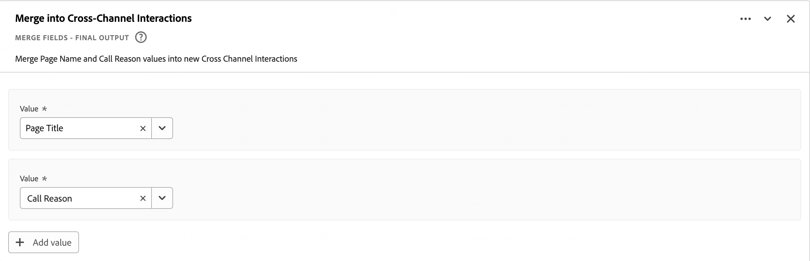

# 衍生欄位

衍生欄位是Adobe Customer Journey Analytics中即時報告功能的重要方面。 衍生欄位可讓您透過可自訂的規則產生器，迅速定義 (通常是複雜的) 資料操作。然後您可以將該衍生欄位當做中的元件（量度或維度） [工作區](../../analysis-workspace/home.md) 甚至進一步將衍生欄位定義為中的元件 [資料檢視](../data-views.md).

相較於在Customer Journey Analytics以外的其他位置轉換或操控資料，衍生欄位可節省大量時間和精力。 例如 [資料準備](https://experienceleague.adobe.com/docs/experience-platform/data-prep/home.html?lang=zh-Hant)， [資料Distiller](https://experienceleague.adobe.com/docs/experience-platform/query/data-distiller/overview.html)，或在您自己的提取轉換載入(ETL) /提取載入轉換(ELT)程式內。

衍生欄位定義於 [資料檢視](../data-views.md)是以定義為規則的一組函式為基礎，並套用至可用的標準及/或結構描述欄位。

範例使用案例包括：

- 定義衍生的「頁面名稱」欄位，更正不正確收集之頁面名稱值以更正頁面名稱值。

- 定義衍生的行銷管道欄位，以根據一或多個條件（例如URL引數、頁面URL、頁面名稱）決定適當的行銷管道。

## 衍生欄位介面

當您建立或編輯衍生欄位時，請使用衍生欄位介面。

|  | 名稱 | 說明 |
|---------|----------|--------|
| 1 | **選擇器** | 您可使用選取器區域來選取您的函式、函式範本、結構描述欄位或標準欄位，並將其拖放至規則產生器。  使用下拉式清單來選取：   [!UICONTROL 函式]  — 可用清單 [函式](#function-reference)，   [!UICONTROL 函式範本]  — 可用清單 [函式範本](#function-templates)，    [!UICONTROL 結構描述欄位]  — 列出資料集類別（事件、設定檔、查詢）的可用欄位和先前定義的衍生欄位，以及   [!UICONTROL 標準欄位]  — 標準可用欄位（如平台資料集ID）。 選擇器中只會顯示字串和數值標準欄位。 如果函式支援其他資料型別，則可以為規則介面中的值或欄位選取具有這些其他資料型別的標準欄位。 您可以使用以下專案搜尋函式、函式範本、結構描述和標準欄位：  搜尋方塊。  您可以透過選取來篩選所選物件清單  在中篩選和指定篩選器 [!UICONTROL 欄位篩選依據] 對話方塊。 您可使用以下工具輕鬆移除篩選器  用於每個篩選器。 |
| 2 | **規則產生器** | 您可使用一或多個規則依序建置衍生欄位。 規則是函式的特定實作，因此一律只與一個函式相關聯。 將函式拖放至規則產生器，即可建立規則。 函式型別會決定規則的介面。 請參閱 [規則介面](#rule-interface) 以取得詳細資訊。  您可以在規則產生器中現有的規則開始、結束或之間插入函式。 規則產生器中的最後一個規則會決定衍生欄位的最終輸出。 |
| 3 | **[!UICONTROL **&#x200B;欄位設定&#x200B;**]** | 您可以命名和描述衍生欄位，並檢查其欄位型別。 |
| 4 | **[!UICONTROL **&#x200B;最終輸出&#x200B;**]** | 此區域會根據過去30天的資料以及您在規則產生器中對衍生欄位所做的變更，顯示輸出值的即時更新預覽。 |

{style="table-layout:auto"}

## 欄位範本精靈

第一次存取衍生欄位介面時， [!UICONTROL 從欄位範本開始] 精靈隨即顯示。

1. 選取最能描述您嘗試建立的欄位型別的範本。
2. 選取 **[!UICONTROL **&#x200B;選取&#x200B;**]** 按鈕以繼續。

衍生欄位對話方塊會填入規則（和函式），對於您選取的欄位型別而言是必要或有用的。 另請參閱 [函式範本](#function-templates) 以取得可用範本的詳細資訊。

## 規則介面

在規則產生器中定義規則時，您會使用規則介面。

|  | 名稱 | 說明 |
|---------|----------|--------|
| A | **規則名稱** | 依預設，規則名稱為 **規則X** （X代表序號）。 若要編輯規則的名稱，請選取其名稱，然後輸入新名稱，例如 `Query Parameter`. |
| B | **函式名稱** | 規則的選定函式名稱，例如 [!UICONTROL URL解析]. 當函式是函式序列中的最後一個並決定最終輸出值時，函式名稱后面會接著一個 [!UICONTROL  — 最終輸出]，例如 [!UICONTROL URL剖析 — 最終輸出].  若要顯示包含函式詳細資訊的快顯視窗，請選取 . |
| C | **規則說明** | 您可以選擇新增說明至規則。 選取 ，然後選取 **[!UICONTROL **&#x200B;新增說明&#x200B;**]** 新增說明或 **[!UICONTROL **&#x200B;編輯說明&#x200B;**]** 以編輯現有的說明。 使用編輯器輸入說明。 您可以使用工具列來格式化文字（使用樣式選擇器、粗體、斜體、底線、右側、左側、置中、顏色、數字清單、專案符號清單），以及新增連結至外部資訊。  若要完成說明的編輯，請在編輯器外按一下「 」。 |
| D | **功能區域** | 定義函式的邏輯。 介面取決於函式的型別。 的下拉式清單 [!UICONTROL 欄位] 或 [!UICONTROL 值] 根據函式預期的輸入型別，顯示所有可用欄位類別（規則、標準欄位、欄位）。 或者，您也可以將欄位從架構和標準欄位選擇器拖放至欄位或值。 當該拖曳欄位源自查閱資料集時，查閱函式會自動插入在您定義的函式之前。  另請參閱 [函式參考](#function-reference) 每個支援函式的詳細資訊。 |

{style="table-layout:auto"}

## 建立衍生欄位

1. 選取現有的資料檢視或建立資料檢視。 另請參閱 [資料檢視](../data-views.md) 以取得詳細資訊。

2. 選取 **[!UICONTROL **&#x200B;元件&#x200B;**]** 資料檢視的索引標籤。

3. 選取 **[!UICONTROL **&#x200B;建立衍生欄位&#x200B;**]** 從左側邊欄。

4. 若要定義衍生欄位，請使用 [!UICONTROL 建立衍生欄位] 介面。 另請參閱 [衍生欄位介面](#derived-field-interface).

   若要儲存新的衍生欄位，請選取 **[!UICONTROL **&#x200B;儲存&#x200B;**]**.

5. 您的新衍生欄位將新增至 [!UICONTROL 衍生欄位>] 容器，為的一部分 **[!UICONTROL **&#x200B;結構描述欄位&#x200B;**]** 位於資料檢視的左側邊欄中。

## 編輯衍生欄位

1. 選取現有的資料檢視。 另請參閱 [資料檢視](../data-views.md) 以取得詳細資訊。

2. 選取 **[!UICONTROL **&#x200B;元件&#x200B;**]** 資料檢視的索引標籤。

3. 選取 **[!UICONTROL **&#x200B;結構描述欄位&#x200B;**]** 索引標籤中的 [!UICONTROL 連線] 窗格於左側。

4. 選取 **[!UICONTROL **&#x200B;衍生欄位>**]** 容器。

5. 將游標停留在您要編輯的衍生欄位上，然後選取 .

6. 若要編輯衍生欄位，請使用 [!UICONTROL 編輯衍生欄位] 介面。 另請參閱 [衍生欄位介面](#derived-field-interface).

   - 選取 **[!UICONTROL **&#x200B;儲存&#x200B;**]** 以儲存更新的衍生欄位。

   - 選取 **[!UICONTROL **&#x200B;取消&#x200B;**]** 取消您對衍生欄位所做的任何變更。

   - 選取 **[!UICONTROL **&#x200B;另存為&#x200B;**]** 將衍生欄位另存為新衍生欄位。 新衍生欄位的名稱與原始編輯的衍生欄位相同，其名稱為 `(copy)` 新增至此頁面。

或者，如果您已在資料檢視中使用衍生欄位做為維度或量度的元件：

1. 選取元件。 請注意，元件的名稱可能與衍生欄位不同。

1. 在「元件」面板中，選取  位於衍生欄位旁邊、結構描述欄位名稱下方。

1. 若要編輯衍生欄位，請使用 [!UICONTROL 編輯衍生欄位] 介面。 另請參閱 [衍生欄位介面](#derived-field-interface).

   - 選取 **[!UICONTROL **&#x200B;儲存&#x200B;**]** 以儲存更新的衍生欄位。

   - 選取 **[!UICONTROL **&#x200B;取消&#x200B;**]** 取消您對衍生欄位所做的任何變更。

   - 選取 **[!UICONTROL **&#x200B;另存為&#x200B;**]** 將衍生欄位另存為新衍生欄位。 新衍生欄位的名稱與原始編輯的衍生欄位相同，其名稱為 `(copy)` 新增至此頁面。

## 刪除衍生欄位

1. 選取現有的資料檢視。 另請參閱 [資料檢視](../data-views.md) 以取得詳細資訊。

2. 選取 **[!UICONTROL **&#x200B;元件&#x200B;**]** 資料檢視的索引標籤。

3. 選取 **[!UICONTROL **&#x200B;結構描述欄位&#x200B;**]** 定位於 [!UICONTROL 連線] 窗格。

4. 選取 **[!UICONTROL **&#x200B;衍生欄位>**]** 容器。

5. 將游標停留在您要刪除的衍生欄位上，然後選取 .

6. 在 [!UICONTROL 編輯衍生欄位] 介面，選取 **[!UICONTROL 刪除]**.

   A [!UICONTROL 刪除元件] 對話方塊會要求您確認刪除。 考慮任何外部參考，這些參考可能存在於資料檢視之外的衍生欄位。

   - 選取 **[!UICONTROL **&#x200B;繼續&#x200B;**]** 以刪除衍生欄位。

或者，如果您已在資料檢視中使用衍生欄位做為維度或量度的元件：

1. 選取元件。 請注意，元件的名稱可能與衍生欄位不同。

1. 在「元件」面板中，選取  位於衍生欄位旁邊、結構描述欄位名稱下方。

1. 在 [!UICONTROL 編輯衍生欄位] 介面，選取 **[!UICONTROL 刪除]**.

   A [!UICONTROL 刪除元件] 對話方塊會要求您確認刪除。 考慮任何外部參考，這些參考可能存在於資料檢視之外的衍生欄位。

   - 選取 **[!UICONTROL **&#x200B;繼續&#x200B;**]** 以刪除衍生欄位。

>[!NOTE]
>
>衍生欄位在Customer Journey Analytics中的連線層級進行管理。 任何與該連線關聯的資料檢視中衍生欄位所做的任何變更，都會套用至所有這些關聯的資料檢視。

## 函數範本

若要快速建立特定使用案例的衍生欄位，可使用函式範本。 這些函式範本可從衍生欄位介面的選取器區域存取，或首次使用時顯示於 [!UICONTROL 從欄位範本開始] 精靈。

### 行銷管道

此範本設定為使用 [Url剖析](#dnl-url-parse) 和 [案例條件](#dnl-case-when) 函式多次，以從URL取得適當的值。 接著，系統就會對這些值套用邏輯，將URL與特定行銷管道建立關聯。

+++ 詳細資料

若要使用範本，您必須為列示為範本規則一部分的每個函式指定正確的引數。 另請參閱 [函式參考](#function-reference) 以取得詳細資訊。

+++

<!--

+++ Data clean up template

>[!WARNING]
>
>Could not find any information on this template.
+++

-->

## 函式參考

{{select-package}}

如需各個支援功能的詳細資訊，請參閱以下內容：

- 規格：
   - 輸入資料型別：支援的資料型別，
   - 輸入：可能的輸入值，
   - 包含的運運算元：此函式支援的運運算元（如果有的話）、
   - 限制：適用於此特定函式的限制，
   - 輸出。

- 使用案例，包括：
   - 定義衍生欄位之前的資料，
   - 如何定義衍生欄位，
   - 定義衍生欄位後的資料。

- 限制（如果適用）。

>[!NOTE]
>
>Lookup函式已重新命名為 [分類](#classify). 請參閱 [分類](#classify) 函式以取得詳細資訊。

<!-- CASE WHEN -->

### 情況

根據一或多個欄位的定義條件套用條件。 然後，系統會根據條件的順序，使用這些條件來定義新衍生欄位中的值。

+++ 詳細資料

## 規格 {#casewhen-io}

| 輸入資料型別 | 輸入 | 包含的運運算元 | 限制 | 輸出 |
|---|---|---|---|---|
| <ul><li>字串</li><li>數值</li><li>日期</li></ul> | <ul><li>[!UICONTROL 如果]， [!UICONTROL Else If] 容器：
<ul><li>[!UICONTROL 值]</li><ul><li>規則</li><li>標準欄位</li><li>欄位</li></ul><li>[!UICONTROL 條件] （請參閱包含的運運算元，根據選取的值型別）</li></ul></li><li>[!UICONTROL 然後將值設為]， [!UICONTROL 否則將值設為]：
<ul><li>[!UICONTROL 值]</li><ul><li>規則</li><li>標準欄位</li><li>欄位</li></ul></ul></li></ul> | 
字串
<ul><li>等於</li><li>等於任何字詞</li><li>包含片語</li><li>包含任何字詞</li><li>包含所有字詞</li><li>開始於</li><li>以任何字詞開始</li><li>終止於</li><li>以任何字詞結尾</li><li>不等於</li><li>不等於任何字詞</li><li>不包含此片語</li><li>不包含任何字詞</li><li>不包含所有字詞</li><li>不開始於</li><li>開頭不是任何詞語</li><li>不終止於</li><li>結尾不是任何詞語</li><li>已設定</li><li>未設定</li></ul>
數值
<ul><li>等於</li><li>不等於</li><li>大於</li><li>大於或等於</li><li>小於</li><li>小於或等於</li><li>已設定</li><li>未設定</li></ul>
日期
<ul><li>等於</li><li>不等於</li><li>晚於</li><li>晚於或等於</li><li>早於</li><li>早於或等於</li><li>已設定</li><li>未設定</li></ul> | <ul><li>每個衍生欄位5個函式</li><li>200 [運運算元](#operators) 每個衍生欄位。 「反向連結網域包含Google」是單一運運算元的範例。 </li></ul> | 
新增衍生欄位
 |

{style="table-layout:auto"}

## 使用案例1 {#casewhen-uc1}

若要定義規則以識別各種行銷管道，請套用階層式邏輯以將行銷管道欄位設定為適當的值：

- 如果反向連結來自搜尋引擎，且頁面具有查詢字串值，其中 `cid` 包含 `ps_`，則行銷管道應識別為 [!DNL *付費搜尋*].
- 如果反向連結來自搜尋引擎，而頁面沒有查詢字串 `cid`，則行銷管道應識別為 [!DNL *免費搜尋*].
- 如果頁面有查詢字串值，其中 `cid` 包含 `em_`，則行銷管道應識別為 [!DNL *電子郵件*].
- 如果頁面有查詢字串值，其中 `cid` 包含 `ds_`，則行銷管道應識別為 [!DNL *顯示廣告*].
- 如果頁面有查詢字串值，其中 `cid` 包含 `so_`，則行銷管道應識別為 [!DNL *付費社交*].
- 如果反向連結來自的反向連結網域 [!DNL twitter.com]， [!DNL facebook.com]， [!DNL linkedin.com]，或 [!DNL tiktok.com]，則行銷管道應識別為 [!DNL *自然社交*].
- 如果上述規則均不符合，則行銷管道應識別為 [!DNL *其他反向連結*].

如果您的網站收到以下範例事件，包含 [!UICONTROL 反向連結] 和 [!UICONTROL 頁面URL]，這些事件的識別方式如下：

| [!DNL Event] | [!DNL Referrer] | [!DNL Page URL] | [!DNL Marketing Channel] |
|:--:|----|----|----|
| 1 | `https://facebook.com` | `https://site.com/home` | [!DNL Natural Social] |
| 2 | `https://abc.com` | `https://site.com/?cid=ds_12345678` | [!DNL Display] |
| 3 | | `https://site.com/?cid=em_12345678` | [!DNL Email] |
| 4 | `https://google.com` | `https://site.com/?cid=ps_abc098765` | [!DNL Paid Search] |
| 5 | `https://google.com` | `https://site.com/?cid=em_765544332` | [!DNL Email] |
| 6 | `https://google.com` |  | [!DNL Natural Search] |

{style="table-layout:auto"}

### 在此之前的資料 {#casewhen-uc1-databefore}

| [!DNL Referrer] | [!DNL Page URL] |
|----|----|
| `https://facebook.com` | `https://site.com/home` |
| `https://abc.com` | `https://site.com/?cid=ds_12345678` |
|  | `https://site.com/?cid=em_12345678` |
| `https://google.com` | `https://site.com/?cid=ps_abc098765` |
| `https://google.com` | `https://site.com/?cid=em_765544332` |
| `https://google.com` |

{style="table-layout:auto"}

### 衍生欄位 {#casewhen-uc1-derivedfield}

您定義新的 `Marketing Channel` 衍生欄位。 您使用 [!UICONTROL 案例條件] 函式來定義規則，這些規則會根據兩者的現有值為建立值 `Page URL` 和 `Referring URL` 欄位。

請注意函式的使用情況 [!UICONTROL URL解析] 以定義擷取值的規則 `Page Url` 和 `Referring Url` 早於 [!UICONTROL 案例條件] 規則已套用。

### 之後的資料 {#casewhen-uc1-dataafter}

| [!DNL Marketing Channel] |
|----|
| [!DNL Natural Social] |
| [!DNL Display] |
| [!DNL Email] |
| [!DNL Paid Search] |
| [!DNL Email] |
| [!DNL Natural Search] |

{style="table-layout:auto"}

## 使用案例2 {#casewhen-uc2}

您已收集內多種不同的搜尋變體 [!DNL Product Finding Methods] 維度。 若要瞭解搜尋與瀏覽的整體效能，您必須花大量時間手動結合結果。

您的網站為收集以下值 [!DNL Product Finding Methods] 維度。 最後，所有這些值都表示搜尋。

| 收集的值 | 實際值 |
|---|---|
| [!DNL search p13n_no] | [!DNL search] |
| [!DNL search p13n_yes] | [!DNL search] |
| [!DNL search refine p13n_no] | [!DNL search] |
| [!DNL search refine p13n_yes] | [!DNL search] |
| [!DNL search redirect p13n_yes] | [!DNL search] |
| [!DNL search-redirect] | [!DNL search] |

{style="table-layout:auto"}

### 在此之前的資料 {#casewhen-uc2-databefore}

| [!DNL Product Finding Methods] |
|----|
| [!DNL search p13_no] |
| [!DNL search p13_yes] |
| [!DNL browse] |
| [!DNL search refine p13_no] |
| [!DNL search refine p13_yes] |
| [!DNL browse] |
| [!DNL search redirect p13_yes] |
| [!DNL search-redirect] |
| [!DNL browse] |

{style="table-layout:auto"}

### 衍生欄位 {#casewhen-uc2-derivedfield}

您定義 `Product Finding Methods (new)` 衍生欄位。 您可建立下列專案 [!UICONTROL 案例條件] 規則產生器中的規則。 這些規則會將邏輯套用至舊版本的所有可能變體 [!UICONTROL 產品尋找方法] 的欄位值 `search` 和 `browse` 使用 [!UICONTROL 包含片語] 條件。

### 之後的資料 {#casewhen-uc2-dataafter}

| [!DNL Product Finding Methods (new)] |
|----|
| [!DNL search] |
| [!DNL search] |
| [!DNL browse] |
| [!DNL search] |
| [!DNL search] |
| [!DNL browse] |
| [!DNL search] |
| [!DNL search] |
| [!DNL browse] |

{style="table-layout:auto"}

## 使用案例3 {#casewhen-uc3}

作為旅行公司，您想要針對預訂的旅行報告分段旅行期間，以便報告分段旅行長度。

假設：

- 組織正在將運送航程期間收集到數值欄位中。
- 他們想要將1-3天的期間貯體放入名為&#39;的貯體中[!DNL short trip]『
- 他們想要將4-7天的期間貯體放入名為&#39;的貯體中[!DNL medium trip]『
- 他們想要將8天以上的期間貯體放入名為&#39;的貯體[!DNL long trip]『
- 1天期間預訂了132次行程
- 已預訂110次旅行，為期2天
- 已預訂105次行程，為期3天
- 已預訂99次行程，為期4天
- 已預訂92次行程，為期5天
- 已預訂85次行程，為期6天
- 已預訂82次行程，為期7天
- 已預訂78次行程，為期8天
- 已預訂50次行程，為期9天
- 預訂了44次行程，為期10天
- 預訂了38次行程，為期11天
- 預訂了31次旅行，為期12天

您需要的報表應如下所示：

| [!DNL Trip Duration Type] | [!DNL Bookings] |
|----|---:|
| [!DNL medium trip] | 358 |
| [!DNL short trip] | 347 |
| [!DNL long trip] | 241 |

{style="table-layout:auto"}

### 在此之前的資料 {#casewhen-uc3-databefore}

| [!DNL Trip Duration] |
|---:|
| 1 |
| 12 |
| 3 |
| 6 |
| 4 |
| 8 |
| 6 |
| 2 |
| 1 |
| 2 |
| 21 |
| 8 |

### 衍生欄位 {#casewhen-uc3-derivedfield}

您定義 `Trip Duration (bucketed)` 衍生欄位。 您可建立下列專案 [!UICONTROL 案例條件] 規則產生器中的規則。 此規則會將邏輯套用至舊的 [!UICONTROL 行程期間] 將欄位值分為三個值： `short trip`， `medium  trip`、和 `long trip`.

### 之後的資料 {#casewhen-uc3-dataafter}

| [!DNL Trip Duration (bucketed)] |
|---|
| [!DNL short trip] |
| [!DNL long trip] |
| [!DNL short trip] |
| [!DNL medium trip] |
| [!DNL medium trip] |
| [!DNL long trip] |
| [!DNL medium trip] |
| [!DNL short trip] |
| [!DNL short trip] |
| [!DNL short trip] |
| [!DNL long trip] |
| [!DNL long trip] |

## 詳細資訊

Customer Journey Analytics使用巢狀容器結構，並按照Adobe Experience Platform的範例建模 [XDM](https://experienceleague.adobe.com/docs/experience-platform/xdm/home.html?lang=zh-Hant) （體驗資料模型）。 另請參閱 [容器](../create-dataview.md#containers) 和 [篩選容器](../../components/filters/filters-overview.md#filter-containers) 以取得更多背景資訊。 此容器模型雖然本身有彈性，但在使用規則產生器時施加了一些限制。

Customer Journey Analytics會使用以下預設容器模型：

下列限制適用，且會在下列情況下強制執行： *選取* 和 *設定* 值。

|  | 限制 |
|:---:|----|
| **A** | 您的值 *選取* 在相同 [!UICONTROL 如果]， [!UICONTROL Else If] 建構(使用 [!UICONTROL 與] 或 [!UICONTROL 或])且必須源自相同容器，可以是任何型別（字串） ，數值 ，依此類推)。   |
| **B** | 您所有的值 *設定* 跨規則必須來自相同容器，且具有相同型別或相同型別的衍生值。    |
| **C** | 您的值 *選取* 橫向 [!UICONTROL 如果]， [!UICONTROL Else If] 規則中的建構do *非* 必須源自相同的容器，並 *非* 必須是相同型別。    |

{style="table-layout:auto"}

+++

<!-- CLASSIFY -->

### 分類

定義一組值，在新衍生欄位中以對應值取代。

+++ 詳細資料

>[!NOTE]
>
>此函式原本名為Lookup ，但已重新命名為Classification ，以因應即將推出的不同功能Lookup函式。

## 規格 {#classify-io}

| 輸入資料型別 | 輸入 | 包含的運運算元 | 限制 | 輸出 |
|---|---|---|---|---|
| <ul><li>字串</li><li>數值</li><li>日期</li></ul> | <ul><li>[!UICONTROL 要分類的欄位]：<ul><li>規則</li><li>標準欄位</li><li>欄位</li></ul></li><li>[!UICONTROL 當值等於] 和 [!UICONTROL 將值取代為]：
<ul><li>字串</li></ul><li>顯示原始值<ul><li>布林值</li></ul></li></ul> | 
不適用
 | 
每個衍生欄位5個函式 每個函式100列
 | 
新增衍生欄位
 |

{style="table-layout:auto"}

## 使用案例1 {#classify-uc1}

您的CSV檔案確實包含索引鍵欄， `hotelID` 以及一或多個與關聯的其他欄 `hotelID`： `city`， `rooms`， `hotel name`.
您正在收集 [!DNL Hotel ID] 但想要建立 [!DNL Hotel Name] 維度衍生自 `hotelID` CSV檔案中的。

**CSV檔案結構和內容**

| [!DNL hotelID] | [!DNL city] | [!DNL rooms] | [!DNL hotel name] |
|---|---|---:|---|
| [!DNL SLC123] | [!DNL Salt Lake City] | 40 | [!DNL SLC Downtown] |
| [!DNL LAX342] | [!DNL Los Angeles] | 60 | [!DNL LA Airport] |
| [!DNL SFO456] | [!DNL San Francisco] | 75 | [!DNL Market Street] |
| [!DNL AMS789] | [!DNL Amsterdam] | 50 | [!DNL Okura] |

{style="table-layout:auto"}

**目前的報告**

| [!DNL Hotel ID] | 產品檢視 |
|---|---:|
| [!DNL SLC123] | 200 |
| [!DNL LX342] | 198 |
| [!DNL SFO456] | 190 |
| [!DNL AMS789] | 150 |

{style="table-layout:auto"}

**所需報告**

| [!DNL Hotel Name] | 產品檢視 |
|----|----:|
| [!DNL SLC Downtown] | 200 |
| [!DNL LA Airport] | 198 |
| [!DNL Market Street] | 190 |

{style="table-layout:auto"}

### 在此之前的資料 {#classify-uc1-databefore}

| [!DNL Hotel ID] |
|----|
| [!DNL SLC123] |
| [!DNL LAX342] |
| [!DNL SFO456] |
| [!DNL AMS789] |

{style="table-layout:auto"}

### 衍生欄位 {#classify-uc1-derivedfield}

您定義 `Hotel Name` 衍生欄位。 您使用 [!UICONTROL 分類] 函式以定義規則，您可在其中分類 [!UICONTROL 飯店ID] 欄位並取代為新值。

如果您想要包含尚未定義成分類值一部分的原始值（例如飯店ID AMS789），請務必選取 **[!UICONTROL 顯示原始值]**. 這可確保AMS789是衍生欄位輸出的一部分，儘管該值未分類。

### 之後的資料 {#classify-uc1-dataafter}

| [!DNL Hotel Name] |
|----|
| [!DNL SLC Downtown] |
| [!DNL LA Airport] |
| [!DNL Market Street] |

{style="table-layout:auto"}

## 使用案例2 {#classify-uc2}

您已收集好幾個頁面的URL，而不是好記的頁面名稱。 這個混合值集合會中斷報表。

### 在此之前的資料 {#classify-uc2-databefore}

| [!DNL Page Name] |
|---|
| [!DNL Home Page] |
| [!DNL Flight Search] |
| `http://www.adobetravel.ca/Hotel-Search` |
| `https://www.adobetravel.com/Package-Search` |
| [!DNL Deals & Offers] |
| `http://www.adobetravel.ca/user/reviews` |
| `https://www.adobetravel.com.br/Generate-Quote/preview` |

{style="table-layout:auto"}

### 衍生欄位 {#classify-uc2-derivedfield}

您定義 `Page Name (updated)` 衍生欄位。 您使用 [!UICONTROL 分類] 函式以定義規則，您可在其中分類現有值 [!UICONTROL 頁面名稱] 欄位並取代為更新的正確值。

### 之後的資料 {#classify-uc2-dataafter}

| [!DNL Page Name (updated)] |
|---|
| [!DNL Home Page] |
| [!DNL Flight Search] |
| [!DNL Hotel Search] |
| [!DNL Package Search] |
| [!DNL Deals & Offers] |
| [!DNL Reviews] |
| [!DNL Generate Quote] |

## 詳細資訊 {#classify-moreinfo}

「分類」規則介面中提供下列額外功能：

- 若要快速清除所有表格值，請選取  **[!UICONTROL 清除所有表格值]**.
- 若要上傳包含「當值等於時」的原始值和「取代為」的新值的CSV檔案，請選取  **[!UICONTROL 上傳CSV]**.
- 若要下載範本，以建立具有要上傳的原始值和新值的CSV檔案，請選取  **[!UICONTROL 下載CSV範本]**.
- 若要下載CSV檔案，並在規則介面中填入所有原始值和新值，請選取「 」  **[!UICONTROL 下載CSV值]**.

+++

<!-- CONCATENATE -->

### 串連

將欄位值結合至具有已定義分隔字元的單一新衍生欄位。

+++ 詳細資料

## 規格 {#concatenate-io}

| 輸入資料型別 | 輸入 | 包含的運運算元 | 限制 | 輸出 |
|---|---|---|---|---|
| <ul><li>字串</li></ul> | <ul><li>[!UICONTROL 值]：<ul><li>規則</li><li>標準欄位</li><li>欄位</li><li>字串</li></ul></li><li>[!UICONTROL 分隔符號]：<ul><li>字串</li></ul></li> </ul> | 
不適用
 | 
每個衍生欄位2個函式
 | 
新增衍生欄位
 |

{style="table-layout:auto"}

## 使用案例 {#concatenate-uc}

您目前正在以個別欄位收集來源和目的地機場代碼。 您想要取用這兩個欄位，並將它們合併成以連字型大小(-)分隔的單一維度。 因此，您可以分析來源與目的地的組合，以識別預訂的最上層路由。

假設：

- 來源和目的地值會收集在相同表格中的個別欄位中。
- 使用者決定在值之間使用分隔字元&#39;-&#39;。

想像會發生下列預約：

- 客戶ABC123預訂鹽湖城(SLC)和奧蘭多(MCO)之間的航班
- 客戶ABC456預訂鹽湖城(SLC)和洛杉磯(LAX)之間的航班
- 客戶ABC789預訂鹽湖城(SLC)和西雅圖(SEA)之間的航班
- 客戶ABC987預訂鹽湖城(SLC)和聖荷西(SJO)之間的航班
- 客戶ABC654預訂鹽湖城(SLC)和奧蘭多(MCO)之間的航班

所需的報表應如下所示：

| 來源/目的地 | Bookings |
|----|---:|
| SLC-MCO | 2 |
| SLC-LAX | 1 |
| SLC-SEA | 1 |
| SLC-SJO | 1 |

{style="table-layout:auto"}

### 在此之前的資料 {#concatenate-uc-databefore}

| 來源 | 目標 |
|----|---:|
| SLC | MCO |
| SLC | LAX |
| SLC | SEA |
| SLC | SJO |
| SLC | MCO |

{style="table-layout:auto"}

### 衍生欄位 {#concatenate-derivedfield}

您定義新的 [!UICONTROL 來源 — 目的地] 衍生欄位。 您使用 [!UICONTROL 串連] 定義規則以串連 [!UICONTROL 原始] 和 [!UICONTROL 目的地] 欄位使用 `-` [!UICONTROL 分隔符號].

### 之後的資料 {#concatenate-dataafter}

| 來源 — 目的地 （衍生欄位） |
|---|
| SLC-MCO |
| SLC-LAX |
| SLC-SEA |
| SLC-SJO |
| SLC-MCO |

{style="table-layout:auto"}

+++

<!-- FIND AND REPLACE -->

### 尋找並取代

尋找所選欄位中的所有值，並在新的衍生欄位中以不同的值取代這些值。

+++ 詳細資料

## 規格 {#findreplace-io}

| 輸入資料型別 | 輸入 | 包含的運運算元 | 限制 | 輸出 |
|---|---|---|---|---|
| <ul><li>字串</li></ul> | <ul><li>[!UICONTROL 值]<ul><li>規則</li><li>標準欄位</li><li>欄位</li></ul></li><li>[!UICONTROL 尋找全部]， [!UICONTROL 並全部取代為]：<ul><li>字串</li></ul></li></ul></ul> | 
字串
<ul><li>[!UICONTROL 尋找全部]， [!UICONTROL 並全部取代為]</li></ul> | 
每個衍生欄位5個函式
 | 
新增衍生欄位
 |

{style="table-layout:auto"}

## 使用案例 {#findreplace-uc}

例如，您收到的外部行銷管道報表值格式錯誤 `email%20 marketing` 而非 `email marketing`. 這些格式錯誤的值會割裂您的報表，並使您更難以檢視電子郵件的執行情形。 您想要取代 `email%20marketing` 替換為 `email marketing`.

**原始報告**

| [!DNL External Marketing Channels] | [!DNL Sessions] |
|---|--:|
| [!DNL email marketing] | 500 |
| [!DNL email %20marketing] | 24 |

{style="table-layout:auto"}

**偏好的報告**

| [!DNL External Marketing Channels] | [!DNL Sessions] |
|---|--:|
| [!DNL email marketing] | 524 |

### 在此之前的資料 {#findreplace-uc-databefore}

| [!DNL External Marketing] |
|----|
| [!DNL email marketing] |
| [!DNL email%20marketing] |
| [!DNL email marketing] |
| [!DNL email marketing] |
| [!DNL email%20marketing] |

{style="table-layout:auto"}

### 衍生欄位 {#findreplace-uc-derivedfield}

您定義 `Email Marketing (updated)` 衍生欄位。 您使用 [!UICONTROL 尋找和取代] 定義規則以尋找及取代所有出現位置的函式 `email%20marketing` 替換為 `email marketing`.

### 之後的資料 {#findreplace-uc-dataafter}

| [!DNL External Marketing (updated)] |
|----|
| [!DNL email marketing] |
| [!DNL email marketing] |
| [!DNL email marketing] |
| [!DNL email marketing] |
| [!DNL email marketing] |

{style="table-layout:auto"}

+++

<!-- LOOKUP -->

### 查詢

使用查詢資料集中的欄位來查詢值，並在新的衍生欄位中傳回值或用於進一步的規則處理。

+++ 詳細資料

## 規格 {#lookup-io}

| 輸入資料型別 | 輸入 | 包含的運運算元 | 限制 | 輸出 |
|---|---|---|---|---|
| <ul><li>字串</li><li>數值</li><li>日期</li></ul> | <ul><li>[!UICONTROL 要套用查閱的欄位]：</li><ul><li>規則</li><li>標準欄位</li><li>欄位</li></ul><li>[!UICONTROL 查詢資料集]</li><ul><li>資料集</li></ul><li>[!UICONTROL 比對索引鍵]<ul><li>規則</li><li>欄位</li></ul></li><li>要傳回的值<ul><li>規則</li><li>欄位</li></ul></li></ul> | 
不適用
 | 
每個衍生欄位3個函式
 | 
下一個規則中用於進一步處理的新衍生欄位或值
 |

{style="table-layout:auto"}

## 使用案例 {#lookup-uc}

您想要使用客戶點按透過Adobe Target顯示的個人化橫幅時收集的活動ID來查詢活動名稱。 想要搭配Analytics for Target (A4T)活動（包含活動ID和活動名稱）使用查詢資料集。

### A4T查詢資料集 {#lookup-uc-lookup}

| 活動ID | 活動名稱 |
|---|---|
| 415851 | MVT測試類別頁面 |
| 415852 | Luma - Campaign Max 2022 |
| 402922 | 首頁橫幅 |

{style="table-layout:auto"}

### 衍生欄位 {#lookup-uc-derivedfield}

您定義 `Activity Name` 衍生欄位。 您使用 [!UICONTROL 查詢] 定義規則以從收集資料中查詢值的函式，值的指定位置為 [!UICONTROL 要套用查閱的欄位] 欄位(例如 **[!DNL ActivityIdentifier]**)。 您可以從中選擇查詢資料集 [!UICONTROL 查詢資料集] 清單(例如 **[!DNL New CJA4T Activities]**)。 接著選取識別碼欄位(例如 **[!DNL ActivityIdentifier]**)從 [!UICONTROL 比對索引鍵] 清單和要從傳回的欄位 [!UICONTROL 要傳回的值] 清單(例如 **[!DNL ActivityName]**)。

## 更多資訊

您可以快速插入 [!UICONTROL 查詢] 函式中，已包含一或多個其他函式。

1. 選取 **[!UICONTROL 結構描述欄位]** 從選取器。
1. 選取  **[!UICONTROL 查詢資料集]**.
1. 選取您的查詢資料集，並尋找您要用於查詢的欄位。
1. 將查詢欄位拖放至函式的任何可用輸入欄位上（例如Case When）。 有效時，會顯示藍色方塊，標籤為 **[!UICONTROL +新增]**，可讓您放置欄位，並在您放置查閱欄位的函式之前自動插入查閱函式。 插入的Lookup函式會自動填入所有欄位的相關值。
   

+++

<!-- LOWERCASE -->

### 小寫

將欄位中的值轉換為小寫，並將其儲存到新的衍生欄位中。

+++ 詳細資料

## 規格 {#lowercase-io}

| 輸入資料型別 | 輸入 | 包含的運運算元 | 限制 | 輸出 |
|---|---|---|---|---|
| <ul><li>字串</li><li>數值</li><li>日期</li></ul> | <ul><li>[!UICONTROL 欄位]：</li><ul><li>規則</li><li>標準欄位</li><li>欄位</li></ul> | 
不適用
 | 
每個衍生欄位2個函式
 | 
新增衍生欄位
 |

{style="table-layout:auto"}

## 使用案例 {#lowercase-uc}

您想要將所有收集的產品名稱轉換為小寫，以便正確製作報表。

### 在此之前的資料 {#lowercase-uc-databefore}

| 收集的產品名稱 | 產品檢視 |
|---|---:|
| 網球拍 | 35 |
| 網球拍 | 33 |
| 網球拍 | 21 |
| 棒球棒 | 15 |
| 棒球棒 | 12 |
| 棒球棒 | 10 |

{style="table-layout:auto"}

### 衍生欄位 {#lowercase-uc-derivedfield}

您定義 `Product Names` 衍生欄位。 您使用 [!UICONTROL 小寫] 函式來定義規則，以將 [!UICONTROL 收集的產品名稱] 欄位轉換為小寫，並將其儲存在新的衍生欄位中。

### 之後的資料 {#lowercase-uc-dataafter}

| 產品名稱 | 產品檢視 |
|---|---|
| 網球拍 | 89 |
| 棒球棒 | 37 |

{style="table-layout:auto"}

+++

<!-- MERGE FIELDS -->

### 合併欄位

將兩個不同欄位的值合併到新的衍生欄位。

+++ 詳細資料

## 規格 {#merge-fields-io}

| 輸入資料型別 | 輸入 | 包含的運運算元 | 限制 | 輸出 |
|---|---|---|---|---|
| <ul><li>字串</li><li>數值</li><li>日期</li></ul> | <ul><li>[!UICONTROL 欄位]：</li><ul><li>規則</li><li>標準欄位</li><li>欄位</li></ul> | 
不適用
 | 
每個衍生欄位5個函式
 | 
新增衍生欄位
 |

{style="table-layout:auto"}

## 使用案例 {#merge-fields-uc}

您想要建立由頁面名稱欄位和來電原因欄位組成的維度，其目的在於跨管道分析歷程。

### 在此之前的資料 {#merge-fields-uc-databefore}

| 頁面名稱 | 工作階段 | 訪客 |
|---|--:|--:|
| 說明頁面 | 250 | 200 |
| 首頁 | 500 | 250 |
| 產品詳細資料頁面 | 300 | 200 |

{style="table-layout:auto"}

| 來電原因 | 工作階段 | 訪客 |
|---|--:|--:|
| 關於我訂單的問題 | 275 | 250 |
| 變更我的訂單 | 150 | 145 |
| 訂購時發生問題 | 100 | 95 |

{style="table-layout:auto"}

### 衍生欄位 {#merge-fields-uc-derivedfield}

您定義 `Cross Channel Interactions` 衍生欄位。 您使用 [!UICONTROL 合併欄位] 函式來定義規則，以合併來自 [!UICONTROL 頁面名稱] 欄位和 [!UICONTROL 來電原因] 欄位並將其儲存在新的衍生欄位中。

### 之後的資料 {#merge-fields-uc-dataafter}

| 跨頻道互動 | 工作階段 | 訪客 |
|---|--:|--:|
| 首頁 | 500 | 250 |
| 產品詳細資料頁面 | 300 | 200 |
| 關於我訂單的問題 | 275 | 250 |
| 說明頁面 | 250 | 200 |
| 變更我的訂單 | 150 | 145 |
| 訂購時發生問題 | 100 | 95 |

{style="table-layout:auto"}

## 詳細資訊 {#merge-fields-moreinfo}

您必須在「合併欄位」規則中選取相同型別的欄位。 例如，如果您選取「日期」欄位，則您要合併的所有其他欄位都必須是「日期」欄位。

+++

<!-- REGEX REPLACE -->

### 規則運算式取代

使用規則運算式將欄位中的值取代為新的衍生欄位。

+++ 詳細資料

## 規格 {#regex-replace-io}

| 輸入資料型別 | 輸入 | 包含的運運算元 | 限制 | 輸出 |
|---|---|---|---|---|
| <ul><li>字串</li><li>數值</li></ul> | <ul><li>[!UICONTROL 欄位]：</li><ul><li>規則</li><li>標準欄位</li><li>欄位</li></ul></ul><ul><li>[!UICONTROL 規則運算式]：</li><ul><li>字串</li></ul></li><li>[!UICONTROL 輸出格式]：<ul><li>字串</li></ul></ul><ul><li>區分大小寫</li><ul><li>布林值</li></ul></li></ul></li> | 
不適用
 | 
每個衍生欄位1個函式
 | 
新增衍生欄位
 |

{style="table-layout:auto"}

## 使用案例 {#regex-replace-uc}

您想要擷取URL的一部分，並作為唯一頁面識別碼來分析流量。 您使用 `[^/]+(?=/$|$)` 用於擷取URL結尾的規則運算式 `$1` 作為輸出模式。

### 在此之前的資料 {#regex-replace-uc-databefore}

| 頁面 URL |
|---|
| `https://business.adobe.com/products/analytics/adobe-analytics-benefits.html` |
| `https://business.adobe.com/products/analytics/adobe-analytics.html` |
| `https://business.adobe.com/products/experience-platform/customer-journey-analytics.html` |
| `https://business.adobe.com/products/experience-platform/adobe-experience-platform.html` |

{style="table-layout:auto"}

### 衍生欄位 {#regex-replace-uc-derivedfield}

您建立 `Page Identifier` 衍生欄位。 您使用 [!UICONTROL REGEX取代] 函式來定義規則以取代 [!UICONTROL 反向連結URL] 使用 [!UICONTROL 規則運算式] 之 `[^/]+(?=/$|$)` 和 [!UICONTROL 輸出格式] 之 `$1`.

### 之後的資料 {#regex-replace-uc-dataafter}

| 頁面識別碼 |
|---|
| adobe-analytics-benefits.html |
| adobe-analytics.html |
| customer-journey-analytics.html |
| adobe-experience-platform.html |

## 詳細資訊

Customer Journey Analytics使用Perl規則運算式語法的子集。 支援下列運算式：

| 運算式 | 說明 |
| --- | --- |
| `a` | 單一字元 `a`。 |
| `a\|b` | 單一字元 `a` 或 `b`。 |
| `[abc]` | 單一字元 `a`、`b` 或 `c`。 |
| `[^abc]` | 除了 `a`、`b` 或 `c` 之外的任一單一字元。 |
| `[a-z]` | `a`-`z` 範圍內的任一單一字元。 |
| `[a-zA-Z0-9]` | `a`-`z`、`A`-`Z` 或數字 `0`-`9` 範圍內的任一單一字元。 |
| `^` | 和行的開頭相符。 |
| `$` | 和行的結尾相符。 |
| `\A` | 字串的開頭。 |
| `\z` | 字串的結尾。 |
| `.` | 符合任一字元。  |
| `\s` | 任一空格字元。 |
| `\S` | 任何非空格字元。 |
| `\d` | 任何數字。 |
| `\D` | 任何非數字。 |
| `\w` | 任一字母、數字或底線。 |
| `\W` | 任一非單詞字元。 |
| `\b` | 任何單詞邊界。 |
| `\B` | 任一非單詞邊界的字元。 |
| `\<` | 單詞的開頭。 |
| `\>` | 單詞的結尾。 |
| `(...)` | 擷取括號內的所有內容。 |
| `(?:...)` | 未標示擷取。防止在輸出字串中參考相符項。 |
| `a?` | 零個或一個 `a`。 |
| `a*` | 零個或更多 `a`。 |
| `a+` | 一個或更多 `a`。 |
| `a{3}` | 剛好 3 個 `a`。 |
| `a{3,}` | 3 個或更多 `a`。 |
| `a{3,6}` | 介於 3 個和 6 個 `a` 之間。 |

您可以在[!UICONTROL 輸出格式]中以不限次數和任何順序的方式使用這些序列，以實現所需的字串輸出。

| 輸出預留位置序列 | 說明 |
| --- | --- |
| `$&` | 和全部運算式相符的輸出。 |
| `$n` | 和第n個子運算式相符的輸出。 例如， `$1` 輸出第一個子運算式。 |
| ``$` `` | 輸出找到的最後一個相符項的結尾 (如果沒有找到之前的相符項，則為文字的開頭) 和目前相符項的開頭之間的文字。 |
| `$+` | 輸出和規則運算式中最後一個標籤的子運算式相符的內容。 |
| `$$` | 輸出字串字元 `"$"`。 |

{style="table-layout:auto"}

+++

<!-- SPLIT -->

### Split

將欄位中的值分割成新的衍生欄位。

+++ 詳細資料

## 規格 {#split-io}

| 輸入資料型別 | 輸入 | 包含的運運算元 | 限制 | 輸出 |
|---|---|---|---|---|
| <ul><li>字串</li><li>數值</li></ul> | <ul><li>[!UICONTROL 欄位]：</li><ul><li>規則</li><li>標準欄位</li><li>欄位</li></ul></ul><ul><li>[!UICONTROL 方法]：</li><ul><li>從左側</li><li>從右側</li><li>轉換為陣列</li></ul></li><li>對於分隔字元：<ul><li>字串</li></ul><li>針對索引：<ul><li>數值</li></ul></li> | 
不適用
 | 
每個衍生欄位5個函式
 | 
新增衍生欄位
 |

{style="table-layout:auto"}

## 使用案例1 {#split-uc1}

您可在單一維度中將語音應用程式回應收集到分隔清單中。 您想要清單中的每個值在回應報表中成為唯一值。

### 在此之前的資料 {#split-uc1-databefore}

| 語音應用程式回應 | 活動 |
|---|--:|
| 非常棒，完全合理，會推薦給其他人 | 1 |
| 很棒，有點混亂，會推薦給其他人 | 1 |
| 不是很好，很混亂，不會向其他人推薦 | 1 |

{style="table-layout:auto"}

### 衍生欄位 {#split-u1-derivedfield}

您建立 `Responses` 衍生欄位。 您使用 [!UICONTROL SPLIT] 函式來定義使用  [!UICONTROL 轉換為陣列] 轉換下列專案之值的方法： [!UICONTROL 語音應用程式回應] 欄位使用 `,` 作為 [!UICONTROL 分隔符號].

### 之後的資料 {#split-uc1-dataafter}

| 回應 | 活動 |
|---|--:|
| 非常棒 | 2 |
| 會推薦給其他人 | 2 |
| 不太好 | 1 |
| 完全合理 | 1 |
| 有點令人困惑 | 1 |
| 非常令人困惑 | 1 |
| 不會推薦給其他人 | 1 |

{style="table-layout:auto"}

## 使用案例2 {#split-uc2}

您可在單一維度中將語音應用程式回應收集到分隔清單中。 您想要將清單中第一個值的回應放入其本身的維度中。 您想要將清單中的最後一個值放入其本身的維度中。

### 在此之前的資料 {#split-uc2-databefore}

| 回應 | 活動 |
|---|--:|
| 非常棒，非常合理，會推薦給其他人 | 1 |
| 很棒，有點混亂，會推薦給其他人 | 1 |
| 不是很好，很混亂，不會向其他人推薦 | 1 |

{style="table-layout:auto"}

### 衍生欄位 {#split-u2-derivedfield}

您建立  `First Response` 衍生欄位。 您使用 [!UICONTROL SPLIT] 函式來定義規則，以取自 [!UICONTROL 回應] 回應左側的欄位 `,` 做為分隔字元。

您建立 `Second Response` 衍生欄位，用以取得下列欄位的最後一個值： [!UICONTROL 回應] 欄位，方法是選取右側的「從」、1作為「分隔符號」、1作為「索引」。

### 之後的資料 {#split-uc2-dataafter}

| 第一個回應 | 活動 |
|---|--:|
| 非常棒 | 2 |
| 不太好 | 1 |

{style="table-layout:auto"}

| 第二個回應 | 活動 |
|---|--:|
| 會推薦給其他人 | 2 |
| 不會推薦給其他人 | 1 |

{style="table-layout:auto"}

+++

<!-- TRIM -->

### 修剪

從欄位值的開頭或結尾，將空格、特殊字元或字元數修剪成新的衍生欄位。

+++ 詳細資料

## 規格 {#trim-io}

| 輸入資料型別 | 輸入 | 包含的運運算元 | 限制 | 輸出 |
|---|---|---|---|---|
| <ul><li>字串</li></ul> | <ul><li>[!UICONTROL 欄位]<ul><li>規則</li><li>標準欄位</li><li>欄位</li></ul></li><li>修剪空白字元</li><li>修剪特殊字元<ul><li>特殊字元的輸入</li></ul></li><li>從左側修剪<ul><li>從 <ul><li>字串開始</li><li>位置<ul><li>位置#</li></ul></li><li>字串<ul><li>字串值</li><li>索引</li><li>標幟以包含字串</li></ul></li></ul></li><li>結束日期<ul><li>字串結束</li><li>位置<ul><li>位置#</li></ul></li><li>字串<ul><li>字串值</li><li>索引</li><li>標幟以包含字串</li></ul></li><li>長度</li></ul></li></ul></li><li>從右側修剪<ul><li>從 <ul><li>字串結束</li><li>位置<ul><li>位置#</li></ul></li><li>字串<ul><li>字串值</li><li>索引</li><li>標幟以包含字串</li></ul></li></ul></li><li>結束日期<ul><li>字串開始</li><li>位置<ul><li>位置#</li></ul></li><li>字串<ul><li>字串值</li><li>索引</li><li>標幟以包含字串</li></ul></li><li>長度</li></ul></li></ul></li></ul> | 
不適用
 | 
每個衍生欄位1個函式
 | 
新增衍生欄位
 |

{style="table-layout:auto"}

## 使用案例1 {#trim-uc1}

您會收集產品資料，但該資料包含可分割報表的隱藏空白字元。 您想要輕鬆修剪任何多餘的空格

### 在此之前的資料 {#trim-uc1-databefore}

| 產品 ID | 活動 |
|---|--:|
| `"prod12356 "` | 1 |
| `"prod12356"` | 1 |
| `" prod12356"` | 1 |

{style="table-layout:auto"}

### 衍生欄位 {#trim-u1-derivedfield}

您建立 `Product Identifier` 衍生欄位。 您使用 [!UICONTROL TRIM] 定義規則的函式 **[!UICONTROL 修剪空白]** 從 **[!UICONTROL 產品ID]** 欄位。

### 之後的資料 {#trim-uc1-dataafter}

| 產品識別碼 | 活動 |
|---|--:|
| `"prod12356"` | 3 |

{style="table-layout:auto"}

## 使用案例2 {#trim-uc2}

您在頁面名稱上收集的資料在頁面名稱結尾包含一些錯誤的特殊字元，這些字元必須移除。

### 在此之前的資料 {#trim-uc2-databefore}

| 名稱 | 活動 |
|---|--:|
| 首頁# | 1 |
| 首頁？ | 1 |
| 首頁% | 1 |
| 首頁&amp; | 1 |
| 首頁/ | 1 |

{style="table-layout:auto"}

### 衍生欄位 {#trim-u2-derivedfield}

您建立  `Page Name` 衍生欄位。 您使用 [!UICONTROL TRIM] 定義規則的函式 [!UICONTROL 修剪特殊字元] 從 [!UICONTROL 名稱] 欄位使用 [!UICONTROL 特殊字元] `#?%&/`.

### 之後的資料 {#trim-uc2-dataafter}

| 頁面名稱 | 活動 |
|---|--:|
| 首頁 | 5 |

{style="table-layout:auto"}

## 使用案例3 {#trim-uc3}

您收集包括storeID的資料。 storeID包含縮寫後的美國州碼，做為前兩個字元。 您只想在報告中使用該州碼。

### 在此之前的資料 {#trim-uc3-databefore}

| storeID | 活動 |
|---|--:|
| CA293842 | 1 |
| CA423402 | 1 |
| UT123418 | 1 |
| UT189021 | 1 |
| ID028930 | 1 |
| 或234223 | 1 |
| NV22342 | 1 |

{style="table-layout:auto"}

### 衍生欄位 {#trim-u3-derivedfield}

您建立  `Store Identifier` 衍生欄位。 您使用 [!UICONTROL TRIM] 定義規則的函式 [!UICONTROL 從右側截斷] 此 [!UICONTROL storeID] 從字串結尾到位置的欄位 `3`.

### 之後的資料 {#trim-uc3-dataafter}

| 存放區識別碼 | 活動 |
|---|--:|
| CA | 2 |
| UT | 2 |
| ID | 1 |
| OR | 1 |
| NV | 1 |

{style="table-layout:auto"}
+++

<!-- URL PARSE -->

### URL 剖析

剖析URL的不同部分，包括通訊協定、主機、路徑或查詢引數。

+++ 詳細資料

## 規格 {#urlparse-io}

| 輸入資料型別 | 輸入 | 包含的運運算元 | 限制 | 輸出 |
|---|---|---|---|---|
| <ul><li>字串</li></ul> | <ul><li>[!UICONTROL 欄位]：</li><ul><li>規則</li><li>標準欄位</li><li>欄位</li></ul><li>[!UICONTROL 選項]：<ul><li>[!UICONTROL 取得通訊協定]</li><li>[!UICONTROL 取得主機]</li><li>[!UICONTROL 取得路徑]</li><li>[!UICONTROL 取得查詢字串值]<ul><li>[!UICONTROL 查詢引數]：<ul><li>字串</li></ul></li></ul></li><li>[!UICONTROL 取得雜湊值]</li></ul></li></ul></li></ul> | 
不適用
 | 
每個衍生欄位5個函式
 | 
新增衍生欄位
 |

{style="table-layout:auto"}

## 使用案例1 {#urlparse-uc1}

您只想要使用反向連結URL的反向連結網域，作為行銷管道規則集的一部分。

### 在此之前的資料 {#urlparse-uc1-databefore}

| [!DNL Referring URL] |
|----|
| `https://www.google.com/` |
| `https://duckduckgo.com/` |
| `https://t.co/` |
| `https://l.facebook.com/` |

{style="table-layout:auto"}

### 衍生欄位 {#urlparse-uc1-derivedfield}

您定義  `Referring Domain` 衍生欄位。 您使用 [!UICONTROL URL解析] 定義規則以從擷取主機的函式 [!UICONTROL 反向連結URL] 欄位並將其儲存在新的衍生欄位中。

### 之後的資料 {#urlparse-uc1-dataafter}

| [!DNL Referrer Domain] |
|----|
| [!DNL www.google.com] |
| [!DNL duckduckgo.com] |
| [!DNL t.co] |
| [!DNL l.facebook.com] |

{style="table-layout:auto"}

## 使用案例2 {#urlparse-uc2}

您想要使用 `cid` 中查詢字串的引數 [!DNL Page URL] 做為衍生追蹤程式碼報表輸出的一部分。

### 在此之前的資料 {#urlparse-uc2-databefore}

| [!DNL Page URL] |
|----|
| `https://www.adobe.com/?cid=abc123` |
| `https://www.adobe.com/?em=email1234&cid=def123` |
| `https://www.adobe.com/landingpage?querystring1=test&test2=1234&cid=xyz123` |

{style="table-layout:auto"}

### 衍生欄位 {#urlparse-uc2-derivedfield}

您定義 `Query String CID` 衍生欄位。 您使用 [!UICONTROL URL解析] 定義規則以擷取中查詢字串引數值的函式 [!UICONTROL 頁面URL] 欄位，指定 `cid` 作為查詢引數。 輸出值會儲存在新的衍生欄位中。

### 之後的資料 {#urlparse-uc2-dataafter}

| [!DNL Query String CID] |
|----|
| [!DNL abc123] |
| [!DNL def123] |
| [!DNL xyz123] |

{style="table-layout:auto"}

+++

## 限制

下列限制一般適用於衍生欄位功能：

- 為衍生欄位定義規則時，您最多可以使用十個不同的結構描述欄位（不包括標準欄位）。
   - 根據此最多10個不同的結構描述欄位，只允許最多3個查詢結構描述或設定檔結構描述欄位。
- 每個Customer Journey Analytics連線最多可以有100個衍生欄位。

### 函式限制摘要

| 函數 | 限制 |
|---|---|
| 
情況
 | <ul><li>5案例當每個衍生欄位有函式時</li><li>200 [運運算元](#operators) 每個衍生欄位</li></ul> |
| 
分類
 | <ul><li>5依衍生欄位分類函式</li><li>每個函式100列</li></ul> |
| 
串連
 | <ul><li>每個衍生欄位2個串連函式</li></ul> |
| 
尋找和取代
 | <ul><li>每個衍生欄位2個尋找和取代函式</li></ul> |
| 
查詢
 | <ul><li>每個衍生欄位5個查詢函式</li></ul> |
| 
小寫
 | <ul><li>每個衍生欄位2個小寫函式</li></ul> |
| 
合併欄位
 | <ul><li>每個衍生欄位有2個合併欄位函式</li></ul> |
| 
規則運算式取代
 | <ul><li>每個衍生欄位有1個Regex取代函式</li></ul> |
| 
Split
 | <ul><li>每個衍生欄位5個分割函式</li></ul> |
| 
修剪
 | <ul><li>每個衍生欄位1個修剪函式</li></ul> |
| 
URL 剖析
 | <ul><li>每個衍生欄位有5個URL剖析函式</li></ul> |

{style="table-layout:auto"}

### 運算子

If或Else If中的運運算元在Case When函式是條件與 **一** 值。 條件的每個額外值都會增加運運算元的數量。

例如，底下的條件使用13個運運算元。

## 詳細資訊

[`Trim`](#trim) 和 [`Lowercase`](#lowercase) 的元件設定中已提供哪些功能 [資料檢視](../component-settings/overview.md). 使用衍生欄位可讓您結合這些函式，直接在Customer Journey Analytics中進行更複雜的資料轉換。 例如，您可以使用 `Lowercase` 移除事件欄位中的區分大小寫功能，然後使用 [`Lookup`](#lookup) 比對新的小寫欄位與只有小寫查詢索引鍵的查詢資料集。 或者，您可以使用 `Trim` 若要在設定之前移除字元 `Lookup` 在新欄位上。

衍生欄位中支援查閱和設定檔欄位，可讓您根據事件查閱和設定檔屬性來轉換資料。 在有查詢或設定檔資料集中的帳戶層級資料的B2B案例中，這會特別有用。 此外，這項支援對於在查閱資料（如行銷活動資訊和選件型別）或設定檔資料（如成員層級和帳戶型別）的常見欄位中操作資料非常有用。

如需衍生欄位的詳細背景資訊，請參閱：

- [充分利用資料：在Customer Journey Analytics中使用衍生欄位的架構](https://experienceleaguecommunities.adobe.com/t5/adobe-analytics-blogs/making-the-most-of-your-data-a-framework-for-using-derived/ba-p/601670)

- [Customer Journey Analytics的衍生欄位使用案例](https://experienceleaguecommunities.adobe.com/t5/adobe-analytics-blogs/derived-fields-use-cases-for-customer-journey-analytics/ba-p/601679)
