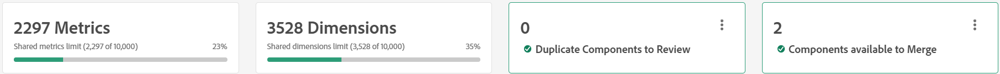
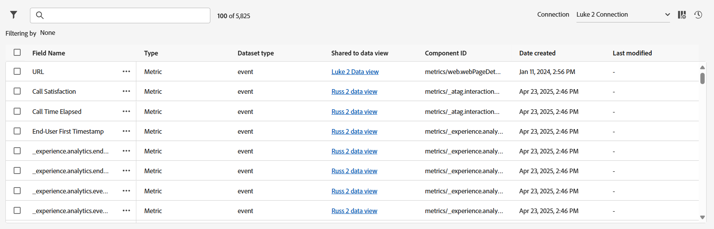

# 共用的量度和維度概觀

共用的量度和維度可提供一個中央位置，用於管理可用於任何數量資料檢視的維度和量度。 這些元件對於使用多個資料檢視的組織特別有用，尤其是如果這些資料檢視共用相同的元件設定。 對共用量度和維度所做的變更會立即套用至它共用的每個資料檢視。 編輯個別資料檢視時，元件名稱旁的圖示可識別共用的維度和量度。

雖然共用的維度和量度可讓共用元件用於許多資料檢視，但無法跨連線共用。

## 工作流程

大部分的組織會使用下列總體工作流程，隨時間刪除重複專案並維護維度和量度：

1. 從多個資料檢視共用的每個資料檢視匯入元件。 如果多個資料檢視中存在相同的維度或量度，Adobe建議匯入該元件的所有例項。 雖然此最佳實務會匯入重複專案，但會匯入重複專案，以便進行重複資料刪除，並保留其對Workspace專案的個別參考。
1. 檢閱使用相同元件ID但具有不同元件設定的所有元件。 針對每一組重複的元件，選取所需的元件設定，以套用至共用該元件ID的所有其他元件。
1. 檢閱使用相同元件ID且也有相同元件設定的所有元件。 這些維度或量度可輕鬆安全地合併。

## [!UICONTROL 共用的度量和維度]管理員

**[!UICONTROL Customer Journey Analytics]** > **[!UICONTROL 資料檢視]** > **[!UICONTROL 共用的量度和維度]**

導覽至此UI會顯示可在多個資料檢視中共用的所有目前維度和量度。 右上角包含兩個按鈕，用於將元件新增至此介面：

* **[!UICONTROL 匯入]**：開啟模組視窗，讓您選取資料檢視，然後選取元件以供共用。
* **[!UICONTROL 建立新的]**：開啟[共用元件編輯器](shared-component-editor.md)。

在這兩個按鈕的正下方，會顯示四個概觀卡片：

* **量度**：此連線中可在資料檢視間共用的量度總數。 每個連線最多可包含10,000個共用量度。
* **維度**：此連線中可在資料檢視間共用的維度總數。 每個連線最多可包含10,000個共用維度。
* **要檢閱的重複元件**：跨多個資料檢視匯入元件時，某些維度或量度可能會共用相同的元件ID。 此概觀卡片中的數字會顯示具有相同元件ID但不同元件設定的元件總數。 選取&#x200B;**[!UICONTROL 檢閱]**&#x200B;可啟用篩選器，讓您選取想要的元件，作為具有相同ID之所有其他元件的真實來源。
* **可合併的元件**：如果維度或量度共用相同的元件ID和相同的元件設定，則它們實際上完全相同並準備進行重複資料刪除。 選取&#x200B;**[!UICONTROL 檢閱]**&#x200B;可啟用篩選器，讓您將具有相同元件ID的所有元件合併為單一共用維度或量度。

所有共用的維度和量度都會顯示在四個概觀卡片下方。

* **篩選器**：選取圖示以顯示或隱藏可用的篩選器。 下列為可使用的篩選：
   * **[!UICONTROL 元件型別]**：僅檢視維度或僅檢視量度。
   * **[!UICONTROL 資料集]**：僅檢視資料集包含在元件共用之資料檢視中的元件。
   * **[!UICONTROL 資料檢視]**：僅檢視共用給該資料檢視的元件。
   * **[!UICONTROL 建立者]**：僅檢視指定使用者建立的元件。
   * **[!UICONTROL 重複]**：僅檢視與其他元件具有相同元件ID的元件。 這些篩選器與透過概觀卡片檢閱元件相同。
* **搜尋**：使用圖示，依名稱搜尋元件。
* **[!UICONTROL 連線]**：變更[連線](/help/connections/overview.md)的下拉式清單。 共用的維度和量度一律只適用於單一連線，
* **[!UICONTROL 自訂表格]**：選取圖示以顯示或隱藏表格中的欄。 可用的選項包括：
   * **[!UICONTROL 欄位名稱]**：共用維度或量度的名稱。 此欄位一律可見。
   * **[!UICONTROL 型別]**：指出元件是維度還是量度。 此欄位一律可見。
   * **[!UICONTROL 資料集型別]**：資料集的型別。 大部分的資料集都是事件資料集。
   * **[!UICONTROL 共用至資料檢視]**：此元件共用至的所有資料檢視。 此欄位一律可見。 選取連結以開啟一個強制回應視窗，其中列出此元件可用的所有資料檢視。
   * **[!UICONTROL 資料集]**：包含在此元件共用對象的每個資料檢視中的所有資料集。 選取連結以開啟列示元件所有資料集的強制回應視窗。
   * **[!UICONTROL 建立者]**：建立元件或將元件匯入共用量度和維度介面的使用者名稱。
   * **[!UICONTROL 結構描述型別]**：資料儲存所在的格式。 範例包括`string`、`double`或`boolean`。
   * **[!UICONTROL 元件識別碼]**：維度或量度的元件識別碼。 在此介面中共用相同元件ID的任何元件都必須檢閱並刪除重複專案。
   * **[!UICONTROL 結構描述]**：維度或量度的結構描述路徑。 例如，`web.webPageDetails.URL`。
   * **[!UICONTROL 描述]**：元件的[描述](/help/data-views/component-settings/overview.md)。
   * **[!UICONTROL 內容標籤]**：元件的[內容標籤](/help/data-views/component-settings/overview.md)。
   * **[!UICONTROL 包含/排除值]**：列出[包含/排除值](/help/data-views/component-settings/include-exclude-values.md)下指定的規則數目。
   * **[!UICONTROL 資料使用標籤]**：結構描述欄位的[資料使用標籤](https://experienceleague.adobe.com/en/docs/experience-platform/data-governance/labels/overview)。
   * **[!UICONTROL 已棄用]**：表示是否已設定已棄用的標幟。
   * **[!UICONTROL 格式]**：值出現的格式。 布林值通常顯示為`True | False`，量度通常顯示為`Decimal`等。
   * **[!UICONTROL 量度重複資料刪除]**：元件的[量度重複資料刪除](/help/data-views/component-settings/metric-deduplication.md)設定。
   * **[!UICONTROL 行為]**：元件的[行為](/help/data-views/component-settings/behavior.md)設定。
   * **[!UICONTROL 歸因]**：元件的[歸因](/help/data-views/component-settings/attribution.md)設定。
   * **[!UICONTROL 沒有值選項]**：元件的[沒有值選項](/help/data-views/component-settings/no-value-options.md)。
   * **[!UICONTROL 值分組]**：元件的[值分組](/help/data-views/component-settings/value-bucketing.md)設定。
   * **[!UICONTROL 持續性]**：元件的[持續性](/help/data-views/component-settings/persistence.md)設定。
   * **[!UICONTROL 小寫]**：表示元件是否已根據元件的[行為](/help/data-views/component-settings/behavior.md)設定啟用小寫。
   * **[!UICONTROL 子字串]**：元件的[子字串](/help/data-views/component-settings/substring.md)設定。
   * **[!UICONTROL 摘要資料群組]**：元件的[摘要資料群組](/help/data-views/component-settings/summary-data-group.md)設定。
   * **[!UICONTROL 建立日期]**：建立或匯入元件的日期。
   * **[!UICONTROL 上次修改時間]**：如果元件在建立後已修改，則為上次修改的日期。
* **[!UICONTROL 工作歷史記錄]**：選取圖示以開啟強制回應視窗，其中顯示從個別資料檢視匯入維度和量度的所有執行個體。

## 編輯元件或共用元件至資料檢視

使用元件旁的核取方塊可顯示您可以採取的所有可用動作。 支援多個選項。

*  **[!UICONTROL 編輯]**：在[共用元件編輯器](shared-component-editor.md)中開啟選取的維度和量度，您可以調整其[元件設定](/help/data-views/component-settings/overview.md)。 選取多個要編輯的元件時，這些元件都會在元件編輯器中開啟。 您可以在元件編輯器中shift +按一下元件，以編輯多個元件的相同欄位。
*  **[!UICONTROL 共用至資料檢視]**：開啟一個視窗，顯示所選連線中可用的所有資料檢視。 選取您想要讓此元件可用的每個資料檢視的核取方塊，然後選取&#x200B;**[!UICONTROL 共用]**。
*  **[!UICONTROL 取消共用至資料檢視]**：開啟一個視窗，顯示目前共用此元件的所有資料檢視。 選取您要移除此元件之可用性的每個資料檢視的核取方塊，然後選取&#x200B;**[!UICONTROL 取消共用]**。
*  **[!UICONTROL 複製]**：建立所選元件的復本。 系統會為複製的元件產生新的元件ID。
*  **[!UICONTROL 刪除]**：從介面移除選取的元件。 如果選取的元件與任何資料檢視共用，則會取消共用。
