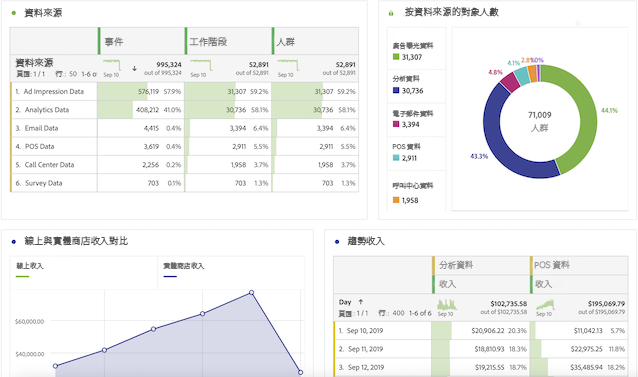

# CJAAdobe Analytics使用手冊

>[!NOTE]
>
>此頁正在構建中。

恭喜你，你的公司開始工作Customer Journey Analytics! 作為Adobe Analytics的用戶，你已經擁有了不錯的先機。 在與Customer Journey Analytics合作時，你會注意到一些巨大的差異和一些相似之處。 本頁旨在解釋那些沒有改變的事以及一些主要差異。 我們還將告訴您，您如何獲得有關新概念的更多資訊，以及進一步的步驟，使您的客戶之旅更輕鬆、更成功。

## 未更改的內容

在報告方面，您熟悉的許多內容沒有改變。 你仍然可以利用Analysis Workspace的力量來分析你的資料。 您還可以使用相同版本的Adobe Analytics儀表板。 工作區和儀表板的工作方式與傳統Adobe Analytics的工作方式基本相同。 Report Builder有一個新的介面，現在可以在PC、Mac電腦和Excel的Web版本上運行。 在報告方面，不同之處在於您能夠訪問更多要分析的跨渠道資料。 下面是一些多通道可視化的示例：

## 新架構

Customer Journey Analytics從Adobe Experience Platform獲取資料。 Experience Platform使您能夠集中並標準化來自任何系統或渠道的客戶資料和內容，並應用資料科學和機器學習來改進個性化體驗的設計和交付。

Platform 中的客戶資料以資料集形式儲存，而資料集是由結構和資料批次組成。如需有關 Platform 的詳細資訊，請參閱 [Adobe Experience Platform 架構概覽](https://experienceleague.adobe.com/docs/platform-learn/tutorials/intro-to-platform/basic-architecture.html?lang=en)。

您的CJA管理員已建立 [連接](/help/connections/create-connection.md) 到平台中的資料集。 然後他們建了 [資料視圖](/help/data-views/data-views.md) 在那些聯繫里。 將資料視圖視為類似於虛擬報告套件。 資料視圖是Customer Journey Analytics報告的基礎。

## 新概念和術語

與傳統的Adobe Analytics相比，CJA中的幾項功能已經更名並重新設計，以符合行業標準。 某些更新的術語包括段、虛擬報表套件、分類、客戶屬性和容器名稱。 耳熟能詳的概念，如電子貨幣和道具，以及它們施加的限制，已不復存在。

### Vars和道具

[!UICONTROL Customer Journey Analytics] 中不再使用 Adobe Analytics 舊版本的 [!UICONTROL eVar]、[!UICONTROL prop] 和 [!UICONTROL event]。您有不限數量的結構元素 (維度、量度、清單欄位)。因此，您曾在資料收集程序期間套用的所有歸因設定，現在都會在查詢時套用。

### 段現在是「篩選器」

[!UICONTROL Customer Journey Analytics 不再使用 eVar、prop 或事件，而是使用 AEP 結構。]這意味著現有的資料段都與 [!UICONTROL Customer Journey Analytics]。 此外，已將&quot;段&quot;更名為&quot;filters&quot;。

目前，您無法共用/發佈 [!UICONTROL 篩選] ([!UICONTROL 段]從 [!DNL Customer Journey Analytics] Experience Platform統一配置檔案或其他Experience Cloud應用程式。 此功能當前正在開發中。

### 計算量度

[!UICONTROL Customer Journey Analytics 不再使用 eVar、prop 或事件，而是使用 AEP 結構。]這意味著現有計算的度量都與 [!UICONTROL Customer Journey Analytics]。

### 會話和變數持久性設定

[!UICONTROL Customer Journey Analytics 會在報告時套用這些設定，而這些設定現在會顯示於「資料檢視」。]這些設定的變更現在可回溯，使用多個「資料檢視」即可擁有多個版本！

### 虛擬報告套件現在是「資料視圖」

### 分類現在是「查找資料集」

### 客戶屬性現在是「配置式資料集」

### 命中容器現在是「事件」容器

### 訪問容器現在是「會話」容器

### 訪問者容器現在是「人」容器

### `Uniques Exceeded` 限制

[!UICONTROL Customer Journey Analytics 沒有唯一值的限制，因此無需擔心這些限制！]
