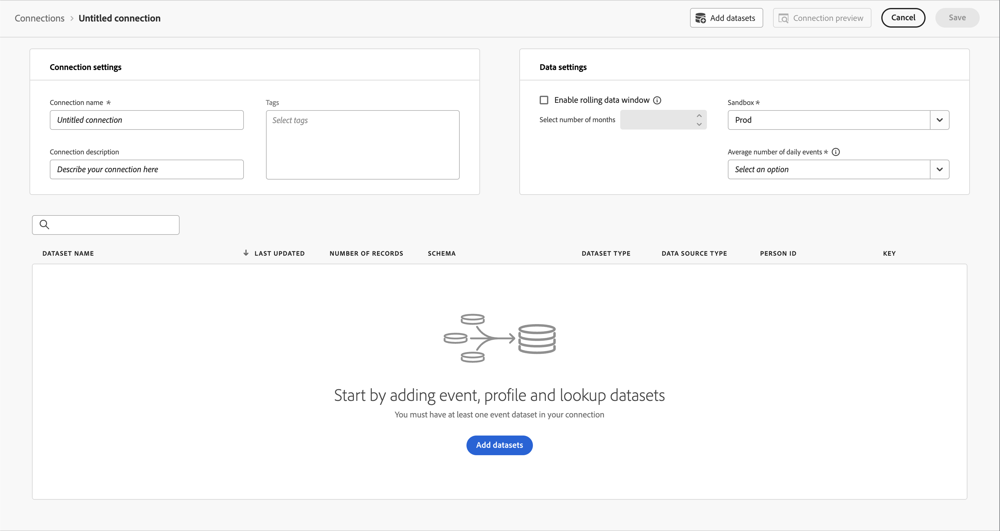

# 建立並設定連線以用於Customer Journey Analytics {#upgrade-create-connection}

<!-- markdownlint-disable MD034 -->

>[!CONTEXTUALHELP]
>id="cja-upgrade-connection"
>title="在 Customer Journey Analytics 中建立連線"
>abstract="連線可讓您將資料從Adobe Experience Platform轉譯為針對Customer Journey Analytics報表最佳化的格式。 在Customer Journey Analytics中建立連線很簡單，只需要幾分鐘即可完成。"

<!-- markdownlint-enable MD034 -->

>[!NOTE]
> 
>必須先完成所有先前的升級步驟，才能依照本頁面的步驟操作。 您可以依照[建議的升級步驟](/help/getting-started/cja-upgrade/cja-upgrade-recommendations.md#recommended-upgrade-steps-for-most-organizations)操作，也可以依照[Adobe Analytics為您的組織動態產生的升級步驟操作，以Customer Journey Analytics升級問卷](https://gigazelle.github.io/cja-ttv/)。
>
>完成此頁面上的步驟後，請繼續依照建議的升級步驟或動態產生的升級步驟操作。

<!-- Should we single source this instead of duplicate it? The following steps were copied from: /help/connections/create-connection.md -->

以下資訊說明如何建立和設定連線，以及如何將Experience Platform資料集新增到您建立的連線。 如需建立及設定連線的詳細資訊，請參閱[建立或編輯連線](/help/connections/create-connection.md)。

## 建立和設定連線 {#create-connection}

1. 在 Customer Journey Analytics 中選取&#x200B;**[!UICONTROL 「連線」]**&#x200B;索引標籤。
1. 選取&#x200B;**[!UICONTROL 「建立新連線」]**。

   

1. 進行連線設定。

   | 設定 | 說明 |
   | --- | --- |
   | **[!UICONTROL 連線名稱]** | 為連線輸入唯一名稱。 |
   | **[!UICONTROL 連線說明]** | 說明此連線的用途。 |
   | **[!UICONTROL 沙箱]** | 在 Experience Platform 中，選擇您要連線之資料集所屬的沙箱。
Adobe Experience Platform 提供的[沙箱](https://experienceleague.adobe.com/zh-hant/docs/experience-platform/sandbox/home)可將單一 Platform 執行個體分割成個別的虛擬環境，以利開發及改進數位體驗應用程式。 您可將沙箱視為內含資料集的「資料獨立單位」。沙箱可用於控制資料集的存取權限。
當您選取沙箱後，左側欄會顯示您可以從該沙箱提取的所有資料集。 |
   | **[!UICONTROL 啟用滾動資料時間窗口]** | 勾選這個核取方塊可讓您在連線層級將 Customer Journey Analytics 資料保留定義為以月為單位的滾動時段 (1 個月、3 個月、6 個月等)。
資料保留是以事件資料集時間戳記為基礎，僅適用於事件資料集。由於無適用的時間戳記，因此輪廓或查詢資料集不存在滾動資料時間窗口設定。不過，如果您的連線在一個或多個事件資料集之外還包含任何輪廓或查詢資料集，則會為相同時段保留該資料。
 主要優點在於您只會儲存或報告適用且實用的資料，並刪除不再實用的舊資料。這有助於您未超過合約限制，並減少超額使用費用的風險。
如果您保留預設值 (未勾選)，Adobe Experience Platform 資料保留設定將取代保留期間。如果您在 Experience Platform 中有 25 個月的資料，Customer Journey Analytics 會透過回填取得 25 個月的資料。如果您在 Platform 中刪除其中 10 個月的資料，Customer Journey Analytics 則會保留剩餘 15 個月的資料。 |
   | **[!UICONTROL 新增資料集]** (請參閱底下) | 如果沒有資料集出現在您的資料集清單中，請新增資料集。 |
   | **[!UICONTROL 資料集名稱]** | 選取一個或多個要拉進 Customer Journey Analytics 中的資料集，然後選取「**[!UICONTROL 新增]**」。
(如果有很多資料集可選擇，可使用資料集清單上方的「搜尋資料集」搜尋列，搜尋合適的資料集)。 |
   | **[!UICONTROL 上次更新時間]** | 僅適用於事件資料集，系統會自動將此設定設為 Experience Platform 中以事件為基礎的結構描述中的預設時間戳記欄位。 「不適用」代表此資料集不含任何資料。 |
   | **[!UICONTROL 記錄數量]** | Experience Platform 中資料集的上個月記錄總數。 |
   | **[!UICONTROL 結構描述]** | 在 Adobe Experience Platform 中建立資料集所根據的[結構描述](https://experienceleague.adobe.com/zh-hant/docs/experience-platform/xdm/schema/composition)。 |
   | **[!UICONTROL 資料集類型]** | Customer Journey Analytics 會針對您新增至此連線的各個資料集，根據傳入的資料自動設定資料集類型。 有 3 種不同的資料集類型：事件資料、輪廓資料和查詢資料。 請參閱下表提供的資料集類型說明。 |
   | **[!UICONTROL 粒度]** | 資料集中資料的粒度；僅適用於摘要資料集。 |
   | **[!UICONTROL 資料來源類型]** | 資料集的資料來源類型。不適用於摘要資料集。 |
   | **[!UICONTROL 人員 ID]** | 從可用身分識別的下拉式清單中選取人員 ID。這些身分識別是在 Experience Platform 的資料集結構中所定義。 若要了解如何以「身分識別對應」作為人員 ID，請參閱以下說明。
重要事項：如果沒有人員 ID 可供選擇，表示結構描述中尚未定義一個或多個人員 ID。請觀看[這部影片](https://www.youtube.com/watch?v=G_ttmGl_LRU)，了解如何在 Experience Platform 中定義身分識別。 |
   | **[!UICONTROL 索引鍵]** | 僅適用於查詢資料集 (例如 _id)。 |
   | **[!UICONTROL 比對索引鍵]** | 僅適用於查詢資料集 (例如 _id)。 |
   | **[!UICONTROL 匯入新資料]** | 設定為開啟或關閉。 |
   | **[!UICONTROL 回填資料]** | 您可以要求將資料回填到資料集。例如，您可以要求回填最近 7 天的資料。正確設定資料集並測試連線。如果一切正常，您就能放心回填剩餘的資料。
此外，您也可以啟用按資料集匯入新資料。 |
   | **[!UICONTROL 回填狀態]** | 此狀態指示是否有任何回填資料在處理中。 |

   {style="table-layout:auto"}

## 新增及設定資料集 {#add-dataset}

您可以在建立連線時新增Experience Platform資料集。

1. 在「連線設定」對話框中，選取「**[!UICONTROL 新增資料集]**」。

1. 在「[!UICONTROL 選取資料集]」步驟中，您會看到 Experience Platform 資料集的清單。

   

   對於每個資料集，清單會顯示：

   | 欄 | 說明 |
   |---|---|
   | 資料集 | 資料集的名稱。選取名稱即可將您導向 Experience Platform 中的資料集。選取「」可顯示含有資料集更多詳細資訊的快顯視窗。您可以選取「**[!UICONTROL 在 Platform 中編輯]**」，以直接在 Experience Platform 編輯資料集。 |
   | 資料集類型 | 資料集的類型：事件、輪廓、查詢或摘要。 |
   | 記錄數量 | Experience Platform 中資料集的上個月記錄總數。 |
   | 結構描述 | 資料集的結構描述。選取名稱可將您導向 Experience Platform 中的結構描述。 |
   | 上一個批次 | Experience Platform 中擷取之上一個批次的狀態。請參閱[批次狀態](https://experienceleague.adobe.com/zh-hant/docs/experience-platform/ingestion/batch/troubleshooting#batch-states)以了解更多資訊。 |
   | 資料集 ID | 資料集的 ID。 |
   | 上次更新時間 | 資料集的最後更新時間戳記。 |

1. 選取一或多個資料集，然後選取「**[!UICONTROL 下一步]**」。連線中必須至少包含一個事件資料集。
   * 若要變更資料集清單中顯示的欄，請選取「」並選取要在「[!UICONTROL 自訂表格]」對話框中顯示的欄。
   * 要搜尋特定資料集，請使用搜尋欄位「」。
   * 要讓所選資料集切換為顯示或隱藏，請選取「」「**[!UICONTROL 隱藏已選取]**」或者「**[!UICONTROL 顯示已選取]**」。
   * 要將已選取資料集清單中的資料集刪除，請使用「」。要刪除所有已選取的資料集，請選取「**[!UICONTROL 全部清除]**」。

1. 現在，請逐一設定資料集。

   

   | 設定 | 說明 |
   | --- | --- |
   | **[!UICONTROL 人員 ID]** | 僅適用於事件和輪廓資料集。從可用身分識別的下拉式清單中選取人員 ID。這些身分識別是在 Experience Platform 的資料集結構中所定義。 若要了解如何以「身分識別對應」作為人員 ID，請參閱以下說明。
如果沒有人員 ID 可以選擇，表示結構描述中尚未定義一或多個人員 ID。有關詳細資訊，請參閱[在 UI 中定義身分識別欄位](https://experienceleague.adobe.com/zh-hant/docs/experience-platform/xdm/ui/fields/identity)。 
所選人員 ID 的值會區分大小寫。例如，`abc123` 和 `ABC123` 是兩個不同的值。 |
   | **[!UICONTROL 時間戳記]** | 僅適用於事件和摘要資料集，系統會自動將此設定設為 Experience Platform 中以事件為基礎的結構描述之預設時間戳記欄位。 |
   | **[!UICONTROL 索引鍵]** | 僅適用於查詢資料集。用於查詢資料集的索引鍵。 |
   | **[!UICONTROL 比對索引鍵]** | 僅適用於查詢資料集。要加入其中一個事件資料集的索引鍵。若此清單空白，您可能尚未新增或設定事件資料集。 |
   | **[!UICONTROL 時區]** | 僅適用於摘要資料。為時間序列摘要資料選取適當的時區。 |
   | **[!UICONTROL 資料來源類型]** | 選取資料來源類型。 資料來源的類型包括： <ul><li>[!UICONTROL 網頁資料]</li><li>[!UICONTROL 行動應用程式資料]</li><li>[!UICONTROL POS 資料]</li><li>[!UICONTROL CRM 資料]</li><li>[!UICONTROL 調查資料]</li><li>[!UICONTROL 呼叫中心資料]</li><li>[!UICONTROL 產品資料]</li><li> [!UICONTROL 帳戶資料]</li><li> [!UICONTROL 交易資料]</li><li>[!UICONTROL 客戶回饋資料]</li><li> [!UICONTROL 其他]</li></ul>該欄位用於調查正在使用之資料來源的類型。 |
   | **[!UICONTROL 匯入新資料]** | 如果您想建立持續的連線，請啟用此選項。透過持續連線，新增至資料集中的新資料批次將在 Workspace 中自動可用。 |
   | **[!UICONTROL 資料集回填]** | 啟用「**[!UICONTROL 回填所有現有資料]**」以確保回填所有現有資料。  選取「**[!UICONTROL 要求回填]**」以回填特定期間的歷史資料。您最多可以定義 10 個資料集回填期間。<ol><li>透過輸入開始和結束資料或使用 選取日期來定義期間。</li><li>選取「**[!UICONTROL 將回填排入佇列]**」將回填加入清單，或選取「**[!UICONTROL 取消]**」以取消。</li></ol>對於每個項目，選取 以編輯期間，或選取 以刪除該項目。  關於回填：<ul><li>您可以個別回填每個資料集。</li><li>系統會優先處理新增至連線中資料集的新資料，因此新資料的延遲最低。</li><li>所有回填 (歷史) 資料的匯入速度都會比較慢。歷史資料多寡會影響延遲長度。</li><li>Analytics 來源連接器可為生產沙箱可匯入最多 13 個月的資料 (不論資料量多寡)。非生產沙箱的回填期限制為 3 個月。</li></ul> |
   | **[!UICONTROL 轉換資料集]** | 對於特定B2B查詢資料集，您可以啟用資料集轉換，以適當的B2B人員型報表案例。 |
   | **[!UICONTROL 回填狀態]** | 可能的狀態指標包括：<ul><li>成功</li><li>正在處理 X 個回填</li><li>關閉</li></ul> |
   | **[!UICONTROL 資料集 ID]** | 此 ID 是自動產生的。 |
   | **[!UICONTROL 說明]** | 建立資料集時為其提供的說明。 |
   | **[!UICONTROL 資料集大小]** | 資料集的大小。 |
   | **[!UICONTROL 結構描述]** | 在 Adobe Experience Platform 中建立資料集所根據的結構描述。 |
   | **[!UICONTROL 資料集]** | 資料集的名稱。 |
   | **[!UICONTROL 預覽：*資料集名稱&#x200B;*]** | 預覽包含日期、我的 ID 和識別碼等欄的資料集。 |
   | **[!UICONTROL 移除]** | 您可以刪除或移除資料集並變更人員 ID，而不需要刪除整個連線。 刪除或移除可減少資料擷取的相關成本，以及重新建立整個連線和相關資料檢視的繁複流程。 |

   {style="table-layout:auto"}

1. 繼續執行[建議的升級步驟](/help/getting-started/cja-upgrade/cja-upgrade-recommendations.md#recommended-upgrade-steps-for-most-organizations)或[動態產生的升級步驟](https://gigazelle.github.io/cja-ttv/)。
