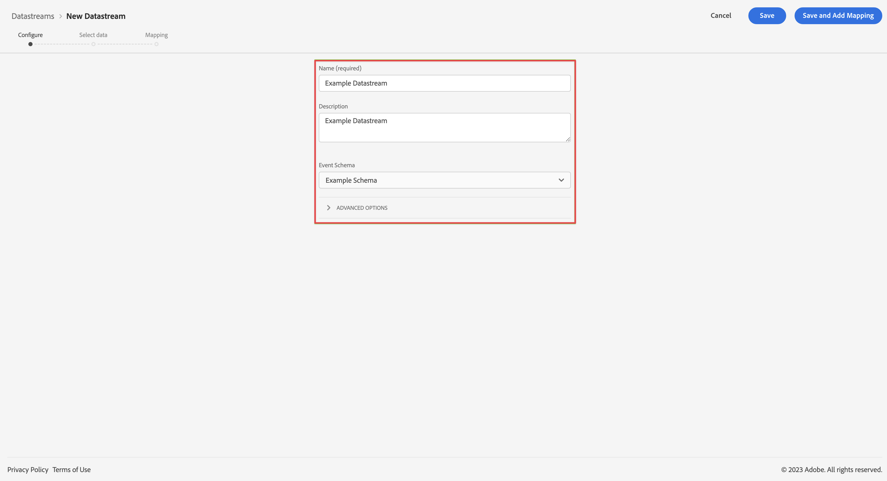

# 建立用於 Customer Journey Analytics 的資料流 {#upgrade-create-datastream}

<!-- markdownlint-disable MD034 -->

>[!CONTEXTUALHELP]
>id="cja-upgrade-datastream-create"
>title="在 Adobe Experience Platform 中建立資料流"
>abstract="資料流是將您的資料傳送至所有已設定服務的中介位置。 在 Adobe Experience Platform 中建立此位置。  在平台介面中初次建立資料流只需幾分鐘。"

<!-- markdownlint-enable MD034 -->

{{upgrade-note-step}}

<!-- Should we single source this instead of duplicate it? The following steps were copied from: /help/data-ingestion/aepwebsdk.md-->

資料流代表實作 Adobe Experience Platform Web 和 Mobile SDK 時的伺服器端設定。 使用 Adobe Experience Platform SDK 收集資料時，資料會傳送至 Adobe Experience Platform Edge Network。 此資料流決定資料要轉送到哪些服務。

在設定中，您想設定資料流以傳送收集的資料至您在 Adobe Experience Platform 中的資料集。

>[!NOTE]
>
>以下步驟僅適用於使用 AppMeasurement 或 Analytics 擴充功能 (標記) 的 Adob&#x200B;&#x200B;e Analytics 實施。
>
>如果您的 Adob&#x200B;&#x200B;e Analytics 實施使用 Web SDK 或 Web SDK 擴充功能，則資料流已存在於您的 Adob&#x200B;&#x200B;e Analytics 環境中。

若要設定您的資料流：

1. 在 Adobe Experience Platform 中，從左側邊欄的「[!UICONTROL 資料收集]」中選取「**[!UICONTROL 資料收集]**」。

1. 選取「**[!UICONTROL 新資料流]**」。

1. 命名並描述您的資料流。 從[!UICONTROL 「事件結構描述」]清單中選取您的結構描述。

   

1. 選取&#x200B;**[!UICONTROL 「儲存」]**。

{{upgrade-final-step}}
