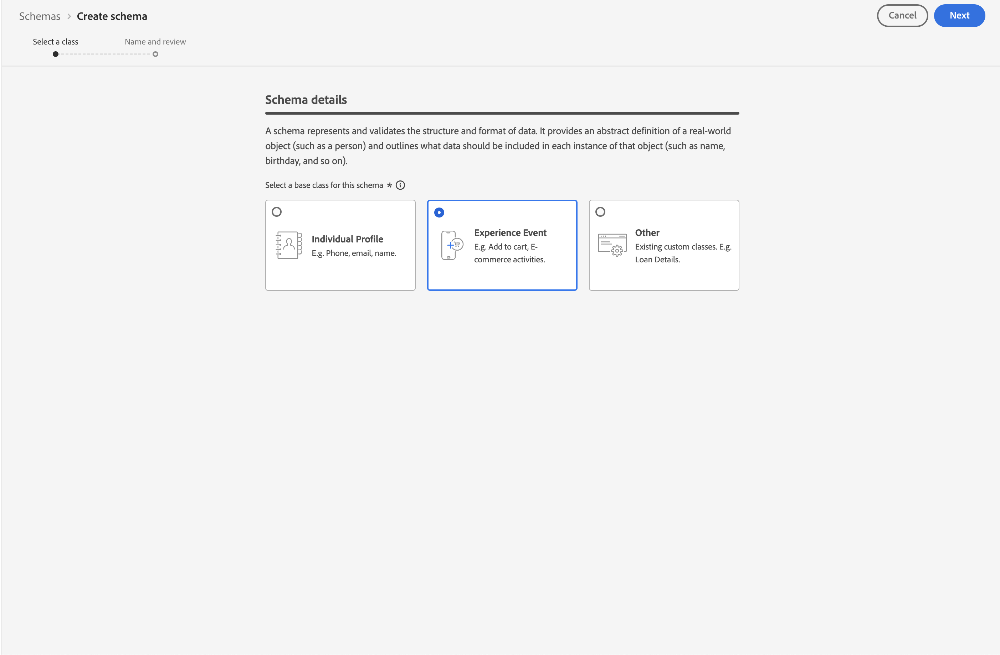

# 建立用於 Customer Journey Analytics 的自訂綱要 {#create-custom-schema}

<!-- markdownlint-disable MD034 -->

>[!CONTEXTUALHELP]
>id="cja-upgrade-schema-create"
>title="在 Adobe Experience Platform 中建立所需的自訂結構描述"
>abstract="使用 Adobe Experience Platform 使用者介面建立結構描述，以便 Adobe 了解儲存資料的正確格式。  此步驟包含實際建立您組織所同意的結構描述。在 Adobe Experience Platform 介面中建立結構描述的預估時間約為一週，取決於需要建立的維度和量度的數量。"

<!-- markdownlint-enable MD034 -->

<!-- markdownlint-disable MD034 -->

>[!CONTEXTUALHELP]
>id="cja-upgrade-schema-create-default-aa"
>title="使用 Adobe Analytics ExperienceEvent 欄位群組建立結構描述"
>abstract="使用「Adobe Analytics ExperienceEvent」欄位群組在 Adobe Experience Platform 中建立一個包含 Adobe Analytics 使用之所有欄位的結構描述。  根據 Adobe Analytics ExperienceEvent 欄位群組建立結構描述是簡單的操作，只需幾分鐘即可完成。"

<!-- markdownlint-enable MD034 -->

<!-- markdownlint-disable MD034 -->

>[!CONTEXTUALHELP]
>id="cja-upgrade-schema-profile"
>title="讓您的結構描述啟用設定檔"
>abstract="在您的結構描述中啟用設定檔以供 Adobe Real-time CDP 使用。之所以顯示此步驟是因為您選取希望與 Adobe Real-time CDP 整合。  由於這個步驟包含點選單一方塊，所以這個步驟只需幾分鐘。"

<!-- markdownlint-enable MD034 -->

{{upgrade-note-step}}

>[!IMPORTANT]
>
>在開始建立自訂結構描述之前，請與整個組織的資料團隊和其他利害關係人合作，為您組織的 Customer Journey Analytics 和您使用的其他 Adob&#x200B;&#x200B;e Experience Platform 應用程式確定理想結構描述設計。若要了解更多資訊，請參閱「[建構您的結構描述以用於 Customer Journey Analytics](/help/getting-started/cja-upgrade/cja-upgrade-schema-architect.md)」。

以下部分介紹如何建立可用於 Customer Journey Analytics 的結構描述。有以下結構描述選項可供使用：

* **自訂 XDM 結構描述：** (建議) 允許根據您的組織需求和您使用的特定平台應用程式量身定制的簡化結構描述。未來需進行的任何變更都很簡單。

* **使用 Adob&#x200B;&#x200B;e Analytics ExperienceEvent 欄位群組的 Adob&#x200B;&#x200B;e Analytics 結構描述：** 需要增加數千個不需要的欄位。未來需進行的任何變更都會更困難。

有關這些結構描述選項的更多資訊，請參閱「[選擇您的 Customer Journey Analytics 結構描述](/help/getting-started/cja-upgrade/cja-upgrade-schema-existing.md)」。

## 建立結構描述

您為 Web SDK 實施定義的自訂結構描述代表您收集到 Adob&#x200B;&#x200B;e Experience Platform 中的資料模型。

若要建立自訂結構描述：

<!-- Should we single source this instead of duplicate it? The following steps were copied from: /help/data-ingestion/aepwebsdk.md-->

1. 在左側邊欄的 Adobe Experience Platform 中，選取「[!UICONTROL 資料管理]」中的「**[!UICONTROL 結構描述]**」。

1. 選取&#x200B;**[!UICONTROL 「建立結構」]**。

1. 在建立結構描述精靈的「**[!UICONTROL 選取類別]**」步驟中：

   1. 選取「**[!UICONTROL 體驗活動]**」。

      

      >[!INFO]
      >
      >    體驗事件結構描述可用來建立設定檔&#x200B;_行為_ (例如場景名稱、推播按鈕至新增至購物車) 模型。個體設定檔結構描述可用來建立設定檔&#x200B;_屬性_ (例如姓名、電子郵件、性別) 模型。

   1. 選取&#x200B;**[!UICONTROL 「下一步」]**。

1. 在「[!UICONTROL 建立結構描述]」精靈的「[!UICONTROL 命名和審查步驟]」中：

   1. 輸入您結構描述的&#x200B;**[!UICONTROL 結構描述顯示名稱]**&#x200B;與 (選用) **[!UICONTROL 說明]**。

      

   1. 選取&#x200B;**[!UICONTROL 「完成」]**。

1. 新增所有欄位群組，包含您想要結構描述中包含的任何欄位。

   欄位群組是可重複使用的物件和屬性集合，可讓您輕鬆擴充結構描述。

   1. 在「**[!UICONTROL 欄位群組]**」部分中，選取「**[!UICONTROL + 新增]**」。

      

   1. 在[!UICONTROL 「新增欄位群組」]對話框中，從清單中選取&#x200B;**[!UICONTROL 「AEP Web SDK ExperienceEvent」]**&#x200B;欄位群組。

      

      您可以選取預覽按鈕，以查看屬於此欄位群組之欄位的預覽，例如 `web > webPageDetails > name`。

      

      選取&#x200B;**[!UICONTROL 「返回」]**&#x200B;來關閉預覽。

   1. (選用) 選取您想要包含的任何其他欄位群組。

      如果您選擇使用預設 Adob&#x200B;&#x200B;e Analytics 結構描述而不是建立自訂 XDM 結構描述，您現在可以新增 Adob&#x200B;&#x200B;e Analytics ExperienceEvent 欄位群組。但是，Adobe 建議建立自訂 XDM 結構描述，而不是新增此欄位群組。

      有關這些結構描述選項的更多資訊，請參閱「[選擇您的 Customer Journey Analytics 結構描述](/help/getting-started/cja-upgrade/cja-upgrade-schema-existing.md)」。

   1. 選取&#x200B;**[!UICONTROL 「新增欄位群組」]**。

1. (選用) 如果您有想要包含在結構描述中的自訂欄位，請建立自訂欄位群組並將自訂欄位新增至該欄位群組。

   1. 在「**[!UICONTROL 欄位群組]**」部分中，選取「**[!UICONTROL + 新增]**」。

      

   1. 在「[!UICONTROL 新增欄位群組]」對話框中，選取「**[!UICONTROL 建立新欄位群組]**」。

   1. 指定顯示名稱和選用結構描述，然後選取「**[!UICONTROL 新增欄位群組]**」。

1. 在[!UICONTROL 「結構」]面板中，選取結構名稱旁的 **[!UICONTROL +]**。

   

1. 在[!UICONTROL 「欄位屬性」]面板中，輸入 `Identification` 作為名稱，**[!UICONTROL 「識別」]**&#x200B;作為[!UICONTROL 顯示名稱]，選取&#x200B;**[!UICONTROL 「物件」]**&#x200B;作為[!UICONTROL 類型]，並選取&#x200B;**[!UICONTROL 「ExperienceEvent 核心 v2.1」]**&#x200B;作為[!UICONTROL 欄位群組]。

   >[!NOTE]
   >
   >如果該欄位群組不適用，請尋找另一個包含身分識別欄位的欄位群組。或[建立一個新欄位群組](https://experienceleague.adobe.com/docs/experience-platform/xdm/ui/resources/field-groups.html?lang=zh-Hant)，並[新增身分識別欄位](https://experienceleague.adobe.com/docs/experience-platform/xdm/ui/fields/identity.html?lang=zh-Hant#define-a-identity-field) (如 `ecid`、`crmId` 以及您需要的其他欄位) 至該欄位群組並選取該欄位群組。

   

   識別物件新增識別功能至您的結構描述。在您的案例中，您想使用 Experience Cloud ID 和電子郵件地址識別瀏覽您網站的設定檔。還有許多其他屬性可用於追蹤您個人的身分識別 (例如客戶 ID、忠誠度 ID)。

   選取&#x200B;**[!UICONTROL 「套用」]**&#x200B;將此物件加入您的結構描述。

1. 在剛剛新增的身分識別物件中選取 **[!UICONTROL ecid]** 欄位，然後在右側面板的[!UICONTROL 「身分識別命名空間」]清單中，選取&#x200B;**[!UICONTROL 「身分識別」]**&#x200B;和&#x200B;**[!UICONTROL 「主要身分識別」]**&#x200B;和 **[!UICONTROL ECID]**。

   

   您將 Experience Cloud Identity 指定為 Adobe Experience Platform Identity 服務可用於組合 (拼接) 具有相同 ECID 的設定檔的行為的主要身分。

   選取&#x200B;**[!UICONTROL 「套用」]**。您會看到指紋圖示出現在 ecid 屬性中。

1. 在剛剛新增的身分識別物件中選取&#x200B;**[!UICONTROL 「電子郵件」]**&#x200B;欄位，然後在[!UICONTROL 「欄位屬性」]面板的[!UICONTROL 「身分識別命名空間」]清單中選取&#x200B;**[!UICONTROL 「身分識別」]**&#x200B;和&#x200B;**[!UICONTROL 「電子郵件」]**。

   

   您將電子郵件地址指定為 Adobe Experience Platform Identity 服務可用於結合 (拼接) 設定檔行為的另一個身分。

   選取&#x200B;**[!UICONTROL 「套用」]**。您會看到指紋圖示出現在電子郵件屬性中。

   選取&#x200B;**[!UICONTROL 「儲存」]**。

1. (選用) 如果您想將 Customer Journey Analytics 與 RTCDP 整合，請選取顯示結構描述名稱的結構描述根元素，然後選取&#x200B;**[!UICONTROL 設定檔]**&#x200B;開關。

   系統會提示您啟用設定檔的結構描述。啟用後，根據此結構將資料攝取至資料集時，該資料就會合併至即時客戶設定檔中。

   如需詳細資訊，請參閱[啟用結構以用於即時客戶設定檔](https://experienceleague.adobe.com/docs/experience-platform/xdm/tutorials/create-schema-ui.html?lang=zh-Hant#profile)。

   >[!IMPORTANT]
   >
   >啟用設定檔的結構描述後，將無法為設定檔停用結構描述。

   

1. 選取&#x200B;**[!UICONTROL 「儲存」]**，即可儲存您的結構。

   您已建立最小結構，以建立可從您網站擷取的資料的模型。該結構可讓您使用 Experience Cloud Identity 和電子郵件地址來識別設定檔。透過啟用設定檔的結構，即可確保將從您網站擷取的資料新增至即時客戶設定檔。

   除了行為資料之外，您也可以從您的網站擷取設定檔屬性資料 (例如訂閱電子報的設定檔詳細資訊)。

   若要擷取此設定檔資料，您可以：

   * 根據 XDM 個體設定檔架構類別建立結構。

   * 將「設定檔核心 v2」欄位群組新增至結構。

   * 根據「設定檔核心 v2」欄位群組新增識別物件。

   * 將 Experience Cloud ID 定義為主要識別碼，並將電子郵件定義為識別碼。

   * 啟用該設定檔結構描述

   請參閱[在 UI 中建立和編輯結構](https://experienceleague.adobe.com/docs/experience-platform/xdm/ui/resources/schemas.html?lang=zh-Hant)，了解有關向結構添加和刪除欄位群組和個別欄位的詳細資訊。

{{upgrade-final-step}}
