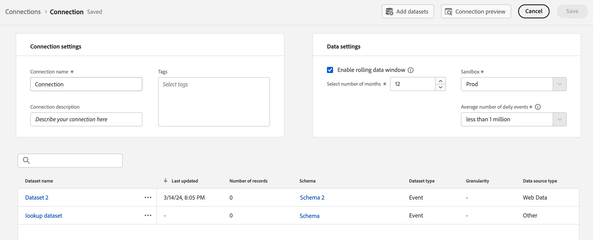

# 將 Analytics 來源連接器資料集新增至連線 {#upgrade-source-connector-dataset}

<!-- markdownlint-disable MD034 -->

>[!CONTEXTUALHELP]
>id="cja-upgrade-source-connector-dataset"
>title="新增 Analytics 來源連接器資料集至您的連線"
>abstract="現在，Analytics 報告套裝的歷史資料已位於 Adobe Experience Platform，請將該資料集新增至您最初設定 Customer Journey Analytics 時所建立的現有連線。此步驟完成後，即可使用 Customer Journey Analytics 中的歷史資料。  在 Customer Journey Analytics 中新增資料集至連線是很簡單的操作，只需幾分鐘即可完成。"

<!-- markdownlint-enable MD034 -->

{{upgrade-note-step}}

## 了解 Analytics 來源連接器如何讓歷史資料進入 Customer Journey Analytics

您可以使用 Analytics 來源連接器，讓 Adobe Analytics 報告套裝資料進入 Adobe Experience Platform。然後，這些資料可以用作 Customer Journey Analytics 的歷史資料。

此流程假設您[在升級到 Customer Journey Analytics 時想要建立 XDM 結構描述](/help/getting-started/cja-upgrade/cja-upgrade-schema-create.md)，因為您需要一個以您組織需求和所用特定 Platform 應用程式量身定制的精簡結構描述。

若要使用 Analytics 來源連接器讓歷史資料進入 Customer Journey Analytics，您需要：

1. [建立 Analytics 來源連接器的 XDM 結構描述](/help/getting-started/cja-upgrade/cja-upgrade-source-connector-schema.md)

1. 如果您還沒有 Analytics 來源連接器，可[建立 Analytics 來源連接器並將欄位對應到 XDM 結構描述](/help/getting-started/cja-upgrade/cja-upgrade-source-connector.md)。

   或

   如果您已擁有 Analytics 來源連接器，則可[將欄位從來源連接器對應到 XDM 結構描述](/help/getting-started/cja-upgrade/cja-upgrade-from-source-connector.md)。

1. 請依下面的說明，將 Analytics 來源連接器資料集新增至連線。

## 將 Analytics 來源連接器資料集新增至連線

您[為歷史資料建立 Analytics 來源連接器](/help/getting-started/cja-upgrade/cja-upgrade-source-connector.md)後，系統會自動為 Analytics 資料建立一個資料集。

您需要將此自動建立的資料集新增至為 Web SDK 實施建立的相同連線。這樣做會讓 Analytics 資料進入 Customer Journey Analytics 內的資料檢視，成為您的 Web SDK 資料相同。

若要將此自動建立的資料集新增至為 Web SDK 實施建立的相同連線：

1. 在 Customer Journey Analytics 的頂部選單中選取「**[!UICONTROL 連線]**」，也可以自「**[!UICONTROL 資料管理]**」選取。

1. 選取您[為 Web SDK 實施而建立](/help/getting-started/cja-upgrade/cja-upgrade-connection.md)的連線。

1. 選取「**[!UICONTROL 編輯]**」。

   

1. 在右上角，選取「**[!UICONTROL 新增資料集]**」。

   

1. 捲動至或搜尋自動建立的資料集 (這是建立 Analytics 來源連接器時的資料集)。

   此資料集的名稱是您的報告套裝名稱，後面附有 `midValues`。例如︰`My report suite midValues`

1. 選取資料集名稱旁的核取方塊，然後選取「**[!UICONTROL 下一步]**」。

   

1. 註明下列資訊：

   <!-- Copied from help/connections/create-connection.md. Should we single source? -->

   | 設定 | 說明 |
   | --- | --- |
   | **[!UICONTROL 個人 ID]** | 僅適用於事件和設定檔資料集。從可用身分識別的下拉式選單中選取人員ID。 這些身分識別是在 Experience Platform 的資料集結構描述中所定義。 若要了解如何以「身分識別對應」作為個人 ID，請參閱以下說明。
如果沒有個人 ID 可以選擇，表示結構描述中尚未定義一或多個個人 ID。有關詳細資訊，請參閱[在 UI 中定義身分識別欄位](https://experienceleague.adobe.com/zh-hant/docs/experience-platform/xdm/ui/fields/identity)。 
所選個人 ID 的值會區分大小寫。例如，`abc123` 和 `ABC123` 是兩個不同的值。 |
   | **[!UICONTROL 時間戳記]** | 僅適用於事件和摘要資料集，系統會自動將此設定設為 Experience Platform 中以事件為基礎的結構描述之預設時間戳記欄位。 |
   | **[!UICONTROL 時區]** | 僅適用於摘要資料。為時間序列摘要資料選取適當的時區。 |
   | **[!UICONTROL 資料來源類型]** | 選取資料來源類型。 資料來源的類型包括： <ul><li>[!UICONTROL 網頁資料]</li><li>[!UICONTROL 行動應用程式資料]</li><li>[!UICONTROL POS 資料]</li><li>[!UICONTROL CRM 資料]</li><li>[!UICONTROL 調查資料]</li><li>[!UICONTROL 呼叫中心資料]</li><li>[!UICONTROL 產品資料]</li><li> [!UICONTROL 帳戶資料]</li><li> [!UICONTROL 交易資料]</li><li>[!UICONTROL 客戶回饋資料]</li><li> [!UICONTROL 其他]</li></ul>該欄位用於調查正在使用之資料來源的類型。 |

   {style="table-layout:auto"}

1. 在「**[!UICONTROL 匯入新資料]**」部分，保持「**[!UICONTROL 匯入所有新資料]**」選項的停用狀態。

   由於您現在是使用 Analytics 來源連接器資料集來儲存歷史資料，因此您不要讓收集到的未來資料進入此資料集。

1. 在「**[!UICONTROL 資料集回填]**」部分中，選取「**[!UICONTROL 請求回填]**」。

1. 透過輸入開始日期和結束日期或選取行事曆圖示 ，可定義您要將回填連線至 Customer Journey Analytics 以納入的時間段。

   您必須明確指定您要求回填的日期。根據多種因素的影響，您可能需要執行以下任一項操作：

   * 選擇的結束日期與您一開始隨 Web SDK 實施收集資料的日期相同。

   * 選擇一個結束日期，該日期應是您最初開始隨 Web SDK 實施收集資料之日期的不久之後，然後使用資料檢視區段來劃分重疊的資料。

   * 選擇一個會讓資料更大幅重疊的結束日期，然後使用資料檢視來劃分重疊的資料。

     **註：** 此選項會使成本增加，因為會有更多列在連線中。

   <!-- Include any of the following?  Make sure you're explicit as to the dates you request backfill to. You want to request it to the date that you start gathering data with your Web SDK implementation. Also possibly include segments for any overlapping date. So you could request everything and then use a segment to exclude data that you don't want. That way if you need to move up the date, then you could change the date in the segment. Downside would be that you might pay for double rows.  When they do that, they're going to see all schema fields from both their custom schema and their Analytics schema. So they'll need to be cognizant to select the right fields, and never select any Analytics fields, because they will be mapped as part of the source connector. Never select any Analytics field group fields because they'll be mapped.  -->

1. 選取「**[!UICONTROL 佇列回填]**」。

1. 選取「**[!UICONTROL 新增資料集]**」，然後選取「**[!UICONTROL 儲存]**」以儲存連線。

1. (條件) 如果您使用查詢資料集，則必須建立查詢資料集並將其新增至您的連線。若需要更多資訊，請參閱「[建立查詢資料集來將 Customer Journey Analytics 的資料分類](/help/getting-started/cja-upgrade/cja-upgrade-dataset-lookup.md)」。

   只有在設定 Web SDK 實施時尚未執行此操作時才需要這樣做。

{{upgrade-final-step}}
