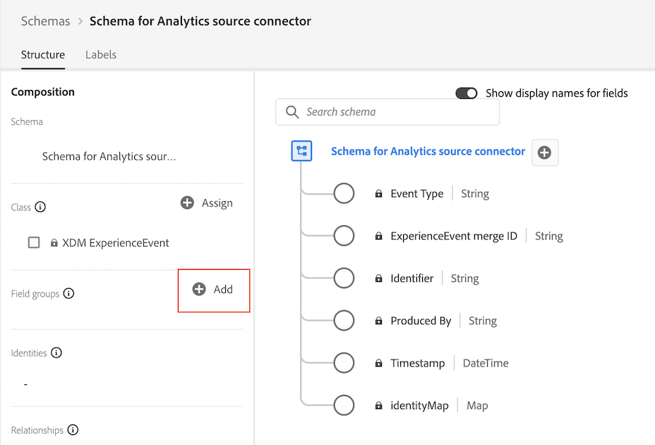

# 建立 Analytics 來源連接器的自訂結構描述 {#create-custom-schema}

<!-- markdownlint-disable MD034 -->

>[!CONTEXTUALHELP]
>id="cja-upgrade-source-connector-create-schema"
>title="建立 Analytics 來源連接器的結構描述"
>abstract="此結構描述是 Adobe Analytics ExperienceEvent 欄位群組，與構成您組織的自訂結構描述的所有欄位群組之組合。您可以將 Analytics 來源連接器使用的欄位對應至您組織的結構描述，並且僅用於歷史資料。  雖然本質上具有技術成分，但建立此結構描述可以在數小時內完成，如果您確切知道哪些欄位群組構成組織的自訂結構描述，則速度可能會更快。"

<!-- markdownlint-enable MD034 -->

<!-- markdownlint-disable MD034 -->

>[!CONTEXTUALHELP]
>id="cja-upgrade-source-connector-historical"
>title="為歷史資料建立 Analytics 來源連接器"
>abstract="您可以使用 Analytics 來源連接器，讓 Adobe Analytics 報告套裝資料進入 Adobe Experience Platform。然後，這些資料可以用作 Customer Journey Analytics 的歷史資料。"

<!-- markdownlint-enable MD034 -->

{{upgrade-note-step}}

## 了解 Analytics 來源連接器如何讓歷史資料進入 Customer Journey Analytics

您可以使用 Analytics 來源連接器，讓 Adobe Analytics 報告套裝資料進入 Adobe Experience Platform。然後，這些資料可以用作 Customer Journey Analytics 的歷史資料。

此流程假設您[想要建立自訂結構描述以便與 Customer Journey Analytics Web SDK 實施一起使用](/help/getting-started/cja-upgrade/cja-upgrade-schema-create.md)，因為您需要一個以您組織需求和所用特定 Platform 應用程式量身定制的精簡結構描述。

若要使用 Analytics 來源連接器讓歷史資料進入 Customer Journey Analytics，您需要：

1. 建立 Analytics 來源連接器的自訂結構描述，如以下所述。

1. 如果您還沒有 Analytics 來源連接器，可[建立 Analytics 來源連接器並將欄位對應到自訂結構描述](/help/getting-started/cja-upgrade/cja-upgrade-source-connector.md)。

   或

   如果您已擁有 Analytics 來源連接器，則可[將欄位從來源連接器對應到 XDM 結構描述](/help/getting-started/cja-upgrade/cja-upgrade-from-source-connector.md)。

1. [將 Analytics 來源連接器資料集新增至連線](/help/getting-started/cja-upgrade/cja-upgrade-source-connector-dataset.md)

## 建立 Analytics 來源連接器的自訂結構描述

您應該已經為您的 Experience Platform Web SDK 實施[建立新的自訂結構描述](/help/getting-started/cja-upgrade/cja-upgrade-schema-create.md)，以便與 Customer Journey Analytics 搭配使用。此結構描述應含有您計劃收集資料的欄位所屬任何欄位群組。

現在，您需要使用 Web SDK 結構描述中的相同欄位群組，並將這些群組新增至可與 Analytics 來源連接器一起使用的新結構描述中。

Analytics 來源連接器的這個結構描述需要包含：

* 您為 Web SDK 實施建立的自訂結構描述中所包含的全部欄位群組 (包括您已建立的任何自訂欄位群組)。(任何不屬於預設欄位群組的自訂欄位都應以自訂欄位群組的一部分新增至 Web SDK 結構描述中。) 

* Adobe Analytics ExperienceEvent 範本欄位群組

若要建立與 Analytics 來源連接器一起使用的自訂結構描述：

1. 在 Adob&#x200B;&#x200B;e Experience Platform 中，開始建立新的自訂結構描述，如「[建立自訂結構描述以便與您的 Customer Journey Analytics Web SDK 實施搭配使用](/help/getting-started/cja-upgrade/cja-upgrade-schema-create.md)」中所述。

1. 新增您為 Web SDK 實施建立的結構描述中包含的所有欄位群組 (包括任何自訂欄位群組)。

1. 新增完這些欄位群組後，要新增 Adob&#x200B;&#x200B;e Analytics ExperienceEvent 欄位群組：

   在「**[!UICONTROL 欄位群組]**」部分，選取「**[!UICONTROL 新增]**」以新增其他欄位群組。

   

1. 搜尋並選取 **[!UICONTROL Adobe Analytics ExperienceEvent 範本]**&#x200B;欄位群組。

   

1. 選取&#x200B;**[!UICONTROL 「新增欄位群組」]**。

1. 選取&#x200B;**[!UICONTROL 「儲存」]**，即可儲存您的結構。

{{upgrade-final-step}}
