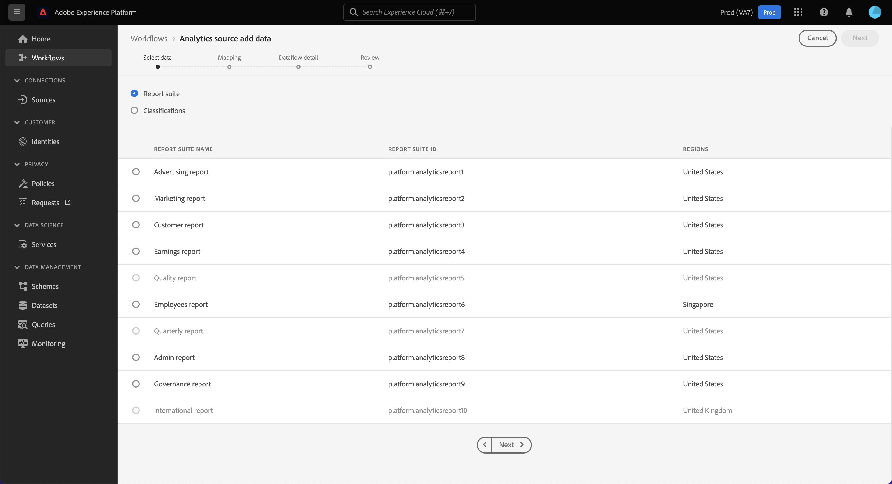

# 建立 Analytics 來源連接器和對應欄位 {#create-source-connector}

<!-- markdownlint-disable MD034 -->

>[!CONTEXTUALHELP]
>id="cja-upgrade-source-connector-create"
>title="建立 Analytics 來源連接器"
>abstract="使用 Analytics 來源連接器攝取報告套裝資料，以便在 Customer Journey Analytics 中使用。  使用預設設定建立 Analytics 來源連接器只需幾分鐘。"

<!-- markdownlint-enable MD034 -->

<!-- markdownlint-disable MD034 -->

>[!CONTEXTUALHELP]
>id="cja-upgrade-source-connector-map-fields"
>title="建立 Analytics 來源連接器和對應結構描述欄位"
>abstract="來源連接器需要知道如何將 Adobe Analytics 欄位對應至您組織的結構描述。使用此介面為來源連接器提供該對應。此步驟是新增歷史資料至 Customer Journey Analytics 的環節之一。  此步驟所需時間在很大程度上取決於您必須對應的維度和量度的數量。此步驟並不困難，但是它十分繁瑣且重複性高。預計資料流對應大約需要一週的時間才能完成。"

<!-- markdownlint-enable MD034 -->

{{upgrade-note-step}}

## 了解 Analytics 來源連接器如何讓歷史資料進入 Customer Journey Analytics

您可以使用 Analytics 來源連接器，讓 Adobe Analytics 報告套裝資料進入 Adobe Experience Platform。然後，這些資料可以用作 Customer Journey Analytics 的歷史資料。

此流程假設您[想要建立自訂結構描述以便與 Customer Journey Analytics Web SDK 實施一起使用](/help/getting-started/cja-upgrade/cja-upgrade-schema-create.md)，因為您需要一個以您組織需求和所用特定 Platform 應用程式量身定制的精簡結構描述。

若要使用 Analytics 來源連接器讓歷史資料進入 Customer Journey Analytics，您需要：

1. [建立 Analytics 來源連接器的自訂結構描述](/help/getting-started/cja-upgrade/cja-upgrade-source-connector-schema.md)

1. 如果您還沒有 Analytics 來源連接器，請如下所述建立 Analytics 來源連接器，並將欄位對應到您的自訂 Web SDK 結構描述。

   或

   如果您已擁有 Analytics 來源連接器，則可[將欄位從來源連接器對應到自訂 Web SDK 結構描述](/help/getting-started/cja-upgrade/cja-upgrade-from-source-connector.md)。

1. [將 Analytics 來源連接器資料集新增至連線](/help/getting-started/cja-upgrade/cja-upgrade-source-connector-dataset.md)

## 建立 Analytics 來源連接器和對應欄位

建立自訂結構描述後，您需要建立 Adob&#x200B;&#x200B;e Analytics 來源連接器以用於歷史資料。(有關建立來源連接器的更全面的一般準則，請參閱「[在 UI 中建立 Adob&#x200B;&#x200B;e Analytics 來源連線](https://experienceleague.adobe.com/docs/experience-platform/sources/ui-tutorials/create/adobe-applications/analytics.html?lang=zh-Hant)」)。

若要建立 Adobe Analytics 來源連接器以用於歷史資料：

1. 在 Platform UI 中，在左側邊欄的&#x200B;**[!UICONTROL 「連線」]**&#x200B;部分，選取「**[!UICONTROL 來源]**」。

1. 從 [!UICONTROL 「類別」]清單中選取 **[!UICONTROL Adobe 應用程式]**。

1. 在 Adobe Analytics 圖格中，選取「**[!UICONTROL 新增資料]**」。

   

1. 選取「**[!UICONTROL 報告套裝]**」，然後從報告套裝清單中，選取報告套裝且其中含有您要在 Customer Journey Analytics 中使用的歷史資料。

   

1. 在右上角螢幕中，選取「**[!UICONTROL 下一步]**」。

1. 選取「**[!UICONTROL 自訂結構描述]**」，然後選取您在[建立包含 Adob&#x200B;&#x200B;e Analytics 欄位組的自訂結構描述](/help/getting-started/cja-upgrade/cja-upgrade-source-connector-schema.md)中所建立的結構描述。<!-- Deleted this, because I changed this from choosing the default schemawe're pointing them now at the schema they just created: "Adobe Experience Platform  automatically creates the schema and the corresponding dataset to map all standard fields from the selected Adobe Analytics report suite." -->

   <!-- add screenshot -->

1. 將每個 Adob&#x200B;&#x200B;e Analytics 維度對應到自訂結構描述維度。

   1. 在「**[!UICONTROL 對應標準欄位]**」部分中，選取「**[!UICONTROL 自訂]**」索引標籤。

   1. 選取「**[!UICONTROL 新增對應]**」。

   

   1. 在「**[!UICONTROL 來源欄位]**」中，從 Adob&#x200B;&#x200B;e Analytics ExperienceEvent 範本欄位組中選取一個 Adob&#x200B;&#x200B;e Analytics 欄位。然後，在「**[!UICONTROL 目標欄位]**」中，選取要將其對應到的 XDM 結構描述自訂欄位。

      由於 AppMeasurement 和 XDM 之間原本就有架構差異，並非所有 Adob&#x200B;&#x200B;e Analytics 欄位在 XDM 中都有對應的欄位。

   1. 對於用來 Adob&#x200B;&#x200B;e Analytics 中收集資料的 Adob&#x200B;&#x200B;e Analytics ExperienceEvent 範本欄位群組中，每個欄位都需要重複進行此程序。

1. 在右上角螢幕中，選取「**[!UICONTROL 下一步]**」。

1. 為資料流命名，並 (可選) 提供說明。

   

1. 在右上角螢幕中，選取「**[!UICONTROL 下一步]**」。

1. 查看連線，然後選取「**[!UICONTROL 完成]**」。

   

   建立連線後將自動建立資料流，然後，使用報告套裝中的 Adob&#x200B;&#x200B;e Analytics 資料填入資料集。資料流會為生產沙盒攝取最多 13 個月的歷史資料。非生產沙箱的回填期限制為三個月。

   如果您使用 Analytics 來源連接器讓歷史資料進入您的 Customer Journey Analytics Web SDK 實施，那麼您需要將此自動建立的資料集新增至您為 Web SDK 實施所建立的連線中。

{{upgrade-final-step}}
