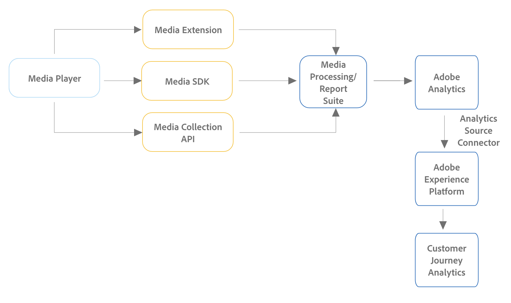

# 設定Customer Journey Analytics的串流媒體收集 {#streaming-media-setup}

<!-- markdownlint-disable MD034 -->

>[!CONTEXTUALHELP]
>id="cja-upgrade-media-edge"
>title="設定和實作Media Edge"
>abstract="您可以將Adobe串流媒體收集設定為使用Experience Platform Edge，讓資料可在Customer Journey Analytics中使用。"

<!-- markdownlint-enable MD034 -->

{{upgrade-note-step}}

在Customer Journey Analytics中實作串流媒體收集的步驟因您目前在Adobe Analytics中實作串流媒體收集而異。

串流媒體收集可透過下列任一種方式在Adobe Analytics中實作：

* [適用於串流媒體收集的Edge Network實作](#edge-network-implementations)

+++ 檢視資訊圖

  

+++

* [適用於串流媒體收集的僅限Adobe Analytics的實作](#adobe-analytics-only-implementations)

+++ 檢視資訊圖

  

+++

如需這些實作方法之間差異的詳細資訊，請參閱串流媒體收集指南中的[實作串流媒體收集](https://experienceleague.adobe.com/en/docs/media-analytics/using/implementation/overview)。

## 適用於串流媒體收集的Edge Network實作

如果串流媒體收集是在您的Adobe Analytics實作中使用Edge Network [實作，這表示將串流媒體收集升級為Customer Journey Analytics所需的部分步驟已經作為Adobe Analytics實作的一部分完成。 ](https://experienceleague.adobe.com/en/docs/media-analytics/using/implementation/overview#edge-implementation-methods)以下是已完成的步驟：

* [在Adobe Experience Platform中設定結構描述](https://experienceleague.adobe.com/en/docs/media-analytics/using/implementation/edge-recommended/media-edge-sdk/implementation-edge#set-up-the-schema-in-adobe-experience-platform)

* [在Adobe Experience Platform中建立資料集](https://experienceleague.adobe.com/en/docs/media-analytics/using/implementation/edge-recommended/media-edge-sdk/implementation-edge#create-a-dataset-in-adobe-experience-platform)

* [在Adobe Experience Platform中設定資料串流](https://experienceleague.adobe.com/en/docs/media-analytics/using/implementation/edge-recommended/media-edge-sdk/implementation-edge#configure-a-datastream-in-adobe-experience-platform)

在升級至Customer Journey Analytics時，您需要完成下列其他步驟：

>[!NOTE]
>
>完成Customer Journey Analytics升級步驟後，請務必使用Adobe Analytics串流媒體收集實施中的結構描述、資料集和資料流。

* [在 Customer Journey Analytics 中建立連線](/help/getting-started/cja-upgrade/cja-upgrade-connection.md)

* [在 Customer Journey Analytics 中建立資料視圖](/help/getting-started/cja-upgrade/cja-upgrade-dataview.md)

## 適用於串流媒體收集的僅限Adobe Analytics的實作

如果串流媒體收集是在Adobe Analytics環境中](https://experienceleague.adobe.com/en/docs/media-analytics/using/implementation/overview#adobe-analytics-only-implementation-methods)使用僅限Adobe Analytics的實作進行[實作，這表示串流媒體資料尚未前往Edge Network。

當您從Adobe Analytics升級至Customer Journey Analytics的過程中建立結構、資料集、資料流、連線和資料檢視時，請進行下列選擇以納入串流媒體收集資料：

* 為Customer Journey Analytics建立結構描述時，請包含`MediaAnalytics Interaction Details`欄位群組。

  如需新增此欄位群組的詳細資訊，請參閱串流媒體收集指南中的[在Adobe Experience Platform中設定結構描述](https://experienceleague.adobe.com/en/docs/media-analytics/using/implementation/edge-recommended/media-edge-sdk/implementation-edge#set-up-the-schema-in-adobe-experience-platform)。

  如需有關建立結構描述的資訊，請參閱[建立自訂結構描述以搭配Customer Journey Analytics](/help/getting-started/cja-upgrade/cja-upgrade-schema-create.md)。

* 為Customer Journey Analytics設定資料流時，請啟用Media Analytics。

  如需啟用此選項的詳細資訊，請參閱串流媒體收集指南中的[在Adobe Experience Platform中設定資料流](https://experienceleague.adobe.com/en/docs/media-analytics/using/implementation/edge-recommended/media-edge-sdk/implementation-edge#configure-a-datastream-in-adobe-experience-platform)。

  如需有關建立資料串流的資訊，請參閱[建立資料串流以搭配Customer Journey Analytics](/help/getting-started/cja-upgrade/cja-upgrade-datastream.md)使用。

* 建立Customer Journey Analytics的資料檢視時，請包含串流媒體收集所需的結構描述欄位。

  請確定您將這些結構描述欄位對應到XDM物件中的正確值。

  如需必要欄位的詳細資訊，請參閱串流媒體收集指南中的[在Customer Journey Analytics中建立資料檢視](/help/getting-started/cja-upgrade/cja-upgrade-dataview.md)。

  如需有關建立資料檢視的資訊，請參閱[在Customer Journey Analytics中建立資料檢視](/help/getting-started/cja-upgrade/cja-upgrade-dataview.md)。

