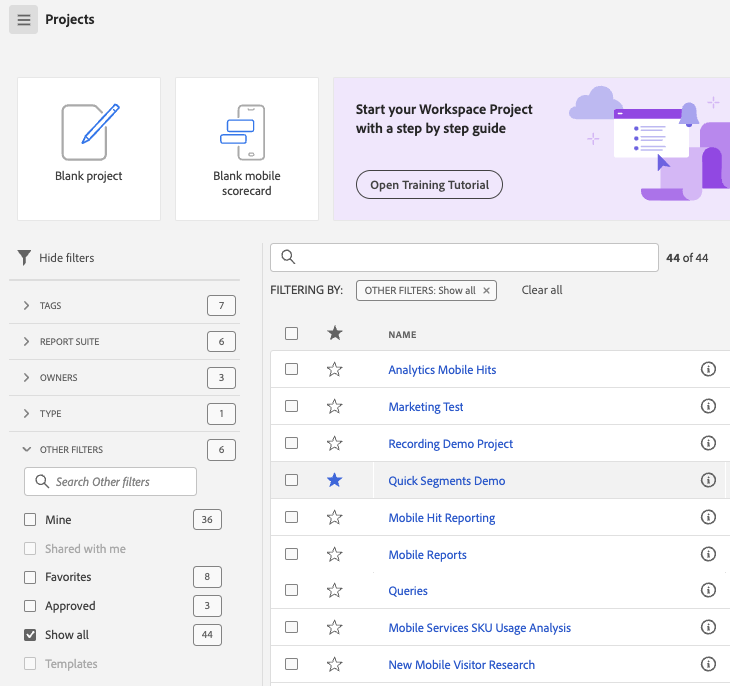

# Customer Journey Analytics 登陸頁面

Customer Journey Analytics 登陸頁面標示[!DNL Analysis Workspace]並設有專案管理員首頁，以及可幫助您更有效地管理客戶歷程資料的學習區段。 

>[!VIDEO](https://video.tv.adobe.com/v/334278/?quality=12)

## 全新登陸頁面功能 {#new-features}

| 功能 | 說明 | 螢幕擷圖 |
| --- | --- | --- |
| 展開[!UICONTROL 專案]表格至全螢幕 | 若要展開表格，僅需按一下漢堡選單圖示。這個動作將收合左側欄索引標籤。 |  |
| 自訂欄寬 | 以前欄寬是固定的。現在您可以透過拖曳欄分隔元來調整它。 |  |
| 重新排序釘選項目 | 若要將釘選項目上下移動，請按一下釘選項目旁的省略符號，並選取&#x200B;**[!UICONTROL 向上移動]**&#x200B;或是&#x200B;**[!UICONTROL 向下移動]**。 |  |
| 新表格欄位 | 按一下表格右上角的[!UICONTROL 自訂表格]圖示。新表格欄位包括： <ul><li>**[!UICONTROL 排程]**：設定為[!UICONTROL 開啟] (若專案已排程) 或[!UICONTROL 關閉] (若專案未排程)。按一下[!UICONTROL 開啟]連結可讓您查看排程專案的資訊。如果您是專案所有人，您還能[編輯專案排程](../analysis-workspace/curate-share/t-schedule-report.md)。</li><li>**[!UICONTROL 專案 ID]**：專案 ID 可用於偵錯專案。</li><li>**[!UICONTROL 最大日期範圍]**：更長的日期範圍會增加專案複雜性，並可能增加處理和載入次數。 </li><li>**[!UICONTROL 查詢數]**：專案載入時，向 Analytics 提出的請求總數。較高的專案查詢數會增加專案複雜性，並可能增加處理和載入次數。載入專案或傳送已排程專案後才能使用此資料。 </li></ul> |  |
| **[!UICONTROL 建立專案]**&#x200B;模組回來了 | 只要在工作區中按一下&#x200B;**[!UICONTROL 「建立專案」]**，您就能再度在[!UICONTROL 空白專案]和[!UICONTROL 空白行動計分卡]之間進行選擇。 您還可以從您公司已建立的任何範本中進行選擇。 |  |

{style="table-layout:auto"}

## 瀏覽至「[!UICONTROL 專案]」索引標籤。 {#navigate-projects}

「[!UICONTROL 專案]」可用作  [!UICONTROL 工作區] 首頁。「專案」索引標籤會顯示公司資料夾、您建立的任何個人資料夾、您的專案和 Mobile 計分卡。 使用此頁面來檢視、建立和修改資料夾、專案和行動計分卡。 如需詳細資訊，請參閱[關於 Analytics 資料夾](/help/analysis-workspace/build-workspace-project/workspace-folders/about-folders.md)。

**[!UICONTROL 專案]**&#x200B;是自訂的設計，可結合您所建立或其他人所建立並與您共用的資料元件、表格和視覺效果。[!UICONTROL 專案]也指空白專案和空白行動計分卡。

>[!NOTE]
>
>下列數項設定會在工作階段和跨工作階段期間持續存在。例如，您選取的索引標籤、選取的篩選器、選取的欄，以及欄排序方向。 搜尋結果不會持續存在。

| UI 元素 | 定義 |
| --- | --- |
| 編輯偏好設定 | 讓您[!UICONTROL 檢視教學課程]和[編輯使用者偏好設定](/help/analysis-workspace/user-preferences.md)。 |
| [!UICONTROL 新建] | 開啟專案模組，您可在此建立 Workspace 專案、Mobile 計分卡或開啟公司範本。 |
| [!UICONTROL 顯示較少 顯示較多] | 在不顯示和顯示橫幅之間切換： |
| [!UICONTROL Analysis Workspace 專案] | 建立空白[工作區專案](https://experienceleague.adobe.com/docs/analytics/analyze/analysis-workspace/home.html?lang=zh-Hant)，供您設計和建置。 |
| [!UICONTROL Mobile 計分卡] | 建立空白 [行動計分卡](https://experienceleague.adobe.com/docs/analytics/analyze/mobapp/curator.html?lang=zh-Hant)，供您設計和建置。 |
| [!UICONTROL 開啟訓練教學課程] | 開啟工作區培訓教學課程，引導您完成逐步教學課程中建置新入門專案的流程。 |
| [!UICONTROL 開啟版本注意事項] | 開啟最新 Adobe Experience Cloud 版本注意事項的 Adobe Analytics 部分。 |
| 篩選器圖示 | 依標籤、資料檢視、擁有者、類型和其他篩選器（我的、與我共用、我的最愛和已核准）進行篩選 |
| 搜尋列 | 搜尋表格中的所有欄。 |
| 選取方塊 | 選取一個或多個專案，以顯示您可以執行的專案管理操作：**刪除**、**共用**、**重新命名**、**複製**、**取消釘選**、**上移**、**下移**、**標記**、**核准**、**匯出 CSV**，和&#x200B;**移至**。您可能沒有執行所列出所有操作的權限。 |
| [!UICONTROL 我的最愛] | 將星號新增至可用作篩選器的最喜愛專案或資料夾旁。 |
| [!UICONTROL 名稱] | 識別專案名稱。 |
| 釘選圖示 | 釘選項目，使其一直出現在清單的頂部，但您可以將其順序上下移動來重新調整順序。 使用省略符號選項選單，並選擇在清單中&#x200B;**上移** 或&#x200B;**下移**。 |
| 資訊 (i) 圖示 | 顯示以下有關專案的資訊：類型、專案角色、所有者、說明，以及共用對象。 此資訊也會指明誰可以[編輯或重複](https://experienceleague.adobe.com/docs/analytics/analyze/analysis-workspace/curate-share/share-projects.html?lang=zh-Hant)此專案。 |
| 省略 (...) | 顯示您可以執行的專案管理操作：**刪除**、**共用**、**重新命名**、**複製**、**取消釘選**、**上移**、**下移**、**標記**、**核准**、**匯出 CSV**，和&#x200B;**移至**。 您可能沒有執行所列出所有操作的權限。 |
| [!UICONTROL 類型] | 指出此類型是工作區專案、行動計分卡或資料夾。 |
| [!UICONTROL 標籤] | 標記專案，可方便分類整理。 |
| [!UICONTROL 專案角色] | 識別專案角色：您是否為專案所有者，以及您是否具有編輯或複製專案的權限。 |
| [!UICONTROL 資料檢視] | 識別與專案相關聯的資料檢視。 面板內的表格和視覺效果是從面板右上角所選資料檢視衍生而得。該資料檢視也會決定左側邊欄內會有哪些元件。在專案內，您可以根據分析使用案例使用一或多個資料檢視。 資料檢視清單是根據相關性來分類。Adobe 是根據目前使用者最近使用套裝情形和多常使用套裝，以及組織內多常使用套裝等來定義關聯性。 |
| [!UICONTROL 所有者] | 識別建立專案的人員。 |
| [!UICONTROL 上次開啟時間] | 識別您上次開啟專案的日期。 |
| 自訂表格圖示 | 選取要在表格中查看的欄。 若要從專案清單中新增或移除欄，請按一下右上方的欄圖示 ()，然後選取或取消選取欄標題。 |
| 顯示：資料夾與專案或所有專案 | 變更表格上的視圖設定，以根據資料夾組織顯示資料夾和專案&#x200B;**或**&#x200B;以無組織的清單顯示所有專案。 |
| &lt; (返回按鈕) | 將您傳回至工作區專案中最新的登陸頁面設定。離開登陸頁面時您擁有頁面設定，會在您返回時持續留在該頁面。 |

### 不再使用專案管理員頁面 {#deprecate-pm-page}

隨著新登陸頁面的發布，我們已棄用「元件管理員」下所列的專案管理員。 新版登陸頁面會處理舊「專案管理員」頁面的所有功能，以及更多功能。

「專案管理員」頁面的一個常見使用案例是檢視您的所有專案。若要使用篩選器邊欄在新登陸頁面上檢視所有專案，請選取&#x200B;**「其他篩選器」**，然後選取&#x200B;**「全部顯示」**。

如果您位於「資料夾與專案」檢視中，會出現一個強制回應快顯視窗，詢問您是否要切換至「所有專案」檢視，這可讓您在可能組織的任何資料夾之外，更輕鬆地檢視所有專案。選取&#x200B;**「切換至「所有專案」檢視」**，以便更完整地檢視您有權存取的所有專案。

## 瀏覽「學習」標籤。 {#navigate-learning}

「學習」頁面包含實施影片導覽和教學課程，還含有多個文件連結。

* [!UICONTROL 工作區基礎課程]導覽可讓您直接進入工作區，並逐步了解工作區版面以及在何處尋找/執行最常用的操作。 此導覽也可以直接在工作區中重新啟動，方法是透過面板標題的工具提示快覽視窗進行。
* 按一下影片/導覽，可新增「**[!UICONTROL 已檢視]**」標籤。此標籤可幫助您透過學習內容追蹤您的進度。您可以按一下此標籤，然後標籤會消失，以防您尚未完成內容。
* 影片模式的「**[!UICONTROL 了解更多]**」按鈕可帶您進入 Adobe Experience League 文件頁面，其中有關於您剛才觀看影片的更多內容。 **[!UICONTROL 觀看更多影片]**&#x200B;可帶您前往 Analysis Workspace YouTube 完整播放清單。

## 設定您的登陸頁面 {#set-landing}

使用者可以設定他們偏好的登陸頁面。

1. 前往「Analytics > [!UICONTROL 元件] > [!UICONTROL 偏好設定] > [!UICONTROL 一般]」。
1. 確認您偏好哪個登陸頁面：

   

## 登陸頁面常見問題 {#landing-faq}

| 問題 | 回答 |
| --- | --- |
| 我在 Beta 版計劃 UI 中進行的工作是否會移轉至生產環境的[!UICONTROL 工作區]體驗？ | 是，在 Beta 版中完成的任何工作都會移轉至舊有/現有的[!UICONTROL 工作區]體驗。 |
| 我可釘選的專案數量是否有上限？ | 沒有，您可以釘選的專案數量沒有限制。 |
| 管理員是否可以為他們的使用者指定此登陸頁面？ | 否，管理員不可以代表他們的使用者指定此登陸頁面。 個人使用者必須自己開啟切換功能。 |
<!-- | Are all reports that currently exist in [!DNL Reports & Analytics] still available? | No, the following reports were phased out, based on overall usage data: <ul><li>Any custom eVars/props/events/classifications<li>My Recommended Reports</li><li>Hourly/Daily/Weekly/Monthly/Quarterly/Yearly unique visitors</li><li>DailyWeekly/Monthly/Quarterly/Yearly unique customers</li><li>Action name depth</li><li>Action name summary</li><li>Add dashboard</li><li>Age</li><li>Audio support</li><li>Billing information</li><li>Clicks to page</li><li>Color depth</li><li>Cookie support</li><li>Cookies</li><li>Connection types</li><li>Creative elements</li><li>Credit card type</li><li>Cross sell</li><li>Custom event funnels</li><li>Custom links</li><li>Customer ID</li><li>Day of week</li><li>Entry action name</li><li>Exit action name</li><li>Exit links</li><li>Fallout</li><li>File downloads</li><li>Find in store</li><li>Full paths</li><li>Gender</li><li>Hit ype VISTA rule</li><li>Image support</li><li>Java</li><li>JavaScript</li><li>JavaScript version</li><li>Manage bookmarks</li><li>Manage dashboards</li><li>Monitor color depth</li><li>Monitor resolutions</li><li>Newsletter signups</li><li>Next action name</li><li>Next action name flow</li><li>Null searches</li><li>Operating system</li><li>Order review</li><li>Page of day</li><li>Pages not found</li><li>Pathfinder</li><li>Path length</li><li>Previous action name</li><li>Previous action name flow</li><li>Product activity</li><li>Product cost</li><li>Product department</li><li>Product inventory category</li><li>Product name</li><li>Product reviews</li><li>Product season</li><li>Product shares</li><li>Product zooms</li><li>Reload</li><li>Searches</li><li>Servers</li><li>Single page visits</li><li>Shipping information</li><li>Site hierarchy</li><li>Social mentions</li><li>Time of day</li><li>Time spent on action name</li><li>Video support</li><li>Visitor state</li></ul> | -->
