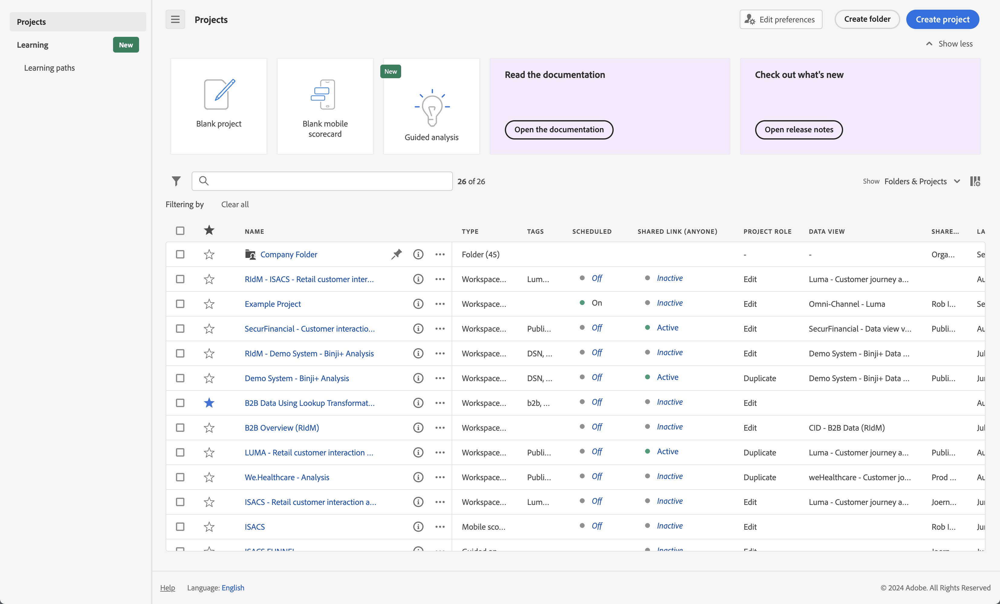

# Customer Journey Analytics 登陸頁面

Customer Journey Analytics 登陸頁面標示[!DNL Analysis Workspace]並設有專案管理員首頁，以及可幫助您更有效地管理客戶歷程資料的學習區段。 

+++ 如需簡介，請參閱影片。

>[!VIDEO](https://video.tv.adobe.com/v/334278/?quality=12)

{{videoaa}}

+++

Customer Journey Analytics 登陸頁面包含以下子索引標籤：專案與學習。

**[!UICONTROL 專案]**&#x200B;是自訂的設計，可結合您所建立或其他人所建立並與您共用的資料元件、表格和視覺效果。[!UICONTROL 專案]也指空白專案和空白移動計分卡。

「**[!UICONTROL 學習]**」標籤包含實作影片導覽、教學課程和文件連結。

>[!BEGINTABS]

>[!TAB 專案]

>[!TAB 學習]

>[!ENDTABS]

## 專案

「[!UICONTROL 專案]」可用作  [!UICONTROL 工作區] 首頁。**[!UICONTROL 專案]**&#x200B;索引標籤會顯示公司資料夾、您建立的任何個人資料夾、您的Workspace專案以及行動計分卡。 使用此頁面來檢視、建立和修改資料夾、專案和行動計分卡。 如需詳細資訊，請參閱[專案](/help/analysis-workspace/build-workspace-project/freeform-overview.md)。

**[!UICONTROL 專案]**&#x200B;是自訂的設計，可結合您所建立或其他人所建立並與您共用的資料元件、表格和視覺效果。[!UICONTROL 專案]也指空白專案和空白行動計分卡。

>[!NOTE]
>
>下列數項設定會在工作階段和跨工作階段期間持續存在。例如，您選取的索引標籤、選取的篩選器、選取的欄，以及欄排序方向。 搜尋結果不會持續存在。

如需詳細資訊，請參閱[專案](/help/analysis-workspace/build-workspace-project/freeform-overview.md)。

<!--

### Customize table columns

To customize column widths, drag the vertical bar that separates each column. 

To add or remove columns from the list of projects, click the column icon ( ) in the top-right, then select or deselect column titles. 

The available columns are:

| Column name | Description | 
|---------|----------|
| [!UICONTROL **Name**] | Identifies the name of the project. |
| [!UICONTROL **Type**] | Indicates whether this type is a Workspace project, a Mobile scorecard, or a folder. |
| [!UICONTROL **Tags**] | Tags projects to organize them into groups. | 
| [!UICONTROL **Scheduled**] | Set to [!UICONTROL On] when a project is scheduled or [!UICONTROL Off] when it is not. Clicking the [!UICONTROL On] link lets you see information about the scheduled project. You can also [edit the project schedule](/help/analysis-workspace/export/t-schedule-report.md) if you are the project owner. |
| [!UICONTROL **Project role**] | Identifies the project roles: whether you are the project Owner and whether you have permissions to Edit or Duplicate the project. |
| [!UICONTROL **Report suite**] | Identifies the Report Suites that are associated with the project. Tables and visualizations within a panel derive data from the report suite selected in the top right of the panel. The report suite also determines what components are available in the left rail. Within a project, you can use one or many report suites depending on your analysis use cases. The list of report suites is sorted on relevance. Adobe defines relevance based on how recently and frequently the suite has been used by the current user, and how frequently the suite is used within the organization. |
| [!UICONTROL **Owner**] | Identifies the person who created the project. |
| [!UICONTROL **Shared With**] | Shows who the project is currently shared with. |
| [!UICONTROL **Last Modified**] | The date and time when the project was last modified. |
| [!UICONTROL **Last Opened**] | Identifies the date that a project was last opened by the user who is currently viewing the Projects page. |
| [!UICONTROL **Last Used**] | Helps determine whether a project is valuable to users in your organization by showing the date and time when the project was last opened by any user within the organization.
Consider the following when viewing this column:
<ul><li>Usage information is available starting in September 2023.</li><li>This column is available only to system administrators.</li></ul> |
| [!UICONTROL **Project ID**] | Can be used for debugging projects. |
| [!UICONTROL **Longest Date Range**] | Longer date ranges increase project complexity and may increase processing and load times. |
| [!UICONTROL **Number of queries**] | The total number of requests made to Analytics when the project loads. A higher number of project queries increases project complexity and may increase processing and load times. This data is available only after a project has loaded or a scheduled project was sent. |
| [!UICONTROL **Location**] | Shows the folder where the project is located. |

### Other UI elements on the Projects page

| UI element | Definition |
| --- | --- |
| Edit preferences | Lets you [!UICONTROL View Tutorials], and [Edit user preferences](/help/analysis-workspace/user-preferences.md). |
| [!UICONTROL Create new] | Opens the project modal where you can create a Workspace project or a Mobile scorecard or open a company template.  |
| [!UICONTROL Show less  Show more] | Toggles between not showing and showing the banner:  |
| [!UICONTROL Workspace project] | Creates a blank [Workspace project](/help/analysis-workspace/home.md) for you to  design and build. |
| [!UICONTROL Mobile scorecard] | Creates a blank [mobile scorecard](https://experienceleague.adobe.com/docs/analytics/analyze/mobapp/curator.html) for you to design and build. |
| [!UICONTROL Open Training Tutorial] | Opens the Workspace training tutorial that guides you through the process of building a new starter project in a step-by-step tutorial.|
| [!UICONTROL Open release notes] | Opens the Adobe Analytics section of the latest Adobe Experience Cloud release notes. |
| Filter icon | Filters by tags, report suites, owners, types, and other filters (Mine, Shared with me, Favorites, and Approved)  |
| Search bar | Searches all columns in the table. |
| Selection box | Selects one or more projects to display the project management actions you can perform: **Delete**, **Share**, **Rename**, **Copy**, **Unpin**, **Move Up**, **Move Down**, **Tag**, **Approve**, **Export CSV**, and **Move to**. You may not have permissions to perform all listed actions. |
| [!UICONTROL Favorites] | Adds a star next to a favorite project or folder that can be used as a filter. |
| [!UICONTROL Name] | Identifies the name of the project. |
| Pin icon | Pins items so they always appear at the top of your list but you can re-adjust the order by moving them up or down in the order. Use the ellipsis option menu and select **Move Up** or **Move down** in the list. |
| Info (i) icon | Displays the following information about a project: Type, Project Role, Owner, Description, and who it is shared with. It also indicates who can [edit or duplicate](/help/analysis-workspace/curate-share/share-projects.md) this project. |
| Ellipsis (...) | Displays the project management actions you can perform: **Delete**, **Share**, **Rename**, **Copy**, **Unpin**, **Move Up**, **Move Down**, **Tag**, **Approve**, **Export CSV**, and **Move to**. You may not have permissions to perform all listed actions. |
| SHOW: Folders & Projects or All Projects | Changes the view setting on the table to show folders and projects according to your folder organization **or** show all of your projects in an unorganized list. |
| < (Back button) | Returns you to your most recent landing page configuration in a Workspace project or a report. The page configuration you had when you left the landing page will persist when you return. |

-->

## 學習

「學習」頁面包含實作影片導覽和教學課程，以及多個文件連結。

使用 Customer Journey Analytics 中的「學習」頁面來學習：

* Customer Journey Analytics中的初級、中間或進階功能和使用案例
* 如何更順暢地從Adobe Analytics轉換至Customer Journey Analytics

若要存取學習內容：

* 在Customer Journey Analytics中，從頂端功能表選取&#x200B;[!UICONTROL **Workspace**]，然後從左側面板選取&#x200B;[!UICONTROL **學習**]。

### 功能

學習頁面提供下列功能

* **篩選內容：**&#x200B;使用依&#x200B;**[!UICONTROL 型別]** （**[!UICONTROL 檔案]**、**[!UICONTROL 影片]**&#x200B;和&#x200B;**[!UICONTROL 導覽與教學課程]**）和&#x200B;**[!UICONTROL 體驗層級]** （**[!UICONTROL 初級]**、**[!UICONTROL 中級]**&#x200B;或&#x200B;**[!UICONTROL 進階]**）篩選學習內容。
* **追蹤進度：**&#x200B;選取內容後，會顯示 **[!UICONTROL 已檢視]**&#x200B;標籤。 此標記可幫助您透過學習內容追蹤您的進度。您可以選取 **[!UICONTROL 已檢視]**&#x200B;標籤，將其從內容片段中移除。
* **檢視其他內容：**&#x200B;檢視任何影片時，請選取&#x200B;**[!UICONTROL 深入瞭解]**&#x200B;檢視Experience League的相關檔案內容。 或者，從「學習」頁面中選取以下任一選項，以檢視其他內容：
   * **[!UICONTROL 造訪 YouTube]：**&#x200B;檢視完整的 Analysis Workspace YouTube 播放清單。
   * [!UICONTROL **造訪Experience League**]：檢視有關Experience League的完整Customer Journey Analytics檔案。
* **新使用者的基礎知識：**&#x200B;建議新使用者參加[!UICONTROL Workspace基礎知識學習]導覽。 此導覽將直接帶您進入工作區並引導您完成最常見的操作。此導覽也可以隨時在Workspace中重新啟動，方法是透過[自由面板](/help/analysis-workspace/c-panels/freeform-panel.md)或[空白面板](/help/analysis-workspace/c-panels/blank-panel.md)標題的工具提示。

## 偏好的登陸頁面

您可以設定您偏好的登陸頁面。 如需詳細資訊，請參閱[使用者偏好設定](/help/analysis-workspace/user-preferences.md#general-preferences)。

<!--
## Landing page FAQ {#landing-faq}

| Question | Answer |
| --- | --- |
| Does the work I do in the beta program UI carry over to the production [!UICONTROL Workspace] experience? | Yes, any work done in the beta carries over to the old/current [!UICONTROL Workspace] experience. |
| Is there a maximum number of projects I can pin? | No, there is no limit on the number of projects you can pin. |
| Can admins designate this landing page for their users? | No, admins cannot designate the landing page on behalf of users. Individual users must turn on the toggle themselves. |
| Are all reports that currently exist in [!DNL Reports & Analytics] still available? | No, the following reports were phased out, based on overall usage data: <ul><li>Any custom eVars/props/events/classifications<li>My Recommended Reports</li><li>Hourly/Daily/Weekly/Monthly/Quarterly/Yearly unique visitors</li><li>DailyWeekly/Monthly/Quarterly/Yearly unique customers</li><li>Action name depth</li><li>Action name summary</li><li>Add dashboard</li><li>Age</li><li>Audio support</li><li>Billing information</li><li>Clicks to page</li><li>Color depth</li><li>Cookie support</li><li>Cookies</li><li>Connection types</li><li>Creative elements</li><li>Credit card type</li><li>Cross sell</li><li>Custom event funnels</li><li>Custom links</li><li>Customer ID</li><li>Day of week</li><li>Entry action name</li><li>Exit action name</li><li>Exit links</li><li>Fallout</li><li>File downloads</li><li>Find in store</li><li>Full paths</li><li>Gender</li><li>Hit ype VISTA rule</li><li>Image support</li><li>Java</li><li>JavaScript</li><li>JavaScript version</li><li>Manage bookmarks</li><li>Manage dashboards</li><li>Monitor color depth</li><li>Monitor resolutions</li><li>Newsletter signups</li><li>Next action name</li><li>Next action name flow</li><li>Null searches</li><li>Operating system</li><li>Order review</li><li>Page of day</li><li>Pages not found</li><li>Pathfinder</li><li>Path length</li><li>Previous action name</li><li>Previous action name flow</li><li>Product activity</li><li>Product cost</li><li>Product department</li><li>Product inventory category</li><li>Product name</li><li>Product reviews</li><li>Product season</li><li>Product shares</li><li>Product zooms</li><li>Reload</li><li>Searches</li><li>Servers</li><li>Single page visits</li><li>Shipping information</li><li>Site hierarchy</li><li>Social mentions</li><li>Time of day</li><li>Time spent on action name</li><li>Video support</li><li>Visitor state</li></ul> | 
-->
