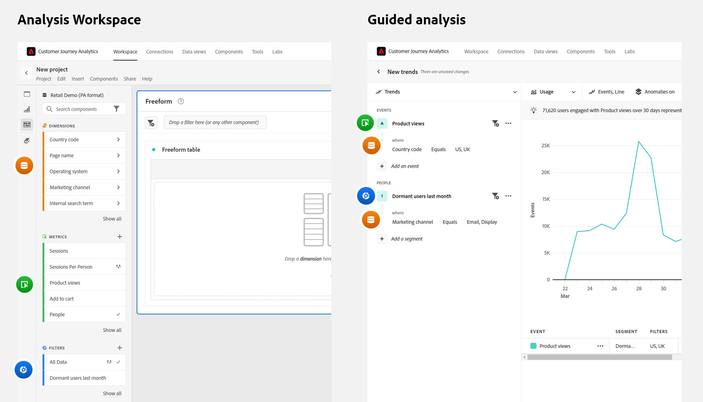
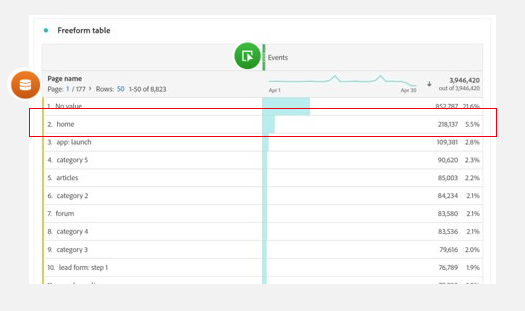

# 引導式分析常見問題集

針對引導式分析的常見問題。

+++**我的組織可以存取引導式分析嗎？**

所有 Customer Journey Analytics 套件中皆包含引導式分析視圖。 請參閱概觀頁面上的[佈建](overview.md#provisioning)章節，了解更多有關您 CJA 套件可利用視圖的資訊。

+++

+++**使用引導式分析需要哪些實作變更？**

如果您現在已經在使用 Customer Journey Analytics，就無需進行額外的實作變更。 引導式分析會使用與其他 CJA 介面相同的[資料視圖](../data-views/data-views.md)和[連線](../connections/overview.md)，例如 [Analysis Workspace](../analysis-workspace/home.md)。

為了讓您的一般使用者能夠透過引導式分析取得最大成功，建議您在 Adobe Experience Platform 和[資料視圖](../data-views/data-views.md)中製定穩健的事件結構描述和管理策略。

+++

+++**何時應該使用引導式分析或 Analysis Workspace？**

**引導式分析**&#x200B;可以幫助使用者快速取得高品質的洞察。 對於產品團隊、希望更安心處理資料的使用者，甚至是分析師而言，它都相當實用，能夠取得先機進行更深入的分析。

**[Analysis Workspace](../analysis-workspace/home.md)** 是更自由形式的空間，可讓您進一步探討資料以找出更多洞察。 對於相當了解資料且想要深入探討的分析師和進階使用者而言，它非常實用。

+++

+++**引導式分析和 Analysis Workspace 之間的術語差異為何？**

引導式分析和 [Analysis Workspace](../analysis-workspace/home.md) 在大多數關鍵術語上是一致的，但存在一些細微差異。

| 引導式分析字詞 | Analysis Workspace 字詞 |
| --- | --- |
| 事件 (二進位 1/0 量度) | 量度 |
| 使用者 | 使用者 |
| 維度 | 維度 |
| 維度項目 | 維度項目 |
| 區段 | 區段 |
| 篩選器 | 報告篩選器 |
| 計算量度、量度 | 計算量度 |

{style="table-layout:auto"}

+++

+++**引導式分析和 Analysis Workspace 在處理報告的方式上有哪些差異？**

雖然 [Analysis Workspace](../analysis-workspace/home.md) 和引導式分析使用相同的基礎資料，各個工具支援您形成該資料查詢的方式依然有所不同。

* **Analysis Workspace是以維度為中心的體驗。** 表格通常包含維度列，而欄通常是量度。 可以在列和欄中套用區段，以獲得所需的資料。

* **引導式分析是事件和以使用者為中心的體驗。** 每個分析都從選取事件開始，然後可以新增維度和區段來調整該事件資料。

{style="border:1px solid gray"}

請考慮以下範例，其中請將重點放在有關網站首頁的資料。 團隊會詢問類似的問題，但分析方法可能會不同。

* 以維度為中心的典型 Analysis Workspace 方法會是：「我們來看看首頁，了解它收到了多少頁面瀏覽次數。」

  {style="border:1px solid gray"}

* 以事件和使用者為中心的典型引導式分析方法會是：「有多少使用者造訪過首頁？」

  {style="border:1px solid gray"}

+++
