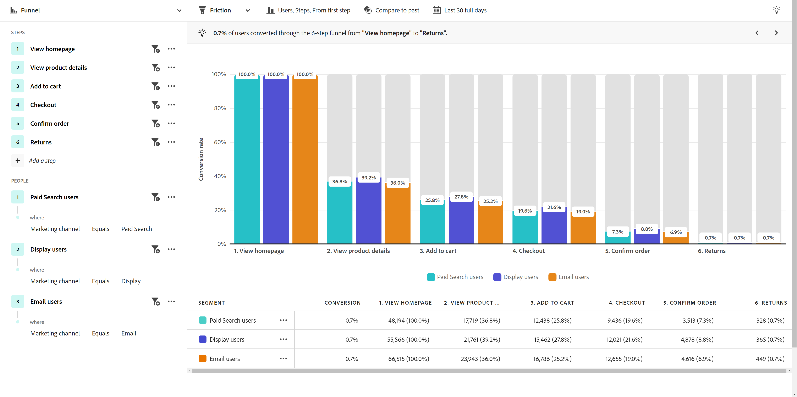

# 產業使用案例

本頁面提供了一些說明性的業界範例，描述客戶體驗團隊 (從分析師到產品團隊再到行銷人員) 可以透過引導式分析完成哪些工作。

+++**零售業**

| 使用案例 | 範例 | 影響 | 分析 |
| --- | --- | --- | --- |
| **最佳化行動購物應用程式** | 許多客戶下載了組織的行動應用程式，但是再也沒有回訪。 該公司發現客戶僅將其用於初始產品建議。 他們重新吸引那些非活躍的客戶。 | **增加行動使用者的LTV。** 測量並增加應用程式使用量，開發更加「快樂的路徑」的使用者體驗。 | [積極成長分析](types/active-growth.md) [淨成長分析](types/net-growth.md) |
| **量化新結帳功能帶來的影響** | 某家雜貨商店正在嘗試進軍線上購物領域。 他們要快速測量新結帳功能 (例如產品推薦或路邊取貨) 的影響。 | **提高轉換率。** 評估業務影響，而不僅僅是功能使用情形。 | [發行影響分析](types/release-impact.md) [首次使用影響分析](types/first-use-impact.md) |
| **減少會員流失** | 某個組織發現客戶歷程中導致客戶流失的摩擦點。 他們能夠藉此檢閱會籍方案，並分析具有流失風險之會員的行為。 | **減少流失率。** 找出培養和培養客戶關係的方法，以防止流失和減少流失。 | [積極成長分析](types/active-growth.md) [漏斗分析](types/funnel.md) |
| **尋找效率不彰的銷售歷程** | 某個組織發現店內銷售人員的歷程出現效率不彰；客戶會閃避他們。 他們調整流程，為客戶提供更愉快的店內購物體驗。 | **改善銷售回應。** 減少低效的流程，進而改善內部歷程，並提供正面客戶體驗。 | [漏斗分析](types/funnel.md) |

{style="table-layout:auto"}

{style="border:1px solid gray"}

{style="border:1px solid gray"}

+++

+++**金融服務業**

| 使用案例 | 範例 | 影響 | 分析 |
| --- | --- | --- | --- |
| **量化新功能帶來的影響** | 某家金融機構透過 Zelle 推出銀行轉帳，且希望了解新功能對完成轉帳的影響。 引導式分析使他們能夠了解客戶的反應，以便行銷團隊能夠推出該功能。 | **提高轉換率。** 衡量新功能對傳輸轉換的影響。 | [發行影響分析](types/release-impact.md) [首次使用影響分析](types/first-use-impact.md) |
| **轉移客服中心通話** | 引導式分析顯示，某個組織的五步驟行動索賠流程會將通話導向其客服中心。 他們建立客群並向這些客戶寄送電子郵件，以利加強了解客戶的體驗。 | **隔離體驗中的摩擦。** 改善「快樂路徑」歷程，並減少來電數量。 | [漏斗分析](types/funnel.md) [轉換趨勢分析](types/conversion-trends.md) |
| **減少客戶流失** | 某個組織了解到，每個月登入一次銀行行動應用程式的客戶，持續成為客戶的時間更長。 引導式分析可讓他們識別哪些客戶有流失的風險，並建立贏回策略。 | **減少流失率。** 維持客戶層級，同時花費購買實際的新客戶。 | [積極成長分析](types/active-growth.md) [淨成長分析](types/net-growth.md) |
| **推薦新功能** | 某個組織注意到最近幾個月的數位提款有所減少。 致電財務顧問的通話次數增加了。 引導式分析可協助該組織與指導委員會一起排定數位流程最佳化的優先順序。 | **建立資料導向藍圖。** 使用資料來規劃及實作最佳化。 | [趨勢分析](types/trends.md) |

{style="table-layout:auto"}

{style="border:1px solid gray"}

{style="border:1px solid gray"}

{style="border:1px solid gray"}

+++

+++**旅遊業及旅館業**

| 使用案例 | 範例 | 影響 | 分析 |
| --- | --- | --- | --- |
| **量化新預訂流程功能帶來的影響** | 某個組織使用引導式分析來快速檢視新的預訂步驟功能對轉換率的影響。 他們找出體驗中獲益最大的部分。 | **提高預訂費率。** 評估業務影響，而不僅僅是功能使用情形。 | [發行影響分析](types/release-impact.md) [漏斗分析](types/funnel.md) |
| **最佳化行動應用程式體驗** | 某個組織快速輕鬆地了解一段時間內的每月活躍應用程式使用者，並依照版本識別正面影響。 | **增加MAU。** 測量並增加應用程式使用量，這會與客戶幸福感相關。 | [積極成長分析](types/active-growth.md) [淨成長分析](types/net-growth.md) |
| **找出行動登入流程中的摩擦** | 了解人們如何成功完成預期的行動登入流程，或是行動登入流程在何種情況下中斷，能讓組織輕鬆確認需要將體驗最佳化的地方。 | **增加CSAT並減少IROP。** 消除摩擦可帶來更順暢的「旅遊日」體驗。 | [漏斗分析](types/funnel.md) [轉換趨勢分析](types/conversion-trends.md) |
| **轉移客服中心通話** | 透過漏斗分析查看使用者體驗，能向使用者顯示訪客遇到摩擦的情況，而這些摩擦會導致代價高昂的客服中心來電量。 接下來要重點關注的步驟是明確的。 | **減少客服中心使用量。** 獲得更多「快樂路徑」的使用者體驗，並減少高成本的通話。 | [漏斗分析](types/funnel.md) [轉換趨勢分析](types/conversion-trends.md) |

{style="table-layout:auto"}

{style="border:1px solid gray"}

{style="border:1px solid gray"}

{style="border:1px solid gray"}

+++

+++**媒體和娛樂業**

| 使用案例 | 範例 | 影響 | 分析 |
| --- | --- | --- | --- |
| **量化新節目或新影集帶來的影響** | 串流服務可以分析使用者觀看新節目或影集後對收視率的影響，並深入了解哪些內容能引起共鳴。 | **增加收視率。** 尋找對收視率影響最大的內容。 | [首次使用影響分析](types/first-use-impact.md) |
| **確認流失風險** | 某個組織發現客戶流動率相當高，這些客戶註冊其平台觀看季節性活動並於活動結束後立即取消。 快速識別這些使用者可讓他們顯示推薦，以吸引客戶與平台保持互動。 | **保留快樂的訂閱者。** 尋找與成長區段互動的內容，以透過建議進行干預。 | [積極成長分析](types/active-growth.md) [淨成長分析](types/net-growth.md) |
| **尋找向上銷售的機會** | 某個組織收入成長的重要部分，是了解哪些應用程式內產品建議對體育場內的球迷最有吸引力。 引導式分析使他們能夠準確地了解哪些產品建議最有效。 | **增加輔助收入。** 瞭解應用程式內優惠方案對促進購買行為的影響。 | [首次使用影響分析](types/first-use-impact.md) [漏斗分析](types/funnel.md) |
| **最佳化跨裝置體驗** | 某個組織想要分析訂閱者如何與多個裝置/應用程式互動。 這些知識可讓他們了解內容消費模式，並確定最適合重新鎖定他們之處。 | **個人化體驗。** 瞭解什麼內容最能引發每個裝置訂閱者的共鳴。 | [趨勢分析](types/trends.md) |
| **轉移客服中心通話** | 某個組織使用引導式分析來找出自動付款無法運作的問題；該問題已使不滿意的客戶致電支援中心來取消其方案。 | **減少支援電話。** 建立更好的客戶體驗，並減少客戶服務電話。 | [漏斗分析](types/funnel.md) [轉換趨勢分析](types/conversion-trends.md) |

{style="table-layout:auto"}

{style="border:1px solid gray"}

{style="border:1px solid gray"}

{style="border:1px solid gray"}

+++

+++**醫療保健**

| 使用案例 | 範例 | 影響 | 分析 |
| --- | --- | --- | --- |
| **改善患者健康結果** | 某個組織擁有資料，可將精力集中在實現成長。 在使用引導式分析之前，他們不清楚每週總共有多少健康計劃會員停止使用計劃。 | **減少看醫生次數。** 快速識別休眠使用者以供重新參與。 | [積極成長分析](types/active-growth.md) |
| **提升患者體驗** | 深入了解有多少患者為了密碼重設的簡單操作聯絡客服中心之後，讓分析師重新燃起熱情，專注於加強患者體驗。 | **降低整體服務成本。** 建立更佳的病人體驗，並減少撥打給病人服務的電話。 | [趨勢分析](types/trends.md) [漏斗分析](types/funnel.md) |
| **依照區段識別重複的跨管道動作** | 某個組織希望了解符合 Medicare 資格的會員在計劃使用方面的活躍程度，以便在其數位產品中向他們提供特定訊息。 從引導式分析中獲得的洞察有助於提高行銷效率。 | **個人化Medicare註冊選擇。** 比較我最活躍的計畫成員的一般循序動作。 | [漏斗分析](types/funnel.md) [積極成長分析](types/active-growth.md) |
| **留住業界頂尖人才** | 某個組織的分析資源時間緊迫。 引導式分析讓該組織能夠快速取得產品使用資料，以便快速應付領導階層來電要求最新消息的情況。 | **減少分析人員的工作量。** 更快取得答案。 在最關鍵的時候提供平易近人的報告。 | [引導式分析](overview.md) |

{style="table-layout:auto"}

{style="border:1px solid gray"}

+++

+++**高科技與 B2B**

| 使用案例 | 範例 | 影響 | 分析 |
| --- | --- | --- | --- |
| **量化新功能帶來的影響** | 某個組織可以分析新產品功能使用量上升之情況，並確定哪些區段最適合。 這種分析可以幫助他們優先考慮將資源花在哪裡，以最大限度地提高使用者參與度，並加強與行銷的合作關係。 | **資料導向優先順序。** 針對配置資源做出明智的決策。 | [發行影響分析](types/release-impact.md) [首次使用影響分析](types/first-use-impact.md) |
| **識別未充分利用產品的角色** | 某個組織為工程師、產品經理和行銷人員設計產品。 引導式分析顯示，雖然產品經理和行銷人員幾乎每天都使用該產品，工程人員大部分卻未加以採用。 | **增加產品採用率。** 以各種方式快速識別使用者行為。 | [積極成長分析](types/active-growth.md) [淨成長分析](types/net-growth.md) |
| **消除轉換過程中的摩擦點** | 在購買流程中要求提供採購訂單號碼，會使得偏好使用信用卡的使用者不願完成訂單。 將該欄位設定為選用欄位時，轉換次數就增加了。 | **改善客戶體驗。** 減少可能的流失率。 | [漏斗分析](types/funnel.md) [轉換趨勢分析](types/conversion-trends.md) |
| **解鎖自助分析** | 取得洞察的存取權是一項挑戰，而某個組織內的部分使用者並未接受過分析訓練。 引導式分析可讓他們取得答案並利用組織其他部門使用的相同資料，從而建立更牢固的合作關係，並實現真正的資料導向決策。 | 跨組織&#x200B;**更密切的合作關係。** 讓產品經理存取先前定址的資料。 | [引導式分析](overview.md) |

{style="table-layout:auto"}

{style="border:1px solid gray"}

+++
