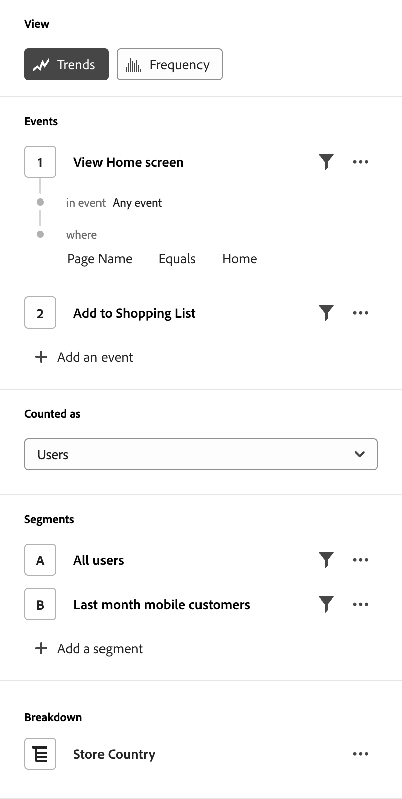

# 引導式分析概觀

引導式分析可讓使用者透過引導式工作流程 (在 Customer Journey Analytics 的跨管道資料上建置)，自助提供有關客戶歷程的高品質資料和深入分析。從行銷到產品的跨職能團隊可以即時連結以使用和了解這些報告。

與 Analysis Workspace 和行動計分卡類似，引導式分析使用來自[資料視圖](../data-views/data-views.md)的資料，透過[連線](../connections/overview.md)參考 Adobe Experience Platform 中的資料。多種在引導式分析中建立的報告可以無縫轉移到 Analysis Workspace 以進行其他研究。

可以使用以下引導式分析視圖：

| 檢視類型 | 說明 |
| --- | --- |
| [參與](types/engagement.md) | 了解功能參與的廣度與深度。 |
| [摩擦](types/friction.md) | 比較步驟之間的轉換率。 |
| [轉換趨勢](types/conversion-trends.md) | 追蹤一段時間內的轉換率變化。 |
| [發行](types/release.md) | 比較發行前和發行後同期的績效。 |
| [首次使用](types/first-use.md) | 測量功能首次使用對關鍵指標的影響。 |
| [保留率](types/retention-rates.md) | 測量使用者持續的回訪習慣。 |
| [使用狀況](types/usage.md) | 測量使用者在一段時間內的參與度。 |
| [頻率](types/frequency.md) | 依照使用頻率來測量參與度。 |
| [作用中](types/active.md) | 識別哪些使用者是新的、保留的、回訪的或非活躍的。 |
| [淨增長](types/net-growth.md) | 您正在獲得還是失去使用者? |
| [時間表](types/timeline.md) | 探索工作階段活動的模式。 |

{style="table-layout:auto"}

## 存取

您可以從「分析」首頁存取「引導式Customer Journey Analytics」。

1. 從首頁中選取&#x200B;**[!UICONTROL 引導式分析]**，這會直接將您導向[使用趨勢檢視](types/usage.md)。

   {style="border:1px solid gray"}

1. 選取「新建&#x200B;****」以檢視不同的檢視選項，並選擇不同的分析起點。

   {style="border:1px solid gray"}

您也可以從Analysis Workspace專案存取引導式分析。

1. 從首頁中選取&#x200B;**[!UICONTROL 空白專案]**&#x200B;以建立空白的Workspace專案。

   {style="border:1px solid gray"}

1. 在左側邊欄中選取 **[!UICONTROL 引導分析]**。

   {style="border:1px solid gray"}

1. 將任何檢視型別拖曳到Workspace畫布上，然後選取「**[!UICONTROL 建立&#x200B;*引導式分析&#x200B;*]**」以產生所需的分析（例如：**[!UICONTROL 建立趨勢&#x200B;]**）。 您也可以從**[!UICONTROL 已儲存&#x200B;]**區段底下，將現有的分析拖曳至Workspace畫布上。

   

## 介面

引導式分析的介面採用問答格式。在查詢邊欄中形成您的問題，然後透過寫入的深入分析、圖表和表格獲得答案。接著，您可以使用視圖類型和視覺效果設定詢問下一個問題。

引導式分析會使用以下 UI 元素：

| 介面預覽 | UI 元素 | 說明 |
| --- | --- | --- |
| {style="border:1px solid gray"} | 查詢邊欄 | 透過選取構成分析的所需元件 (事件、屬性和區段) 來設定您的「問題」。以下選項適用於所有視圖類型，而且每個視圖都提供額外的設定。 <ul><li>**分析選擇器**：一種下拉式選單，可讓您切換到新的分析類型。您的查詢選取內容將保持在新分析類型允許的限制內。</li><li>**視圖選擇器**：一種下拉式選單，可讓您針對所形成的查詢切換到新視圖 (「答案」)。您的查詢選取內容將保持在新視圖類型允許的限制內。</li><li>**事件**：您要測量的事件。每種視圖類型都會對您可以設定的事件數量實施不同的限制。</li><li>**篩選器**：使用「事件」或「區段」部分中的圖示，依照特定屬性縮小範圍。選取屬性後，標準篩選條件 (例如「[!UICONTROL 等於]」、「[!UICONTROL 包含]」或「[!UICONTROL 結尾為]」）和前 1000 個屬性值都可用。</li><li>**計為**：要套用至所選取事件的計算方法。</li><li>**區段**：您要測量的區段。每種視圖類型都會對您可以設定的區段數量實施不同的限制。</li></ul> |
| {style="border:1px solid gray"} | 圖表 | 根據查詢邊欄和設定的輸入內容傳回的資料視覺效果。您看到的視覺效果取決於圖表上方的視圖和設定。該圖表也包括： <ul><li>**工具提示**：將滑鼠停留在任何圖表資料點上，可顯示包含更多資訊的工具提示。</li><li>**圖例**：將滑鼠停留在圖表圖例系列上，可檢視可用的定義、聚焦於該系列，以及暫時隱藏其他系列。按一下圖例中的系列即可加以隱藏。</li><li>**註解**：適用的[註解](../components/annotations/overview.md)會顯示在視覺效果和圖例之間。它會以註解設定的顏色顯示為  圖示。對於顯示隨時間變化之資料的視圖類型，會在設定的日期或日期範圍下方出現  圖示。對於未顯示隨時間變化之資料的視圖類型，會在圖表的右下角顯示  圖示。</li><li>**選取動作**：透過選取任何資料點來公開可用的下一個動作。 選項包括&#x200B;**儲存區段**。</li></ul> |
| {style="border:1px solid gray"} | 表格 | 根據查詢邊欄和設定的輸入內容傳回之資料的表格表示。表格中的欄取決於圖表上方的視圖類型。該表格也包括： <ul><li>**選取動作**：切換每列的圖示，以隱藏或公開圖表序列。 選取&#x200B;**[!UICONTROL 更多]**&#x200B;功能表，即可使用其他動作。 選項包括&#x200B;**儲存區段**。</li></ul> |
| {style="border:1px solid gray"} | 視覺效果設定 | 圖表上方的選項可讓您提出下一個問題，以及自訂圖表和表格傳回資料的方式。以下選項適用於所有視圖類型，而且每個視圖都提供額外的設定。 <ul><li>**圖表設定**：微調圖表和表格的顯示內容。可用選項取決於選取的視圖。</li><li>**日期範圍**：一種行事曆選擇器，可讓您決定分析的日期範圍。您也可以選取趨勢檢視的時間間隔，例如每日、每週或每月。</li><li>**分析見解**：內容的分析見解取決於您檢視的分析。這些分析見解是為目前的分析提供觀察結果。如果有多個分析見解，您可以使用右側的箭頭查看。您可以使用右上角的燈泡圖示切換此方框的可見度。</li></ul> |
| {style="border:1px solid gray"} | 選單 | 位於引導式分析右上角，會為您的分析提供各種動作的命令。<ul><li>**資料視圖選擇器**：變更分析所使用的資料視圖。您變更資料視圖時，查詢邊欄中的可用元件也會變更。</li><li>**複製連結**：將分析的連結複製到剪貼簿。共用之前，系統會提示您先儲存。</li><li>**共用**：會開啟共用強制回應視窗，其中包含用來共用給個別使用者或群組的更多選項。您可以讓其他使用者共用分析內容，或產生讓任何人共用的連結。</li><li>**儲存**：儲存分析。如果您要儲存新的分析，就會出現一個強制回應視窗，要求輸入名稱和說明。</li><li>**另存新檔**：將該分析與目前分析分開儲存，從而建立副本。此時會顯示一個強制回應視窗，要求輸入新名稱和說明。</li><li>**在 Workspace 中開啟**：在 Analysis Workspace 中重新建立目前的引導式分析。Workspace 專案會以新標籤建立，藉此防止在引導式分析中使用時發生中斷。它是分析的副本，開啟後不會與原始引導式分析保持同步。您想要移交給分析師團隊，或更深入探討引導式分析允許以外的資料時，請使用此命令。</li><li>**複製到剪貼簿**：將圖表圖形複製到剪貼簿，以便貼上到其他應用程式。查詢邊欄和表格不會包含在圖形中。</li><li>**下載 PNG**：將圖表圖形下載為 `.png`。查詢邊欄和表格不會包含在圖形中。</li><li>**下載 CSV**：將表格資料下載為 `.csv`。查詢邊欄和圖表不會包含在檔案中。</li></ul> |

{style="table-layout:auto"}

## 佈建

引導式分析視圖會以下列方式納入 Customer Journey Analytics 套件中：

| 套件 | 可用視圖 |
| --- | --- |
| [!UICONTROL CJA 附加元件] | 趨勢：使用情況、趨勢：頻率、漏斗：摩擦、漏斗：轉換趨勢、保留：保留率、使用者成長：活躍、使用者成長：淨成長 |
| [!UICONTROL CJA Foundation] | 趨勢：使用情況 |
| [!UICONTROL CJA Select] | 基礎檢視+趨勢：頻率，漏斗：摩擦，漏斗：轉換趨勢，保留：保留率，使用者成長：作用中，使用者成長：淨成長 |
| [!UICONTROL CJA Prime] | 選取檢視+使用者資料流：時間表，功能矩陣：參與，影響：發行，影響：首次使用 |
| [!UICONTROL CJA Ultimate] | Prime 視圖 |

{style="table-layout:auto"}

產品設定檔管理員可以在 Adobe Admin Console 中新增或移除對引導式分析的存取權。

1. 登入 [Adobe Admin Console](https://adminconsole.adobe.com)。
1. 在產品清單中選取「**[!UICONTROL Customer Journey Analytics]**」。
1. 為您要編輯的權限選取所需的產品設定檔。
1. 選取「**[!UICONTROL 許可權]**」標籤，然後按一下「[!UICONTROL 報告工具]」下的「**[!UICONTROL 編輯]**」。
1. 選取[!UICONTROL 可用許可權專案]清單中&#x200B;**[!UICONTROL 引導式分析存取]**&#x200B;旁的，這會將其新增至[!UICONTROL 包含的許可權專案]清單。
1. 選取「**[!UICONTROL 儲存]**」。

如需詳細資訊，請參閱[使用者層級存取權](/help/technotes/access-control.md#user-level-access)。

>[!TIP]
>
>部分管理員偏好為 Customer Journey Analytics 的新使用者啟用引導式分析，並停用 Analysis Workspace。一旦這些使用者熟悉該產品和您的組織資料，您就可以啟用對 Analysis Workspace 的存取權。
