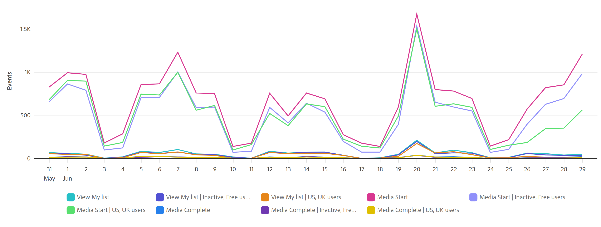

# 引導式分析概述

引導式分析是一種報告格式，可讓產品團隊快速自助滿足其資料需求，以便他們可以快速獲得高品質的深入分析，並做出更多資料導向的產品決策。 跨職能團隊可以即時連線，以使用和瞭解這些報表。

引導式分析報表類似於Analysis Workspace和行動計分卡，使用來自 [資料檢視](../data-views/data-views.md)，會透過參照Adobe Experience Platform中的資料 [連線](../connections/overview.md). 在「引導式分析」中建立的所有報表均可順暢地傳輸至Analysis Workspace以供進一步研究。

引導式分析提供多種分析和檢視資料的方式。 檢視型別能以不同方式顯示相同的資料，導致使用相同事件和區段獲得不同的深入分析。 根據您選擇的檢視，您會獲得不同的查詢邊欄和視覺效果設定。 您可以在檢視之間自由切換，而且如果檢視支援任何適用的查詢邊欄元件則會延續。

引導式分析將檢視型別分類為 **分析型別**. 可使用下列分析和檢視型別：

| 分析類型 | 檢視類型 | 說明 |
| --- | --- | --- |
| [!UICONTROL 影響] | [版本](types/release.md) | 比較發佈前和發佈後同期的績效. |
| [!UICONTROL 影響] | [首次使用](types/first-use.md) | 衡量首次功能使用對關鍵指標的影響. |
| [!UICONTROL 漏斗] | [摩擦](types/friction.md) | 比較步驟之間的轉換率. |
| [!UICONTROL 漏斗] | [轉換趨勢](types/conversion-trends.md) | 追蹤一段時間內的轉換率變化. |
| [!UICONTROL 使用者增長] | [作用中](types/active.md) | 識別哪些人是新的、保留的、回訪的或非活躍的使用者. |
| [!UICONTROL 淨增長] | [淨增長](types/net-growth.md) | 您正在獲得還是失去使用者? |
| [!UICONTROL 趨勢] | [使用狀況](types/usage.md) | 測量使用者在一段時間內的參與度. |

{style="table-layout:auto"}

## 存取

如果您的組織已針對引導式分析進行布建，您可以從Customer Journey Analytics首頁存取它。

1. 按一下 **[!UICONTROL 引導式分析]** 從首頁直接跳至 [使用趨勢檢視](types/usage.md).

   

1. 按一下 **[!UICONTROL 新建]** 檢視不同的檢視選項，並選擇不同的起點進行分析。

   

## 介面

引導式分析的介面（無論分析型別為何）包含下列主要UI元素：

| 介面預覽 | UI 元素 | 說明 |
| --- | --- | --- |
|  | 查詢邊欄 | 設定組成分析的所需元件（事件、屬性和區段）。 每種分析型別都會對可設定的事件和區段數實施不同的限制。 如果您切換至新的分析型別，您的查詢選擇將維持在該分析型別的允許限制內。 |
|  | 圖表 | 根據您從查詢邊欄和設定輸入的資料，傳回資料的視覺效果。 您看到的視覺效果取決於圖表上方的檢視和設定。 可用的檢視視視查詢邊欄上方的分析型別而定。 此圖表也包含： <ul><li>**工具提示**：將游標停留在任何圖表資料點上，即可顯示包含更多資訊的工具提示。</li><li>**圖例**：將滑鼠指標暫留在圖表圖例上以顯示序列定義（可用時）。</li><li>**點按動作**：以滑鼠左鍵按一下任何資料點，即可公開可用的後續動作。 選項包括 **儲存區段**.</li></ul> |
|  | 表格 | 根據您從查詢邊欄和設定輸入的資料傳回的表格表示法。 表格中的欄取決於圖表上方的檢視型別。 可用的檢視視視查詢邊欄上方的分析型別而定。 此表格也包含： <ul><li>**點按動作**：按一下「 」以公開可用的下一個動作 **[!UICONTROL 更多]** 功能表。 選項包括 **儲存區段**.</li></ul> |
|  | 視覺效果設定 | 圖表上方有數個選項，可讓您自訂圖表和表格傳回資料的方式。<ul><li>**檢視型別**：下拉式選擇器，可讓您以不同方式呈現指定分析型別的資料。</li><li>**圖表設定**：微調圖表和表格顯示的內容。 可用選項取決於選取的檢視。</li><li>**日期範圍**：日曆選擇器，可讓您決定分析的日期範圍。 您也可以選取趨勢檢視的間隔，例如每日、每週或每月。</li><li>**深入分析**：根據您檢視的分析提供內容相關見解。 您可以使用箭頭來定位以取得其他見解，或使用右上角的燈泡圖示來顯示或隱藏這些見解。</li></ul> |
|  | 選單 | 引導式分析右上角的命令，可為您的分析提供總體動作。<ul><li>**資料檢視選擇器**：變更分析使用的資料檢視。 當您變更資料檢視時，查詢邊欄中的可用元件也會變更。</li><li>**儲存**：儲存分析。 如果您要儲存新的分析，會出現一個要求名稱和說明的強制回應視窗。</li><li>**另存為**：將分析與目前分析分開儲存，並建立副本。 會出現一個強制回應視窗，要求新的名稱和說明。</li><li>**在工作區中開啟**：在Analysis Workspace中重新建立目前的引導式分析。 Workspace專案是在新索引標籤中建立，以防止在引導式分析中工作時發生中斷。 它是分析的副本，在開啟後不會與原始引導式分析保持同步。 當您想要移交至分析團隊或深入瞭解資料（比引導式分析所允許的資料更深入）時，請使用此命令。</li><li>**複製到剪貼簿**：將圖表圖形複製到剪貼簿，以便貼到其他應用程式中。 查詢邊欄和表格不包含在圖形中。</li><li>**下載PNG**：將圖表圖形下載為 `.png`. 查詢邊欄和表格不包含在圖形中。</li><li>**下載CSV**：將表格資料下載為 `.csv`. 查詢邊欄和圖表未包含在檔案中。</li></ul> |

{style="table-layout:auto"}

## 布建

引導式分析屬於Adobe Product Analytics的一部分，是Customer Journey Analytics的付費附加元件。 如果您的組織想要開始使用這組功能，請聯絡您的Adobe客戶團隊。

您的組織布建為使用引導式分析後，產品設定檔管理員可以在Adobe Admin Console中新增或移除對它的存取權。

1. 登入 [Adobe Admin Console](https://adminconsole.adobe.com).
1. 選取 **[!UICONTROL Customer Journey Analytics]** 在產品清單中。
1. 針對您要編輯的許可權，選取所需的產品設定檔。
1. 按一下 **[!UICONTROL 許可權]** 標籤，然後按一下 **[!UICONTROL 編輯]** 在 [!UICONTROL 報告工具].
1. 按一下旁的加號圖示 **[!UICONTROL 引導式分析存取]** 在清單中 [!UICONTROL 可用的許可權專案]，這會將其新增至 [!UICONTROL 包含的許可權專案].
1. 按一下「**[!UICONTROL 儲存]**」。

>[!TIP]
>
>有些管理員偏好啟用引導式分析，並停用Analysis Workspace以供新使用者Customer Journey Analytics。 一旦這些使用者使用產品和您的組織資料成熟後，您就可以啟用Analysis Workspace的存取權。
