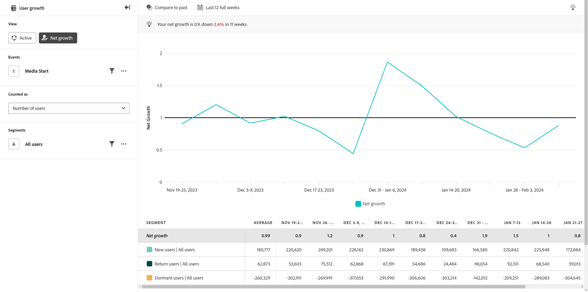

# 淨增長

{{release-limited-testing}}

此 **淨增長** 「檢視型別」可讓您深入瞭解特定期間內，使用者增減的速率。 水平軸是時間間隔，垂直軸是增長的測量值。

每個資料點代表淨增長，其計算公式如下：

`([New users] + [Return users]) / [Dormant users]`

此公式的結果為比率。 淨增長 `1` 代表一種平衡；該產品獲得的使用者數量與它失去的使用者數量相同。 淨成長率大於 `1` 代表正增長；新+回訪使用者多於休眠使用者。 同樣地，淨成長率低於 `1` 代表遺失；休眠使用者多於新增+回訪使用者。

類似於 [作用中](active.md) 檢視型別，使用者定義如下：

* **新增**：使用者在目前期間處於作用中狀態，但先前未出現。 檢視分析回顧多久的時間，藉由將游標停留在「[!UICONTROL 新使用者]&#39;在圖表圖例中。 回顧範圍會根據選取的日期範圍和間隔動態決定。
* **傳回**：使用者在目前期間處於作用中狀態，而在先前期間則非作用中，但在某個時間點之前處於作用中狀態。 檢視分析回顧到多遠的位置，藉由將游標停留在「[!UICONTROL 回訪使用者]&#39;在圖表圖例中。 回顧範圍會根據選取的日期範圍和間隔動態決定。
* **休眠**：使用者在上一個時段處於活動狀態，但在目前時段未處於活動狀態。 休眠使用者不會計入作用中使用者總數。
* 注意：重複使用者不會納入此計算中，因為它們不代表任何使用者的收益或損失。

此檢視型別的使用案例包括：

* **績效評估**：可讓您評估產品在取得新使用者方面的整體效能。 透過追蹤增長趨勢，您更能瞭解您的產品是否以所需的速度吸引和保留使用者。
* **使用者贏取分析**：可讓您評估使用者贏取策略的成效。 分析使用者成長的來源，例如搜尋引擎、促銷活動或其他行銷管道，可讓您找出最重要的成長來源，以便相應地配置資源。
* **流失分析**：淨增長在其公式中包含減少（休眠使用者）。 您可以評估使用者群在一段時間內的整體健康狀況。 如果淨成長率持續低於 `1`，表示有大量的減少情形，可能會促使實施保留策略。

## 查詢邊欄

查詢邊欄可讓您設定下列元件：

* **事件**：您要測量的事件。 由於此檢視型別是以使用者為基礎，在期間內與事件互動一次的使用者會計為作用中使用者。 您可以在查詢中包含一個事件。
* **人員**：您要測量的區段。 您可以在查詢中包含一個區段。

## 日期範圍

分析所需的日期範圍。 此設定有兩個元件：

* **間隔**：您要用來檢視趨勢資料的日期詳細程度。 有效選項包括每小時、每日、每週、每月和每季。 相同的日期範圍可以有不同的間隔，這會影響圖表中的資料點數和表格的欄數。 例如，以每日詳細程度檢視橫跨3天的分析只會顯示3個資料點，而以每小時詳細程度橫跨3天的分析則會顯示72個資料點。
* **日期**：開始和結束日期。 方便起見，您也可以使用滾動式日期範圍預設集和先前儲存的自訂範圍，或使用日曆選擇器來選擇固定日期範圍。
