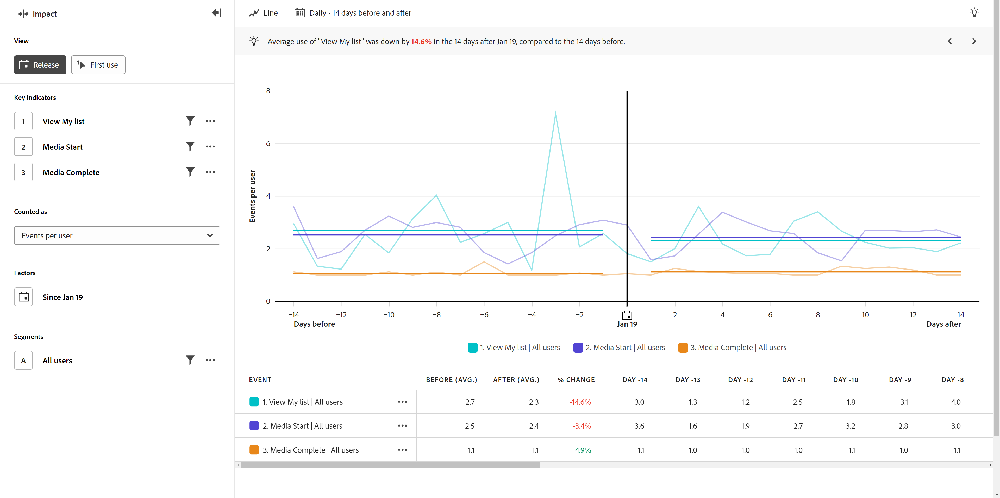

# 版本檢視

{{release-limited-testing}}

此 **版本** 檢視會顯示指定日期之前和之後關鍵指標執行方式的比較。 此報表的水平軸是時間間隔，而垂直軸則測量所需的索引鍵。 圖表中央的垂直長條代表您要比較之前和之後的日期。 此日期通常表示您要測量的產品有顯著變更，例如產品更新或行銷活動啟動。

## 使用案例

此檢視型別的使用案例包括：

* **整體績效評估：** 比較整體關鍵指標（例如收入）可協助您判斷特定版本是否整體成功。
* **功能採用**：如果產品更新著重於改善特定功能，您可以使用此檢視直接比較產品更新前後該功能的使用情形。
* **錯誤偵測**：追蹤發行前後的錯誤數量可提供客戶問題的早期指標。 如果您在發行後發現錯誤增加，您可以與工程或開發團隊合作，以找出並修正問題，避免對客戶造成進一步影響。

## 查詢邊欄

查詢邊欄可讓您設定下列元件：

* **關鍵指標**：您要為每個使用者測量的事件。 每個選取的關鍵指標都會以彩色線條表示。 表格中會新增代表事件的列。 您最多可以包含三個事件。
* **因素**：您想要比較之前和之後的日期。
* **人員**：您要測量的區段。 選取的區段會篩選您的資料，以僅聚焦於符合區段條件的個人。

## 圖表設定

「版本」檢視提供下列圖表設定，您可在圖表上方的功能表中調整這些設定：

* **量度**：您要測量的量度。 選項包括 [!UICONTROL 每位使用者的事件]， [!UICONTROL 使用者百分比]， [!UICONTROL 事件]， [!UICONTROL 工作階段]、和 [!UICONTROL 使用者].
* **圖表型別**：您要使用的視覺效果型別。 選項包括Line。

## 日期範圍

影響報表中的日期選取與其他分析型別的運作方式不同，因為報表會以查詢邊欄中指定的日期為中心。 提供下列選項：

* **間隔**：您要用來檢視趨勢資料的日期詳細程度。 有效選項包括 [!UICONTROL 每日]， [!UICONTROL 每週]， [!UICONTROL 每月]、和 [!UICONTROL 每季]. 變更間隔會影響「之前」和「之後」時段可用的選項。
* **時段之前和之後**：要在查詢邊欄中指定的日期之前和之後分析的時間量。 可用選項取決於 [!UICONTROL 間隔] 選取。
