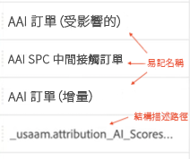
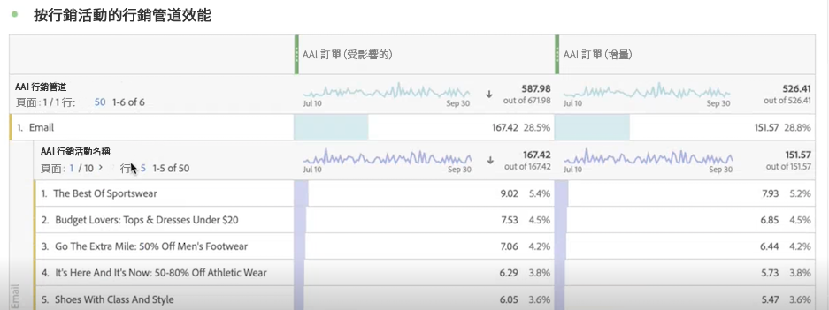
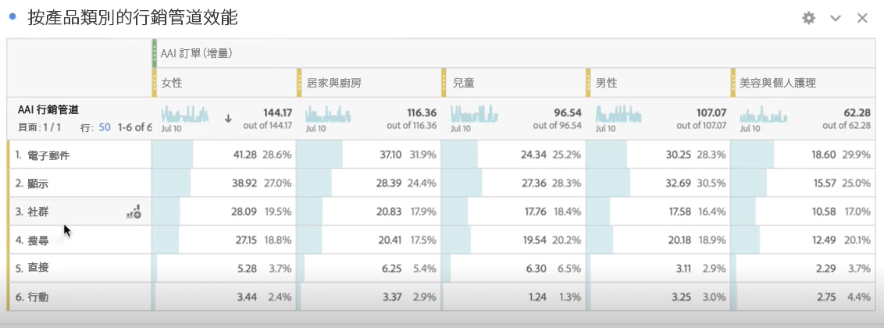

# 將Attribution AI與CJA整合

>[!NOTE]
>
>此功能將於2022年5月25日發佈。

[Attribution AI](https://experienceleague.adobe.com/docs/experience-platform/intelligent-services/attribution-ai/overview.html?lang=en)作為Adobe Experience Platform智慧服務的一部分，它是一種多渠道的算法歸屬服務，它計算客戶交互對特定結果的影響和增量影響。 通過Attribution AI，營銷人員可以通過瞭解客戶旅程每個階段的每個客戶交互的影響來衡量和優化營銷和廣告支出。

Attribution AI支援兩類得分：算法和基於規則。 算法得分包括增量和影響得分。

* **影響分數** 將100%的轉換信用在市場營銷渠道之間。
* **增量分數** 首先考慮到即使沒有市場營銷，您也會達到的轉換基準。 此基線取決於AI對模式、季節性等的觀察，因為現有品牌認可、忠誠和口碑。 余下信貸分為營銷渠道。

基於規則的分數包括 [!UICONTROL 第一次觸摸]。 [!UICONTROL 上次觸摸]。 [!UICONTROL 線性]。 [!UICONTROL U形], [!UICONTROL 時間衰減]。 Attribution AI支援3個Experience Platform方案：體驗活動、Adobe Analytics和消費者體驗活動。

Attribution AI與Customer Journey Analytics(CJA)整合，以便Attribution AI針對資料運行模型，然後CJA將這些模型的輸出作為資料集導入，然後可以與CJA其餘資料集整合。 然後，可以在CJA中的資料視圖和報告中使用啟用Attribution AI的資料集。

## 工作流程

在CJA中的輸出工作之前，在Adobe Experience Platform執行某些步驟。 該輸出由具有應用的Attribution AI模型的資料集組成。

### 步驟1:建立Attribution AI實例

在Experience Platform中，通過選擇和映射資料、定義事件和培訓資料來建立Attribution AI實例，如所述 [這裡](https://experienceleague.adobe.com/docs/experience-platform/intelligent-services/attribution-ai/user-guide.html)。

### 步驟2:設定到Attribution AI資料集的CJA連接

在CJA，你現在可以 [建立一個或多個連接](/help/connections/create-connection.md) Experience Platform已檢測為Attribution AI的資料集。 這些資料集以「Attribution AI分數」前置詞顯示，如下所示：

### 第3步：基於這些連接建立資料視圖

在CJA, [建立一個或多個資料視圖](/help/data-views/create-dataview.md) 包含Attribution AIXDM欄位。 （在此提供螢幕截圖會很好。）

### 第4步：CJA工作區中AAI資料的報告

例如，在CJA Workspace項目中，可以拉入「AAI訂單」等度量，以及「AAI市場活動名稱」或「AAI市場營銷渠道」等維度。

這裡，我們看到一個包含AAI資料的Workspace項目，它顯示具有影響和增量分數的訂單。

## Attribution AI與Attribution IQ

你何時應該使用Attribution AI資料 [Attribution IQ](/help/analysis-workspace/attribution/overview.md)，本機CJA功能？ 下表顯示了在功能方面的一些差異：

| 功能 | Attribution AI | Attribution IQ |
| --- | --- | --- |
| 分數歸屬 | 有 | 否 |
| 允許用戶調整模型 | 是 | 是 |
| 是否跨渠道進行歸屬(注：AAI不使用與CJA相同的縫合資料。) | 是 | 是 |
| 包括增量分數和受影響的分數 | 有 | 否 |
| ML建模 | 是 | 是 |
| ML模型與預測 | 有 | 否 |

{style=&quot;table-layout:auto&quot;}
