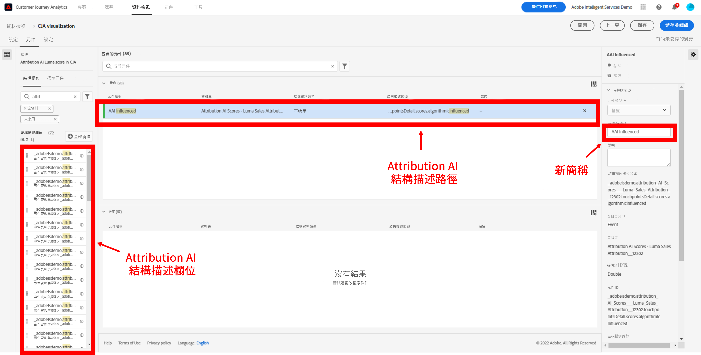

# 將 Attribution AI 與 CJA 整合

[Attribution AI](https://experienceleague.adobe.com/docs/experience-platform/intelligent-services/attribution-ai/overview.html?lang=zh-Hant) 是 Adobe Experience Platform Intelligent Services 的一部分，它是一種多管道的演算法歸因服務，可計算客戶互動對指定結果的影響和累加影響。 透過 Attribution AI，行銷人員可藉由了解每個客戶在客戶歷程各個階段的互動所產生的影響，以衡量行銷和廣告支出並使其最佳化。

Attribution AI與Customer Journey Analytics(CJA)整合，以使Attribution AI根據客戶的營銷觸點和轉換資料源運行模型。 然後，CJA將這些模型的輸出作為資料集導入，或者它可以與CJA其餘資料集整合。 然後可以在 CJA 中的資料檢視和報告中運用具有 Attribution AI 功能的資料集。

Attribution AI 支援 3 個 Experience Platform 結構描述：體驗事件、Adobe Analytics 和取用者體驗事件。

Attribution AI 支援兩種類別的分數：演算法及規則型。 

## 算法得分

演算法分數包括累加分數和受影響的分數。

* **受影響的分數**&#x200B;會在行銷管道之間分配 100% 的轉換點數。
* **累加分數**&#x200B;會先考量您即使沒有行銷也能達到的轉換基線。 由於現有的品牌認知度、忠誠度和口碑，此基線取決於 AI 對模式、季節性等因素的觀察。 其餘的點數會在行銷管道之間分配。

## 基於規則的分數

基於規則的分數包括

* **[!UICONTROL 第一次觸摸]** 在「歸因回望」窗口中首次看到的「觸點」，則100%的評分。
* **[!UICONTROL 上次觸摸]** 將100%的信用授予最近在轉換前發生的「觸點」。
* **[!UICONTROL 線性]** 在導致轉換的每個觸點上，都給予同等的評價。
* **[!UICONTROL U形]** 給第一次互動40%的信用，給最後一次互動40%的信用，把剩下的20%分給中間的任何接觸點。 只有單一接觸點的轉換則會獲得 100% 的評分。如果是具有兩個接觸點的轉換，兩者會平均獲得 50% 的評分。
* **[!UICONTROL 時間衰減]** 以指數衰減，並帶有自定義半衰期參數，其中預設值為7天。 每個管道的權重須視接觸點啟動和最終轉換之間所經過的時間量而定。用於判斷評分的公式為 `2^(-t/halflife)`，`t` 代表接觸點和轉換之間的時間量。所有接觸點隨後都會標準化至 100%。

## 工作流程

在 CJA 中使用輸出之前會在 Adobe Experience Platform 中執行某些步驟。 輸出是由已套用 Attribution AI 模型的資料集所組成。

### 步驟 1：建立 Attribution AI 執行個體

在 Experience Platform 中，藉由選取及對應資料、定義事件及訓練您的資料來建立 Attribution AI 執行個體，如[這裡](https://experienceleague.adobe.com/docs/experience-platform/intelligent-services/attribution-ai/user-guide.html)所述。

### 步驟 2：設定 CJA 與 Attribution AI 資料集的連線

現在在 CJA 中，您可以[建立一個或多個連線](/help/connections/create-connection.md)來連接已針對 Attribution AI 檢測的 Experience Platform 資料集。 這些資料集以「Attribution AI分數」前置詞顯示，如下所示：

### 步驟 3：根據這些連線建立資料檢視

在 CJA 中，[建立一個或多個資料檢視](/help/data-views/create-dataview.md)，這些檢視包含 Attribution AI XDM 欄位。 

下面是觸點的XDM架構欄位：

下面是要轉換的XDM架構欄位：

### 步驟 4：在 CJA 工作區中報告 AAI 資料

在 CJA 工作區專案中，您可以納入像是「AAI 訂單」等量度，以及像是「AAI 行銷活動名稱」或「AAI 行銷管道」等維度。

>[!IMPORTANT]
>
>這些維和度量不是以這種方式本機命名的。 這些是「友好的名字」。 的 [Attribution AI中的命名約定](https://experienceleague.adobe.com/docs/experience-platform/intelligent-services/attribution-ai/input-output.html?lang=en#attribution-ai-output-data) 遵循架構路徑。 我們建議將長AAI架構路徑名稱更名為CJA中更短、更易用的名稱（維/度量）。 你可以在 **[!UICONTROL 資料視圖]** > **[!UICONTROL 編輯資料視圖]** > **[!UICONTROL 元件]** 頁籤 **[!UICONTROL 架構欄位]** ->按一下架構欄位 — > **[!UICONTROL 元件名稱]**。

**具有影響和增量分數的訂單**

以下工作區專案中有 AAI 資料，其中顯示有受影響的分數和累加分數的訂單。深入到任何維，通過以下方式瞭解屬性：市場活動、產品組、用戶段、地理位置等。

**營銷業績**

比較不同屬性模型之間的點屬性對比：

**通道交互**

瞭解渠道交互，瞭解哪些渠道可以最有效地與其他渠道配合使用，使用Venn圖：

**要轉換的頂部路徑**

下表顯示了轉換（消除重複）的頂部路徑，以幫助您設計和優化觸點：

**提前期到轉換**

在此，我們將看到在混合中使用觸點時轉換的提前期。 它有助於優化提前期：

## Attribution AI 與 Attribution IQ 之間的差異

那什麼時候應該使用 Attribution AI 資料，而不是原生 CJA 功能 [Attribution IQ](/help/analysis-workspace/attribution/overview.md) 呢？此表格顯示兩者功能上的一些差異：

| 功能 | Attribution AI | Attribution IQ |
| --- | --- | --- |
| 增量屬性 | 有 | 無 |
| 允許使用者調整模型 | 有 | 有 |
| 跨管道進行歸因 (注意：AAI 不使用 CJA 所用的相同拼接資料。) | 有 | 有 |
| 包括受影響的分數 | 有 | 有 |
| 進行 ML 模型化 | 有 | 有 |
| 基於區域的歸屬模型 | 有 | 有 |
| 可在模型中配置市場營銷觸點 | 有 | 無 |

{style=&quot;table-layout:auto&quot;}
