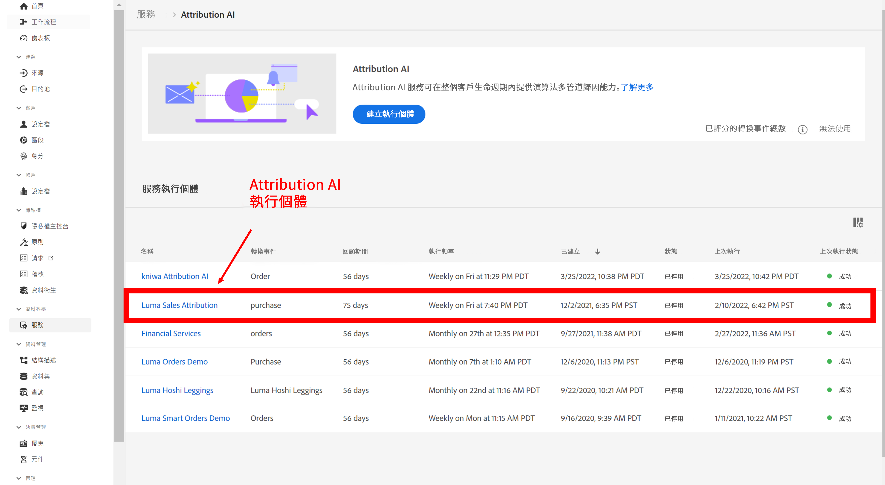

# 將 Attribution AI 與 CJA 整合

[Attribution AI](https://experienceleague.adobe.com/docs/experience-platform/intelligent-services/attribution-ai/overview.html?lang=zh-Hant) 是 Adobe Experience Platform Intelligent Services 的一部分，它是一種多管道的演算法歸因服務，可計算客戶互動對指定結果的影響和累加影響。 透過 Attribution AI，行銷人員可藉由了解每個客戶在客戶歷程各個階段的互動所產生的影響，以衡量行銷和廣告支出並使其最佳化。

Attribution AI 會與 Customer Journey Analytics (CJA) 進行某種程度的整合，使 Attribution AI 可針對客戶的行銷接觸點和轉換資料來源執行模型。 然後 CJA 會將這些模型輸出當作資料集匯入，或者可以將其與您的其餘 CJA 資料集整合。 接著就能在 CJA 中的資料檢視和報告中運用具有 Attribution AI 功能的資料集。

Attribution AI 支援 3 個 Experience Platform 結構描述：體驗事件、Adobe Analytics 和取用者體驗事件。

Attribution AI 支援兩種類別的分數：演算法及規則型。

## 演算法分數

演算法分數包括累加分數和受影響的分數。

* **[!UICONTROL 受影響的]分數**&#x200B;會在行銷管道之間分配 100% 的轉換點數。
* **[!UICONTROL 累加] 分數**&#x200B;會先考量您即使沒有行銷也能達到的轉換基線。 由於現有的品牌認知度、忠誠度和口碑，此基線取決於 AI 對模式、季節性等因素的觀察。 其餘的點數會在行銷管道之間分配。

## 規則型分數

規則型分數包括

* **[!UICONTROL 首次接觸]**&#x200B;會將 100% 的評分給予歸因回顧期間中首個出現的接觸點。
* **[!UICONTROL 上次接觸]**&#x200B;會將 100% 的評分給予轉換前發生的最近一次接觸點。
* **[!UICONTROL 線性]**&#x200B;會將相等的評分歸給每個帶來轉換的接觸點。
* **[!UICONTROL U 形]**&#x200B;會將 40% 的評分給予第一次互動，再將 40% 的評分給予上次互動，剩下的 20% 則分給兩者之間的任何接觸點。 只有單一接觸點的轉換則會獲得 100% 的評分。 如果是具有兩個接觸點的轉換，兩者會平均獲得 50% 的評分。
* **[!UICONTROL 時間衰減]**&#x200B;會以自訂的半衰期參數 (預設為 7 天) 進行指數耗損。 每個管道的權重須視接觸點啟動和最終轉換之間所經過的時間量而定。 用於判斷評分的公式為 `2^(-t/halflife)`，`t` 代表接觸點和轉換之間的時間量。 所有接觸點隨後都會標準化至 100%。

## 工作流程

在 CJA 中使用輸出之前會在 Adobe Experience Platform 中執行某些步驟。 輸出是由已套用 Attribution AI 模型的資料集所組成。

### 步驟 1：建立 Attribution AI 執行個體

在 Experience Platform 中，藉由選取及對應資料、定義事件及訓練您的資料來建立 Attribution AI 執行個體，如[這裡](https://experienceleague.adobe.com/docs/experience-platform/intelligent-services/attribution-ai/user-guide.html)所述。

### 步驟 2：設定 CJA 與 Attribution AI 資料集的連線

現在在 CJA 中，您可以[建立一個或多個連線](/help/connections/create-connection.md)來連接已針對 Attribution AI 檢測的 Experience Platform 資料集。 這些資料集出現時會有「Attribution AI 分數」前置詞，如下所示：

### 步驟 3：根據這些連線建立資料檢視

在 CJA 中，[建立一個或多個資料檢視](/help/data-views/create-dataview.md)，這些檢視包含 Attribution AI XDM 欄位。 

以下列出接觸點的 XDM 結構描述欄位：

以下列出轉換的 XDM 結構描述欄位：

### 步驟 4：在 CJA 工作區中報告 AAI 資料

在 CJA 工作區專案中，您可以納入像是「AAI 訂單」等量度，以及像是「AAI 行銷活動名稱」或「AAI 行銷管道」等維度。

AAI 中的原始分數輸出具有嵌套綱要，其中欄位路徑的長度足以佔用表格或視覺效果中大部分的空間。為了簡潔表達，會按照以下規則在 CJA 中自動產生[!UICONTROL 顯示名稱]並投入使用：

* 所有欄位都有「AAI」首碼
* 如果是接觸點欄位：
   * 對於作為分數 XDM 一部分的欄位，其在 CJA 中會顯示為 `AAI T {field name}`
   * 對於作為 passThrough 欄納入的欄位，其在 CJA 中會顯示為 `AAI T PT {field name}`
* 如果是轉換欄位：
   * 對於作為分數 XDM 一部分的欄位，其在 CJA 中會顯示為 `AAI C {field name}`
   * 對於作為 passThrough 欄納入的欄位，其在 CJA 中會顯示為 `AAI C PT {field name}`

**包含受影響分數和累加分數的訂單**

以下工作區專案中有 AAI 資料，其中顯示有受影響的分數和累加分數的訂單。 您可以按照以下項目深入研究以了解歸因：行銷活動、產品群組、使用者區段和地理位置等。

**行銷績效**

比較和對比不同歸因模型之間的接觸點歸因：

**管道互動**

透過文氏圖表了解管道互動，以掌握哪些管道搭配使用時成效最佳：

**排名在前的轉換路徑**

此表格列出排名在前的轉換路徑 (已排除重複項目)，可協助您設計和最佳化接觸點：

**轉換前置時間**

此部分提供混合接觸點時的轉換前置時間。 這有助於最佳化前置時間：

## Attribution AI和CJA歸因功能之間的差異

下表顯示部分功能差異：

| 功能 | Attribution AI | CJA歸因 |
| --- | --- | --- |
| 逐量增加歸因 | 有 | 無 |
| 允許使用者調整模型 | 有 | 有 |
| 跨管道進行歸因 (注意：AAI 不使用 CJA 所用的相同拼接資料。) | 有 | 有 |
| 包括受影響的分數 | 有 | 有 |
| 進行 ML 模型化 | 有 | 有 |
| 地區型歸因模型 | 有 | 有 |
| 可設定模型中的行銷接觸點 | 有 | 無 |

{style="table-layout:auto"}
