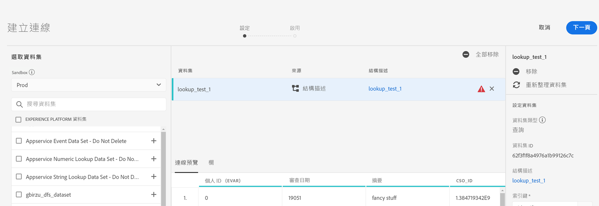
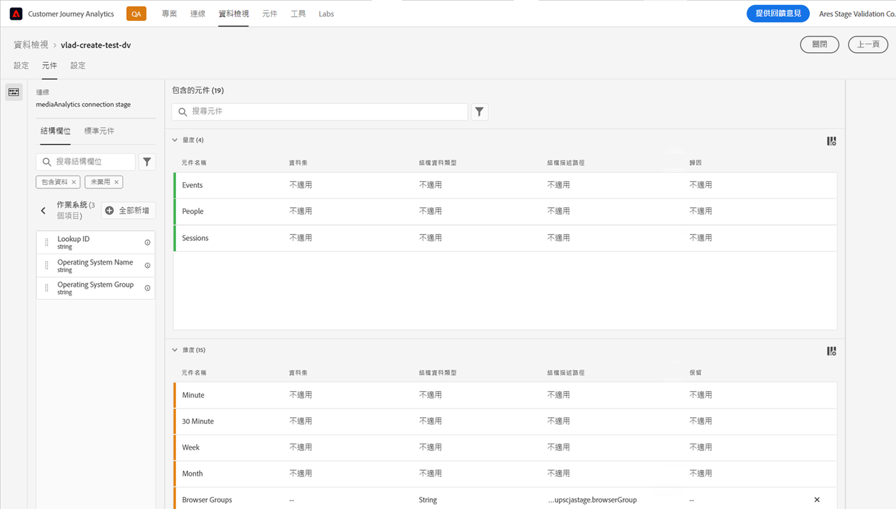
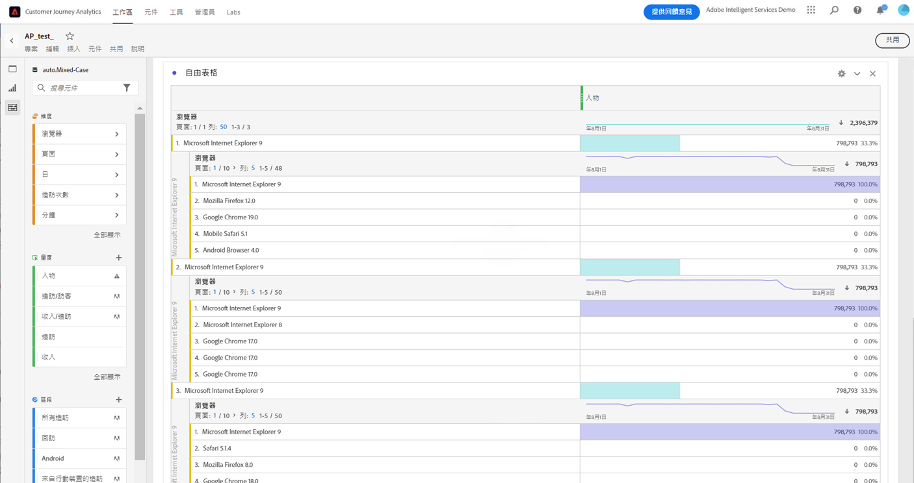
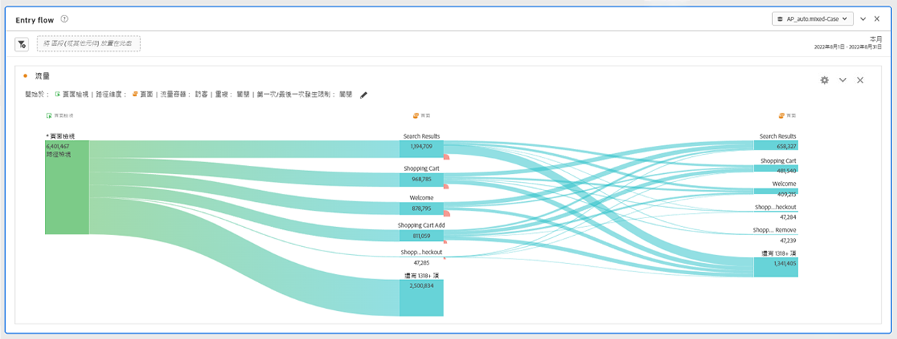
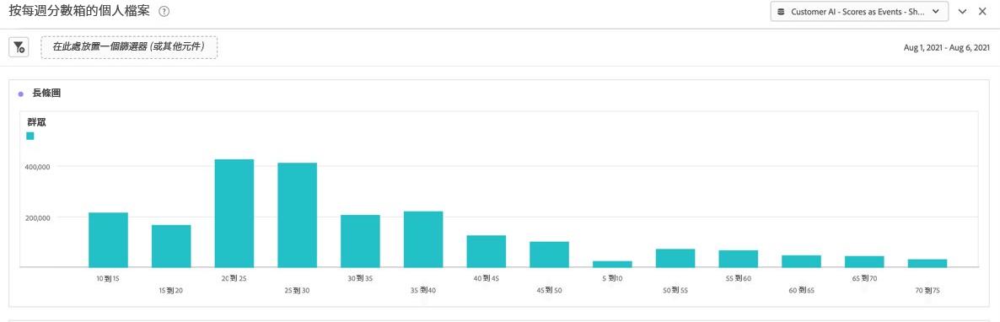
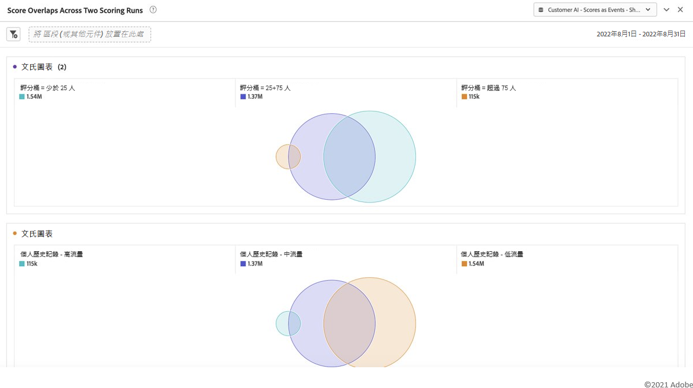

# 將 Customer AI 與 CJA 整合

[Customer AI](https://experienceleague.adobe.com/docs/experience-platform/intelligent-services/customer-ai/overview.html?lang=zh-Hant) 是 Adobe Experience Platform Intelligent Services 的一部分，它讓行銷人員能夠產生個人層面的客戶預測。

在影響因子的協助下，Customer AI 可告知您客戶可能會有什麼行為以及原因何在。 此外，行銷人員可受益於 Customer AI 預測和洞見，藉由提供最適合的方案和訊息來打造個人化客戶體驗。

客戶AI依靠個人行為資料和個人資料資料進行傾向評分。 客戶AI具有靈活性，它可以接收多個資料源，包括Adobe Analytics、Adobe Audience Manager、消費者體驗事件資料和體驗事件資料。 如果使用Experience Platform源連接器輸入Adobe Audience Manager和Adobe Analytics資料，則模型會自動選取標準事件類型來訓練和計分模型。 如果導入自己的「體驗事件」資料集而不使用標準事件類型，則任何相關欄位都需要映射為自定義事件或配置檔案屬性（如果要在模型中使用）。 這可以在Experience Platform中的「客戶AI」配置步驟中完成。&#x200B;

Customer AI 與 Customer Journey Analytics (CJA) 整合到一定的程度，以便可以在 CJA 的資料檢視和報告中利用具有 Customer AI 功能的資料集。通過此整合，您可以

* **跟蹤一段時間內用戶的傾向分數**。 示例用例：酒店客戶在酒店的音樂會場地購買展示票的可能性有多大？
* **分析哪些成功事件或屬性與傾向得分相關**。&#x200B;示例用例：我想瞭解與傾向得分相關的屬性或成功事件。
* **跟蹤客戶傾向在不同評分運行期間的錄入流**。 示例用例：我想瞭解一些最初傾向低的人，隨著時間推移，他們變成了傾向高的人&#x200B;。
* **看傾向的分佈**。 用例：我想瞭解我的傾向分數的分佈，可以更精確地分析我的部分。&#x200B;示例：零售商想以50美元的價格進行特定促銷。 由於預算等原因，他們可能只想進行非常有限的促銷。 他們分析資料，並決定只針對80%以&#x200B;上的客戶。
* **看看特定群體在一段時間內完成某項行動的傾向**。 用例：我想跟蹤一個特定群體。 這和第一個相似，但你可以追蹤一個特定的群體&#x200B;。 酒店示例：營銷人員可以跟蹤他們的銅製和銀制，銀制和金制。 然後，他們可以看到，每個群體都傾向於隨時間預訂酒店。&#x200B;

## 工作流程

在 CJA 中使用輸出之前會在 Adobe Experience Platform 中執行某些步驟。

### 步驟 1：設定 Customer AI 執行個體

準備好資料並準備好所有憑據和架構後，請按照 [配置客戶AI實例](https://experienceleague.adobe.com/docs/experience-platform/intelligent-services/customer-ai/user-guide/configure.html?lang=zh-Hant) 在Adobe Experience Platform。

### 步驟 2：設定 CJA 與 Customer AI 資料集的連線

現在在 CJA 中，您可以[建立一個或多個連線](/help/connections/create-connection.md)來連接已針對 Customer AI 檢測的 Experience Platform 資料集。 每種預測（如「升級帳戶的可能性」）都相當於一個資料集。 這些資料集以「客戶AI Scores in EE Format - name_of_application」前置詞顯示。

>[!IMPORTANT]
>
>如果在步驟1中的配置期間啟用切換以啟用CJA的分數，則每個客戶AI實例具有兩個輸出資料集。 一個輸出資料集以配置檔案XDM格式顯示，一個以體驗事件XDM格式顯示。

以下是CJA作為現有或新資料集的一部分引入的XDM架構的示例：

(請注意，此範例為個人基本資料集；相同一組結構描述物件將成為 CJA 捕捉的 Experience Event 資料集的一部分。 體驗事件資料集會包含時間戳記當作評分日期。) 在此模型中被評分的每個客戶都會有與其相關的分數、評分日期等。

### 步驟 3：根據這些連線建立資料檢視

現在在 CJA 中，您可以繼續使用維度 (例如分數、評分日期、可能性等) 以及您在建立的連線中引進的量度來[建立資料檢視](/help/data-views/create-dataview.md)。

### 步驟 4：在工作區中報告 CAI 分數

在CJA Workspace中，現在可以建立新項目並拉入可視化效果。

**趨勢傾向得分**

下面是一個包含CAI資料的Workspace項目的示例，該項目在一段時間內將用戶的傾向分數&#x200B;趨勢化，如堆積條形圖：

**包含原因代碼的表**

下表顯示了段具有高傾向或低傾向的原因代碼&#x200B;:

**客戶傾向的錄入流**

此流程圖顯示了客戶傾向在不同評分運行期間的錄入流&#x200B;:

**傾向分數分佈**

此條形圖顯示傾向得分的分佈&#x200B;:

**傾向重疊**

此Venn圖顯示了不同計分運行的傾向重疊：

