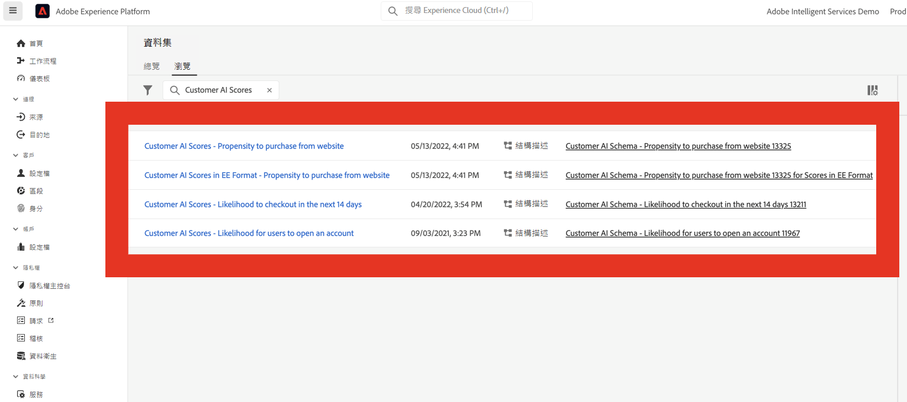
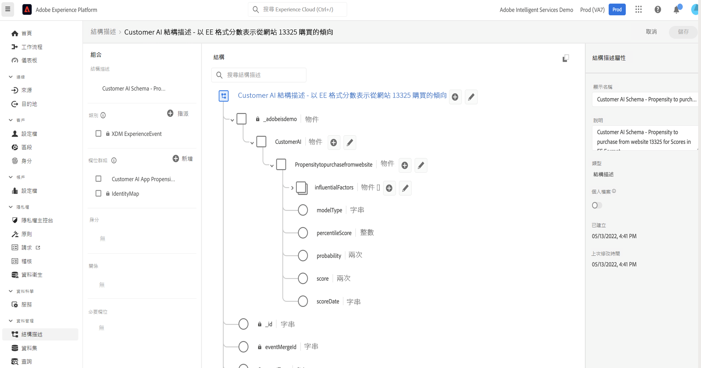
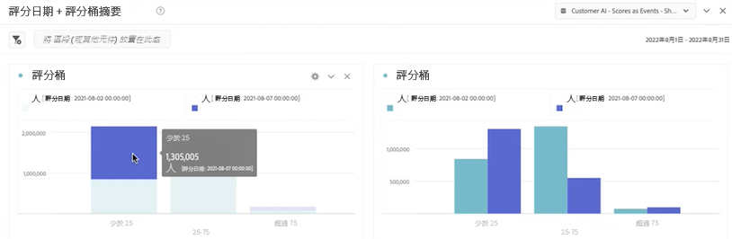

# Integrate Customer AI with CJA

>[!NOTE]
>
>This page is under construction.

With the help of influential factors, Customer AI can tell you what a customer is likely to do and why. Additionally, marketers can benefit from Customer AI predictions and insights to personalize customer experiences by serving the most appropriate offers and messaging.

Customer AI works by analyzing one of the following datasets to predict churn or conversion propensity scores:

* Adobe Analytics data using the Analytics source connector
* Adobe Audience Manager data using the Audience Manager source connector
* Experience Event (EE) dataset
* Consumer Experience Event (CEE) dataset

Customer AI integrates with Customer Journey Analytics (CJA) to the extent that Customer AI-enabled datasets can be leveraged in data views and reporting in CJA.

## 工作流程

Some of the steps are performed in Adobe Experience Platform prior to working with the output in CJA.

### Step 1: Download Customer AI scores

### Step 2: Define Customer AI inputs and outputs

### Step 3: Configure a Customer AI instance

### Step 4: Set up a CJA connection to Customer AI datasets

These datasets appears with the &quot;Customer AI Scores&quot; prefix, as shown here:

Each prediction, such as &quot;Likelihood to upgrade account&quot; equates to one dataset.

Here is an example of a XDM schema that CJA would bring in as part of an existing or new dataset:

(Note that the example is a profile dataset; the same set of schema object would be part of an Experience Event dataset that CJA would grab. The Experience Event dataset would include timestamps as the score date.) Every customer scored in this model would have a score, a scoreDate, etc. associated with them.

### Step 5: Create data views based on these connections

### Step 6: Report on CAI scores in Workspace

Here is an example of a Workspace project with CAI data that shows score dates in a stacked bar chart:

