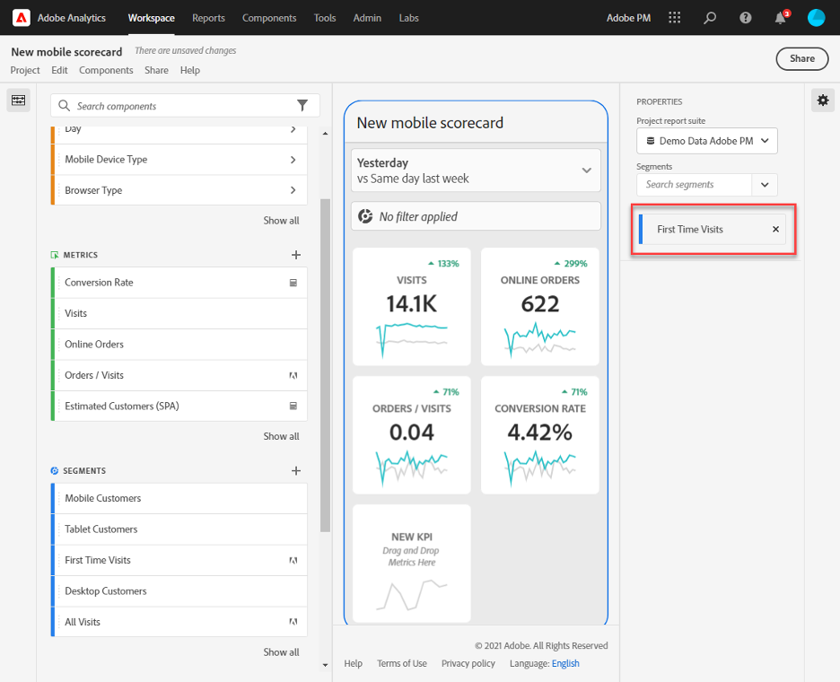

# 管理計分卡

本主題說明Customer Journey Analytics資料的組織者如何檢視及管理計分卡元素。

## 檢視和設定圖磚屬性 {#tiles}

按一下計分卡產生器中的圖磚，右側欄會顯示與該圖磚相關聯的屬性和特性以及其詳細投影片。 在此邊欄中，您可以為該圖磚提供新的&#x200B;**標題**，或是透過套用篩選器來設定圖磚。區段是Customer Journey Analytics中的篩選器。

## 檢視詳細投影片 {#view-detail-slides}

若您按一下圖磚，動態快顯視窗會顯示應用程式中向高階主管使用者呈現詳細投影片的方式。您可新增維度以針對您的特定需求劃分資料。如果尚未套用任何維度，劃分維度會是&#x200B;**小時**&#x200B;或&#x200B;**天數**，視預設日期範圍而定。

劃分會按維度項目細分量度，以精進您的分析，例如以下情況：

* 依廣告平台 (AMO ID) 劃分的不重複訪客量度
* 依產品類別 (零售) 劃分的造訪
* 依產品名稱劃分的總營收

新增至圖磚的每個維度，都會顯示在應用程式詳細檢視的下拉式清單中。高階主管使用者可從下拉式清單中選擇選項。

## 自訂詳細投影片 {#customize-detail-slide}

自訂詳細投影片可讓您與客群分享的資訊更有針對性。

>[!BEGINSHADEBOX]

如需示範影片，請參閱 [自訂詳細資料檢視](https://video.tv.adobe.com/v/3410002?quality=12&learn=on){target="_blank"}。

>[!ENDSHADEBOX]

您可以修改每個詳細投影片的版面並新增文字，以更清楚地說明一般使用者可在資料中看到的內容。您還可以使用下拉式選單變更圖表類型。

### 變更投影片版面

變更投影片版面以專注於最重要的資訊。例如，您可以變更版面，僅顯示圖表或僅顯示表格。若要變更投影片版面，請選取其中一種預先設計的格式。

您還可以透過將視覺化元件從左側邊欄拖放到畫布上來變更投影片版面。每個詳細投影片一次只能提供兩種視覺化。

### 為投影片新增描述性文字

您可以新增文字以提供有關圖表中所包含內容或有關資料的細微差別的有意義資訊。

若要新增文字到詳細投影片，請選取顯示 `T` 符號的版面，或將文字視覺化元件從左側欄拖放到上方。新增新的文字視覺化或選擇包含文字的投影片版面時，文字編輯器將自動開啟。文字編輯器會提供格式化文字的所有標準選項。您可以套用段落、標題和副標題等文字樣式，並套用粗體和斜體字體。您可以對齊文字、新增項目符號和編號清單以及新增連結。完成編輯後，請選取文字編輯器右上角的最小化按鈕將其關閉。若要編輯已新增的文字，請選取鉛筆圖示，以再次開啟文字編輯器。

## 移除元件 {#remove}

同樣地，若要移除套用至整個計分卡的元件，請在計分卡上按一下圖磚之外的任意位置，然後按一下將游標停留在元件上時顯示的&#x200B;**x**，即可將其移除，如下方「**初次造訪次數**」所示：

## 建立資料故事 {#create-data-story}

資料故事是圍繞中心主題或量度建置的支援資料點、業務內容和相關量度的集合。

例如，如果您著重在網頁流量，最重要的量度可能是造訪，但您也可能對新使用者、不重複人員感興趣，而且您可能想要依網頁或流量來自的裝置型別檢視劃分的資料。 行動記分卡專案中的資料故事可讓您將最重要的量度放在首位和中心位置，並透過多個詳細資訊幻燈片描述量度背後的完整故事。

觀看影片，深入了解在 Analysis Workspace 的行動記分卡專案中建立資料故事的資訊。

>[!BEGINSHADEBOX]

如需示範影片，請參閱 [行動計分卡專案的資料故事](https://video.tv.adobe.com/v/3416392/?quality=12&learn=on){target="_blank"}。

>[!ENDSHADEBOX]

**若要建立資料故事** {#data-story-create}

將多個詳細資訊幻燈片新增到磚來建置資料故事。

1. 從行動記分卡專案開始。
1. 選取要從中建立故事的磚。
   
   {width=".50%"}
1. 新增幻燈片以建置資料故事。第一張幻燈片是預設產生的。
要新增新幻燈片，請將滑鼠懸停在幻燈片上或按一下幻燈片，然後從可用選項中進行選擇：
   * 點選 + 號建立新幻燈片。
   * 點選複製圖示以複製現有幻燈片。
1. 如果您建立了一張空白幻燈片，請從左側邊欄拖放元件，或選擇一個版面以使用磚中的資料自動填入幻燈片。
   
要刪除幻燈片，請點選垃圾桶圖示。

### 自訂資料故事 {#customize-data-story}

資料故事可讓您自訂所有內容，好讓您可以共用資訊，並排除您不需要的所有內容。您可以自訂磚和個別幻燈片以新增篩選器、顯示細分、變更版面和變更視覺效果。

**自訂磚的方法**

1. 點選磚。所選取的磚會顯示藍色邊框，右側面板則會顯示磚的屬性。
1. 變更標題、圖表類型和其他磚選項。
1. 將元件拖曳到磚上。
   
把元件 (如視覺效果) 拖曳到磚上時，該元件將套用至所有資料故事幻燈片。
1. 要只對標題套用變更，請按住 Shift 鍵來套用變更。
   

>[!NOTE]
>幻燈片會繼承圖磚的元件，但圖磚不會繼承幻燈片的元件。

**自訂個別幻燈片**

您可以變更資料故事中個別幻燈片的視覺效果。例如，您可以將特定幻燈片的水平列變更為環圈圖。您也可以變更版面。請參閱[自訂詳細幻燈片](#customize-detail-slide)。

### 預覽資料故事 {#preview-data-story}

建立資料故事後，使用「**預覽**」按鈕查看資料故事並與之互動，就像您是應用程式使用者一樣。有關預覽資料故事的資訊，請參閱[預覽記分卡](#preview)

### 在磚和幻燈片之間導覽 {#navigate-tiles-slides}

導覽列會顯示代表各張幻燈片內容的圖示。如果有多張幻燈片，導覽列可讓您輕鬆瀏覽到特定幻燈片。

要在磚和幻燈片之間移動，請點選導覽列。

{width="45%"}

您也可以使用鍵盤上的箭頭來回導覽，或選取元件並將它拉到螢幕的左側或右側來滾動。

## 預覽計分卡 {#preview}

在Adobe Analytics儀表板應用程式中發佈計分卡後，您可以預覽計分卡的外觀和功能。

1. 按一下螢幕右上角的 **[!UICONTROL 預覽]**。

   

1. 若要檢視計分卡在不同裝置上的外觀，請從「[!UICONTROL 裝置預覽]」下拉式選單選取裝置。

   

1. 若要與預覽互動，您可以：

   * 按一下左鍵以模擬手機螢幕上的點選。

   * 使用電腦的捲動功能來模擬用手指捲動手機螢幕。

   * 長按以模擬用手指長按手機螢幕。 這對於與詳細檢視中的視覺效果互動非常有用。

## 共用計分卡 {#share}

若要與執行使用者共用計分卡：

1. 按一下 **[!UICONTROL 共用]** 功能表，然後選取 **[!UICONTROL 共用計分卡]**。

1. 在&#x200B;**[!UICONTROL 共用行動計分卡]**&#x200B;表單中，依照以下說明填寫欄位：

   * 提供計分卡的名稱
   * 提供計分卡的說明
   * 新增相關標記
   * 指定計分卡的收件者

1. 按一下 **[!UICONTROL 共用]**。

在您共用計分卡後，您的收件者可在其 Analytics 儀表板中存取該計分卡。如果您在計分卡產生器中對計分卡進行後續變更，共用的計分卡會自動更新。 到時，主管使用者在應用程式中重新整理計分卡後，就能看見變更。

如果您是以新增元件的方式更新計分卡，可再次共用計分卡 (並勾選 **[!UICONTROL 共用內嵌元件]** 選項)，以確保您的高階主管使用者有權存取這些變更。

### 使用分享連結來分享計分卡

使用可共用連結可讓您在電子郵件、檔案或簡訊應用程式中輕鬆共用計分卡。 可共用的連結可讓收件者在他們的案頭或儀表板行動應用程式上開啟計分卡。 可共用的深層連結可讓您更輕鬆地共用專案，並促進與利害關係人的互動。

使用可共用連結來共用計分卡

1. 按一下 **[!UICONTROL 共用]** 功能表，然後選取 **[!UICONTROL 共用計分卡]**。

   

1. 複製連結並將其貼到電子郵件、檔案或IM應用程式中。

   收件者使用案頭應用程式或瀏覽器開啟連結時，行動計分卡專案將在Workspace中開啟。

   當收件者在行動裝置上開啟連結時，計分卡將直接在Adobe Analytics儀表板應用程式中開啟。

   如果收件者尚未下載行動應用程式，系統會將他們導向至App Store或Google Play市集中的應用程式清單，他們可以從該清單下載。

## 移除 [!UICONTROL 未指定] 維度項目 {#remove-dims}

如果您想從資料中移除 [!UICONTROL 未指定] 維度項目，請執行以下作業：

1. 選取正確圖磚。
1. 在右側欄中，在 **[!UICONTROL Drill ins]** 下選取維度項目 (包含您想移除的 **[!UICONTROL 未指定]** 項目) 旁的右箭頭。

   

1. 按一下 **[!UICONTROL 未指定]** 旁的圖示，即可從報表中移除未指定的資料。(您也可移除任何其他的維度項目。)

## 在計分卡上檢視智慧型字幕 {#captions}

智慧型字幕可協助非分析人員更瞭解其資料，無需分析人員協助。 智慧型字幕使用進階機器學習和創作AI，為視覺效果提供有價值的自然語言見解。

這些註解會挑選出資料中重要的統計深入分析，並以自然語言短語，因此有助於非分析人員提升其資料素養。

智慧型註解可用於行動應用程式中的所有視覺效果，包括折線圖、環圈圖、長條圖和摘要數字。

若要在行動計分卡上檢視智慧型字幕：

1. 在計分卡中，按一下圖磚。 例如，在此計分卡中，按一下滑鼠左下方的線圖。

   

1. 點選右上方的藍色圖示以產生註解。 註解會顯示線上圖下方。

   

1. 向右撥動以檢視所有智慧型字幕。

   智慧型字幕可指出資料尖峰、異常、趨勢、下降、關聯和其他現象。

1. 點選註解內的黑色旗標可報告問題，例如有害或非法的內容。

   

1. 按一下X退出&#x200B;**[!UICONTROL 報告結果]**&#x200B;對話方塊。
