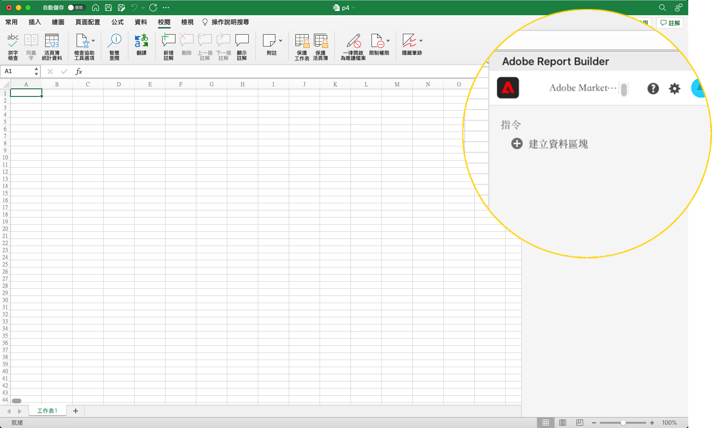
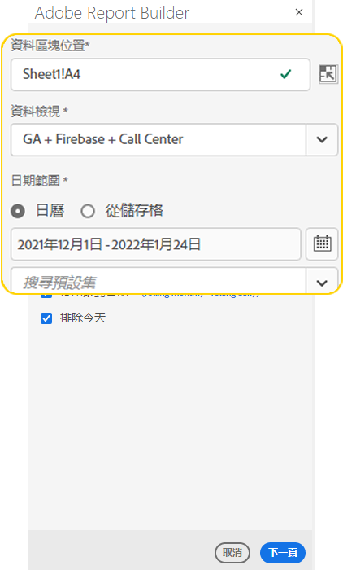
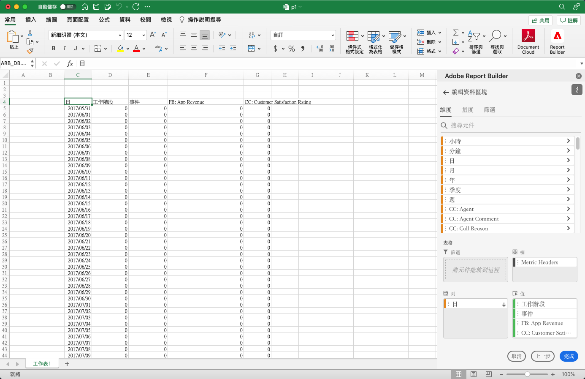
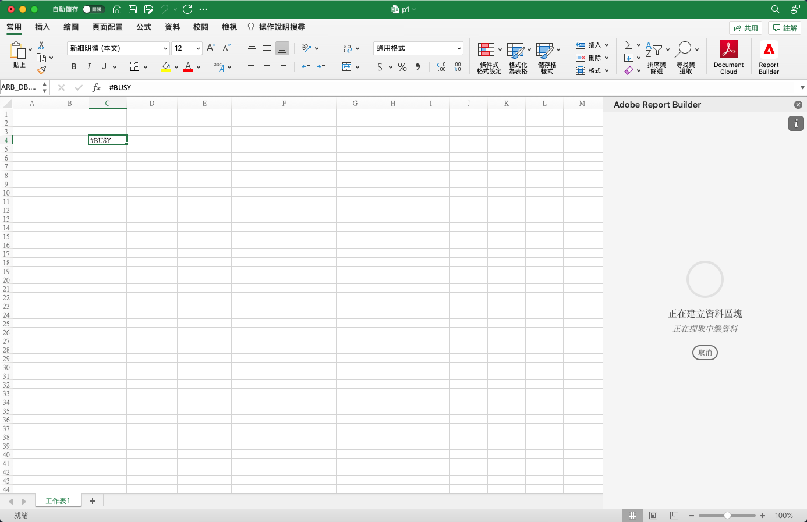
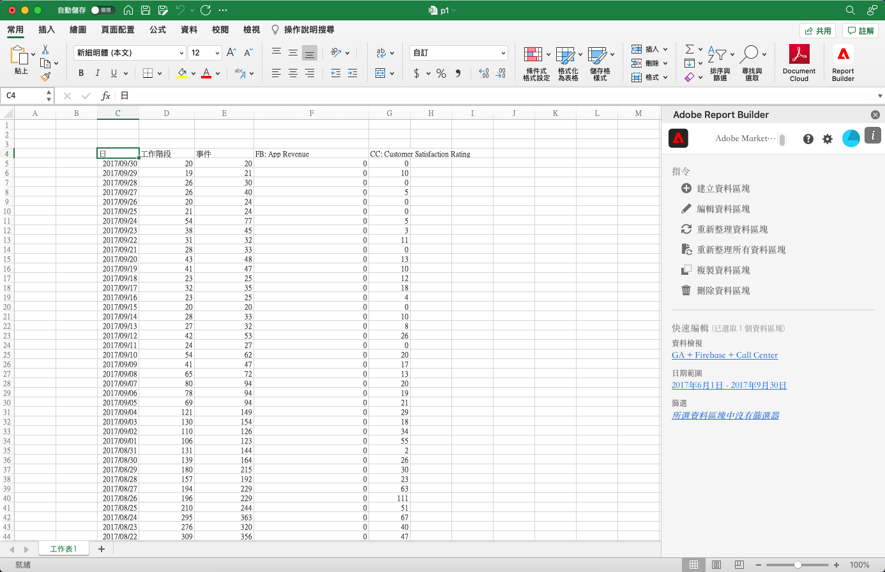

# 建立「資料區塊」

*資料區塊*&#x200B;是由單一資料請求所建立的資料表。Report Builder 活頁簿可包含多個資料區塊。當您建立資料區塊時，請先設定資料區塊，然後再建置資料區塊。

## 設定資料區塊

為資料區塊地點、資料檢視和日期範圍設定初始的資料區塊參數。

1. 按一下&#x200B;**建立資料區塊**。

   

1. 設定&#x200B;**資料區塊地點**。

   此資料區塊地點選項會定義 Report Builder 將資料新增至您的工作表的工作表位置。

   若要指定資料區塊位置，可在工作表中選取單一儲存格或是輸入儲存格位址，例如 a3、\\\$a3、a\\\$3 或 sheet1!a2。當擷取資料時，指定的儲存格將會位於資料區塊的左上角。

1. 選擇&#x200B;**資料檢視**。

   「資料檢視」選項可讓您從下拉式選單選擇資料檢視或是從儲存格位置引用資料檢視。

1. 設定&#x200B;**日期範圍**。

   「日期範圍」選項可讓您選擇日期範圍。日期範圍可以是固定或滾動式。如需更多有關日期範圍選項的資訊，請參閱[選取日期範圍](select-date-range.md)。

1. 按一下「**下一步**」。

   

   在您設定資料區塊後，您可以選取維度、量度和篩選器，來建置您的資料區塊。「維度」、「量度」和「篩選器」索引標籤會顯示在「表格產生器」窗格上方。
<!--
    
  -->

## 建置資料區塊

若要建置資料區塊，請選取報表元件，然後自訂版面配置。

1. 新增「維度」、「量度」和「篩選器」。

   捲動元件清單或利用&#x200B;**搜尋**&#x200B;欄位來找出元件。將元件拖放至「表格」窗格或是在清單中的元件名稱上按兩下，就能將元件自動加入「表格」窗格。

   按兩下元件，將其新增至表格的預設區段。

   - 如果您在欄中已經有維度，可將維度元件新增到「列」區段或「欄」區段。
   - 將日期元件新增到「欄」區段。
   - 將「篩選器」元件新增到「篩選器」區段。

1. 安排「表格」窗格中的項目，以自訂資料區塊的版面配置。

   將「表格」窗格中的元件拖放至重新排列元件，或是在元件名稱上按一下滑鼠右鍵，然後從選項選單中進行選取。

   當您將元件加入表格時，工作表中的「資料區塊」位置會顯示資料區塊的預覽。資料區塊預覽的版面配置會隨著您新增、移動或移除表格中的項目而自動更新。

   

1. 按一下「**完成**」。

   擷取分析資料的同時，會顯示一則處理訊息。

   

   Report Builder 會擷取資料，並在工作表中顯示已完成的資料區塊。

   
