# 篩選維度

依預設，表格中的每個維度項目會傳回該維度的前10個項目。

變更每個維度傳回的維度項目

1. 選擇資料塊，然後按一下「命令」面板中的「編輯資料塊」。

1. 按「下一步」以顯示「Dimension」標籤。

1. 按一下&#x200B;**...**&#x200B;圖示，在表格中的元件名稱旁。

   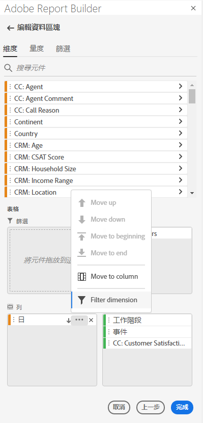

1. 在彈出菜單中選擇&#x200B;**篩選維**&#x200B;以顯示&#x200B;**篩選維**&#x200B;窗格。

1. 選擇&#x200B;**最受歡迎**&#x200B;或&#x200B;**特定**。

   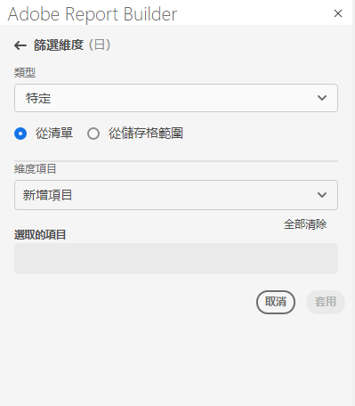

1. 根據選取的篩選類型選取適當的選項。

1. 按一下&#x200B;**Apply**&#x200B;以新增篩選器。

   Report Builder會顯示通知以確認新增的篩選。

若要顯示已套用的篩選，請將滑鼠指標暫留在維度上。 已套用篩選的Dimension會在Dimension名稱右側顯示篩選圖示。

## 篩選類型

篩選維度項目有兩種方式：最受歡迎且最具體。

## 最受歡迎

「最受歡迎」選項可讓您根據量度值動態篩選維度項目。 最受歡迎的篩選會根據量度值傳回排名最高的維度項目。 依預設，前10個維度項目會列出，依新增至資料區塊的第一個量度排序。

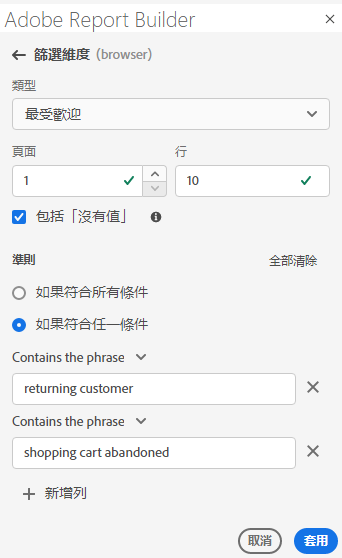

### 頁面和列選項

使用&#x200B;**Page**&#x200B;和&#x200B;**Rows**&#x200B;欄位，將資料劃分為連續組或頁。 這可讓您將排名列值以外的其他值提取至報表中。 此功能對於將資料提取超過50,000列限制特別實用。

#### 頁面和列預設值

- 頁面= 1
- 行= 10

「頁面」和「列」預設設定可識別每個頁面有10列資料。 第1頁返回前10個項目，第2頁返回後10個項目，以此類推。

下表列出頁面和列值的範例，以及產生的輸出。

| 頁面 | 列 | 輸出 |
|------|--------|----------------------|
| 1 | 10 | 前10個項目 |
| 2 | 10 | 項目11-20 |
| 1 | 100 | 前100個項目 |
| 2 | 100 | 項目101-200 |
| 2 | 50,000 | 項目50,001-100,000 |

#### 最小值和最大值

- 起始頁面：最小= 1，最大：5000萬
- 行數：最小= 1，最大：5萬

### 包含「無值」

在Customer Journey Analytics中，有些維度會收集「無值」項目。 此篩選器可讓您從報表中排除這些值。 例如，您可以根據「產品SKU」索引鍵建立「產品名稱」分類之類的分類。 如果特定產品SKU尚未透過其特定產品名稱分類設定，其產品名稱值會設為「無值」。

預設情況下，「包含」**未選擇值**」。 取消選取此選項以排除沒有值的項目。

### 依條件篩選

您可以根據是否滿足所有條件或是否符合任何條件來篩選維度項目。

若要設定篩選條件

1. 從下拉式清單中選取運算子。

   

1. 在搜尋欄位中輸入值。

1. 按一下「新增列」以確認選取項目並新增其他條件項目。

1. 按一下刪除圖示以移除條件項目。

   您最多可以包含10個條件項目。

### 變更篩選和排序順序

用來篩選及排序資料區塊的量度旁會出現箭頭。 箭頭的方向指示度量的排序是最大還是最小還是最大。

若要變更排序方向，請按一下量度旁的箭頭。 

若要變更用來篩選及排序資料區塊的量度，

1. 將滑鼠指標暫留在表格產生器中所需的量度元件上，以顯示其他選項。

2. 按一下偏好量度上的箭頭。 

   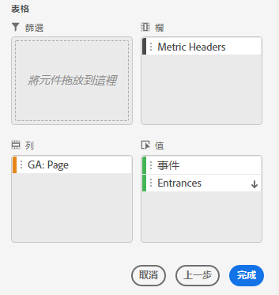

## 特定篩選

「特定」選項可讓您為每個維度建立固定的維度項目清單。 使用&#x200B;**Specific**&#x200B;篩選類型來指定要包含在篩選器中的確切維度項目。 您可以從清單或儲存格範圍中選取項目。

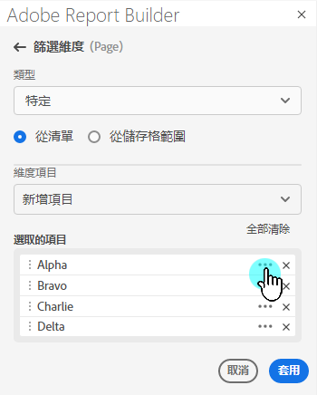

### 從清單

1. 選擇&#x200B;**從清單**&#x200B;選項以搜索和選擇維項。

   選擇&#x200B;**From list**&#x200B;選項時，清單會先填入事件最多的維度項目。

   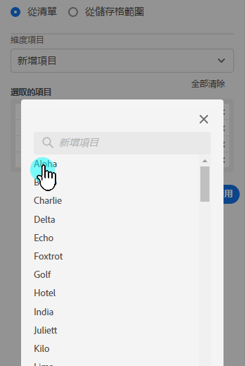

   **可用項目**&#x200B;清單從事件最多的維度項目排序至事件最少的維度項目。

1. 在&#x200B;**添加項**&#x200B;欄位中輸入搜索項以搜索清單。

1. 若要搜尋最近90天資料中未包含的項目，請按一下「顯示最近6個月的項目」**以延伸搜尋。**

   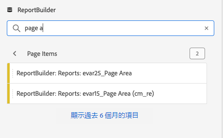

   過去6個月的資料載入後，Report Builder會更新連結至&#x200B;**顯示過去18個月的項目**。

1. 選取維度項目。

   選定的維項將自動添加到&#x200B;**選定項**&#x200B;清單中。

   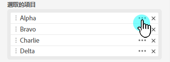

   若要從清單中刪除項目，請按一下刪除圖示以從清單中移除項目。

   若要移動清單中的項目，請拖放項目或按一下……以顯示移動功能表。

   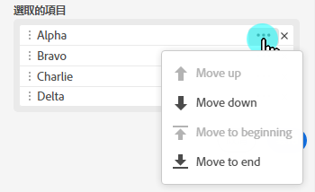

1. 按一下&#x200B;**Apply**

   Report Builder會更新清單，顯示您套用的特定篩選。

### 從儲存格範圍

選擇&#x200B;**從儲存格範圍**&#x200B;選項，以選擇包含要比對之維度項目清單的儲存格範圍。

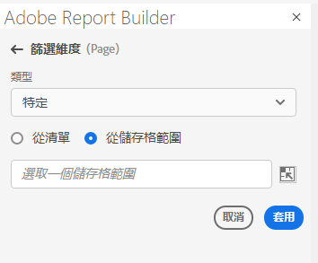

選取儲存格範圍時，請考慮下列限制：

- 範圍必須至少包含一個儲存格。
- 範圍不能超過50,000個儲存格。
- 範圍必須位於單一未中斷的列或欄中。

您的選取項目可包含空白的儲存格或含有與特定維度項目不符之值的儲存格。

### 從表格產生器的「Dimension」標籤

在&#x200B;**Dimension**&#x200B;標籤中，按一下維度名稱旁的>形圖示以檢視維度項目清單。

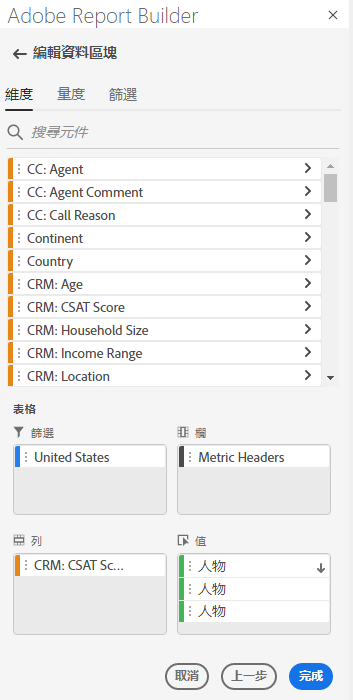

您可以將項目拖放至&#x200B;**表格**，或連按兩下項目名稱以將其新增至&#x200B;**表格**&#x200B;產生器。
