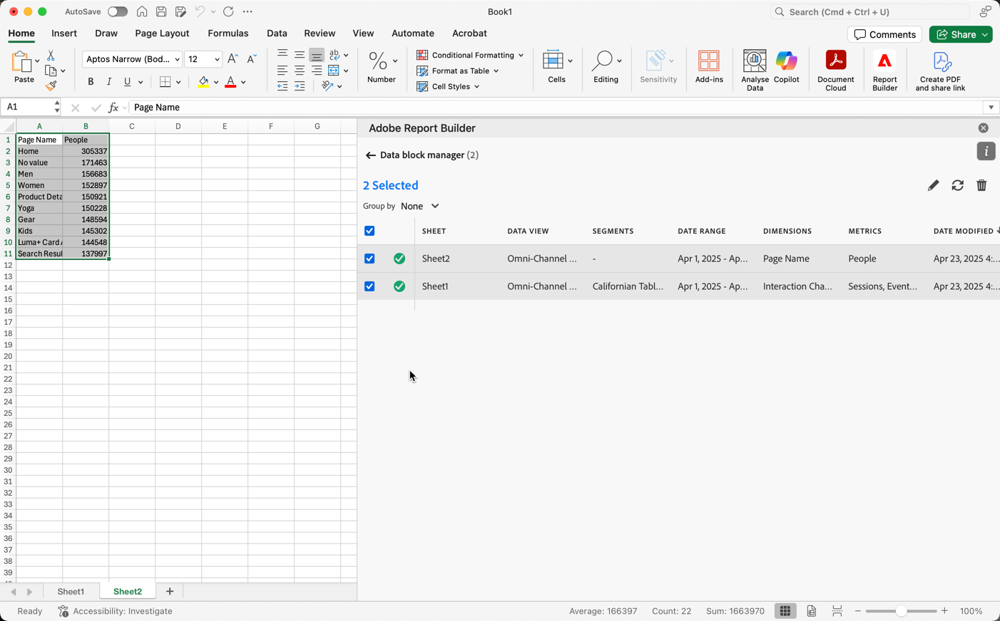

# 在 Report Builder 中管理資料區塊

您可以使用資料區塊管理員來檢視及管理活頁簿中的所有資料區塊。 資料區塊管理員提供搜尋、篩選和排序功能，讓您可以快速地找出特定資料區塊。 在選取一個或多個資料區塊後，您可以編輯、刪除或重新整理所選的資料區塊。

## 檢視資料區塊

按一下&#x200B;**管理**&#x200B;即可檢視活頁簿中的所有資料區塊清單。

資料區塊管理員會列出活頁簿中顯示的所有資料區塊。 

## 排序資料區塊清單

您可依顯示的欄來排序資料區塊清單。 例如，您可以依資料檢視、篩選、日期範圍和其他變數來排序資料區塊清單。

若要排序資料區塊清單，請按一下欄標題。

## 搜尋資料區塊清單

使用「搜尋」欄位可找出資料區塊表格中的任何資料。 例如，您可以搜尋資料區塊或資料檢視中包含的量度。 您也可以搜尋出現在日期範圍、修改日期或上次執行日期等欄中的日期。

## 編輯資料區塊

您可以編輯套用到一個或多個資料區塊的資料檢視、日期範圍或篩選條件。

例如，您可以在一個或多個資料區塊內將現有篩選條件替換為新的篩選條件。

1. 選取您想要更新的資料區塊。 您可以選取最上層核取方塊來選取所有資料區塊，也可以選取個別資料區塊。

   

1. 按一下編輯圖示可顯示「快速編輯」視窗。

   

1. 選取篩選連結可更新資料檢視、日期範圍或篩選條件。

   

## 重新整理資料區塊

按一下重新整理圖示可重新整理清單內的資料區塊。

若要確認某個資料區塊是否已重新整理，請按一下重新整理狀態圖示。 綠色圓圈中的核取記號  表示資料區塊重新整理成功。 未能重新整理的資料區塊將會顯示警告圖示 。這可讓您輕鬆識別任何資料區塊是否有錯誤。

## 刪除資料區塊

按一下垃圾桶圖示可刪除選取的資料區塊。

## 分組資料區塊

您可以使用&#x200B;**分組方式**&#x200B;下拉式選單或按一下欄標題來分組資料區塊。 若要依欄排序資料區塊，請按一下欄標題。 若要依群組來分組資料區塊，請從&#x200B;**分組方式**&#x200B;下拉式選單中選取群組名稱。 例如，底下螢幕擷圖顯示依工作表分組的資料區塊。 其中顯示依 Sheet1 和 Sheet2 分組的資料區塊。 這會很實用，可在替換篩選條件等使用案例中使用。 如果您將多個篩選條件套用到每個資料區塊，則建立一個包含您想要取代的所有資料區塊的群組會很實用。 然後您就可以輕鬆地一次選取及編輯所有資料區塊。

## 修改資料區塊管理員檢視

您可以修改可在「資料區塊管理員」視窗中看到哪些欄。

按一下欄清單  圖示可選取哪些欄要列在資料區塊管理員中。 選取要顯示欄的欄名稱。 取消選取欄名稱即可從檢視中移除該欄。

