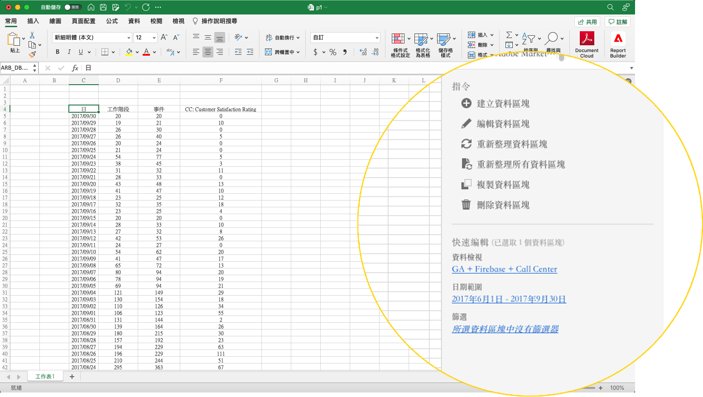
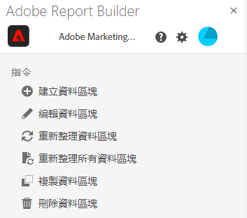
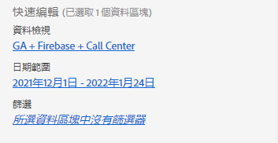
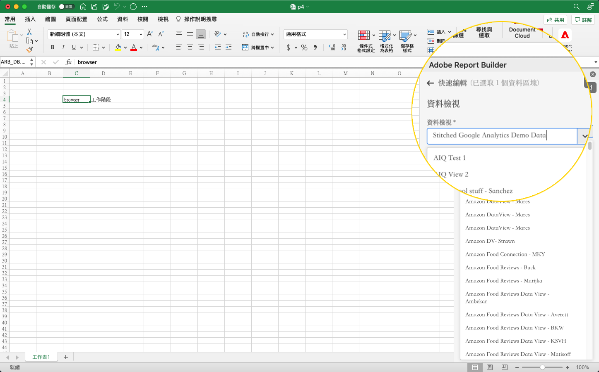

# Report Builder中心

使用Report Builder中心來建立、更新或刪除資料區塊。

Report Builder中心包含「命令」和「快速編輯」面板。



## 命令面板

使用「命令」面板訪問與所選單元格或先前操作相容的命令。



### 命令

| 顯示的命令 | 可用時間…… | 用途 |
|------|------------------|--------|
| 建立資料區塊 | 活頁簿中已選取一或多個儲存格。 | 用於建立資料區塊 |
| 編輯資料區塊 | 所選單元格或單元格範圍僅屬於一個資料塊。 | 用於編輯資料區塊 |
| 刷新資料塊 | 該選擇至少包含一個資料塊。 命令將僅刷新選中的資料塊。 | 用於刷新一個或多個資料塊 |
| 重新整理所有資料區塊 | 活頁簿包含一或多個資料區塊。 | 用於重新整理活頁簿中的「所有」資料區塊 |
| 複製資料塊 | 所選單元格或單元格範圍是一個或多個資料塊的一部分。 | 用於複製資料區塊 |
| 刪除資料區塊 | 所選單元格或單元格範圍僅屬於一個資料塊。 | 用於刪除資料區塊 |

## 快速編輯面板

在試算表中選取一或多個資料區塊時，Report Builder會顯示「快速編輯」面板。 可以使用「快速編輯」面板更改單個資料塊中的參數，或同時更改多個資料塊中的參數。



使用「快速編輯」部分所做的更改將應用於所有選定的資料塊。

### 資料檢視

資料區塊會從選取的資料檢視中提取資料。 如果在工作表中選取了多個資料區塊，且它們沒有從相同的資料檢視中提取資料，**資料檢視**&#x200B;連結會顯示&#x200B;*多個*。

當您更改資料視圖時，所選內容中的所有資料塊都採用新的資料視圖。 資料區塊中的元件會根據ID來比對新資料檢視，例如符合```evars```)。 如果在資料區塊中找不到元件，則會顯示警告訊息，並從資料區塊中移除元件。

若要變更資料檢視，請從下拉式選單中選取新資料檢視。



### 日期範圍

**日期** 範圍會顯示所選資料區塊的日期範圍。如果選取多個資料區塊並有多個日期範圍，**日期範圍**&#x200B;連結會顯示&#x200B;*多個*。

### 篩選器

**篩選器**&#x200B;連結顯示所選資料塊所使用篩選器的摘要清單。 如果選取多個資料區塊並套用多個篩選器，**篩選器**&#x200B;連結會顯示&#x200B;*多個*。
