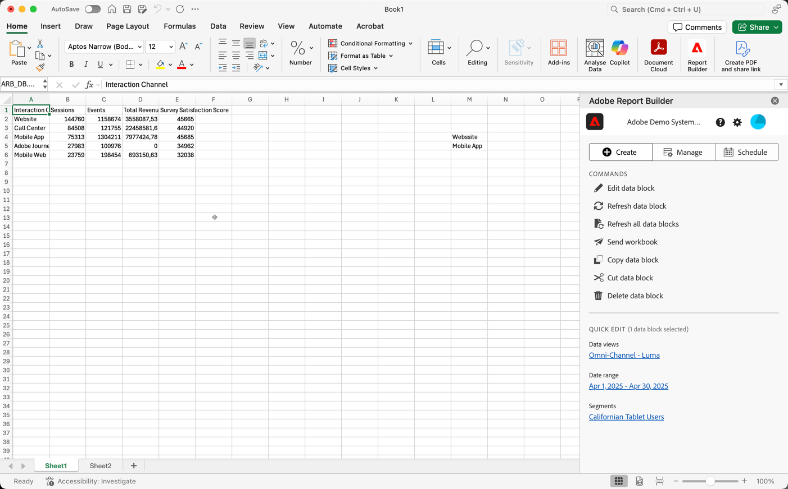

# Report Builder 中心

Report Builder中心是從Excel功能區列選取 **[!UICONTROL Report Builder]**&#x200B;時，Excel活頁簿中顯示的右側窗格。

利用 Report Builder 中心建立、更新、刪除及管理資料區塊。

Report Builder中心包含 **[!UICONTROL Create]**、 **[!UICONTROL Manage]**&#x200B;和 **[!UICONTROL 排程]**&#x200B;按鈕、**[!UICONTROL 命令]**&#x200B;面板和&#x200B;**[!UICONTROL 快速編輯]**&#x200B;面板。

{zoomable="yes"}

選取

*  **[!UICONTROL 建立]**&#x200B;以[建立新的資料區塊](create-a-data-block.md)。
*  **[!UICONTROL 管理]**&#x200B;以[管理現有的資料區塊](manage-reportbuilder.md)。
*  **[!UICONTROL 排程]**&#x200B;至[管理排程，以透過電子郵件傳送您的活頁簿](schedule-reportbuilder.md)。

## 「命令」面板

使用&#x200B;**[!UICONTROL 命令]**&#x200B;面板來存取與選取的儲存格或先前動作相容的命令。

| 命令 | 可提供時間為… | 用途 |
|------|------------------|--------|
|  **[!UICONTROL 編輯資料區塊]** | 所選取的儲存格僅為一個資料區塊的一部分。 | 用於編輯資料區塊。 |
|  **[!UICONTROL 重新整理資料區塊]** | 選取範圍包含至少一個資料區塊。 指令只會重新整理選取範圍中的資料區塊。 | 用於重新整理一或多個資料區塊。 |
|  **[!UICONTROL 重新整理所有資料區塊]** | 該活頁簿包含一或多個資料區塊。 | 用於重新整理活頁簿中的所有資料區塊 |
|  **[!UICONTROL 傳送活頁簿]** | 該活頁簿包含一或多個資料區塊。 | 使用以檔案形式透過電子郵件傳送活頁簿。 |
|  **[!UICONTROL 複製資料區塊]** | 所選取的儲存格範圍為一或多個資料區塊的一部分。 | 用於複製資料區塊。 |
|  **[!UICONTROL 剪下資料區塊]** | 所選取的儲存格範圍為一或多個資料區塊的一部分。 | 設定以剪下資料區塊。 |
|  **[!UICONTROL 刪除資料區塊]** | 所選取的儲存格僅為一個資料區塊的一部分。 | 用於刪除資料區塊 |

## 快速編輯面板

當您選取試算表中的一個或多個資料區塊時，Report Builder會顯示&#x200B;**[!UICONTROL 快速編輯]**&#x200B;面板。 您可以使用&#x200B;**[!UICONTROL 快速編輯]**&#x200B;面板，同時變更一或多個資料區塊中的引數。

您使用&#x200B;**[!UICONTROL 快速編輯]**&#x200B;區段時所做的變更會套用至所有選取的資料區塊。

### 資料檢視

資料區塊會從選取的資料檢視提取資料。 如果在一個工作表中選取了多個資料區塊，且它們不從相同的資料檢視提取資料，則&#x200B;**資料檢視**&#x200B;連結會顯示&#x200B;**[!UICONTROL _多個_]**。

當您變更資料檢視時，選取範圍中的所有資料區塊會採用新的資料檢視。 資料區塊中的元件會根據ID和新的資料檢視進行比對。 如果在資料區塊中找不到元件，則會移除該元件，並以&#x200B;**[!UICONTROL 無效值]**&#x200B;取代，或針對特定元件顯示。

若要變更資料檢視，請從&#x200B;**[!UICONTROL 資料檢視]**&#x200B;下拉式功能表中選取新的資料檢視。

### 日期範圍

**資料範圍**&#x200B;顯示所選取資料區塊的資料範圍。 如果選取具有多個日期範圍的多個資料區塊，**[!UICONTROL 日期範圍]**&#x200B;連結會顯示&#x200B;**[!UICONTROL _多個_]**。

### 區段

**區段**&#x200B;連結會顯示所選資料區塊使用之區段的摘要清單。 如果選取了多個已套用多個區段的資料區塊，**區段**&#x200B;連結會顯示&#x200B;**[!UICONTROL _多個_]**。

>[!MORELIKETHIS]
>
>[選取資料檢視](select-data-view.md)
>>[選取日期範圍](select-date-range.md)
>>[使用篩選器](work-with-filters.md)
>
