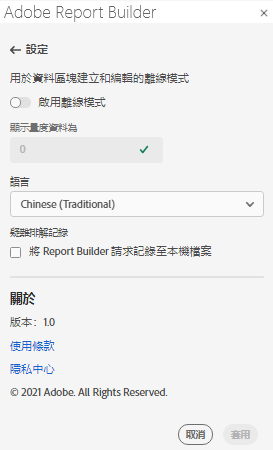
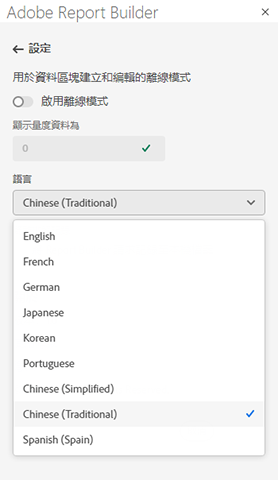

# Report Builder設定

使用&#x200B;**設定**&#x200B;窗格配置應用程式級設定，如UI顯示的語言，或者是否以離線模式工作。 設定會立即套用，並針對所有未來工作階段進行設定，直到變更為止。

若要變更Report Builder設定

1. 按一下&#x200B;**Settings**&#x200B;圖示。

1. 對「啟用離線模式」、選擇「語言」或「啟用疑難解答日誌設定」進行更改。

1. 按一下&#x200B;**「套用」**。

   

## 離線模式

以離線模式建立和編輯資料區塊時，不會擷取資料。 而是使用模擬資料，讓您不需等待請求執行，即可快速建立及編輯資料區塊。 當您重新聯機時，*刷新資料塊*&#x200B;命令或&#x200B;*刷新所有資料塊*&#x200B;命令將刷新您用實際資料建立的資料塊。

啟用離線模式

1. 按一下&#x200B;**Settings**&#x200B;圖示。

1. 選擇&#x200B;**啟用離線模式**。

1. 在&#x200B;**將度量資料顯示為**&#x200B;欄位中輸入正整數。

1. 按一下&#x200B;**「套用」**。

## 語言

您可以選擇Report BuilderUI的語言。 所有支援的Adobe Analytics語言均已推出。

若要選取Report BuilderUI中使用的語言

1. 按一下「設定」。

1. 從&#x200B;**Language**&#x200B;下拉菜單中選擇語言。

   

1. 按一下「**應用」。**

## 疑難排解

使用「疑難解答」設定將所有客戶端/伺服器資料記錄到本地檔案。 使用此選項可幫助解決支援票證。

若要啟用「疑難排解」選項，請選取「將報表建立工具請求記錄至本機檔案」**。**
